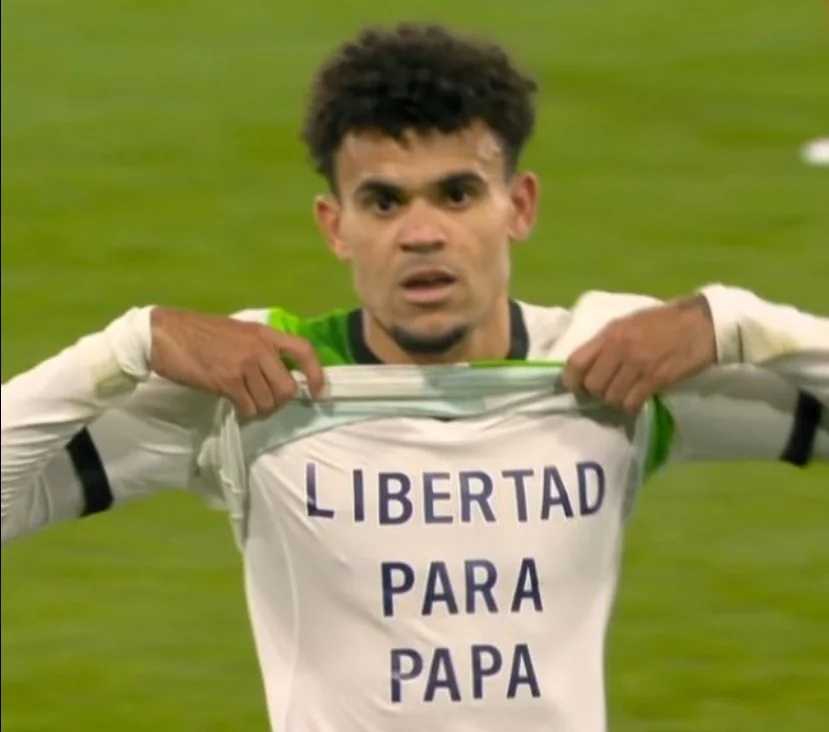
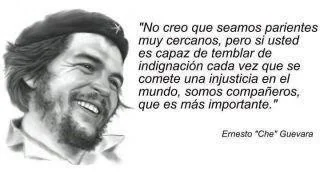

*Después de anotar el gol de la libertad, la mirada de Lucho Díaz no es de alegría. Liverpool empató con Luton. «¡Libertad para papá!». (Cortesía X de Luis Díaz).*

El gol de la libertad se forjó en tiempo extendido. **Minuto 82:42**. Luton 1 Liverpool 0. El técnico **Jürgen Klopp** ordenó el ingreso de **«Lucho**»** Díaz** como una forma de solidarizarse por el drama que vive su jugador con el secuestro de su padre **«Mane**»**** Díaz. **Minuto 94:35**. El tiempo extendido se agota. Su compañero **Konaté** gana un rebote en el área de Luton y se la pasa a **Elliott**. Este paró el balón, levantó la cara y luego lo cruzó a la izquierda cuando vio que el ariete colombiano se adentraba en la zona de candela. A este solo le bastó dar un salto y lamer la pelota con su frente para cambiarle su trayectoria directa al ángulo derecho de la red defendida por el cancerbero **Kaminski**.: ¡Gol de la libertad! ¡**«Lucho**, la gente te quiere****»****! Gritó el narrador emocionado.

Sin embargo, **«Lucho**»**** Díaz lo tenía todo preparado. Cuando la mente se dispone a conseguir una meta no se desespera. Tuvo dos o tres tiros al arco contrario en 12 minutos de juego. No se le vio desesperado. El momento llegó y no tuvo que hacer tanto esfuerzo. Logró el gol del empate para su equipo. Pero para él, fue el gol de la libertad de su padre secuestrado por el ELN. **Un secuestro que pasará a la historia como el suicidio político de esta guerrilla que aún está presa de su fundamentalismo mesiánico heredado de sus fundadores**, tal como lo demostramos en la entrega anterior.

¡Qué cosa! Para escribir este artículo recordé la primera etapa de mi vida de periodista (1983) cuando fui redactor deportivo en **Emisoras Atlántico** de Barranquilla, al lado de **Fabio Poveda Márquez**, Álvaro Torres, Francisco Figueroa, Abel González Chávez, Efrain Peñate, Cheo Feliciano y Lao Herrera.

## **«¡Libertad para papá!**»****

Mientras el público celebraba el gol del empate de Liverpool, en la mente y en el corazón de **«Lucho**»** Díaz** podría estar ocurriendo un océano de sentimientos encontrados. ¡La incertidumbre! ¡La expectativa! **Minuto 95:16**. La pelota yace en el ángulo derecho de la red. **«Lucho**»**** se voltea. En su rostro no se percibía alegría. Tal vez angustia. Mira a su técnico Klop y se levanta parcialmente la camiseta No 7 de su equipo. Sostiene la punta con sus dientes para que no se baje y extiende sus brazos como implorando a Dios. En la camisilla blanca interior se destacó la siguiente frase en color negro:

> **«¡Libertad para papá!**»****

## El gol de la libertad

Ese gol de la libertad también fue del dolor. Es el drama que lleva en su interior un hombre agradecido por el sacrificio de su padre. Un sufrimiento que vive la familia de los secuestrados. Pero no todos tienen la oportunidad de **«Lucho**»** Díaz** para que el mundo se entere de esta afrenta y exprese su solidaridad -que es la ternura de los pueblos, como dijera el Ché Guevara- sea un medio de presión para su liberación. ¿**«La ternura de los pueblos**»**** ? ¿Esto lo entiende la dirigencia del **Coce del ELN** y, en particular, los miembros del **Frente de Guerra Norte** que siguen teniendo debajo del sobaco el libro _El socialismo y el hombre nuevo_ del Ché? ¿Lo habrán entendido? ¿Lo entienden?

Los líderes del ELN no lo entienden. Sus mentes siguen la lógica de la guerra hasta el punto de despojarse de su naturaleza humana y se transforman en una máquina del terror. ¡Literal! No piensan. No analizan. Carecen de amor hacia el prójimo. ¡Odian! Cosifican al ser humano, porque ellos mismos se desnaturalizan y se convierten en una cosa. En su lógica alienante, **«Mane**»**** Díaz representa ¿dos o tres millones de dólares para su guerra sucia? **«Mane**»**** Díaz no es un ser humano, es una cosa que le puede representar dinero para seguir matando, secuestrando y destruyendo. ¡Autodestruyéndose!

Te puede interesar: [Suicidio político del Eln y secuestro de Díaz (II)](/articulos/suicidio-politico-del-eln-por-secuestro-de-diaz/)

## Un solo ser humano

*¿El ELN liberará a padre de Luis Diaz?*

Si un líder político, un dirigente guerrillero o un gobernante, de izquierda o de derecha, no es capaz de darlo todo por un solo ser humano, es un síntoma inequívoco de que estamos frente a un ser despojado de su condición humana. ¿Ese ser puede conducir una organización que busca el progreso humano? Es más: ¿Puede dirigir toda una nación sin esa humana condición?

No obstante, un simple futbolista que no aspira a ser estadista, como es la pretensión de los líderes del ELN, nos está dando una lección de **amor eficaz**. ¡Práctico! El amor de **«Lucho**»** Díaz** fue la fuerza motriz que lo llevó hoy a anotar el gol de la libertad de su padre. Es la praxis del amor de hijo hacia un padre que no se queda en la utopía del discurso abstracto de los políticos profesionales que gobiernan la nación. En tanto su padre, el secuestrado del ELN, expresó ese amor eficaz de Camilo Torres, en su rol de progenitor. Cumplió a cabalidad ese papel.

De hecho, **«Mane**»**** Díaz no es el típico caso del padre que abandona a su hijo, y la madre lo cría y se hace figura del deporte para escapar de la pobreza. ¡No! **«Mane**»**** Díaz sí es el típico caso, pero a la inversa. El buen padre que está presente en los distintos momentos vitales de sus hijos. Que los ayuda a forjarse como seres humanos y a conseguir sus metas. Es el amor de hijo. El amor de padre. El amor al prójimo. Como dijera **Camilo Torres Restrepo**, _el amor efic_az, (Pablo en Romanos) en su concepto de teología de la liberación:

> **«**Este amor, para que sea verdadero, tiene que buscar eficacia. (...) tenemos que buscar medios eficaces para el bienestar de las mayorías****»****.
> 
> [Mensaje a los cristianos, Camilo Torres](/articulos/espanol/camilo/cristianos.htm).

¿Dónde está el amor eficaz de la conducta de los dirigentes del ELN en este caso del secuestro de **«Mane**»**** Díaz? No existe.

## Secuestrar para financiar

*Pablo Beltrán fue uno de los primeros en iniciar el diálogo de paz con el gobierno de Gustavo Petro.*

En agosto de 2023, ya lo había dicho uno de los comandantes del ELN, **Pablo Beltrán** (Israel Ramírez Pineda), al periodista **Yamit Amat**:

> "No se le cobra (impuesto de guerra) ni al mediano, ni al pequeño se les cobra a los grandes (,,,) Hay propuestas de acudir a la comunidad internacional para que mientras estemos en cese haya alguna ayuda exterior, y para evitar operaciones de finanzas (secuestrar)."
> 
> E[l Tiempo](/articulos/politica/proceso-de-paz/el-eln-dejara-de-secuestrar-pablo-beltran-lider-del-grupo-guerrillero-responde-793577).

En la lógica de la guerra -que es una lógica de alienación- el humano pierde su condición natural, se enajena en sí mismo, y se transforma en una cosa que no piensa. Los que están en esa lógica no lo entienden. Como dice Sigmun Freud, le da cabida a sus impulsos inconscientes dominados por una falsa conciencia ya sea política, religiosa o por el dinero mismo, como es el caso presente. Son impulsos y deseos inconscientes justificados por la razón de ser (el discurso) de su organización.

El ELN pudo conocer extraoficialmente que **«Lucho**»** Díaz** se estaría ganando **3 millones de libras esterlina** anualmente. Es decir, **3,7 millones de dólares americanos**. ¿Secuestrar a un ser humano para recibir un ingreso de un año de trabajo de **«Lucho**»** Díaz**? Esto nos propone una pregunta más explosiva: ¿Qué diferencia existe entre la extorsión del **Clan del Golfo** con la extorsión del ELN a **«Lucho**»** Díaz**? No hay ninguna diferencia. Como se dijo en la entrega anterior, el método de Uribe o de los paramilitares para acabar a sus supuestos enemigos, es el mismo usado por la guerrilla.

Te puede interesar: [EL Coce del Eln ordenó liberación del padre de Luis Díaz](/articulos/el-cose-del-eln-ordeno-liberacion-del-padre-de-luis-diaz/)

## La vida de un ser humano

Ernesto Guevara de la Serna (Ché Guevara), dijo en su texto _El socialismo y el hombre nuevo_:

> “Vale, pero millones de veces más la vida de un solo ser humano, que todas las propiedades del hombre más rico de la tierra”.

¿Cuánto vale la vida de **«Mane**»**** Díaz? ¿Los 3,7 millones de dólares que el ELN necesita para mantenerse en el diálogo para la _Paz Total_ de Gustavo Petro? Carlos Marx -autor de _Das Kapital_ en 1867- reconoció que los seres de carne y hueso no son guiados por la conciencia sino por las circunstancias de la vida. El guerrillero, por ejemplo, dejó de ser hombre consciente para convertirse en un hacedor de violencia determinado por la lógica de la guerra.

> **«**No es la conciencia la que determina la vida, sino la vida la que determina la conciencia****»****.
> 
> Das Kapital, Carlos Marx 1867.