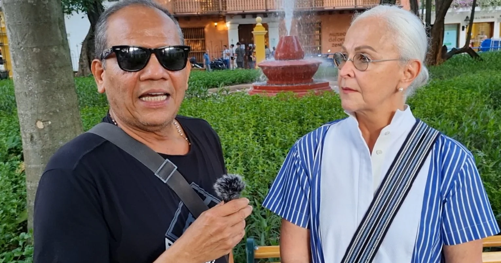
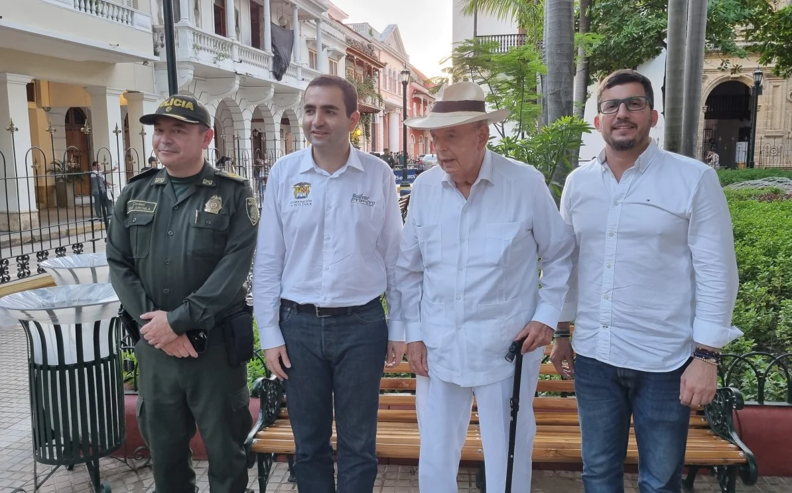

*Parque de Bolívar rescatado por Vicente Blel./VoxPopuli.Digital.*

Hoy el **Parque de Bolívar** recuperado, es el legado de **Vicentico Blel Scaf**, gobernador de Bolívar. Un legado para el país histórico. Pero, todo fue posible gracias a que el parque tenía dolientes que representó dignamente **Raymundo Angulo Pizarro**, quien _regresó del más allá_ para reclamar esa obra. Llevó la bandera de esa _ciudadanía empoderada_ que reclama de su gobernante el poder que se le delegó. El _zar de la belleza_ pidió a gritos esa recuperación. Veía con tristeza el abandono paisajístico de esta obra histórica y cultural. Sin duda, es uno de los sitios emblemáticos donde se encuentran la historia colonial y republicana de Cartagena de Indias y de Colombia.

El Dios de la vida le dio un tiempo extendido a Raymundo cuando estaba en el más allá con el fin de ver de nuevo una de las joyas paisajísticas e históricas de la ciudad. El presidente del **Concurso Nacional de Belleza**, sobreviviente de la pandemia del **Covid-19**, solía recorrer el parque y levantar las personas que se dormían en las bancas de madera de roble con estructura de hierro forjado. Tanto era así que cuando un hombre en condiciones de calle lo veía venir decía:

> **«**¡Levántate ya! viene Raymundo a interrumpirnos el sueño**»**.

El Concurso Nacional de Belleza se encargó de mantenerlo durante 19 años hasta cuando pasó al Distrito de Cartagena. Después de la pandemia de 2020 quedó reducido al olvido y a la dejadez de una administración indolente como la de **William Dau Chamat**. Cada vez que Raymundo veía el parque desvencijado, mustio y abandonado, sentía una tristeza en el alma. La misma tristeza que experimentaba cualquier visitante o residente de la ciudad.

*Cuando entrevistaba a Julia Salvi, el alma del Festival Internacional de Música Clásica de Cartagena de Indias. /Captura de pantalla.*

Tal es el caso de la inspiradora y alma del **Festival Internacional de Música Clásica de Cartagena y de la Orquesta Sinfónica, Julia Salvi:**

> Debo darle las gracias al gobernador. Es un regalo para el país y los visitantes que quieren ver parques como este. Es que tenemos allá la Inquisición, el Museo de Oro, el Banco de la República, la Plaza de la Proclamación, la Catedral.
> 
> Julia Salvi.

## El legado de Vicentico, el Parque de Bolívar

https://www.youtube.com/watch?v=5aIfPvwwgOQ&t=59s

Puede ver este documental sobre la Nueva Vida del Parque de Bolívar

¿Cuántas veces estuvimos, acompañados o solos, sentados en las bancas del Parque de Bolívar reflexionando sobre la ciudad, el país, o de la vida misma? Muchas veces nos sentamos y tomamos un tinto delicioso de los _tuchineros_ y afinar los sentidos para ver y percibir los sonidos del paisaje que sugería el Parque de Bolívar. Ahora, desde esas bancas con madera de teka barnizadas (antes eran de roble), se observa mejor el entorno, el lustre del paisaje histórico.

Desde esas bancas se podía ver el abordaje del pintor o pintora callejera para vender su lienzo a los turistas extranjeros. Observar el trabajo de _Chojuan_, el embolador, cómo dejaba brillante los zapatos de cuero de sus clientes después de una lustración. Ver a un grupo de bailarines con vestidos tricolores bailar desde una cumbia hasta una puya. O escuchar atentamente al historiador popular hablar sobre diversas historias de la vida colonial de Cartagena de Indias, especialmente de cuando ahumaban a las supuestas brujas procesadas por el Santo Oficio.

En una oportunidad -Raymundo recordó este hecho- un señor estaba acostado en una de las bancas del parque de Bolívar. Estaban haciendo una poda de los árboles. Él no se quiso levantar. Ante esa situación, la directora ejecutiva del Concurso Nacional de Belleza, cuya oficina está al frente, le extendió un documento para que lo firmara con el fin de que eximiera a la entidad de lo que le podría suceder. No lo firmó. Al rato, cayó sobre la banca una gran rama de unos de los árboles que estaban podando. No lo mató. Dos minutos antes, a regañadientes, se había levantado de esa banca.

## La historia viva

*Coronel José Archila, el gobernador Vicente Blel, Raymundo Angulo y el director de Icultur Iván Sanes./VoxPopuli Digital.*

El Parque de Bolívar es una historia en movimiento. Una historia viva. Se transforma con el desarrollo del tiempo. Hoy está recuperado. Fue un mantenimiento impecable, me dice la paisajista **Erika Barrios**. En varias etapas de nuestra historia recibió diferentes nombres producto de cambios históricos. El primer nombre fue **Plaza de la Inquisición** cuando este tribunal de la iglesia católica se instaló en 1610. El nombre que conserva hoy se originó en la época centenaria de 1896.

En 1999 fue recuperado por el gobernador magangueleño **Miguel Raad** y entregado a la administración distrital de Gina Benedetti. El Concurso de la Belleza le hizo mantenimiento hasta antes del Covid-19. Fue abandonado por el Distrito de Cartagena durante el gobierno de William Dau Chamat.

Ante esa situación, a petición del presidente del Concurso Nacional de Belleza, Raymundo Angulo, el gobernador de Bolívar, Vicente Blel Scaf, lo restauró y embelleció. El pasado 4 de noviembre de 2023 fue reinaugurado con presencia del nuevo gobernador **Yamilito Arana Padaúi** y otras personalidades.