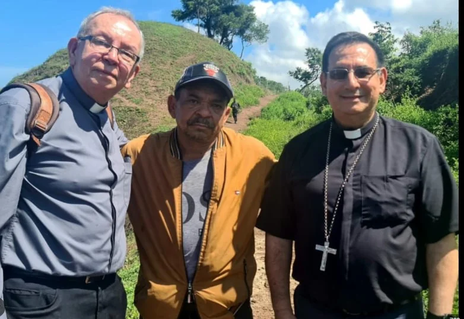

*¡Libre Mane Díaz! Cortesía. Foto especial. (Cortesía).*

¡Libre _Mane_ Díaz! Por fin, el anuncio se hizo realidad hoy. ¿Y ahora qué? ¿Seguirá el Eln secuestrando y **autosaboteando el proceso de paz**? ¿Abusará de la **laxitud del primer presidente de izquierda** Gustavo Petro? ¿Puede recibir el **perdón social** de la nación? ¿Se confirmará su **suicidio político**? ¿Tiene **autoridad ética** para proponer una transformación social del país pisoteando la **dignidad humana**? Sin duda, el Eln pasará a la historia por dos hechos que lo retratan para la historia: **el asesinato (1989) de un obispo de la iglesia Católica y el secuestro del padre de una estrella del fútbol mundial.**

Como facilitadores de la liberación de Mane Diaz actuaron Raúl Rosende, jefe adjunto de la Misión de Verificación de la ONU, y monseñor **Francisco Ceballos**, obispo de Riohacha.

**El secuestro de Manuel Díaz,** como el secuestro y asesinato del obispo de Arauca**, Jesús Emilio Jaramillo,** se constituyen en una **afrenta a la condición humana**. Expresan un _infantilismo político_ determinado por un discurso anacrónico e incongruente con la praxis del movimiento guerrillero. Refleja, igualmente, un proceso de **alienación de sus dirigentes**, porque están atrapados en un sistema de creencias políticas dogmáticas _cuasireligiosas_.

Te puede interesar: [Suicidio político del Eln y secuestro de Díaz (II)](/articulos/suicidio-politico-del-eln-por-secuestro-de-diaz/)

## La extorsión a la libertad del Eln

*¡Libre Mane Díaz! Un obispo artífice de su libertad. Foto especial. (Cortesía).*

Después del derecho a la vida, el derecho a la libertad, son conquistas de la humanidad. Pero, al mismo tiempo, son los dos derechos más violentados en el mundo capitalista y, en particular, de nuestro país. Las distintas guerras, incluyendo las supuestas guerras justas, afectan la vida y la libertad. Si bien existe libertad constitucional y legal, la mitad de Colombia está arrinconada por las diferentes fuerzas paralelas al poder estatal. La conducta irracional del Eln deslegitima su discurso político y, en la praxis, su actuación se asemeja a un grupo más del bestiario nacional. Por ejemplo, al Clan del Golfo.

Castigar el cuerpo. Secuestrarlo. Torturarlo. Degradarlo a una cosa por razones económicas o políticas es la afrenta que el modernismo denunció. Pero, al mismo tiempo, justificó. Las teorías modernas de los derechos humanos, después del holocausto de la Segunda Guerra Mundial, crearon un sistema de verdad universal determinado por las naciones más poderosas del mundo colonial eurocéntrico.

En Colombia, superamos la supuesta retrógrada constitución de 1986. Pero no superamos la violación sistemática de los derechos a la vida y a la libertad. Tanto el Estado como sus grupos paraestatales y la guerrilla atentaron contra estos derechos. Hoy, como ayer lo hizo las **Autodefensas Unidas de Colombia**, contribuyeron a un proceso de descomposición de la violencia y de la lucha armada-

Te puede interesar: [El gol de la libertad de «Lucho» Díaz (III)](/articulos/el-gol-de-la-libertad-de-lucho-diaz/)

## El secuestro y asesinato de un obispo

Las paradojas de la historia. Hoy, el obispo de Riohacha, **Francisco Ceballos**, se enfrentó cara a cara con la guerrilla que una vez asesinó a un colega suyo por cuestionar esos métodos inhumanos. El Eln acusó, secuestró y asesinó al obispo de Arauca, Jesús Jaramilllo por, supuestamente, estar al servicio de las fuerzas militares. Los dirigentes del frente que dominaba ese departamento petrolero, decidieron ajusticiar al obispo simplemente porque fue capaz de criticar su aberrante actuación. Este crimen solo se compara con el ejecutado por los **escuadrones de la muerte** de El Salvador contra monseñor Arnulfo Romero. Los dos fueron beatificados por el Papa.

El lunes 2 de octubre de 1989, monseñor **Jesús Emilio Jaramillo** se transportaba en un automotor por Arauca, en la frontera con Venezuela. En su interior, además, estaban cuatro religiosos. El cuerpo sin vida del obispo d**e Arauca apareció cerca al vehículo.** La historia indica que el obispo le pidió al sacerdote que lo acompañaba que lo confesara. Acto seguido, fue ejecutado por los guerrilleros del Eln.

Hoy, podemos decir con alegría: ¡Libre _Mane_ Díaz! Algunos estaban pensando lo peor, tal como le sucedió al obispo de Arauca. El 2 de noviembre una vez que el Coce del ELN admitiera el secuestro del padre de la estrella del Liverpool, **Luis Díaz Marulanda**, anunció su liberación en cuestión de horas. No lo hizo. Después anunció que el miércoles 8, tampoco lo hizo. Por fin, hoy 9 de noviembre, podemos repetir: ¡Libre _Mane_ Díaz!

## Este es el autosaboteo del Eln

https://youtu.be/Ov0cQ45hr\_c?feature=shared