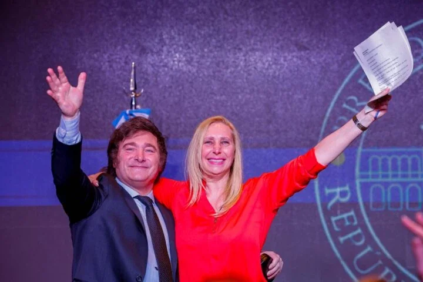

*Javier Milei y su hermana Karina Milei. ¿Salto al vacío?. Foto cortesía.*

La elección del antisistémico Javier Milei ¿un salto al vacío? Luego de la segunda vuelta presidencial, el economista fue elegido presidente de Argentina frente al candidato de la izquierda kirchnerista, **Jorge Massa**, actual ministro de economía. De acuerdo a la información de las agencias internacionales, el nuevo presidente recibió **56%** de los votos por el **44%** de Massa.

Sin embargo ¿por qué ganó Milei? Los analistas coinciden que supo capitalizar el inconformismo de los sectores sociales y políticos de este país dirigido por una **izquierda en decadencia** como el kirchnerismo, la versión actualizada del peronismo. Una izquierda carente de creatividad para llevar al pleno desarrollo de los derechos de la ciudadanía argentina.

Según la BBC, con el 98% del escrutinio Milei logró un amplio triunfo con casi el 56% de los votos por el 44% de Massa. Milei logró en esta segunda vuelta casi **seis millones de votos** más que en la primera. Con estos resultados, tomará posesión el próximo 10 de diciembre como presidente de todos los argentinos que sufren una inflación del 140%.

## ¿Salto al vacío?

El país prefirió las ideas alocadas y disruptivas de Milei aunque sea un salto al vacío. Fue una escogencia desesperada frente al discurso continuista y prosistema de Massa. **Los argentinos están cansados más de lo mismo**: izquierda o derecha. Se lanzó a la ultraderecha. Pero no tienen conciencia de que el cambio no es regresar atrás sino sanar las profundas diferencias económicas y sociales que la _economía estatista_ de la izquierda ni la _economía de mercado_ de derecha, pudieron resolver.

Luego de confirmarse su victoria, Milei dijo:

> "Quiero que quede claro esto: somos un gobierno que va a cumplir a raja tabla con los compromisos que he tomado: **Respeto a la propiedad privada y comercio libre.** El modelo de la decadencia ha llegado a su fin."

¿Salto al vacío? El problema fundamental para cumplir con sus promesas de campaña estriba en el mismo congreso controlado por la derecha y la izquierda. Además, el nuevo presidente de los argentinos recordó que el país fue uno de los más prósperos del mundo. Este discurso prendió en un electorado inconforme.

> "Los resultados de este modelo están a la vista de todos. De ser el país más rico del mundo, hoy somos 130, la mitad de la población es pobre y el 10% indigente"

Se reafirmó como un presidente libertario:

> **"Hoy es una noche histórica para la Argentina.** muchas gracias a todos los que vinieron e hicieron que esto sea posible. Gracias a los que trabajaron para tener un presidente liberal libertario".