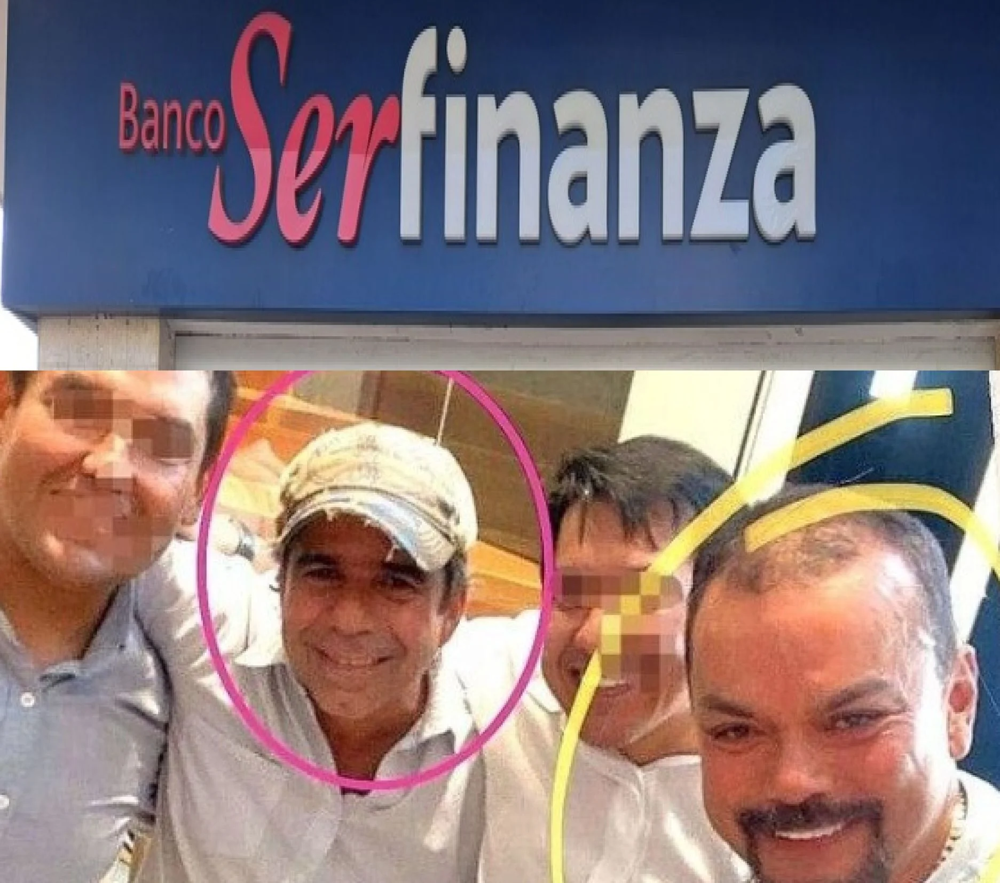
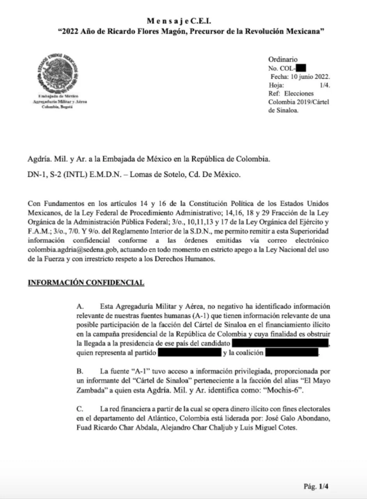
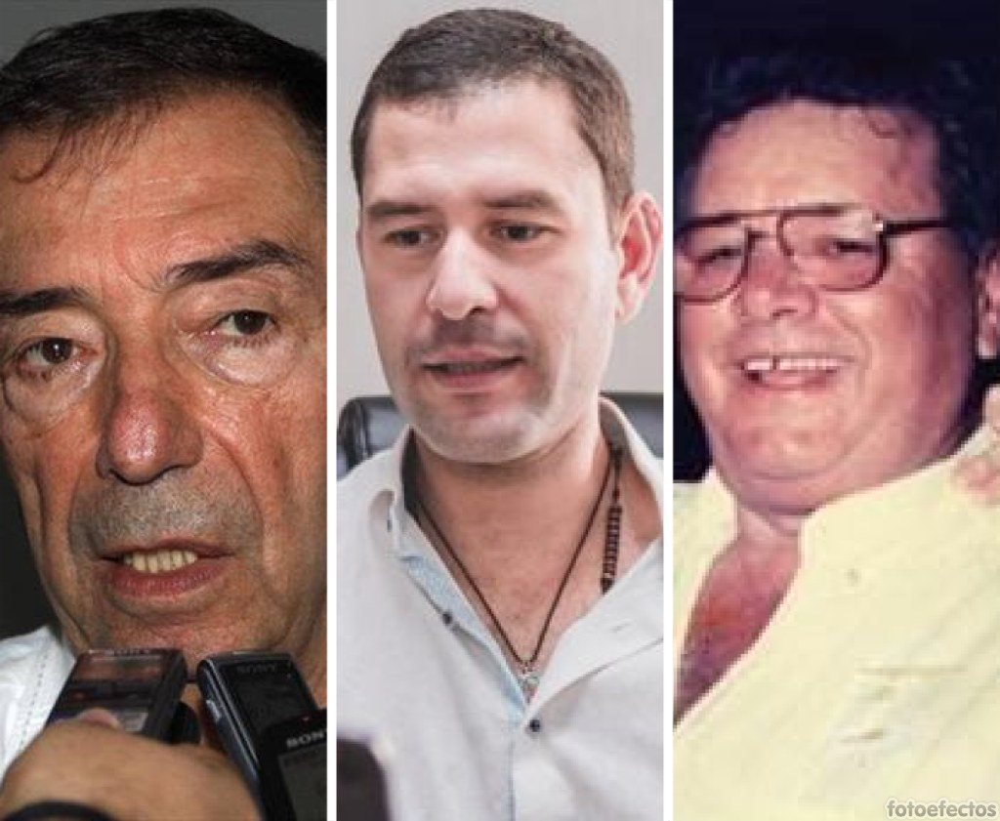
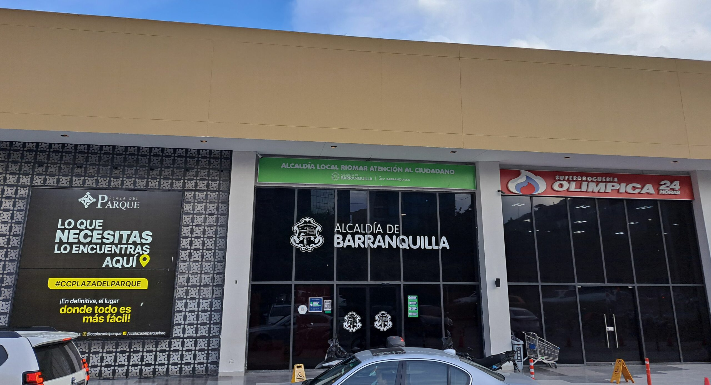

*Serfinanza: ¿La lavandería del Califato Daeschariano? No es la primera vez que relacionan a los Char con el narcotráfico.*

¿El **Banco Serfinanza** es la lavandería del Califato Daeschariano? Sin duda, es una pieza clave para armar el rompecabezas del supuesto lavado de activos de la familia **Char Abdala**. Son 6 casos de presunto lavado de activos donde se encuentra involucrado. El imbricado problema de ser señalado como instrumento para lavar el dinero de la corrupción política―administrativa y del narcotráfico es un deber del Estado investigar y judicializar el caso. La Fiscalía General debe hacerlo. Pero, su titular **Francisco Barbosa Delgado** no lo hace. Mucho menos **el presidente Gustavo Petro**, quien tiene tres instrumentos: Superitendencia Financiera, UIAF y SAE para investigar e intervenir a esa entidad financiera.

No obstante, se inicia estas entregas con varios interrogantes que son muy problemáticos. ¿Por qué la fiscalía y el ejecutivo no le han colocado el cascabel al gato? Sabemos que **Cambio Radical** dirige la Fiscalía y Barbosa tiene las manos atadas. Pero ¿qué le impide al mandatario de los colombianos, Gustavo Petro, ordenar investigar administrativamente a Serfinanza? ¿Hay gato encerrado? Esto es lo que se quiere desentrañar en esta investrigación.

Barranquilla, Cartagena y Santa Marta están en poder de diferentes mafias del narcotráfico. Ni siquiera en los momentos más violentos del narcotrafico, sus niveles de inseguridad eran tan altos como hoy. No había tantas organizaciones armadas ilegales en las grandes urbes. Pero, lo que sugiere la inteligencia militar de México divulgada por la revista **Eje Central** es que presuntamente se tejió una alianza entre las familias Zambada García y Char para controlar los puertos del Caribe con el fin de exportar libremente drogas.

## ¿La lavandería del Califato? La investigación

*Pruebas divulgada por la revista Eje Central.*

Textualmente, la información confidencial de la inteligencia militar dice:

> «La red financiera a partir de la cual se opera dinero ilícito con fines electorales en el departamento del Atlántico, Colombia, está liderada por José Galo Abondano, Fuad Ricardo Char Abadala, Alejandro Char Chaljub y Luis Miguel Cotes».

*Fuad Char, Luis Miguel Cotes y José Galo Abondano hace 8 años. La red financiera de Serfinanza.*

Por esa razón, la investigación periodística propone esta hipótesis para que la tengan en cuenta los organismos del Estado que tienen el poder de investigar a Serfinanza y a su presidente, **Jean Piero Celia**. ¿Celia deberá responder administrativa y penalmente por lo que se podría destapar en los procesos que se le vienen? Quizás el cargo más grave sea lavado de activos, o sea, la gran lavandería del **Califato Daeschariano** conformada por dos familias de origen sirio―libanés: **Daes Abuchaibe y Char Abdala**.

Sin embargo, existe una diferencia entre las dos familias. Los Char y los Daes, por ejemplo, surgieron como prósperos comerciantes que luego se articularon al narcotráfico, según diferentes investigaciones que no terminaron en condena en nuestro país. En tanto que los **Rodríguez Orejuela** nacieron como prósperos narcotraficantes que devinieron en empresarios y financiadores de campañas políticas presidenciales y destacados mecenas del país.

Te puede interesar; [¡Urgente! Las cuentas fantasmas de Serfinanza que inhabilitan a Char (III)](/articulos/urgente-cne-avoca-inhabilidad-de-alejandro-char-por-pruebas-evidentes/)

## _Mucho tilín tilín_

*Serfinanza: ¿La lavandería del Califato Daeschariano? La desfachatez es tremenda. El distrito de Barranquilla y Olímpica son de los Char/ Foto VoxPopuli.Digital.*

En Barranquilla y el Atlántico, el control del Califato Daeschariano es casi que absoluto. Controlan el poder económico a través de Supertiendas Olímpica. En cada rincón de la ciudad y del departamento se encuentra su presencia. Su expansión territorial es muy evidente. También es un control político e ideológico. Hagan lo que hagan, sea legal o ilegal, encuentran el perdón social de una sociedad, cuya decadencia moral es evidente. De hecho, la Fiscalía, el poder judicial y el control social está en manos del poder político que actúa sin ningún contrapeso.

Serfinanza es para el Califato lo que el desaparecido **Banco de los Trabajadores** fue para la familia **Rodríguez Orejuela**. Como Barranquilla y el Atlántico es para los Char, lo que fue Cali y el Valle del Cauca para **Miguel y Gilberto Rodriguez**. ¿Por qué razón el Estado colombiano no ha perseguido este presunto criminal maridaje de la economía legal con la ilegal? ¿A qué le temen? El mismo discurso del presidente Petro, en estos 17 meses, solo ha sido discurso. _Mucho tilín tilín y de paletas_ _nada_. ¡No pasa a la acción!

Al mismo tiempo, en las pasadas elecciones el **Pacto Histórico** se abstuvo de presentar candidatos propios para la gobernación del Atlántico y de Barranquilla. Quizás respetando algún acuerdo electoral con el **Califato Daeschariano**. **Eduardo Noriega** **de la Hoz**, la voz de Petro en Colombia Humana y, por tanto, en el Pacto Histórico, le negó el aval a **Máximo Noriega** como candidato a la gobernación del Atlántico. Igualmente, impidió crear una candidatura fuerte y competitiva frente a **Alejandro Char**. Después del partido que la selección de Colombia le ganó a Brasil 2―1, el prestigio de Petro salió malogrado con el apoyo de la familia Char y una derecha paisa que trató a _Fico_ Gutiérrez, alcalde electo de Medellín como a una estrella de rock.

Te puede interesar: [Serfinanza y Valorcon, la Corte cierra el cerco financiero del «rey» Arturo (VII)](/articulos/serfinanza-y-valorcon-la-corte-cierra-el-cerco-financiero-del-rey-arturo/)

## Vea el análisis: Serfinanza y el Oso Yogui

https://youtu.be/SUuoOFirSXc?feature=shared

## Los 6 casos de la lavandería del Califato

Como la prensa debe ser guía antes que ser guiada por ideología o intereses particulares algunos, se propone investigar el papel de Serfinanza en varios hechos de evidente corrupción. Esto debe llamarle la atención a las autoridades competentes, especialmente a la Fiscalía y a la Superintendencia Financiera, para que den resultados en sus investigaciones.

Por lo menos, está demostrado que Serfinanza tiene relación con **seis** **fenómenos de corrupción** asociados al **lavado de activos**. (I) El caso de **_Aidescándalo_** con su _**Casa Blanca**_. (II) Los préstamos sospechosos a parlamentarios y aspirantes a la alcaldía y gobernación. (III) Corrupción al electorado en el caso del expresidente del congreso **Arturo Char**. (IV) La inhabilidad sobreviviniente de **Alejandro Char** por los manejos de dineros de Transmetro. (V) El robo de la Triple AA. (VI) Un supuesto entramado de lavado de activos procedentes del narcotráfico y el control de los tres puertos del Caribe colombiano en compañía del **Cartel de Sinaloa**.

De los seis casos enumerados, solo el último puede prosperar en poco tiempo. Pero, surge algo desesperanzador para Colombia. El Grupo Olímpica podría hacer un segundo acuerdo con la justicia norteamericana para que no lo condenen al ostracismo con la **Lista Clinton** o no sean procesados penalmente. **¿Cuál sería el destino de Serfinanza y de su cadena de supermercado Olímpica?** ¿Harán acuerdo con E.U.

Por lo anterior, se propondrá una aproximación a la nueva realidad del _Califato Daeschariano_ o _Califato del Atlántico_. Su nombre surge como una forma de parodia de lo que fuera el **califato de Córdoba** en la época de esplendor económico, social y cultural de la colonización árabe en la península ibérica.

## Próxima entrega: El eslabón más débil: el Oso Yogui