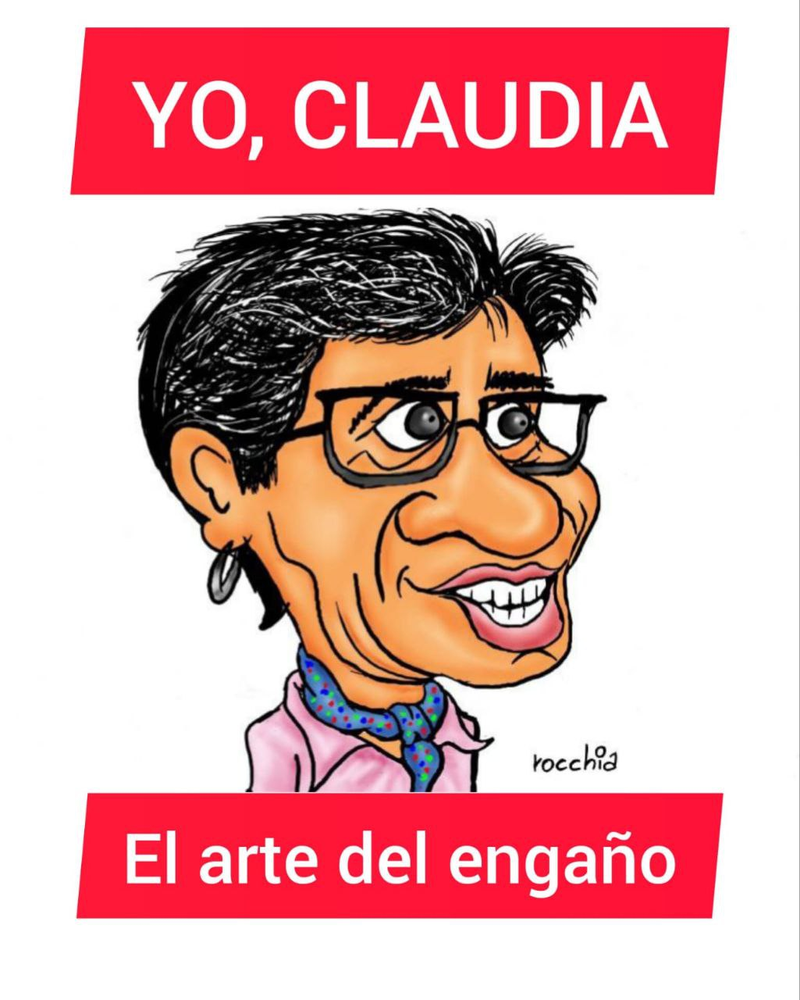
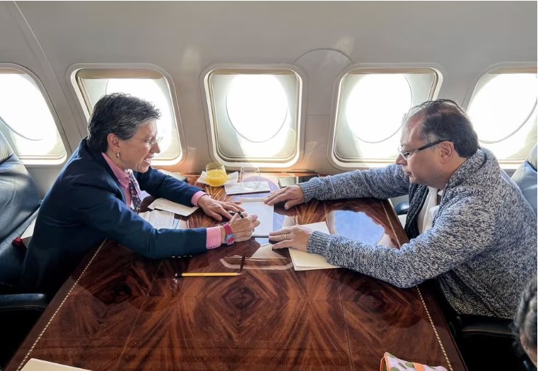
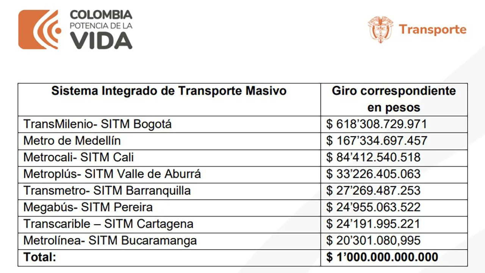
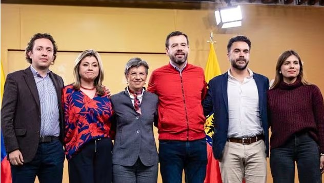
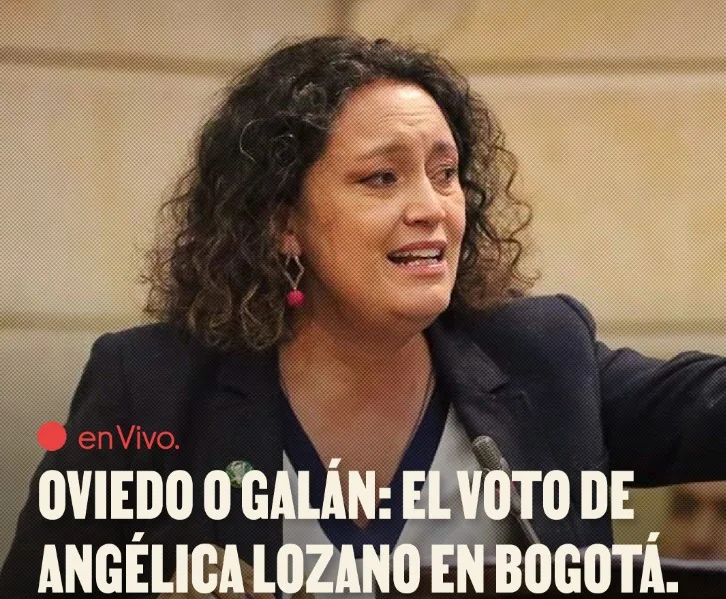

*Yo, Claudia o el arte del engaño: La caída de Bogotá/Cortesía Rocchia.*

Yo, Claudia o el arte del engaño. En Bogotá está por terminar un mandato desarrollista a lo Enrique Peñaloza con una imagen favorable precaria. Desde la llegada del liberal **Jaime Castro**, el Distrito Capital gira entre el centro de derecha y la izquierda. Los **resultados electorales del 29 de octubre de 2023** confirmaron esta premisa. La lucha por el control de Bogotá fue una auténtica partida de ajedrez entre dos ajedrecistas de pesos pesados. El duelo lo ganó la alcaldesa de Bogotá, **Claudia Nayibe López Hernández** (centro―derecha), sobre otro excelente ajedrecista de izquierda, el presidente de Colombia, **Gustavo Petro Urrego**. Su candidato, **Gustavo Bolívar**, sufrió una aplastante derrota frente a **Carlos Fernando Galán**, quien lo triplicó en el número de votos.

La real política, es decir, la praxis de la política, es como un juego de ajedrez o una comedia a _La Mandrágora_ (Maquiavelo, 1518). Los políticos manejan el arte del engaño para obtener sus fines. Los jugadores mueven las fichas previendo la próxima jugada del adversario. No actúan pensando en el **valor presente** sino en en el **valor futuro**. Pero tienen la capacidad de disfrazar sus íntimos intereses como si fueran los intereses colectivos.

Por tanto, de una **partida de ajedrez político**, la sociedad es la única perdedora. Gane quien gane ―para la ciudadanía común― se traduce en una verdadera tragicomedia política. Refleja lo sucio que es el ejercicio de esa real política de izquierda o de derecha. Así está retratado en _La Mandrágora_ del pensador florentino **Nicolás de Maquiavelo** y en la _Teoría del Poder_ (2022) del filósofo samario **Bruno Maduro**.

Te puede interesar: [Defender a Petro y condenar a Hamás y al genocidio sionista de Netanyahu (I)](/articulos/defender-a-petro-y-condenar-a-hamas-y-al-genocidio-sionista-de-netanyahu/)

## Enfoque metodológico

¿Por qué se propone un **enfoque centrado en el Ser**? Los análisis superficiales que hacen los comentaristas _**bogocéntricos**_, sean de izquierda o de derecha, solo se centran en el fracaso del Pacto Histórico. Si bien es verdad, los resultados electorales en las pasadas elecciones regionales y locales reflejan un nivel de inconformidad que no lo recogen ninguna de las vertientes políticas. Esto es, se parte de la diferenciación metodológica propuesta en el párrafo de entrada sobre el arte del engaño.

Contrario al _enfoque bogocéntrico_ en este análisis ―desde la periferia― surge como necesidad libertaria y ética de un periodismo independiente y transformador para iniciar una **acción política distinta a las dominantes**. Un periodismo que parte de la realidad y necesidad diaria del ciudadano y no de las necesidades políticas de las ideologías y partidos dominantes, y de los medios de comunicación hegemónicos.

Este enfoque ―que es un fin en sí mismo― busca develar (quitar el velo) de los intereses particulares y mezquinos bien ocultos en falsos discursos políticos que persiguen oscuros objetivos personales disfrazados de intereses colectivos.

## Las dos maquinarias y el presupuesto público

*El supuesto acuerdo de Orinoquía.*

La premisa básica con la que se parte es que cualquier candidato que quisiera ganar la Alcaldía de Bogotá tenía que contar con la maquinaria. Una maquinaria bien aceitada por el gigantesco presupuesto público de la ciudad que llega a **$26 billones (2023)** solo para inversión social. No se tiene en cuenta el pago de la deuda y el funcionamiento burocrático de la maquinaria. El rubro total llega a **$31,5 billones**.

A su turno, el presupuesto de la ciudad también se mueve con las enormes transferencias que desde el gobierno nacional se aportan para el caótico y loco sistema de transporte de la ciudad, el Metro en construcción y la nueva línea de Metro propuesta. Entre las troncales de Transmilenio y las dos líneas de metro que se proponen construir, los aportes se acercan a la espeluznante cifra de **$60 billones**,

El presidente **Gustavo Petro** conocía muy bien esta premisa. Sabía ―desde el día de su posesión― que debía ganarse a la alcaldesa para lograr modificar el contrato del Metro de Bogotá hacia la propuesta de metro subterráneo. También sabía que sería la puerta de entrada para consolidar sus pretensiones electorales en Bogotá con Gustavo Bolívar.

Por su parte, la alcaldesa **Claudia Nayibe López**, sabía que debía ganarse al presidente para obtener los avales pertinentes, condición fundamental del proceso licitatorio de la segunda línea del Metro. Este ramal va hacia las localidades de Suba y Engativá. De esta manera, podría obtener el aporte de recursos por parte de la nación para suplir el enorme déficit que tiene el caótico sistema de transporte de **Transmilenio**, que se acercaba a **$1 billón de pesos**. Allí comenzó la partida de ajedrez que culminó con el jaque al presidente. Así se tejió la derrota de Bolívar y la perpetuación del oportunismo de centro derecha _**bogocéntrico**_.

Te puede interesar: [¿Se contaminó la elección de Petro con dineros sucios? (VI)](/articulos/se-contamino-la-eleccion-de-petro-con-dineros-sucios/)

## El arte del engaño de Yo, Claudia

El arte del engaño es una tarea para aquellas personas que no tienen límites. Sin escrúpulos. En aras de lograr su objetivo, la alcaldesa López hizo como el camaleón, cambió de táctica. De oponerse ferreamente en un primer momento a las pretensiones del Presidente por modificar el trazado del Metro, se inclinó. Quizás se arrodilló. Se mordió la lengua para rogar una tregua y lograr su cometido. Le aceptó al Presidente su propuesta de hacer las revisiones pertinentes y los estudios técnicos necesarios con la empresa china para modificar el trazado.

De esa manera, sin estar en su mente cumplir, la alcaldesa permitió que funcionaran «mesas técnicas»  para estudiar la propuesta del presidente y avanzar en “pactos”. Así ganaba tiempo. Solo quería que **Ricardo Bonilla**, ministro de Hacienda, le desembolsara los recursos que necesitaba para su caótico sistema de transporte. Solo quería el aval financiero del ministerio de Hacienda para la segunda línea del Metro.

El _**Pacto de la Orinoquía**_, de febrero de 2023 ―muy publicitado por los medios de comunicación― fue la estrategia de la alcaldesa para bajarle la tensión al tema. Al mismo tiempo, esperaba pacientemente que le definieran los recursos anhelados. Mientras eso ocurría, el congreso empezaba a discutir una **adición presupuestal** presentada consecuencialmente en ese mismo mes por el ministro de entonces, **José Antonio Ocampo**.

## Yo, Claudia, hace que se arrodilla

La alcaldesa esperaba pacientemente para dar su golpe de mano. El Presidente, dentro de su sistema de creencia, pensaba que podía convencer a la escurridiza y habilidosa alcaldesa para sumarla a su propósito de cambiar el trazado del metro.

La llegada en mayo de 2023 del ministro Bonilla sirvió para que la alcaldesa consolidara su posición. Por tanto, mostrara su verdadera careta y su esencia: el arte del engaño. **Ricardo Bonilla**, apenas tenía una semana de su posesión como ministro de Hacienda, Petro lo dotó de funciones presidenciales. **Lo primero que hizo fue firmar la garantía de la Nación para los créditos que necesitaba la segunda línea del Metro.**

Ese primer acto del ministro Bonilla empoderó a Claudia. Sin embargo, faltaba más. La real posición de la alcaldesa se consolidó con el segundo acto de **Ricardo Bonilla**. ¡Le aprobó los recursos (**$618,3 mil millones** ) que necesitaba Claudia para resolver el déficit del inviable sistema de transporte creado por la _mente bogocéntrica_. Eran los mismos recursos “embolataos” en las discusiones de la adición presupuestal.

Te puede interesar: [¿Tumbar a Petro con fuente anónima? (I)](/articulos/tumbar-a-petro-con-fuente-anonima-i/)

## Bonilla y Petro, los engañados

El artífice de la maniobra, el sujeto que hizo posible que se concretara el arte del engaño de Claudia López fue el mismo ministro de Hacienda, **Ricardo Bonilla**. Ella no sabía cómo sacar el dinero de la nación de esa adición presupuestal de $16 billones. Bonilla se la puso de _papayita_ y le dio la fórmula para sacar debajo de la manga **$1 billón**. Con el fin de matar varios pájaros con un solo tiro (lenguaje violento que refleja la estupidez de la conducta), hizo el acuerdo con los parlamentarios que fue un oxigeno para las maquinarias tradicionales en plena recta final de las elecciones.

En el paquete incluyeron a Barranquilla, Medellín y el Valle de Aburrá, Cali, Pereira, Cartagena y Bucaramanga con el fin de distribuir entre ellos el 38% de las transferencias.

*Ministerio de Hacienda distribuyó y ordenó el giro de recursos para cubrir déficit operacional de Sistemas Integrados de Transporte Masivo.*

## Cómo se fraguó el arte del engaño

*La sonrisa de Yo, Claudia con el ganador de la contienda, Carlos Fernando Galán./Cortesía alcaldía.*

Contemplen esta situación que se presentó en los momentos febriles de la aprobación de la mencionada adición del Presupuesto Nacional proveniente de los dineros de la reforma tributaria.

**El 23 de junio**, último día de sesión de las comisiones económicas del Congreso que debían aprobar la **adición presupuestal**, la alcaldesa estaba allí muy pendiente con computador en mano. **Logró sacarle al gobierno nacional la suma de $618,3 mil millones** para cubrir el déficit de Transmilenio. Esto equivalente al 61,8% de lo asignado al Sistema Integrado de Transporte (SIT) del país

En un tiempo récord (mayo-junio) la alcaldesa logró su cometido. Sólo esperaba el desembolso de los recursos. Bonilla se los giró un mes y medio antes de las elecciones. El 4 de septiembre llegaron a las arcas del Distrito para atender los requerimientos de Transmilenio. Así quedó establecido en el artículo 4 de la Ley 2293 de 2023.

La pregunta que surge de esa transferencia de la nación a diferentes en entes territoriales: **¿El dinero fue utilizado para atender necesidades del sistema de transporte?** ¿Le dieron otra destinación? ¿Esos giros estuvieron atados a un acuerdo con la alcaldesa? ¿Deberá Bonilla responder esta y muchas preguntas más? Sin duda, que sí. Un ejemplo de ello es el desvío del dinero que se hizo en Barranquilla.

## El arte del engaño y su máscara

*Angélica Lozano, el arte del engaño. Cortesía La Silla Vacía.*

De cualquier manera, se había consumado la jugada maestra de la alcaldesa. Una jugada que refleja su ambivalencia y su carácter de doble faz. Una máscara para lo público y otra máscara para lo privado. Mientras tanto, el Presidente Petro esperaba con mucha ingenuidad política. Creía que su ministro estrella con funciones presidenciales pudiese hacer que la alcaldesa ―¡ahora sí!― apoyaría su metro subterráneo. Y con este hecho, se tejería una alianza poderosa que llevaría al alfil del Presidente (Gustavo Bolívar) al Palacio Liévano.

Los resultados saltan a la vista. De una actitud de espera, y después de tener en el bolsillo los recursos de Transmilenio, **la alcaldesa pasó a la ofensiva**, como todo oportunista. Con la ayuda de destacados dirigentes del Partido Verde (Katherine Miranda y su misma esposa, **Angélica Lozano**), iniciaron la ofensiva para impedir la llegada del alfil del presidente al Palacio Líevano.

Es claro que la propia dirección del partido Alianza Verde ―de la cual hace parte su mujer― estaba al tanto de todas estas jugarretas. De manera sospechosa, el mismo día que el ministerio de Hacienda le desembolsó los $618,3 mil millones a Transmilenio (4 de septiembre), la dirección de los verdes "dejó en libertad" a sus militantes para votar por cuatro candidatos. Por supuesto, la maquinaria de Claudia la aceitó a favor de su candidato preferido, **Carlos Fernando Galán**. **Katherine Miranda** adhirió el 14 de septiembre a Galán. La esposa de la alcaldesa ―camaleónica y de doble filo como su marido― dijo que su voto estaba entre Galán y Oviedo.

En general, la derecha del partido verde se inclinó por buscar una final entre Galán y Oviedo para una supuesta segunda vuelta. Y allí se fue la esperanza de Gustavo Bolívar de ganar la alcaldía. O, por lo menos, pasar a una segunda vuelta.

## Yo, Claudia y su ofensiva

La idea era promover una segunda vuelta entre Galán y Oviedo. Por tanto, se debería atacar con todos los hierros a Bolívar. Era el enemigo a derrotar. La ofensiva de la alcaldesa fue brutal. Ronda de medios, Presencia reiterada en los informativos con ataques directos al Presidente. Páginas enteras en diarios de circulación nacional daban cuenta de una supuesta parálisis de las obras que haría el candidato del Presidente. Defensa a ultranza del diseño de Metro elevado, con el cual coincidía el candidato Galán.

En suma, Claudia desató un feroz activismo político sin precedentes en varios frentes para impedir el triunfo de Gustavo Bolívar. Mientras el poco carismático alfil del Presidente veía venir su propia derrota. Lo que no se imaginó fue la tamaña paliza que recibiría el 29 de octubre al ocupar el tercer lugar detrás de Oviedo que le sacó 2 puntos porcentuales. Es decir, 45 mil votos.

Al final, el Presidente intentó frenar la debacle que ya estaba en ciernes. Programó los consejos de gobierno en algunas alcaldías locales donde la situación era más crítica. El viaje que hizo a China quiso usarlo para atraer a un electorado que aparecía esquivo. Pero la partida ya estaba perdida. El Jaque mate estaba escrito. Sólo faltaba medir el tamaño de la debacle.

La imagen final de esta historia es la cara de satisfacción que los esposos López―Lozano mostraron en un video para sus seguidores. Celebraban un triunfo que también había sido suyo. La foto de la alcaldesa con el triunfador era uno de los hechos más esperados por la pareja de esposas.

El abrazo de **Yo, Claudia**, con **Carlos Fernando Galán Pachón** ¿qué representará para Gustavo Petro? ¿El fracaso del Pacto Histórico en casi todo el territorio nacional como en Bogotá? Yo, Claudia, encarna no solo su desquiciado afán de protagonismo sino la verdadera esencia de la real política. Ella es una excelente protagonista de La Mandrágora que resume todo lo contrario de lo que es la política según Aristóteles: la doble careta (doble faz). Una cosa es lo que dicen en público y otra lo que hacen en privado.

## Próxima entrega

La segunda entrega de Yo, Claudia, versará sobre las finanzas del Distrito y su incapacidad de asumir la construcción del Metro de Bogotá. Explicaremos cómo el presidente Petro puede _coger el toro por los cachos_ y hacer que el proyecto sea un asunto nacional para quitarle la competencia al Distrito Capital.

## Nota

**Lucio Torres** fue precandidato presidencial en 2009 junto con Gustavo Petro y Carlos Gaviria (fallecido).