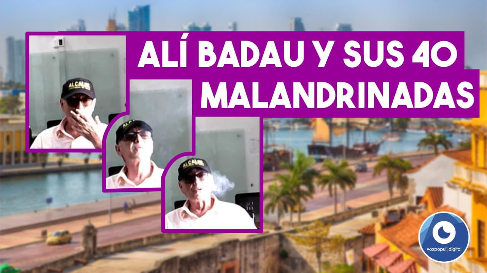
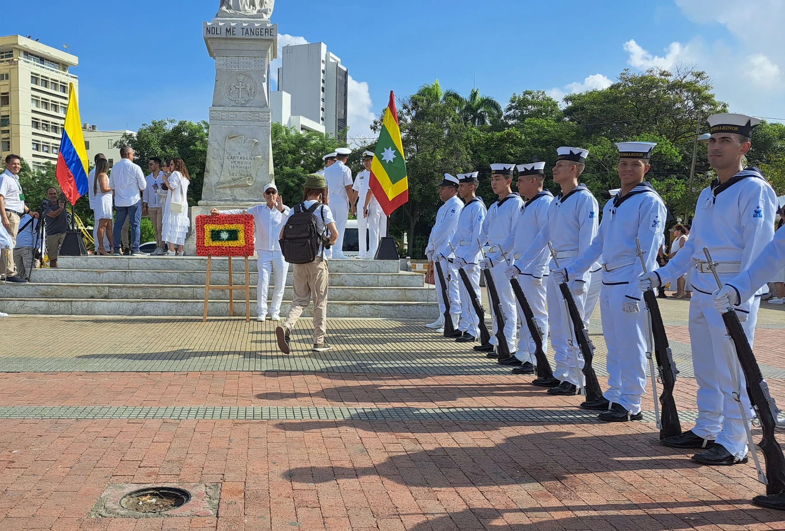

*Un psicópata en la alcaldía: la autodestrucción de Cartagena. Se fumó el presupuesto.*

En síntesis, **William Dau** pasó de autodenominarse _el Tractor_ a ser una _carretilla trabada_: **Un psicópata en la alcaldía** de Cartagena. Asqueado de la crisis de gobernabilidad y de una percepción de alta corrupción, **hace 4 años el 84%** de los cartageneros expresó que **la ciudad va por mal camino**. En diciembre de 2019 la mayoría se ilusionó de que se iba a salir del atolladero con el nuevo alcalde que le prometía _mocharle_ la cabeza a _los malandrines_.

Hoy, la desilusión es estremecedora e impactante: el 87% es pesimista. El resto es indiferente. Estas cifras son de la encuesta de percepción 2023 de **Cartagena Cómo Vamos.**

El periodista que esto escribe y publica fue víctima del psicópata. En una cena en Bocagrande de fin de año de 2018 me propuso su plan de ser alcalde y yo gobernador. Por la financiación de la campaña no había problemas. Respetuosamente le dije que no. No había empatía y tampoco podía ir en _contravía_ de mis principios integrales.

## 4 años de persecución

Sin embargo, en estos 4 años que terminan, sufrí la persecución, incluso, de amigos de izquierda que me insultaban porque creían que estaba al servicio de _los malandrines_ cuando advertía de la catástrofe que sufriría la ciudad. Los proyectos sociales de nuestra fundación fueron bloqueados. La policía nos detenía arbitrariamente. Algunos colegas se colocaban del lado del alcalde psicópata. Fuimos objeto de muchas acciones judiciales que, afortunadamente, fallaron a favor.

Esta publicación la despojo de todo prejuicio. Hice lo posible por adherirme a una imparcialidad subjetiva para ser objetivo en la interpretación de los hechos. La administración de William Dau cierra su nefasto ciclo dejando un nivel de pesimismo mayor al de hace cuatro años cuando se creyó que habíamos tocado fondo. Un período inestable de 8 años de desgobierno que culminó con un alcalde encargado por el presidente Iván Duque, **Pedrito Pereira**, quien fue una marioneta de la corrupción nacional del momento.

Te puede interesar: [El alcalde le hizo pistola a Cartagena: un año perdido](/articulos/el-alcalde-le-hizo-pistola-a-cartagena/)

## El dominio hegemónico y el odio

*Un psicópata en la alcaldía. No le interesa el dolor de sus semejantes. Miren el hueco donde hace 4 años había una lámpara. Refleja la psicopatía de William Dau. /Voxpopuli.Digital.*

A diferencia del adormecimiento mental de los barranquilleros (los medios de comunicación, el Junior, el Carnaval, están en poder de los Char para dormir a la sociedad) que aceptan con gusto la psicopatía de sus tres gobernantes (**Alejandro Char II, Elsa Noguera y Jaime Pumarejo**) que ha tenido en los últimos 16 años, **los1.065.570 cartageneros** tienen otra reacción.

La mayoría odia al gobernante cuando se quiere perpetuar en el poder. Su capacidad de reaccionar inconscientemente frente al dolor infringido es quejarse o calumniar en el _palito de caucho_ o debajo de la alcaldía. Ahora lo hacen en sus redes sociales. Este es un recurso heredado de siglos de servidumbre de colonización española. Por ejemplo, hace 20 años el odio era contra la **_Casa García_** y la _**Casa Araújo**_. Hace 4 años era contra los malandrines. Hoy, el odio es contra **William Dau**. ¿Cómo se explica este fenómeno?

Sin embargo, el pasado 29 de octubre, **160 mil cartageneros** (una votación histórica) recurrieron a un supuesto _malandrín_ (**Dumek Turbay Paz**) para que los salvara del supuesto _antimalandrín_, William Dau, quien tenía candidata propia. Pero, al final, se demostró que cuando uno acusa a otro sin fundamento, sin pruebas y sin soportes, está haciendo una extensión de dí mismo. Ve en el otro lo que uno es. Si no hay pruebas, la palabra de uno se convierte en calumnia o injuria. ¿Cuántas veces fue condenado por estos dos males el alcalde Dau? Más de 25 procesos que lo obligaron a retractarse. Ya no le decían el **Tractor** sino el **Retractor**.

Como se trata de hechos, hoy empezaremos a analizar los 7 pecados capitales de psicópata en la alcaldía que, gracias a Dios, concluye el 31 de diciembre su doloroso período.

Te puede interesar: [Cartagena sin alcalde electo, ¿y por qué Pedrito instaló comisión de empalme?](/articulos/cartagena-sin-alcalde-electo-y-por-que-pedrito-instalo-comision-de-empalme/)

Te puede interesar: [Covid-19: ¡Cartagena se derrumba, y el alcalde de rumba! (I)](/articulos/covid-19-cartagena-se-derrumba-y-el-alcalde-de-rumba-i/)

## El periodismo que pasa de la denuncia a la acción

*Zozobra pre-electoral*

A este periodista, el alcalde psicópata (no es un calificativo, aquí te mostramos las evidencias) lo acusó de estar al servicio de _los malandrines_ cuando se le desenmascaró en los informes periodísticos. Y hasta le pagaron a falsos periodistas y a algunos _influencers_ para atacarnos. ¿Cuántos enemigos gratuitos de la izquierda cartagenera se vinieron en contra del periodista? ¿Cuántos líderes sindicalistas le chupaban la suela al alcalde mientras vivían sabrosos con las ordenes de prestación de servicios de **$7 millones** **mensuales**? Colegas al servicio de cadenas nacionales se fueron contra el periodista cuando le preguntó al alcalde sobre su presunta adicción al bazuco.

A esos burócratas de derecha o de izquierda, sindicalistas o patronalistas, no les importó que la pobreza monetaria de los cartageneros se había remontado a **43,6%**. Tampoco que de cada 100 cartageneros, 40 padecieron hambre, según Cartagena Cómo Vamos. Los revocadores demostramos con cifras que William Dau, además de ser un vicioso que no respondió nuestra pregunta en plena audiencia, había sido incapaz de gobernar.

Si bien la Registraduría y todos los organismos de control como la justicia y la Fiscalía estuvieron del lado del psicópata alcalde, las personas y sus organizaciones fuimos capaces de recoger 95 mil firmas en tres meses para revocarlo. Que la Registraduría no las validó, pese a que 65 mil firmas eran válidas, demostró que esos mecanismos de participación son una falacia.

Si William Dau era el padre vicioso y psicópata ¿cómo iban a ser sus hijos? El tiempo demostró que esas 65 mil personas, cuyas firmas eran válidas, tenían razón: Dau era incapaz de gobernar. La ciudad debió experimentar 3 años más de dolor para reaccionar.

Te puede interesar: [**Cartagena Revoca ¡por fin! recibió formatos para revocar a Dau**](/articulos/cartagena-revoca-por-fin-recibio-formatos-para-revocar-a-dau/)

Puedes leer: [**«El Buitre» Dau se destapó con mentiras y verdades a Bloomberg**](/articulos/el-buitre-dau-se-destapo-con-mentiras-y-verdades-a-bloomberg/)

## Lo fundamental desvelar un psicópata en la alcaldía

Pero, lo fundamental de este análisis es la **autodestrucción de Cartagena** cuando eligió a un psicópata como alcalde que la ilusionó y la manipuló en el primer año de su gobierno. Tiempo suficiente para meterse en el bolsillo a una población sufrida y con una _desesperanza aprendida_. Pero la ilusión termina cuando ya la magia del psicópata no funciona.

De hecho, las últimas ocurrencias en Facebook de **William Dau Chamat** intensifican ese sentimiento de _desesperanza aprendida_. Al comienzo de su administración, fue la sensación para aquellas personas que se autoengañan y se autodestruyen llevadas por sus propias frustraciones. Solo esperan un salvador capaz de matar a sus enemigos, causantes de su mala situación, como cuando David mató a Goliat, según el Antiguo Testamento.

Te puede interesar: [¡Hasta siempre Mastrascusas! Un líder de la causa social](/articulos/hasta-siempre-mastrascusas-un-lider-de-la-causa-social/)

## ¿Lección aprendida?

¿Cuantas veces nos hemos tropezado con la misma piedra? Lo peor, nos acostumbramos a estar en piso y sin deseo de levantarnos. Sabemos sus causas y consecuencias. Pero, no hallamos solución a nuestro mal. No entendemos que la solución está en quitar la piedra del camino y estar alerta en el caminar para no caer y ser víctima de la esclavitud.

Entonces, nos entregamos a un _salvador_ y con él vivimos nuestra luna de miel hasta cuando la magia deja de funcionar y aparezca otro salvador. Y se repite el ciclo.

Este análisis espero que lo lean, especialmente los **20 millones de colombianos** que ejercen el poder electoral y eligen presidentes. Esta pretensión no deja de ser una ilusión y quizás es también mesiánica. Nadie salva a nadie. La salvación es individual, pero su consecuencia es social. Si el 10% de los que votan fuesen conscientes de esta realidad, Colombia cambiaría. Porque serían 2 millones de líderes con una nueva visión de la vida y de la política. Y los líderes transforman o destruyen una sociedad.

Te puede interesar: [¡](/articulos/adios-yolanda-nos-dejaste-una-cloaca-edurbe-ii/)[Adiós, Yolanda! Nos dejaste una cloaca: Edurbe (II)](/articulos/adios-yolanda-nos-dejaste-una-cloaca-edurbe-ii/)

## La realidad

Nuestra nación está sumida en una pelea fratricida entre _uribistas_ y _petristas_, derechistas e izquierdistas mientras la nación se hunde. No hemos aprendido la lección. ¿Serían capaces los colombianos de elegir -después del presidente Petro- a un presidente como Álvaro Uribe Vélez, cuyo legado fue de violencia y de autodestrucción? No acabó con la guerrilla ni con el narcotráfico, como lo prometió en 2002. Creó una sensación de seguridad en forma ilusoria cuando los finqueros y los pueblerinos nos podíamos trasladar de un lugar a otro sin que la guerrilla hiciera su _pesca milagrosa_.

La inseguridad ya no era un problema de la élite. Ahora la inseguridad se socializó en los centros urbanos disputándose las rentas ilegales con la _vista gorda_ de las autoridades. El narcotráfico y la corrupción crecieron. Cartagena como Barranquilla y Santa Marta, _las tres perlas del Caribe_, están en poder de la mafia del narcotráfico. Esto no es nuevo. Pero en los últimos 4 años los indicadores de delitos de alto impacto crecieron exponencialmente.

En Cartagena nos entretuvimos oyendo y riéndonos de las locas salidas de su psicópata alcalde. Entre tanto, la ciudad vivía y vive una crisis de su tejido social. Más bien, una crisis de su conciencia social.

Te puede interesar: [Revolcón en resultados electorales: García recuperaría más de 20 mil votos! (I)](/articulos/revolcon-en-resultados-electorales-garcia-recuperaria-mas-de-20-mil-votos-i/)

## La buena noticia

En otras palabras, nosotros mismos nos convertimos en sociópatas al elegir a un psicópata en el poder. En el caso de los cartageneros, nuestro alcalde. ¿Quién lo eligió? Su elección reflejó una situación especial de los electores. Se perdió el sentido de pertenencia y de las virtudes sociales de hacer el bien general que se transforma en bienestar social. No alcanzamos a discernir entre el bien y el mal. Nos alineamos y esclavizamos según nuestros apegos: ya somos de derecha, ya somos de izquierda, ya uribistas o ya petristas.

El discurso de William Dau fue un soliloquio. Hablaba solo, pero reflejaba el parecer de la mayoría de los cartageneros asqueados por la miseria y la corrupción. Él representaba a sus seguidores cuando atacaba a los supuestos _malandrines_. ¿Quién no se rió y se solazó cuando le dijo a todos los concejales _hijueputas malandrines_?

En fin, nos olvidamos que somos seres humanos. Que el dolor no tiene género ni ideología. Porque el dolor es dolor. Y el amor es amor. La buena noticia es que el amor sana todo. Y lo mejor, es gratuito y lo tienes tú. Está en el Ser. ¡Descúbrelo!

## Un psicópata en la alcaldía y la desesperanza

Son cuatro años de una _desesperanza aprendida_, tal como lo analiza el psicólogo social **Martin Seligman,** padre de la **psicología positiva**. Debemos desarrollar más las emociones creativas y positivas que nos producen un bienestar individual o social. ¿Por qué? Las personas que son más felices, tienen más resistencia al dolor y son en general más sanas y viven más, dice Seligman.

Pero, además, las personas felices logran mejores ingresos, porque les gustan emprender y siempre tienen un proyecto creativo en mente. Las desventajas y debilidades no los frustran. Por el contrario, se convierten en un desafió para llevar a cabo su noble propósito. Esto está demostrado por muchos estudios científicos. Y por la experiencia misma. Y mi propia experiencia.

En cambio, las personas infelices, frustradas y que tienen un grado de trastorno mental, se autodestruyen y afectan su entorno de influencia. Y si son psicópatas y se meten en la política, llegan a ser hasta presidentes y, otras veces, se convierten en dictadores. La historia universal nos presenta dos ejemplos: **Joseph Stalin y Adolfo Hitler**. Uno de izquierda y otro de derecha. Los dos fueron unos psicópatas consumados. Llevaron a la muerte a 60 millones de seres humanos.

Las personas con trastorno de personalidad antisocial tienden a antagonizar, manipular o tratar a los demás con dureza o con indiferencia insensible. En la próxima entrega mostraremos los 7 pecados capitales del psicópata.