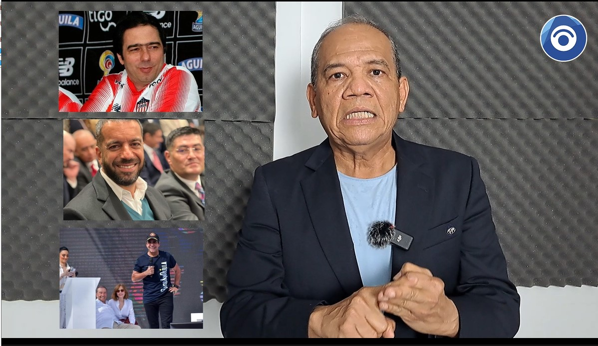

*Demanda de nulidad contra Alejandro Char en Tribunal Administrativo. /Alcaldía de Baranquilla.*

Un demanda de nulidad contra la elección del alcalde de Barranquilla, **Alejandro Char Chaljub**, se radicó ante el **Tribunal Administrativo del Atlántico**. Esta acción electoral se presentó como ciudadano y defensor de los derechos humanos de la humanidad. Se busca que la autoridad judicial declare la **nulidad del fallo del Consejo Nacional Electoral (CNE) que habilitó su candidatura**.

Para ello, la demanda se basa en **dos casos fácticos**.

## Caso Serfinanza

El primero se refiere a las relaciones comerciales del Banco Serfinanza con el Distrito de Barranquilla. Dos hechos inhabilitantes con relación a Serfinanza. **El primero**, la pignoración de los ingresos de libre destinación durante la administración de Jaime Pumarejo.

El Distrito de Barranquilla le hizo un préstamo a Serfinanza pignorando sus ingresos de libre destinación, tomando en cuenta que el Distrito se encuentra sobre endeudado. Los dos gobiernos de Alejandro Char y los de Elsa Noguera y Jaime Pumarejo llevaron al Distrito a sobregirarse hasta el año 2035, de acuerdo con los estudios sobre finanzas públicas realizado por la Universidad del Norte.

## Un alcalde inhabilitado desde su primera elección

*Demanda de nulidad contra Alejandro Char por tramposo. Usa el junior y los carnavales para mantener dormida a la población barranquillera./Alcaldía.*

**El segundo hecho.** Una parte de los $93 mil millones girado por la nación para ese fondo, por cualquier razón, fueron girados a cuentas de Serfinanza. En el último año de la administración de Jaime Pumarejo se abrieron varias cuentas fantasmas en el Banco de los Char con el fin de administrar esos dineros. El hecho se destapó cuando el 7 de septiembre el Ministerio de hacienda y Crédito Público giró la suma de $26.286 millones. En forma extraña esos dineros llegaron a una cuenta de ahorro de Serfinanza que estaba embargada por **Consorcio Grandes Proyectos** donde hacía parte algunos amigos de Alejandro Char.

En el 2009 adjudicaron la construcción del Portal de Soledad a ese consorcio. **Elsa Noguera**, en su calidad de alcaldesa no pagó ese compromiso con el consorcio. Ante esta situación, presentó un laudo arbitral que el 13 de abril de 2018 falló contra Transmetro. Ya para esa época, Alejandro Char recibió de nuevo el caso en su segunda administración. J**aime Pumarejo tampoco pagó**.

Es decir, en su tercera administración, Alejandro Char encontró una verdadera pelotera que hace 14 años él inició. Pero más grande y onerosa es la deuda que debe pagar Transmetro y del Distrito de Barranquilla. Defrauda el fisco, burla la ley 80/93, causa daño a terceros, el Distrito debe pagar sumas onerosas, despilfarra los recursos oficiales, fracasa en las grandes obras que quedan como elefantes blancos y vuelve a ser elegido por más de 400 mil votos. ¿Acaso la cultura mafiosa y traqueta es la hegemonía dominante en Barranquilla?

## Caso Junior

*¿Cuánto cuesta Carlos Bacca? El capital del junior representa $500 millones. No le pagan un solo peso al Distrito de Barranquilla por el uso del estadio metropolitano. Son empresarios tramposos.*

Ninguno de los clubes deportivos profesionales de Barranquilla pagan por el usufructo de los escenarios deportivos creados para el deportes y la recreación pública. Todos están al servicio exclusivo de esas **empresas deportivas** que generan a sus dueños altas ganancias sin que la ciudad se beneficie.

Desde el 2011, fecha de constitución legal como empresa de sociedad anónima, la [Corporación Popular Junior no paga por el uso y usufructo](DECLARAR de oficio la nulidad absoluta del contrato 312 del 30 de diciembre de 1994, suscrito entre el Instituto Distrital para la Recreación y el Deporte y el Club Deportivo “La Gaitana”, en los términos expuestos en esta providencia.) del estadio Metropolitano _Roberto Meléndez_. Instrumentalizan **actas de uso** para disfrazar un contracto de arrendamiento o de concesión.

## Vea el análisis

https://youtu.be/W-gdJMPdCWo

## Defraudan al Distrito desde hace 12 años

De esta manera, desde hace 12 años, consecutivamente año tras año, la Secretaría de Recreación y Deportes del Distrito (SRDD) cada enero le entrega el estadio Metropolitano mediante una **acta de uso marco** cuya duración se prolonga hasta el 31 de diciembre. El acta de uso, determina que le cede por 24 horas el **estadio metropolitano** al Club Popular Junior (una empresa de sociedad anónima) cada vez que vaya a jugar. O sea, todo el año. A cambio de ello el Distrito no recibe un solo peso.

Así se firmaron las actas de 2019, 2020, 2021, 2022, 2023. Las dos últimas durante el período inhabilitante. En la administración del alcalde, presuntamente inhabilitado, la SRDD debió firmar el acta del 18 de enero de 2024 con ocasión del partido donde Junior le ganó a Millonarios 1-0 en el estadio Metropolitano.

## **Aclaración**

En aras del principio de transparencia, como parte de este informe periodístico, consideren los intereses que se tiene en el proceso judicial iniciado con esta demanda. **VoxPopuli Digital** hace parte de la **Fundación VoxPopuli Corporación** asociada a un bufete jurídico y de auditoria forense.

El lector se estará haciendo esta pregunta. **¿Cuál es nuestro interés?** Se pretende develar el entramado empresarial que permitió la captura íntegra del Distrito de Barranquilla y de la gobernación del Atlántico. Presuntamente, ese entramado está al servicio de intereses privados de la familia Char, Daes y sus asociados. Se presume que utilizan las transferencias de la nación a los entes territoriales mencionados y sus ingresos corrientes para acumular riqueza en forma indebida con una apariencia de legalidad. Esto se tiene que acabar.

## La demanda de nulidad

El 29 de septiembre de 2023, se presentó ante el CNE una solicitud de revocatoria de la inscripción del ciudadano **Alejandro Char Chaljub** para la alcaldía de Barranquilla en las elecciones regionales del 29 de octubre del 2023. Esta solicitud se fundamentó en la causal de inhabilidad prevista en el numeral 3 del artículo 37 de la Ley 617 del 2000. Se abrió el expediente con radicado No CNE-E-DG-2023-044564. **El CNE desestimó la solicitud y habilitó la inscripción del candidato.**

Por esa razón, la demanda de nulidad pretende que se declare la nulidad de la **Resolución No 13709** de 2023 del 19 de octubre de 2023, por la cual el CNE negó la solicitud de revocatoria de la inscripción del candidato de Cambio Radical, **Alejandro Char Chaljub**.

*La demanda contra la elección de Alejandro Char fue trasladada el 19 de enero al Tribunal Administrativo del Atlántico. Captura de pantalla del traslado.*

## Declarar nula la elección de Char

La segunda pretensión de la demanda es que se declare la nulidad del Acta General de Escrutinio, proferida por la Comisión Escrutadora Distrital de Barranquilla―Atlántico. En consecuencia, se decrete la nulidad de la elección de **Alejandro Char** a la Alcaldía de Barranquilla el 29 de octubre del 2023.

La demanda se diseñó tomando en cuenta el **artículo 275 de la Ley 1437** del 2011, que habla de las causales de anulación electoral previstas en el numeral 5 del artículo 137 de este Código:

> «Se elijan candidatos o se nombren personas que no reúnan las calidades y requisitos constitucionales o legales de elegibilidad o que se hallen incursas en causales de inhabilidad.»

Esta demanda se fundamenta en mi rol de ciudadano colombiano, defensor de los derechos humanos, periodista investigativo, en ejercicio del artículo 40 de la Constitución política de Colombia. Desde el punto legal, en el artículo 23 de la Convención Americana de Derechos Humanos y el artículo 275 de la Ley 1437 del 2011. Ello indica que se está habilitado para presentar esta demanda ante el Contencioso Administrativo en procura del orden jurídico electoral colombiano.

## Lea la demanda y comparta la noticia y el video. Toda Barranquilla debe saber que tiene un alcalde tramposo

DEMANDA-DE-NULIDAD-ELECTORAL-CONTRA-LA-ELECCION-DE-ALEX-CHAR (documento no disponible)Descargar (documento no disponible)