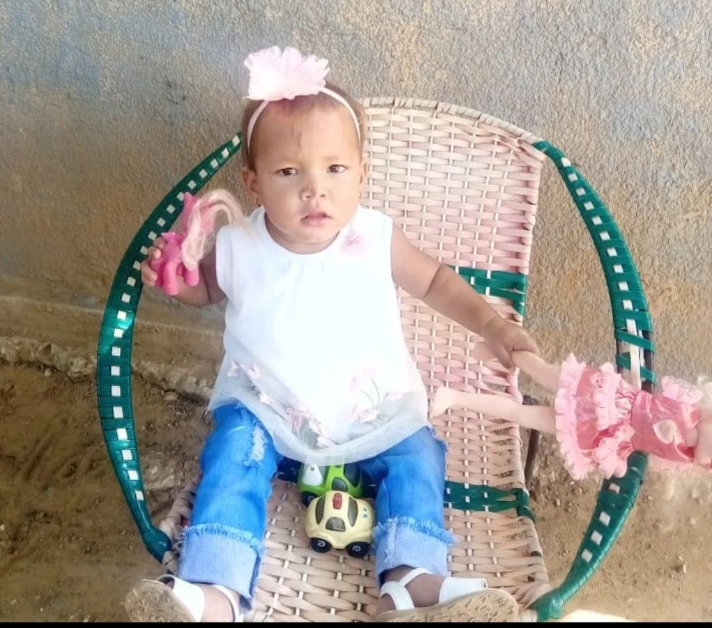

*La muerte de Sofía significó una falla de la Fiscalía. Esta foto cuando estaba en Maracaibo. Se puede ver los golpes recibidos en uno de los maltratos propiciados, al parecer, por su padrastro llamado Ender Villamil.*

La muerte de **Sofía Leal Flórez** (3 años) despertó estupor e indignación en la ciudad. Hoy se pudo comprobar que su muerte es consecuencia de **una falla en el servicio de la Fiscalía**. Y un fracaso de la justicia para proteger a nuestros niños. Su deceso se produjo en la madrugada del 21 de enero 2024 en Casa del Niño _**Napoleón Franco Pareja**_, presuntamente como consecuencia de un **paro cardiorespiratorio**. Pero, los galenos pudieron establecer que era por signos de **violencia intrafamiliar y de abuso sexual**.

La pequeña nació en Maracaibo de padres maracuchos. Por querer de su padrastro, le llamó **Enderliannys Sofía**. Hacía 4 años que su madre **Enyury Flórez Olivares**, recién llegada a Cartagena, sostuvo una inesperada relación sentimental con **Kendry José Leal Mendoza** (30) años, de Maracaibo, técnico de refrigeración. Al entrevistarlo se le nota su nobleza e inocencia del marido engañado. Vive en esta ciudad desde hace varios años buscando prosperidad. Montó un taller y tiene suficiente clientes. Pero se conoció con Endry, y fue su perdición. Tanto que lo llevó a separarse de su esposa venezolana y de su hija mayor de 10 años por comprometerse con Enyury.

## Enyury, la clave para esclarecer la muerte de Sofía

Sin embargo, cuando la madre de Sofía tenía 4 meses de embarazo, lo abandonó como se abandonan _los zapatos viejos._ Se regresó a Santa Rosa, Maracaibo. Allá, Enyury se volvió a reconciliar con su primer marido que ella dice que se llama **Ender Villamil**, el padre de su primer hijo de 5 años, de quien salió huyendo para Colombia porque era un marido maltratador y, al parecer, maltrataba reiteradamente a Sofía. La primera vez que la trajo, tenía 2 años. Dicen los familiares, entrevistados por **VoxPopuli Digital,** que a la niña no se le podía agarrar de los brazos o cargar, porque lloraba.

Además de eso, la niña sentía molestia cuando la mamá le lavaba las partes íntimas, de acuerdo al relato. **La clave de esta situación oscura que terminó con la muerte de Sofía, sin duda, la tiene Enyury,** su madre. No fue sincera con su marido, con los médicos y con el equipo psicosocial del ICBF.

Al analizar esta situación, **VoxPopuli Digital** fue a entrevistarla con el fin de clarificar la real historia, porque no cuadraba en la línea narrativa de los actores. No obstante, la joven **Enyury Flórez Olivares**, por segunda vez, abandonó a su marido, un día después de la muerte de Sofía. Vi compungido a su padre que me dio la información. Seguramente ella irá en busca de **Ender Villamil** con quien tejió una relación tóxica y dependiente. Propio de las mujeres maltratadas, según los expertos consultados para escribir esta historia.

## La investigación del ICBF

La investigación de **VoxPopuli Digital** conoció que el **Instituto Colombiano de Bienestar Familiar (ICBF)** hace 6 meses presentó una denuncia penal en la Fiscalía para que estableciera las causas del presunto maltrato infantil. Y tuvo la custodia provisional de Sofía para la protección de sus derechos hasta el 22 de noviembre que se la devolvió a sus padres. ¿Por qué lo hizo? Así señala el protocolo, salvo que la Fiscalía hubiese intervenido y judicializado a los victimarios de Sofía.

Si bien en esos momentos el ICBF accionó su equipo de protección para el restablecimiento de los derechos de Sofía, el equipo psicosocial falló para estructurar entrevistas que permitiera evaluar mejor la situación. La Defensora de Familia, **Neyse del Carmen Jiménez Romero**, debió prender las alarmas para que la Fiscalía actuara diligentemente.

Ahora bien. No se trata solo de cumplir con las formalidades de ley en un país leguleyo como Colombia, sino que las acciones sean efectivas. Es decir, tengan resultados. Como sabemos que el 80% de las denuncias presentadas a la Fiscalía son archivadas por negligencia de ese ente, se amerita que los servidores públicos que tienen la responsabilidad de proteger los derechos superiores de los niños tengan un compromiso, no ante la ley, sino ante la vida de sus protegidos. Eso lo hace un funcionario con sentido de pertenencia con su misión.

## La negligencia de la Fiscalía

Empero, la Fiscalía no accionó. Ni siquiera entrevistó a los sospechosos, empezando por la mamá. Esta negligencia permitió que nuevamente aparecieran los actos de violencia infantil que terminaron con la muerte de Sofía.

Esta falla en el servicio debe ser investigada por el fiscal general, Francisco Barbosa, quien anda ocupado y desesperado peleando con el presidente Gustavo Petro.

Tenemos en nuestro poder la denuncia de la Defensora de Familia de ICBF, zonal de la localidad de La Virgen, **Neyse del Carmen Jiménez Romero** con todos sus soportes. Y no hay evidencia de que la Fiscalía Seccional, cuya directora es **Iveth Hernández Sampayo**, haya actuado. La palabra la tiene también esta funcionaria por la muerte de Sofía.

También entrevistamos al padre de

¿Te interesa?: [¿No más Betto en el ICBF? Democratizarían contratación](/articulos/no-mas-betto-en-el-icbf-democratizarian-contratacion/)

## ICBF abrió ruta de atención

*Esta es la denuncia por presunta violencia intrafamiliar presentada por el ICBF contra el padre y madrasta de Sofía. Fecha, 26 de junio de 2023. La Fiscalía no hizo nada. Iveth Hernández debe responder.*

En ese sentido, la Fiscalía fue incapaz de actuar. El ICBF abrió su hoja de ruta para atender el caso de Sofía una vez fue notificada por el Hospitalito. Cuando tuvo el informe de su equipo psicosocial, la defensora de familia presentó la denuncia el 26 de junio de 2023. De acuerdo al documento en poder de este medio, le solicitó a la Fiscalía seccional que actuara de inmediato y judicializara a los presuntos actores de este **delito de violencia intrafamiliar**.

Pero, la Fiscalía no hizo nada. No activó ninguna ruta para perseguir la violencia intrafamiliar contra esa inocente y desvalida niña. De tal manera, que los presuntos victimarios continuaron con el maltrato infantil hasta que llegó el fatídico día de su muerte.

Por otra parte, cabe resaltar que contra el **Napoleón Pareja** y las Eps **Mutual Ser, Acopi**, entre otras, registran en nuestro medio, igualmente, muchas quejas por falta de atención adecuada a pequeños pacientes venezolanos y también colombianos. Aquí también hay falla en el servicio de las EPS.

¿Te interesa?: [¿El Betto, el nuevo Baloto de la corrupción en el ICBF? (I)](/articulos/el-betto-pone-en-peligro-el-sistema-de-proteccion-infantil-del-icbf/)

## La vida trágica de Sofía

*La muerte de Sofía significó una falla de la Fiscalía. /Ilustración Cortesía pikisuperstar)*

Dos meses después de haber llegado a Cartagena, el 24 de mayo 2023 entró por urgencia una menor de 2 años que padecía de una crisis respiratoria pediátrica con pronóstico reservado. Después del examen médico de rigor, la internaron en una cama de la Unidad de Cuidados Intensivos (UCI) del Hospitalito. Presentaba signos de **síndrome de dificultad respiratoria pediátrica severa**, según la historia clínica a la que tuvo acceso **VoxPopuli Digital**. No tenía ni una sola vacuna y estaba completamente descuidada, según el informe médico.

Lo anterior significa que su estado de salud era de extrema gravedad que comprometía su vida. El pediatra ordenó exámenes de rayos X en sus pulmones. Cuando el profesional de la salud vio los negativos se encontró con la sorpresa de que Sofía, además de su grave problema respiratorio, presentaba varias fracturas en diferentes partes de su frágil cuerpecillo: costillas, brazos. También observaron que tenía quemaduras de primero y segundo grado ya cicatrizadas. En medio de ese cuadro crítico, con la intervención del personal médico, afortunadamente, salvaron a Sofía. Por ese momento. . .

Los médicos y el personal sanitario se hicieron muchos interrogantes ante los hallazgos. Quemaduras, fracturas, laceraciones, desnutrición. Una desatención total. Pero (¡atención!) eran evidencias de violencia infantil. La trabajadora social envió el caso al ICBF que de inmediato activó al equipo de protección de la infante. Y fue cuando tomó a la niña y la mantuvo en protección durante 6 meses. Luego de recopilar las pruebas, interrogar a los presuntos autores de este desalmado hecho, presentó la denuncia a la Fiscalía con todas sus evidencias.

## Un marido engañado

**Kendry José Leal Mendoza**, tiene una hija mayor de 10 años con su primera mujer. Se vino a Cartagena con ella. Cuando conoció a Enyury, su esposa estaba embarazada.

El año pasado, Enyury Flórez regresó a Cartagena con su hija Sofía con apenas dos años de edad. Localizó al progenitor y de nuevo regresaron a convivir. Endry se alegró de tener a su hija Sofía y a su madre, de quien estaba enamorado. Pero, no sabía la verdadera historia de maltrato y abuso infantil que su hija sufría en Maracaibo.

Enyury dijo que supuestamente Sofía se cayó del segundo piso de la casa donde vivían en el barrio Boston. Pero eso no fue cierto, según familiares del marido. Así justificó las fracturas viejas que le hallaron en el rayos X. Endry y sus familiares sí notaban que la niña antes de entrar en la crisis respiratoria, lloraba mucho. No la llevaron al hospital hasta cuando se presentó el tema respiratorio.

Sofía siguió llorando producto del dolor de sus fracturas sin que Endry lo supiera, pero Enyury sí sabía lo que le había sucedido. Cuando ya no soportaron el dolor de la niña, y que ya no podía respirar, la llevaron a la urgencia del Hospitalito. Eso sucedió el 24 de mayo cuando fue atendido en el Hospitalito remitido del centro de Salud de la Ese de Olaya.

## Por segunda vez

Pero, seis meses después cuando el ICBF le devolvió a Sofía, Enyury no la llevó a la cita que tenía el 22 de diciembre. Ella se devolvió a Maracaibo el 27 del mismo mes, aduciendo que _se le había muerto una abuelita_ y la necesitaban allá. **Regresó el 19 de enero de 2024**. Al día siguiente, ingresaron a la niña, por segunda vez, al hospital Napoleón Pareja, del cual nunca regresó.

Los médicos hicieron de todo en la noche del 20 de enero, _Día del Dulce Nombre de Jesús_. Le practicaron varias reanimaciones. Los **paros cardiorrespiratorios** eran recurrentes. Sin embargo, la vida de Sofía se fue apagando cada vez que le sobrevenía un paro cardiaco. Su corazoncito se fue apagando, hasta cuando en la madrugada del 21 de enero del 2024, Sofía no respiró más. (Espere la segunda parte de esta historia).