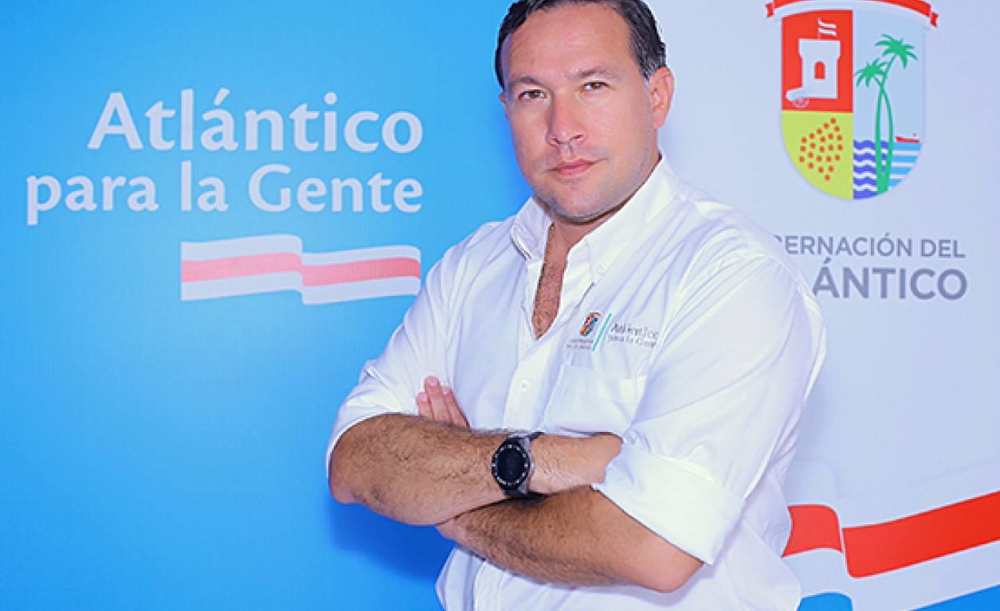
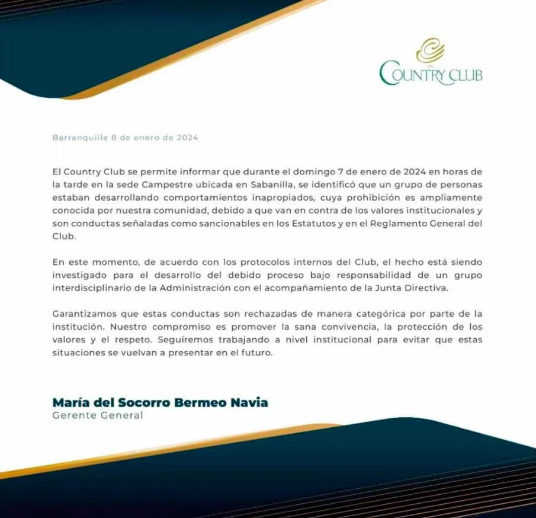

*Atlántico para la gente, Iván «el Tigre» Borrero, la fantasía erótica que le frustró su nuevo cargo.*

¿Quién no ha tenido una fantasía erótica? ¿Un trío? ¡Uff¡ Quizás fue esta fantasía la que le costó el puesto al Secretario de Hacienda de Bolívar, **Iván __«__el Tigre_»_ Borrero**. Él y su esposa estuvieron acompañando a **Elsita Noguera** en la gobernación del Atlántico. En principio, **el acto sexual entre tres personas adultas** no es una conducta reprochable ni causalidad para que lo despidan de un cargo público. Pero, hacer sexo en público y en un sitio familiar, no deja de ser escandaloso ni reprochable.

Aunque el gobernador **Yamil Arana Padauí** no motivó el retiro de su Secretario de Hacienda (la primera baja de su gabinete) en sus declaraciones a El Tiempo, todo indicaría que **__«__el Tigre_»_ Borrero** presentó la renuncia el martes 9 de enero, según una fuente de la gobernación. Como es obvio, la causa pudo ser el escándalo del trío sexual cuando trascendió públicamente. En el hecho, está involucrada su esposa, funcionaria de la gobernación del Atlántico y otra mujer que, al parecer, también trabaja con Elsita Noguera.

Este trío sexual que se hizo en el baño de mujeres (sitio público, otra fantasía _voyerista_) y, especialmente en la sede recreacional de Sabanilla del exclusivo Country Club donde se van a broncear las familias burguesas de Barranquilla, pasará como uno de los más famosos, digno de una escena de porno al aire libre.

Te puede interesar: [¿No más Betto en el ICBF?](/articulos/no-mas-betto-en-el-icbf-democratizarian-contratacion/)

## Así recreamos la fantasía erótica

En el siguiente video se recreó la fantasía erótica del Tigre Borrero, cuya esposa trabajó con Elsita Noguera. Ellas son buenas amigas. Aunque no son imágenes explícitas, si puede afectar el oído sensible de las mujeres del Country Club que van tomadas del brazo de su señores esposos.

https://youtu.be/0qAhRU4pFsU

Escenas recreadas tomada. Una de las socias del Club descubrió cuando estaban haciendo el trío.

## Los audios de la fantasía erótica

Desde el día de ocurrencia de los hechos (domingo 7 de enero 2024), la señora que vio el trío sexual, lanzó el audio a la red de wasap. Nosotros recibimos los audio pasadas las 5 de la tarde. Pero no publicamos hasta no verificar los detalles de los mismos con el fin de no afectar los derechos de terceros. La dama se dio cuenta, porque escuchó los gemidos y un alboroto en el baño de damas. Las mujeres suelen ser discretas, muy habladoras después de hacer sus necesidades fisiológicas. A veces se quedan en los lavabos retocándose sus maquillajes, ajustándose sus prendas de vestir o chismoseando.

Lo cierto es que el cumplimiento de esta **fantasía erótica** en un baño público debe ser tan excitante que se arriesgaron a ser descubierto, como en efecto lo hizo la señora de bien que de inmediato cuestionó el hecho y puso la queja a la administración. El trío, **_el Tigre_ Borrero**, su esposa **Karen Vargas** y una desconocida salieron tapándose la cara. Pero los testigos se habían dado cuenta de sus identidades.

## El comunicado del Country Club

## Lo que dicen los expertos

Según la experta sexóloga, **Silvia Cintrano**, citada por **Cuídate Plus**, dice:

> "**La motivación** para mantener relaciones sexuales en público no es otra que **exponerse a una situación novedosa y morbosa**, que genera excitación y adrenalina por ser algo prohibido y fuera de la rutina. **En otras ocasiones, es la única alternativa** que se encuentra, por no tener acceso a una casa o un lugar más confortable". 

Tener una **fantasía erótica** es normal. Cumplirla debe ser algo sensacional. ¡Excitante! ¿A qué precio? A **Iván David __«__el Tigre_»_ Borrero Hernández**, le costó el cargo de Secretario de Hacienda de Bolívar donde solo se había posesionado el pasado 1 de enero de 2024.