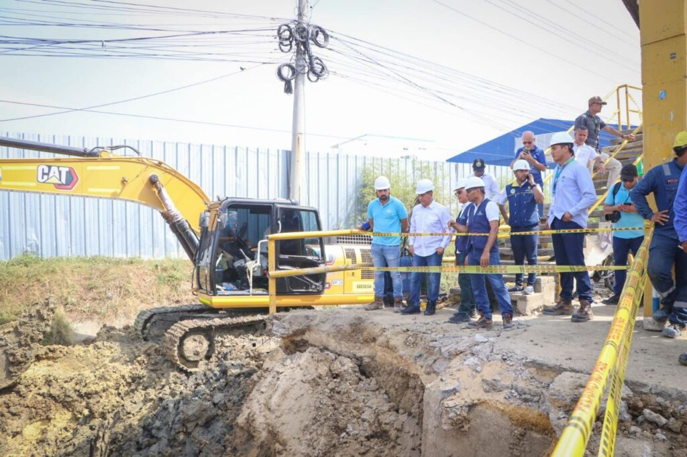
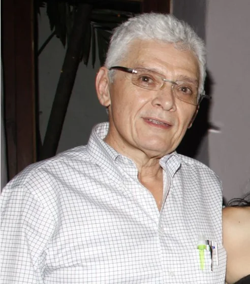

*Dumek, Cartagena sin agua, sin luz, insegura, y ¡mucho calor!. Aquí, inspeccionando las obras. /Aguas de Cartagena.*

Cartagena sin agua es la nota del momento. En los últimos años la paciencia de _La Heroica_ es como la de Job, quien soportó las pruebas de Dios:  **«¿O por qué tu ropa te acalora cuando Dios detiene el cálido viento del sur?»** Pero, con la nueva administración de **Dumek Turbay**, 50 días después, el panorama de **bienestar sigue siendo preocupante**. Cartagena está sin agua, sin luz, insegura, y ¡mucho calor! Supuestamente durante el contrato de concesión de Aguas de Cartagena se invirtió $1 billón y el principal tubo madre que abastece de agua cruda a la ciudad está inservible.

Una mente razonable se puede preguntar:

> ¿Dónde está todo ese mundo de dinero? ¿Herencia maldita de las administraciones anteriores y de la multinacional Aguas de Barcelona?

Lo peor, pagamos las **tarifas más altas** de servicios públicos domiciliarios del país. Y ahora estamos obligados a sufragar una **sobretasa de seguridad ciudadana** cuando los casos de homicidios, atracos, extorsión y asalto callejero siguen disparados. En el caso del servicio de agua potable y alcantarillado la causa es más profunda que los 7 metros donde está enterrado el tubo madre que se dañó.

Hoy, el alcalde **Dumek Turbay Paz** le pidió ayuda al gobernador de Bolívar, **Yamil Arana Padauí**, porque el regreso del agua por las tuberías es incierta la fecha. Regresaremos como en la década de los 90, cuando nos bañábamos con totumas, luego de abastecerse en las piletas públicas.

¿Te interesa? [La tira-y-jala en la Concesión Vial: la TIR se cumplió (II)](/articulos/tira-y-jala-con-los-peajes-en-cartagena-la-tir-se-cumplio/)

## ¿Nos merecemos esta Cartagena?

*William Dau, el archienemigo de Dumek, fue más ladrón de todos los ladrones. El primer accionista de Aguas de Cartagena en ser elegido alcalde. ¿Cómo la ve? El que mucho habla, poco hace.*

¿Quién nos puede ayudar a cargar esta cruz resultado de nuestros errores? ¿Los cartageneros nos merecemos este panorama oscuro cuando la vida se hace cada día más insoportable en los barrios populares de la ciudad? La respuesta tiene implícita otra pregunta: ¿Quiénes eligen a sus gobernantes?

Sin duda, la respuesta nos señala a nosotros mismos. La culpa no es de los políticos, es nuestra. Nosotros tenemos el poder y se lo delegamos a ellos a través del voto. ¿Lo entiende la gente subyugada por la pobreza y el abandono? No lo entiende. ¿Por qué? Porque son personas alienadas, enajenadas mentalmente que hasta son capaces de elegir a un **demente de alcalde**, como nos sucedió con Dau. ¿Por qué esa misma gente no fue capaz de escuchar las voces de advertencia que hicimos en la época electoral?

Cuatro años después, en muchos barrios impera la ley del hampa, la ley de los bandidos con la vista gorda de las autoridades. Ley que impone impuestos y tributos para fortalecer el actuar de sus organizaciones armadas ilegales. Pequeñas tiendas se ven sometidas al régimen oprobioso de esta bandas delincuenciales que se pelean las rentas ilegales de la ciudad. ¡Y la Policía, el CTI y la Fiscalía lo saben! Hay evidencias que prueban que agentes estatales reciben dividendos de esas rentas ilegales.

¿Te interesa? [Las 4 causas que provocarían la caída del alcalde Dau (II)](/articulos/las-4-causas-que-provocarian-la-caida-del-alcalde-dau-ii/)

## ¿Por qué Cartagena está sin agua?

*En la alcaldía de Dionisio Vélez pidió anticipadamente la prórroga del contrato de concesión con Aguas de Cartagena. Estuvo involucrado en el escándalo de los Papeles de Panamá.*

Debemos profundizar la causa de la crisis del suministro del agua en Cartagena. Más allá de la rotura del tubo madre, a la altura del barrio Ceballos, que tiene a más de la mitad de la ciudad sin agua, el problema es de corrupción público-privada.

Por ejemplo, una investigación de **Julio Ratia**, miembro del Área Manager de AGBAR, llegó a la conclusión de que entre 1995-2015, la empresa **Aguas de Cartagena** recibió mediante crédito del Banco Mundial **125,5 millones de dólares para financiar la primera fase del Plan Maestro de Acueducto y Alcantarillado**. Esta deuda la asumió el distrito y la nación con el 18% del Impuesto Predial Unificado,  el 20% de los Ingresos Corrientes de la Nación, y el 5% de las regalías indirectas. Así lo establece el documento **CONPES 3036 de 1999**. Es sospechoso, por decir lo menos, que los cartageneros debimos pagar la suma de **$253.494** mil millones en solo intereses del crédito al Banco Mundial. 

¿Por qué esos tubos madres, como el de la transversal 54, a la altura del barrio Ceballos, están inservibles? ¿Qué se hizo la multimillonaria inversión con créditos del Banco Mundial? ¿A dónde fue a parar? Si la concesión de Aguas de Cartagena se vencía el 2021 ¿por qué razón el alcalde **Dionisio Vélez Trujillo** la prorrogó con mucha anticipación (2015)?

**VoxPopuli Digital** denunció el hecho, pero la Procuraduría de **Alejandro Ordoñez** archivó el proceso. Vélez Trujillo, a través de su esposa, abrió firmas _Off Short_ y salió pringado con los _Panamá Papers_, de acuerdo a investigación realizada por **VoxPopuli Digital** tomando como base la filtración de esos documentos.

Hasta ahora se han invertido más de **$253.494 mil millones** de esos recursos para pagar solo intereses del crédito al Banco Mundial.

## Viaje a Barcelona y Cartagena sin agua

*Gabriel García Romero, primo hermano de Juancho García, fue el primer alcalde en viajar a Barcelona para cuadrar el negociado de Aguas de Cartagena. Sigue recibiendo dinero de las acciones por terceras personas.*

Dato curioso. Todos los alcaldes de Cartagena desde **Gabriel García Romero** hasta el demente de **William Dau**, debieron llegar a Barcelona, una vez se posesionaron o ganaron las elecciones. ¿Ya lo hizo Dumek?

Alcalde que es elegido en Cartagena, alcalde que debe viajar a Barcelona. Esta modalidad la inauguró el burgomaestre **Gabriel García Romero** en 1994, y la siguió cada uno de los burgomaestres hasta **William Dau Chamat**. Este, además de enajenado mental, es avaricioso: es propietario de un porcentaje de las acciones de Aguas de Cartagena. Acciones que le entregaron cuando, siendo veedor en 2004, se torció con la demanda contra el Banco Mundial. Y le dieron un puesto en un grupo financiero de Nueva York. Todos esos veedores y políticos, al parecer, recibieron **1 millón de dólares de la época**. En esa cochada estaba metido Dau, quien debió crear la la falsa historia de estar amenazado de muerte para pedir asilo en los Estados Unidos donde obtuvo la ciudadanía.

Cuando Gabriel García Romero fue a Barcelona, durante las dos semanas de estadía, hizo el negociado del contrato de concesión con **Aguas de Barcelona**. Hoy, según fuentes de entero crédito, la Casa García y sus compinches de la época, siguen recibiendo dividendos de ese contrato de concesión otorgado a **Aguas de Barcelona.** Esta entidad ahora pasó a Suez de Francia que compró el 70% de las acciones de Agbar.

## ¿Cuándo regresará el agua?

El agua por tubería no regresará por ahora en el mayor porcentaje de la ciudad. Quizás el servicio se normalice el miércoles, si no hay otro contratiempo. Así lo confirmó el propio alcalde Turbay Paz que visitó el sitio del daño. Inevitablemente se debe recurrir a los carrotanques. Pero en la ciudad no habría los suficientes vehículos para atender dicha emergencia.

Por eso, anunció que le pedirá ayuda al gobernador **Yamilito Arana**. Se le debe recordar al alcalde que la Unidad Nacional para la Gestión del Riesgo de Desastres (UNGRD) tiene **224 carrotanques** con capacidad de 12 y 20 mil litros disponibles para atender emergencias de este tipo.

En la próxima entrega analizaremos cómo invirtieron el $1 billón y si Dumek pedirá la terminación anticipada de la prorroga del contrato de concesión por incumplimiento de Aguas de Cartagena en la expansión y optimización del servicio de acueducto y alcantarillado.