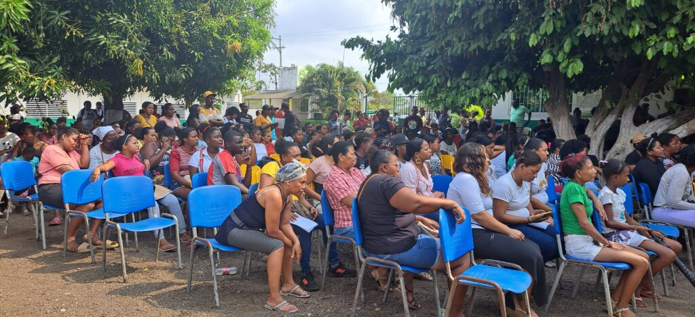
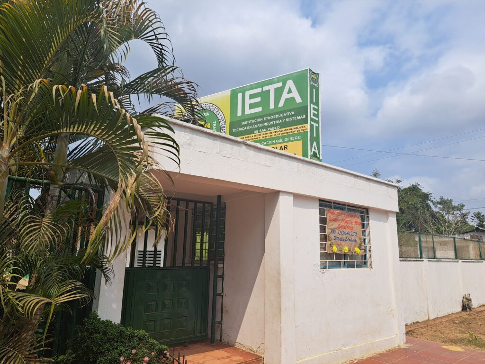

*En esta asamblea se aclaró sobre el recaudo de los $10 mil destinados a un aula del colegio. Colegio de autogestión comunitaria. /VoxPopuli Digital.*

La **Institución Etnoeducativa Técnica en Agroindustria y Sistema de San Pablo- IETA** fue creada por la misma comunidad en el corregimiento de María la Baja, en el corazón de los **Montes de María**, zona de Bolívar. Sin duda, son _héroes sin capa_ que no esperan ni siquiera las gracias. Ellos lograron conseguir el lote hasta construir las estructuras con el diseño de la Universidad de Cartagena. Hoy, es el colegio de la autogestión comunitaria en San Pablo, cuyos padres de familia aportan para mejorar y ampliar el servicio educativo.

De esos primeros directivos que iniciaron esta gran empresa, sobreviven solo dos. Rosita de Payares es una de esas sobrevivientes. Llegó a la asamblea del jueves 1 de febrero para sentar su voz, ya que se sienten agraviados por especies difamatoria en el sentido de que estaban cobrando el pago de $10 mil por las matriculas.

## Vea el video de San Pablo

https://youtu.be/jiZma\_xcwqk?feature=shared

## El cobro de los $10 mil y la autogestión comunitaria

Por ser un colegio de la autogestión comunitaria, el IETA debe recaudar sus propios recursos para ampliar el servicio con más aulas, baños, obras de mantenimiento, agua, entre otras necesidades. La asociación de padres de familia y el consejo comunitario de San Pablo acordaron en la última asamblea de 2023 aportar la suma de $10 mil con el fin de construir el aula de informática de la institución.

Esa iniciativa provocó el malestar de algunos padres de familia que se quejaron ante algún medio de comunicación presentando el hecho como si se le estuviere condicionando la matricula de los estudiantes al pago de ese dinero. Pero, no es cierto.

Al respecto, **Edgar García** del consejo comunitario de San Pablo en plena asamblea general de la Asociación de Padres de Familia con la presencia de **VoxPopuli Digital**, aclaró que fue un **aporte extraordinario** resultado de un acuerdo de la asamblea anterior. Es un mecanismo de financiación para construir el aula de informática que deben construir este año.

¿Te interesa? [Cartagena viola derecho a la educación a miles de niños pobres](/articulos/cartagena-viola-derecho-a-la-educacion-a-miles-de-ninos-pobres/)

## El regreso con nuevos sueños

El regreso al colegio en este 2024 es un motivo de alegría para un nuevo comienzo, un nuevo reto de aprender de mil quinientos niños afrodecendientes de esta **institución etnoeducativa**. Son niños que buscan ser mejores seres humanos, _héroes sin capa_ como aquellos que hicieron posible la existencia de este colegio.

En la visita que hicimos a San Pablo nos recibieron con la primera asamblea de padres de familia de este año. Se formó una polémica. Algunos usuarios , muy pocos, se quejaron porque el día de la matrícula le pidieron la colaboración de los $10 mil pesos. Son padres de familia que no asistieron a la asamblea de aquel momento y, probablemente, estaban desinformados.

Pero, los directivos aclararon este malentendido ante la asamblea en pleno. Manifestaron que ese apoyo fue un acuerdo de la asamblea general de padres de familia de diciembre del año pasado. Se busca **recaudar $15 millones** que destinarán a la construcción del aula de informática. La idea de unir el cobro de los $10 mil con la matricula se debió a la experiencia de que un alto porcentaje de padres de familia no aportan por voluntad espontanea.

La asociación pensaba rifar una novilla. Pero todos estuvieron de acuerdo que fuera una colaboración directa para que los fondos recaudados quedaran íntegramente en caja.

¿Te interesa? [Recorte a educación pública, calienta las calles cartageneras](/articulos/anuncio-de-recorte-tributario-calienta-las-calles-cartageneras/)

## La autogestión comunitaria

La unión de la asociación de padres de familia con el consejo comunitario permitió desarrollar acciones de resultados para la misma comunidad escolar de la Institución Educativa.

De la misma forma como reunieron fondos para hacer el encerramiento, construir un pozo o mejorar las instalaciones de la institución IETA, esos $10 mil servirán para que los niños tengan una formación en informática.

No es fácil sacar adelante un proyecto educativo de autogestión. Entre los mismos integrantes de la comunidad a veces, a veces sin información suficiente, cuestionan a los que están haciendo. Pero, el trabajo de autogestión es de gran satisfacción. Así aprendemos a valorar los bienes comunes y a crear sentido de pertenencia con el servicio público, en este caso, la educación.

El consejo comunitario, la asociación y los profesores son unos héroes sin capa que echan hacía adelante a pesar de todo.