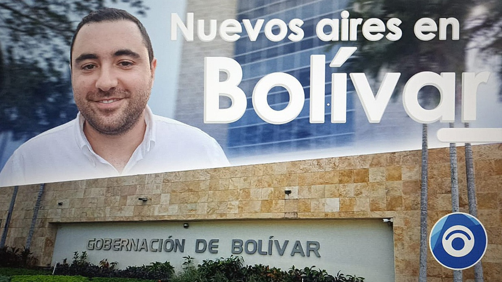
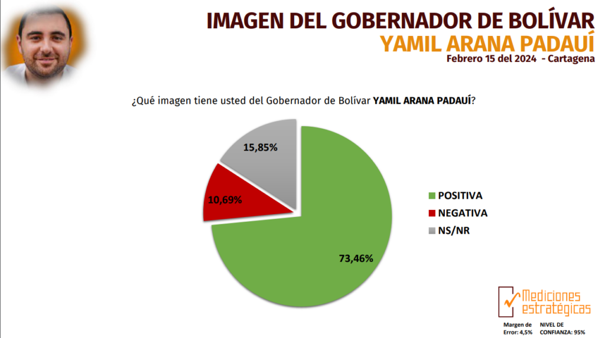

*Yamil Arana demostró con Bolívar Mejor en los 100 días ser activo, propositivo, proactivo y simpático./VoxPopuli.Digital*

**Bolívar Mejor** **en los 100 días** ―que se cumplirán el 11 de abril de 2024. Además, se respira aire fresco. Incluso, en la misma sede de la gobernación ondea con alegría las banderas de Colombia y Bolívar. Están limpias y relucientes. Aunque **Yamil Hernando Arana Padauí** no calienta la silla de gobernador y aunque todavía no está todo su personal contratado, hay un nuevo ambiente. Un joven que, desde el 1 de enero de 2024, se esmera por cumplir con los 5 objetivos de su programa de gobierno.

Ayer lo vimos abriendo y cerrando la magia de la **Semana Santa** de Mompox. Hoy, pone las maquinarias del departamento para oxigenar las aguas de El Laguito que mueren lentamente por falta de circulación de agua fresca de la Bahía de Cartagena.

Quienes han tratado a Yamilito constatan que es un muchacho activo, propositivo, proactivo y simpático. Goza de una inteligencia relacional, clave en un líder político. Quizás este lunes 1 de abril caliente la silla en el Centro Administrativo del Departamento para su consejo de gobierno. ¿Qué nos dirá de **Bolívar Mejor** **en los 100 días**?

¿Te interesa? [La Candelaria de Magangué, Yamilito descongeló su tiempo](/articulos/la-candelaria-de-magangue-yamilito-descongelo-su-tiempo/)

## Bolívar Mejor en los 100 días

*En los 30 días ocupó el primer lugar de todos los gobernadores de la región Caribe. Bolívar Mejor en los 100 días ratificará su primer lugar./Mediciones Estratégicas.*

En los primeros 30 días, la percepción de los cartageneros fue positiva para Yamilito. Según **Mediciones Estratégicas**, fue el gobernador mejor posicionado en la capital del departamento con el **73,46%** de imagen positiva. Es más, casi quedó empatado con el mismo alcalde **Dumek Turbay Paz**. quien alcanzó **74,21%**. Es muy probable que **Bolívar Mejor en los 100 días** siga siendo la gestión más aceptada de los 8 gobernadores. Sobre todo, porque en la próxima encuesta se tendrá en cuenta los municipios de Magangué, El Carmen, Arjona, Turbaco y María la Baja.

No obstante, para evaluar acertadamente la actuación de Arana Padauí en **Bolívar Mejor** **en los 100 días**, debemos partir de su programa de gobierno. Empero, vale aclarar que los gobernantes regionales y locales deben ejecutar sus actividades con base en el plan de desarrollo del período anterior. Esto se hace bajo el principio de **continuidad de la administración pública**.

En ese sentido, no podríamos evaluar a los gobernantes regionales y locales por la ejecución de su programa de gobierno sino por su capacidad de gestión para sacar adelante el plan de desarrollo del gobierno anterior. Esto es, que la línea de gestión de Yamilito Arana está guiada por el plan de desarrollo departamental que se diseñó en **Bolívar Avanza** de Vicente Blel Scaff.

¿Te interesa? [¡Emergencia sanitaria! Dumek y Yamilito unidos por Cartagena (II)](/articulos/emergencia-sanitaria-dumek-y-yamilito-unidos-por-cartagena-ii/)

## Los 5 objetivos programáticos de Yamilito

*   Bolívar Mejor: **Crecimiento económico y oportunidad de empleo para todos.**
*   Bolívar Mejor en justicia social: **Cierre de brechas y calidad de vida para todos.**
*   Bolívar Mejor verde y sostenible: **Transición energética y gestión ambiental de excelencia.**
*   Bolívar Mejor con Institucionalidad fuerte: **Transparencia como base de una mejor gestión.**
*   Bolívar Mejor: **Seguridad y convivencia ciudadana**.

## Yamil y Petro

Contrario al alcalde de Cartagena, **Dumek Turbay**, Yamil estuvo en diferentes eventos realizados por el presidente Gustavo Petro durante lo que él llamó el Gobierno del Pueblo en el Caribe. Estuvo en Montería en un Consejo de Ministros y fue anfitrión en Mompox. En este Distrito Especial, el presidente le copió la propuesta de que la Universidad de Cartagena se quede con los más de **$200 mil millones** que Ecopetrol le pagó por concepto de las estampillas prouniversitarias.

Sin embargo, Yamilito estuvo mojando prensa con Petro, porque el Pacto Histórico apoyó su candidatura. Es decir, que el presidente tiene un aliado de mucha valía en la región Caribe para sacar adelante macroproyectos importantes.

Además, si el plan de desarrollo Bolívar Mejor lo alínea con el plan de desarrollo nacional Potencia de la Vida, el departamento se verá muy recompensado, incluso, Cartagena de Indias, muy a pesar de la resistencia de Dumek Turbay respecto a varios criterios del presidente, como la Asamblea Nacional Constituyente.

¿Te interesa? [La impagable deuda de la UdeC a Ecopetrol: Petro y Yamilito piden condonarla](/articulos/la-impagable-deuda-de-la-udec-a-ecopetrol-petro-y-yamilito-piden-que-la-condonen/)

## Nuevos aires

Si, nuevos aires se respira en el Centro Administrativo Departamental (CAD) con **Bolívar Mejor** **en los 100 días**. Aunque el relevo entre **Vicente Blel Scaff y Yamil Arana** no está libre de traumas ―supuestamente el nuevo software para la contratación tuvo problemas para su funcionamiento― se espera que la capacidad de gestión del nuevo Gobernador, lleve a Bolívar a otro nivel de desarrollo, incluso, en este primer año cuando ya tenga su nuevo Plan de Desarrollo Bolívar Mejor.