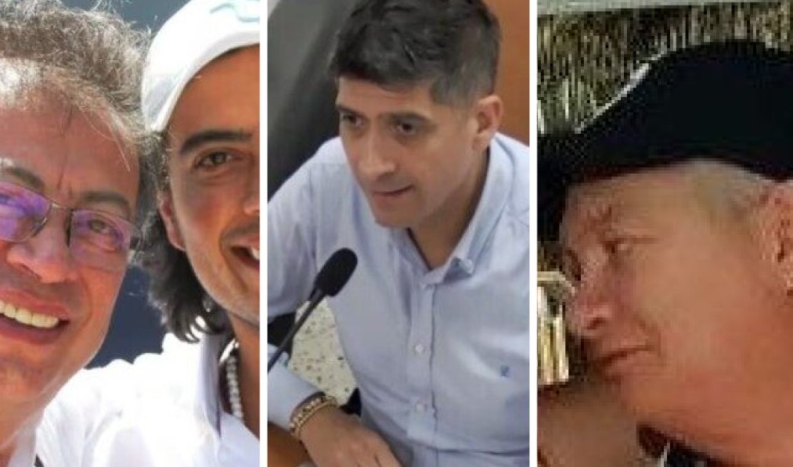
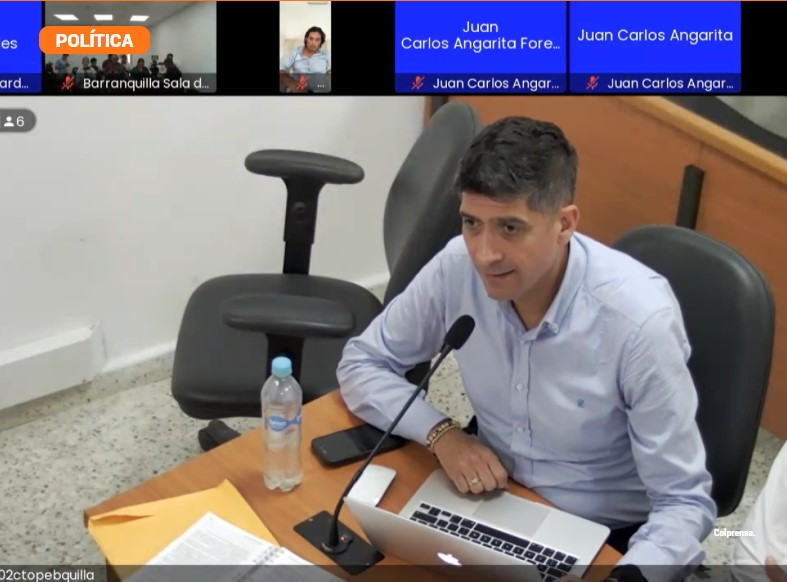
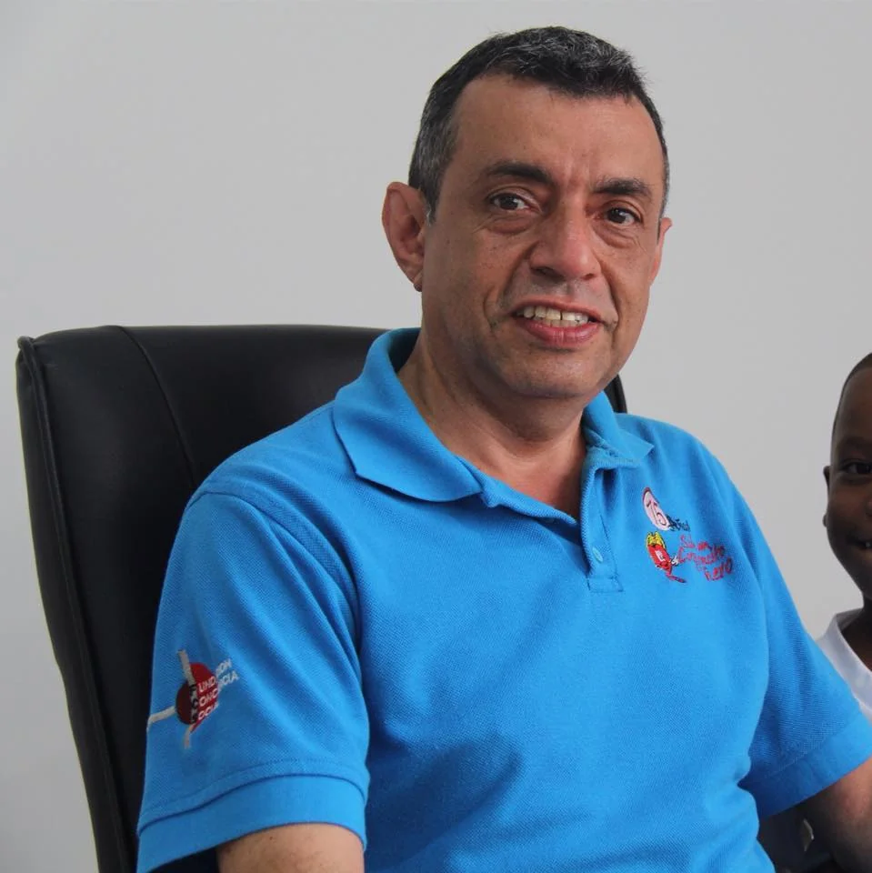

*¿Cortina de humo vinculación de Nicolás Petro con Lost Provention?*

¿Por qué es una cortina de humo la vinculación de **Nicolás Petro Burgos** con Lost Prevention y, de contera, con el Clan Los Vega? Empecemos por decir que no existe evidencia alguna de dicha relación del hijo del presidente Petro con esa entidad. En primer lugar, los representantes de la empresa desmintieron esa versión. En segundo lugar, así está demostrado en las investigaciones de la Fiscalía Seccional Atlántico con radicados **No 080016001055202205531** y **080016001055202201161**. Tercero, la Fiscalía no confirmó la versión difundida por la prensa.

Lo anterior lleva a inferir, en un razonamiento lógico, que se trata de llevar el caso del **Clan Los Vegas** a enlodar la campaña presidencial del **presidente Gustavo Petro**. Al mismo tiempo, pretende desviar la confesión de parte del exdiputado y de su exesposa **Daysuris Vázquez** de haber recibido cerca de **$1 mil millones** a través de dos contratos chimbos con la **[Esal Conciencia Social](/articulos/system/files/182._fundacion_conciencia_social_parte_1.pdf)**, cuyo representante legal es el exconcejal **Gustavo de la Ossa Vélez**, uno de los grandes contratistas del ICBF del Atlántico y posible testaferro de Elsa Noguera.

¿Te interesa? [¡Terremoto político! ¿Detención de Nicolás, golpe devastador al gobierno de Petro? (III)](/articulos/terremoto-politico-detencion-de-nicolas-golpe-devastador-al-gobierno-de-petro/)

## Lost Prevention desmiente a Caracol

ANGEL-MARIA-CARRILLO-SALGADO-120237720013731\_000011 (documento no disponible)Descargar (documento no disponible)

Con este oficio (para leerlo darle clic a _descargar_) dirigido al abogado Ángel María Carrillo Salgado como respuesta a una petición, la Fiscalía Primera Delegada ante el Tribunal Superior del Distrito de Bogotá le aclara que su nombre no está mencionado en el proceso que se le sigue a Nicolás Petro.

De otra parte, la representante legal de la empresa de seguridad Lost Prevention, **Lilian Dolores López**, según fuente manifestó a la fiscalía delegada:

> **«**No señor, no conozco **al señor Petro (hijo),** no tengo ni idea, nadie ha llegado a la gerencia de la empresa, ni se me ha acercado a mí como representante legal o de manera personal, a decirme que colabore con una persona que no conozco, eso no tiene ni pies ni cabeza**»**.

En esos mismos términos se refirió el reconocido abogado **Ángel Carrillo Salgado**, padre de **Ángel Carrillo López**, sobre la relación de Lost Prevention con Los Vega, en entrevista con **VoxPopuli Digital**, dijo:

> **«**En el 2015 hubo un problema en la ciudad, ellos (Los Vega) solicitaron los servicios de escoltas ante la empresa llenaron todos los requisitos y solicitó a la Superintendencia que lo investigara. En ese momento no había ningún problema ni social ni jurídico. Luego se canceló todo tipo de relación con esos clientes. Esto está en manos de la Fiscalía en tres investigaciones y se le ha dado todo el material que ellos han pedido**»**.

¿Te interesa? [Nicolás Petro lloró. ¿Presidencia le recomendó acogerse al principio de oportunidad? (IV)](/articulos/nicolas-petro-lloro-denunciara-a-peces-gordos-de-la-corrupcion/)

## **«A confesión de parte, relevo de pruebas»**

Cuando Nicolás Petro y su exesposa expresaron su voluntad de acogerse al principio de oportunidad, presentaron una confesión de parte. Y como dice el viejo axioma jurídico **«a confesión de parte, relevo de pruebas»**. Este solo hecho abrió un boquete para involucrar a otros actores que no aparecían en el radar.

En ese sentido, **Mario Burgos**, fiscal donde es procesado el hijo del presidente, abrió una línea de investigación donde estarían involucrados la gobernadora del Atlántico **Elsa Noguera de la Espriella**, su secretario General, el guajiro **Raúl José Lacouture Daza**, y el mismo **Gustavo de la Ossa Vélez**. Fue una **confesión de parte que releva a la misma Fiscalía de probarlo.** Petro y Vásquez admitieron que sí recibieron dineros de esa contratación. Además, **la confesión fue avalada** en el último día de la audiencia por parte del juez de garantía**.**

Como para que no queden dudas, esa confesión fue respaldada con e**lemento material probatorio** (EMP) que pone al descubierto la verdad de un cohecho y un concierto para delinquir con el objetivo de defraudar los recursos de la gobernación del Atlántico. Uno de esos elementos es la grabación del audio presentada por el fiscal Burgos donde aparece Lacouture y Daysuris **acordando detalles y tiempos de esos contratos con la gobernación**.

## ¿Proteger a Elsa Noguera?

*¿Cortina de humo para proteger a los afiles de Char-Daes?*

La cortina de humo puede ser obra del **charismo**. Busca matar dos pájaros con un solo tiro. El afán del fiscal **Mario Andrés Burgos Patiño** de sobredimensionar la acción penal para tratar de enredar la campaña presidencial de Gustavo Petro, pone sobre la superficie una **parcialidad objetiva** del administrador de justicia. Esto favorece a posibles autores de delitos, por los cuales no ha compulsado copias a las autoridades competentes para que los investiguen. **Evidentemente, existe un concierto para delinquir para expoliar los recursos de la gobernación del Atlántico**.

Por ejemplo, presuntamente, **Elsa Noguera**, aparece como actora principal de este delito, aunque la gran prensa no visibiliza su figura. _No ven las carabelas_. Y no las ven porque tienen hambre de tumbar presidente. Por tanto, Burgos ―tal vez compelido por esos mismos medios de comunicación― solo se enfocó en el enriquecimiento ilícito mirando la campaña presidencial. Hasta ahora, se desconoce si abrió otros expedientes distinto al **radicado No 110016010000202300001**.

En consecuencia, a Elsa Noguera, sin equívocos, se le debió abrir un expediente por parte de la Fiscalía Delegada ante la Corte Suprema de Justicia. ¿Su delito? De hecho, se puede configurar un **concierto para delinquir.** Pero también, **cohecho y contratos sin el lleno de requisitos legales**. Sería el contenido de la noticia criminal que se la Fiscalía podría abrir o abrió contra ella debido a su transacción comercial con los diputados del Atlántico para que le aprobaran los proyectos de ordenanza claves para ese proceso de expoliación del presupuesto público departamental.

En la audiencia pública se pudo apreciar objetivamente que Vásquez acordó con N**icolás Petro, De la Ossa, Lacouture Daza y con Pedro Name** (familiar de **José David Name**), al parecer, padre del hijo de Daysuris, **“manipular la adjudicación del contrato y en su fase de ejecución”**.

¿Te interesa? [¿Nicolás se retractará con la visita presidencial? ¿Todo por Luka? (VII)](/articulos/nicolas-se-retractara-con-la-visita-presidencial/)

## ¿Omisión del fiscal Burgos?

*Fiscal Mario Burgos Patiño ¿cortina de humo lo de Los vegas?/Captura de pantalla.*

Si el fiscal delegado Burgos se abstuvo de compulsar copia para vincular en el proceso a la hoy exgobernadora del Atlántico, Elsa Noguera, estaría cometiendo una irregularidad que se podría convertir en un tipo penal. Se trataría de una evidente OMISIÓN.

Además, dicha OMISIÓN se pudo extender a la necesidad de abrir expedientes contra Lacouture y De la Ossa, dos alfiles y **presuntos testaferros de Elsa Noguera y del charismo**. Es más evidente el enriquecimiento ilícito de Nicolás Petro y Daysuris con dineros procedentes de la contratación pública con la gobernación del Atlántico que con los dineros del _Hombre Malboro_ y del hijo del _Turco_ Hilsaca. La actuación del fiscal Burgos es, por decir lo menos, demasiado descuidada y falta de rigor técnico para señalar y precisar el material probatorio del ilícito de concierto para delinquir que apuntan a Noguera.

Igualmente, la Gran Prensa pretende hacer énfasis en las supuestas pruebas que apuntan a demostrar el ingreso de **dinero sucios** a la campaña del presidente. Desconocen las evidencias existentes que, tal vez, el 80% de los dineros con los cuales se enriqueció Petro hijo y su exesposa Daysuris Vázquez, **vienen del modelo de corrupción galopante de la gobernación del Atlántico** y no de los presuntos mafiosos.

¿Te interesa? [La doble crucifixión del primogénito de Petro: «Me han dado la espalda» (II)](/articulos/la-doble-crucifixion-del-primogenito-de-petro-me-han-dado-la-espalda-ii/)

## La versión de Caracol

Al mismo tiempo, la versión difundida por Caracol TV, de que a Nicolás Petro se le estaba buscando cómo crear papeles falsos para justificar su supuesto enriquecimiento ilícito no tiene ningún asidero real. Esta versión, según Caracol, es de una supuesta **fuente humana encubierta de la Fiscalía**. Sin embargo, los periodistas no fueron capaces de contrastar la información con el mismo informe de inteligencia de la misma Fiscalía para saber el grado de credibilidad de la misma y/o si es una fuente cierta o no. Con esta falta de rigor de Caracol, no solo se practica el peor periodismo del mundo sino que le hace un daño a la sociedad antes que a la misma familia presidencial. El periodismo no puede ser brazo político de la izquierda o derecha, o de cualquier tendencia ideológica.

Por tanto, se colige que con los documentos que les fueron infiltrados no busca explorar la verdad de los hechos sino instrumentalizar la información para concentrar la atención en el cuestionado hijo de Petro. Al parecer, consciente o no, pretenden desviar la relación de Los Vega con empresarios allegados a los Char y Daes que se beneficiaron con sus actividades ilícitas. De la misma manera, pretende cubrir con una cortina de humo las evidencias de los grandes contratos de la gobernación de **Elsa Noguera de la Espriella** para pagar los favores a los diputados de la asamblea del Atlántico y, en especial, de sus directivos. Los Petro-Vásquez pudieron recibir más de mil millones de dos contratos sin el lleno de requisitos legales manejados y manipulados, presuntamente, por Raúl Lacouture Daza.

## Ojo a Conciencia Social

*Gustavo de la Ossa, el presunto testaferro de Elsa Noguera para repartir dinero a los diputados. ¿Cortina de humo?/Foto cortesía.*

En ese aspecto, Conciencia Social, representada por De la Ossa es una de las organizaciones claves para descifrar el modelo de contratación corrupto de la gobernación del Atlántico en la Era del charismo. Raúl Lacouture Daza, el Secretario General de Elsa Noguera, estuvo dirigiendo una empresa de vigilancia llamada Interglobal Ltda.

Adicionalmente, Lacouture Daza fue la columna vertebral de la Fundación Schola del papa Francisco en Barranquilla presidida por Elsa Noguera. Presuntamente se enriquecieron ocasionalmente con los grandes contratos ejecutados para la venida del Sumo Pontífice. Su oficina estaba en la sede de la gobernación que tiene en La Plaza de la Paz.

En la próxima entrega relataremos el papel de Raúl Lacouture Daza y de Gustavo de la Ossa Vélez para el enriquecimiento ilícito de los diputados, presuntos testaferros de la exgobernadora Elsa Noguera.