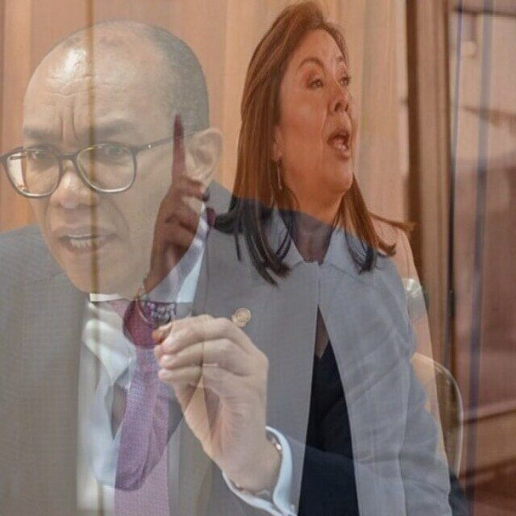
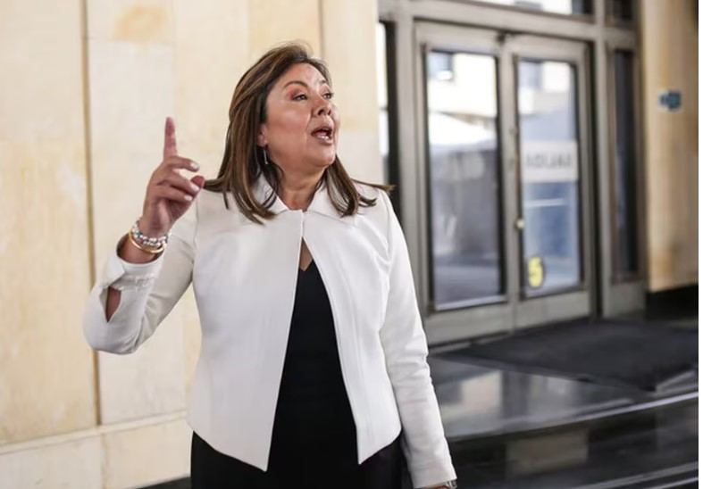

El tiempo de la Corte Suprema de Justicia sigue siendo elástico gracias a su viejo reglamento interno. Sus 23 magistrados de la Sala Plena tampoco hoy se pusieron de acuerdo para elegir fiscal. Sin embargo, tres elementos se pueden destacar de esta cuarta frustrada intención. (I) El voto en blanco perdió fuerza. (II) La ternada **Amelia Pérez Parra**, quien alcanzó 13 votos en la Sala anterior, dos más que el voto en blanco, se desplomó en la preferencia de los magistrados. (III) Se avizora acuerdo. Por esto brilló la ausencia de la protesta social y de los ataques del presidente y de los senadores del Pacto Histórico.

Los 23 magistrados decidieron volverse a ver las caras en sala extraordinaria del martes 12 de marzo de 2024, porque su presidente tiene un viaje a Brasil el 21 de marzo. Al término de la Sala, el presidente de la corporación **Gerson Chaverra**, dijo:

> “Nos encontramos próximos o cercanos a alcanzar el consenso y esa mayoría necesaria para la elección de la nueva fiscal general”

## La caída del voto en blanco

El voto en blanco siguió dominando, pero en cada ronda de votación iba perdiendo fuerza. En las dos primeras rondas electorales, ninguna de las ternadas (**Amelia Pérez Parra, Luz Adriana Camargo y Ángela María Buitrago)** superaron el voto en blanco. Pero en la tercera ronda, Amelia Pérez le ganó con 13 votos, dos más que el voto en blanco. Hoy ese favoritismo se vino al piso, mientras que la preferencia por el blanco se reactivó momentáneamente. Pero, cedió terreno ante **Luz Adriana Camargo Garzón,** quien logró 13 votos. Es decir, que para el 12 de marzo, arranca como una de las favoritas para ser la próxima fiscal.

Como el _pan se puede quemar en la boca del horno_, el tener 13 votos no es garantía que pueda ser elegida fiscal en la sala del 12 de marzo. La jurista Amelia Pérez fue acribillada por los medios de comunicación y las redes sociales de la oposición como resultado de la actividad militante de su esposo proclive al petrismo.

En consecuencia, si no hay algún escándalo antes de la próxima jornada electoral de los 23 magistrados, **Camargo Garzón** se erige como la nueva fiscal general de la nación. 

## Sín límites, el tiempo de la Corte

El decreto Ley 16 de 2014, mediante el cual el presidente Juan Manuel Santos modificó la estructura orgánica de la Fiscalía General de la Nación, no definió un tiempo límite para la elección del fiscal. ¿Por qué el presidente Petro no lo modificó antes de mandar la terna a la Corte Suorema de Justicia?

El país se ve abocado en estos momentos en una disyuntiva política propuesta por dos vertientes institucionales para la elección de la próxima fiscal: la del presidente y la de la Corte Suprema de Justicia.

El tiempo, de por sí es subjetivo, porque es solo una **percepción del sujeto humano, y no una realidad objetiva**, como el aire o la energía. Por esta misma razón, el tiempo de la Corte y el tiempo de la Constitución son dos tiempos distintos. El tiempo de la Corte es el tiempo de 23 percepciones subjetivas de sus magistrados. Ante este criterio objetivo, vale la pena preguntarse ¿Es constitucional el tiempo de la Corte Suprema de Justicia? Sin lugar a equívocos que es legal, porque la ley y el reglamento no estipula un tiempo determinado para limitar la percepción subjetiva de sus integrantes.

Sin embargo, el mandato conferido a la Corte Suprema por el artículo 249 de la Constitución de 1991, si bien es cierto no impone tiempos diferentes a los que se tome el alto tribunal para llegar a las mayorías calificadas, no puede ser indefinido. Pero, se parte del límite consciente de los magistrados tomando en cuenta la armonía institucional. Como los tiempos son una sensación subjetiva del administrador de justicia, su comportamiento debería estar limitado para evitar dilación que pueda provocar una desarticulación institucional.

## El tiempo de la Corte debe ser limitado

*Luz Adriana Camargo repuntó en la última votación con 13 votos. El tiempo de la Corte debe ser limitado.*

Por tanto, el tiempo de la Corte Suprema de Justicia debe ser limitado por la Corte Constitucional a través de una acción constitucional.

En ese sentido, si nos atenemos a la tesis del abogado **Nixon Torres** en la acción de constitucionalidad, el tiempo del fiscal es institucional y no personal, entonces, la conducta de la Corte llevó el período del anterior fiscal Francisco Barbosa más allá del 12 de febrero, fecha en la cual cesaron sus funciones por mandato constitucional. Puesto que al dejar en ese cargo a su designada, Martha Mancera, no sería el tiempo de la Constitución sino el tiempo de **Francisco Barbosa.** Esos tiempos subjetivos de la Corte, como ocurrió con la sucesión de Mario Iguarán (2005-2009) y con la de Néstor Humberto Martínez (2016-2019), provocaron un desbarajuste institucional en el país. Desbarajuste que es aprovechado por organizaciones mafiosas anidadas al interior de la misma Fiscalía.

Conclusión. Sabemos que es difícil poner de acuerdo a 23 personas que piensan en la gran responsabilidad de elegir a una mujer tan poderosa como la próxima fiscal. ¿Será Luz Adriana Camargo? No está claro todavía, si tomamos como referencia el caso de Amelia Pérez. Pues, el pan se puede quemar en la boca del horno. Pero hay una señal de que podemos tener fiscal: el voto en blanco quedó disminuido y quizás los votos de Amelia Pérez emigrarán para donde Luz Adriana Camargo. ¿El 12 de marzo habemus Fiscal?