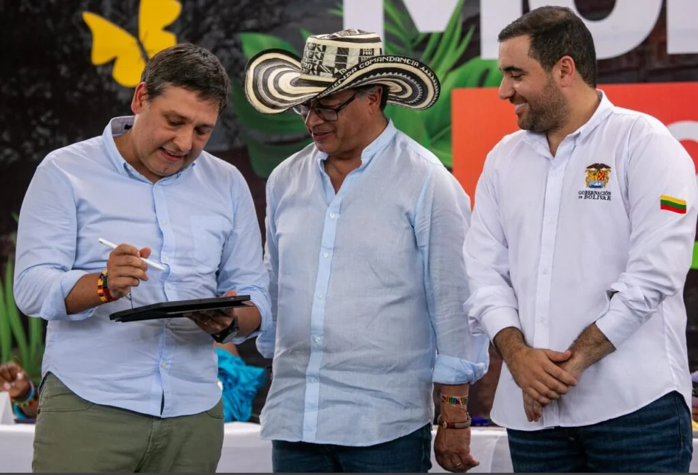

*la impagable deuda de la UdeC a Ecopetrol: Petro y Yamilito piden que la condonen*

La impagable deuda de la UdeC a Ecopetrol parece que tiene solución política mas no jurídica. Y la vía es la condonación. Una de las intenciones que tenía el gobernador de Bolívar, **Yamilito Arana Padauí**, era aprovechar la correría del **presidente Gustavo Petro** y de su comitiva presidencial para solicitar la condonación de la deuda de la UdeC.

En efecto, en su discurso en Santa Cruz de Mompox, el primer mandatario manifestó que ese dinero se debe quedar en la universidad.

> “Sugiero que Ecopetrol debe buscar el camino para que esos $200 mil millones se queden en la UdeC. Hay que encontrar una solución, porque si no todo lo que hablamos es carreta, lo que vamos es a matar la Universidad de Cartagena... con esa platica la matamos".
> 
> Gustavo Petro en Mompox, 22 de marzo de 2024.

¿Te interesa? [La deuda eterna de $126 mil millones de Bolívar a UdeC provocaría un colapso (I)](/articulos/la-deuda-eterna-de-126-mil-millones-de-bolivar-a-udec-provocaria-un-colapso-i/)

## La impagable deuda de la UdeC

*William Malkún Castillejo, rector, le tocó enfrentar la impagable deuda de la UdeC. El déficit de la universidad bordea los $100 mil millones y la gobernación de Bolívar le tiene una deuda histórica de $126 mil millones. ¿Cómo se lo pagará?*

Hay deudas que son impagables y otras pagables. Por ejemplo, es pagable los $126 mil millones que la gobernación de Bolívar le debe a la universidad, a corte del 2022. En ese año le denominamos **deuda histórica**. En la gobernación de **Dumek Turbay (2019**) se hizo un acuerdo de pago. Ahora bien. ¿Cómo una empresa, cuyas rentas son del Estado, que es Ecopetrol, desata una persecución jurídica para reclamar la devolución del cobro de **estampilla pro-universitaria** que se hizo mediante una acción de cumplimiento? La impagable deuda de la UdeC, sin duda, que lo es, porque la universidad no es una fábrica de salchichas ¿O si lo es?

Antes de responder esas preguntas vale la pena hacer un análisis de contexto del hecho.

## Acción dd cumplimiento

En 2006, la UdeC presentó acción de cumplimiento al considerar que Ecopetrol S.A. no cumplió con el pago de la estampilla por las exportaciones de petróleo desde el puerto de Cartagena, desde el año 1997. La demanda fue conocida en primera instancia por el Juzgado 13 Administrativo de Cartagena. Mediante sentencia del 26 de enero de 2007, el juzgado negó las pretensiones y declaró la falta de legitimación en la causa por pasiva de Ecopetrol S.A.

Por su parte, el Tribunal Administrativo de Bolívar, en fallo de segunda instancia del 12 de marzo de 2007, revocó la decisión del juzgado 13 Administrativo. En consecuencia, ordenó a Ecopetrol el pago de los dineros que la Universidad de Cartagena debió recaudar durante ese período desde 1997 hasta cuando efectivamente se pagara el tributo. En este sentido, ordenó a la Contraloría General de la República que determinara el monto adeudado. Pero esta entidad manifestó que Ecopetrol no estaba obligada a pagar dicha deuda. Ante esta situación, el Tribunal Administrativo **decretó la nulidad de todo** lo actuado a partir de la ejecución del fallo al resolver petición de la directiva universitaria.

Finalmente, el juzgado cumplió con la orden del Tribunal y se hicieron dos pagos a la Universidad. Uno por **$26.402.634, 272**, el 3 de marzo de 2009. El otro por **$22.865.515.597** 9 de abril de 2010. Posteriormente, tanto Ecopetrol como la UdeC, presentaron tutelas que fueron negadas sus pretensiones. La UdeC pretendía más y Ecopetrol pedía que se reconociera la violación del debido proceso.

## La jugada de Ecopetrol y el "vómito negro"

*La deuda impagable de la UdeC ¿Ricardo Roa, presidente de Ecopetrol, obedecerá a su jefe, el presidente de la república Gustavo Petro?*

Ecopetrol tiene en su lista a varios bufetes de abogados que son como sanguijuelas. Se ganan multimillonarias comisiones por éxito y, al parecer, tienen pagos adicionales. Uno de estos bufetes hizo una jugada extraproceso contra la Universidad. Presentó un derecho de petición con el cual revivió el proceso fallado en segunda instancia y que ya se había ejecutoriado. O sea, revivieron un proceso que era _cosa juzgada_.

**El 26 de julio de 2012, Ecopetrol S.A**. en un derecho de petición solicitó a la universidad la devolución de los pagos en excesos o indebidos que se hicieron por la estampilla. Esta petición fue negada mediante acto del 20 de septiembre de 2012. Pero, emitieron una resolución que fue demandada ante lo contencioso dando lugar a un nuevo proceso.

Ante esa negativa, el abogado  **Willington Ali Plata Villamizar**, en representación de Ecopetrol, demandó la resolución mediante la cual la universidad negó la devolución del dinero. En segunda instancia, el Consejo de Estado falló contra la universidad y la condenó al **"vómito prieto"**: devolver los **$49 mil millones** que le habían pagado hasta el 2010 con intereses y las costas jurídica. Deuda que hoy estaría llegando a la suma de **$200 mil millones.** Esto es muy grave, porque la universidad arrastra un déficit aproximado de **$100 mil millones.** Y como el _bebé llora y la madre lo pellizca_, la gobernación de Bolívar tiene una **deuda histórica** con la Universidad de Cartagena que podría llegar a más de **$126 mil millones** a precio de 2022.

## ¿Condonar la impagable deuda de la UdeC?

En principio el artículo **355 de la Constitución Política** prohíbe expresamente las condonaciones efectuadas por entidades públicas a favor de personas naturales o jurídicas de derecho privado. ¿Lo puede hacer con una entidad pública y educativa?

La respuesta a esta pregunta nos exige una nueva entrega de este seriado sobre la impagable deuda de la UdeC a Ecopetrol. Es impagable porque profundizaría el déficit que arrastra nuestra Alma Mater, ya que su pago la llevaría a una debacle total. Así como el Estado salva a los grandes bancos cuando se encuentran en crisis, el presidente Petro debe buscar que Ecopetrol decrete la condonación tomando en cuenta que ese dinero lo puede presentar como **responsabilidad social empresarial** para fomentar la educación de los sectores menos favorecidos de la ciudad y de la región.

Si esa tesis es acogida por los expertos juristas de Ecopetrol y de su presidente Ricardo Roa, sin duda, la Universidad debe llegar a otro nivel. Además, porque si logra que la gobernación de Bolívar le pague la deuda histórica que hoy podría llegar a más de $200 mil millones, la U de C. quedaría boyante financieramente. Entonces se diría: _no hay mal que por bien no venga_