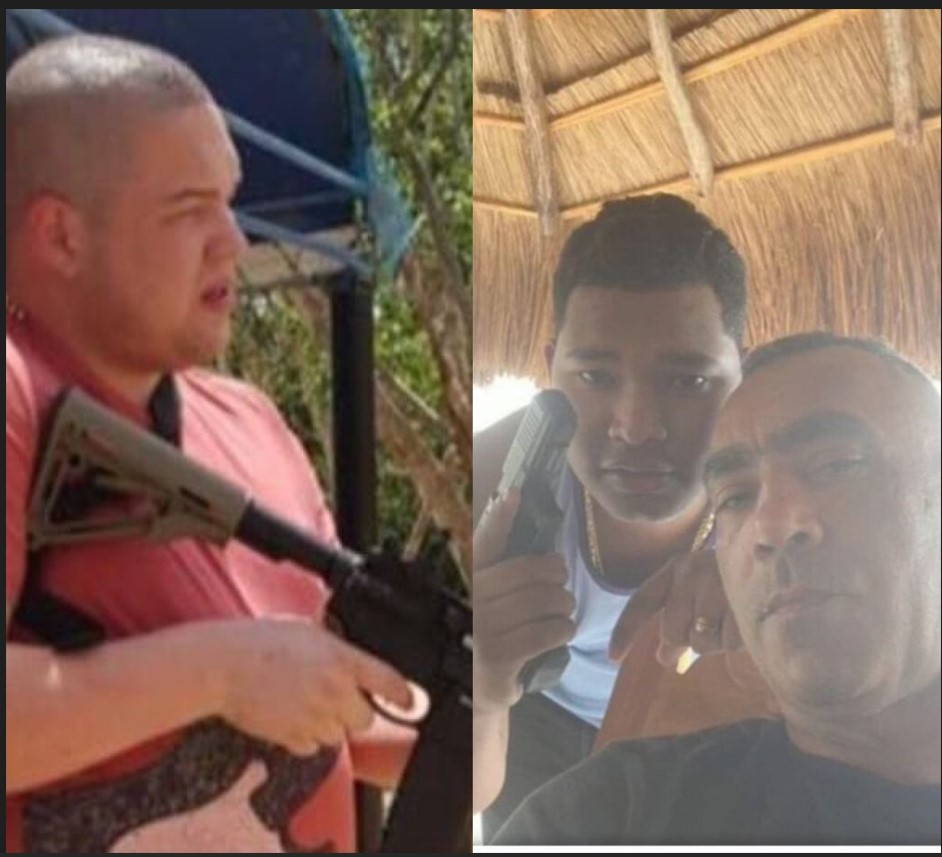
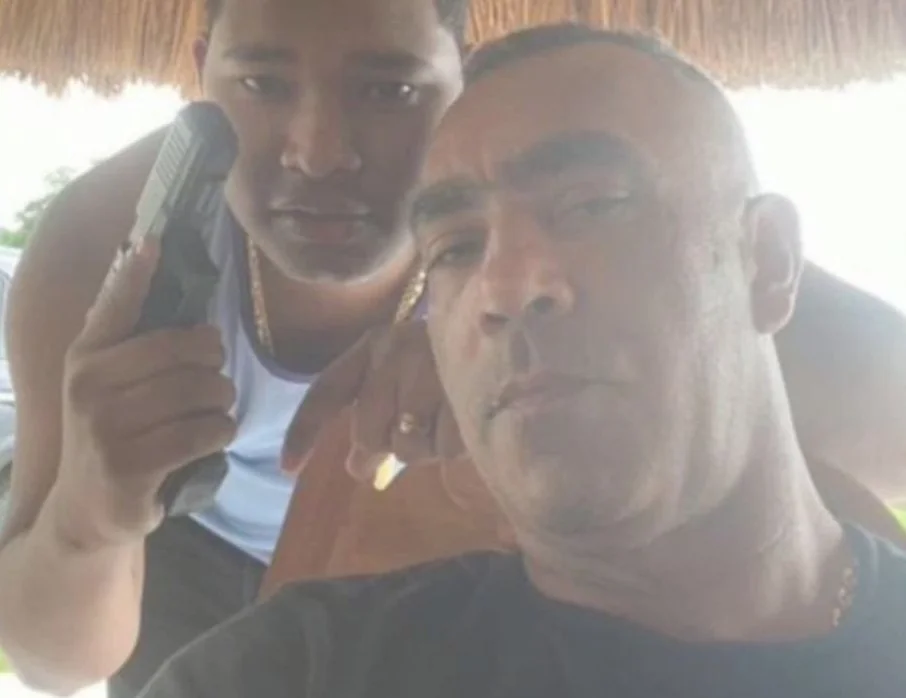

*El Beto (muerto), Jonathan (muerto) y Negra Dominga tomándose la selfie con su sobrino amado.*

¿El dolor que hoy siente **Meili Daza Curvelo** será el mismo que sintió **Álvaro Ospino Illera**, conocido en el bajo mundo como **«La Negra Dominga»**, el 25 de octubre de 2022? Este día, su amado sobrino—hijo, **Jonathan Ospino Illera**, fue asesinado fríamente por **el _Beto_**, en la fiesta de su cumpleaños. Este crimen le costó el exterminio de toda su familia. El último fue él, como para que su dolor se lo llevara hasta la eternidad.

En ese punto, vale la pena preguntarse: ¿Tuvo que ver **Álvaro Ospino Illera** con la muerte de **Roberto Carlos Vega Daza**, el hijo menor de uno de los jefes del bajo mundo más temido de Barranquilla? Es la pregunta de orientación de esta historia que les voy a narrar.

¿Te interesa? [¿Negra Dominga y su venganza contra Los Vega Daza? (III)](/articulos/negra-dominga-y-su-venganza-contra-los-vega-daza-iii/)

## Vea el Final de Los Vegas

> _En este análisis documental, Lucio Torres te explica la hipótesis de que la causa de su muerte pudo ser la venganza desatada por el padre de crianza de Jonathan Ospino Illera asesinado a sangre fría por el Beto en la fiesta de su cumpleaños el 25 de octubre de 2022 en la finca Mediterrané, Puerto Colombia, Barranquilla._

https://youtu.be/9EmMMOScVAY

## El poder de la palabra

La palabra tiene poder:

> A _hierro mata, a hierro muere_.

Esa es la ley del karma conocida desde que el humano se mata entre sí y que los profetas y filósofos de la Era Axial advirtieron desde la India hasta la China, 700 años antes de Cristo.

Luego de que hoy las autoridades colombianas confirmaran su muerte, los restos mortales de **Roberto Carlos Vega Daza**, **alias Beto**, yacen ahora en una cubeta de Medicina Legal española esperando que un alma piadosa reclame sus restos mortales. A 8.033 km. de distancia, **Meili Daza Curvelo**, la viuda de «Kike» Vega y mamá de los Vega Daza, luego de la masacre del 29 de junio de 2023, siguiendo la tradición guajira, había declarado que **«todo lo llevaría hasta las últimas consecuencias»**. Hoy, con la muerte de su último hijo, debe sentirse profundamente adolorida y ¿arrepentida?

Contrario a lo que hoy siente una madre adolorida por la muerte de sus últimos hijos, **«La Negra Dominga»** podría experimentar un fresquito profundo de satisfacción. Al parecer, cumplió el juramento que hizo de vengar la muerte de su sobrino—hijo, al pie de la tumba en el cementerio de Arroyohondo—Bolívar, al norte del Caribe colombiano donde reposan sus restos mortales.

## Nuevo patrón en el bajo mundo

*El nuevo patrón del bajo mundo, La Negra Dominga./ Foto Suministrada.*

Se acabó el **Clan de Los Vega**, sin duda que sí. ¿Se acabó la guerra de las bandas que controlan la economía subterránea de Barranquilla? Sin duda que no. Este episodio de la masacre de Los Vega, que tenía algún tipo de alianza con _los Pepes_, no se encuentra en el escenario de guerra entre estos últimos y _los Costeños_, como equivocadamente dicen algunos medios de prensa y analistas consultados. Es una guerra muy particular y peculiar que podría cambiar la correlación de fuerza de esas bandas. Pero, a favor de la organización que exterminó a Los Vega, es decir, **Los Piloneros**, cuya economía no depende de la extorsión o del despojo de tierra. Tiene otras fuentes financieras toleradas por las mismas autoridades.

Ahora están surgiendo dos grandes jefes, los triunfadores de esta guerra contra Los Vega que alinearán a todo el bajo mundo de la ciudad, inclusive, a las mismas autoridades: **Álvaro Luis Ospino Illera** (****«La Negra Dominga»**)** y su gran aliado **Víctor Rafael Reales Hoyos**. Contra estos dos personajes fue confirmada la sentencia No 256 de 2011 del [Tribunal Supremo de Justicia](/articulos/decisiones/scp/Abril/078-3412-2012-11-171.html) de Venezuela por sicariato y concierto para delinquir cuando le vendían seguridad a Walid Makled García, alias _el Turco_ o el Árabe.

¿Te interesa la primera entrega de esta serie?  [«Kike» Vega e hijos masacrados en su madriguera](/articulos/kike-vega-e-hijos-masacrados-en-su-madriguera/).

## La sentencia de muerte

*Así entrenaba Los Vega, el Beto era uno de ellos./foto suministrada.*

El último de los cachorros del _Kike_ Vega se había salvado 3 veces. La segunda vez fue antes de la masacre del 29 de junio de 2023. En esta pereció su padre y sus dos hermanos, en **North Frontier de Villa Campestre**, al norte de Barranquilla. Fue su escondrijo después de que alias _Beto_, el hoy occiso, asesinara a Jonathan.

De acuerdo con fuentes de inteligencia, _Kike_ Vega quiso negociar con **«La Negra Dominga»**. Le mandó varios mensajes en noviembre de 2022 por diferentes fuentes y con distintos mensajeros. Le hizo una oferta en dinero. Todo fue en vano, porque Álvaro Ospino Illera solo quería la cabeza de Beto, el asesino de su sobrino—hijo. En su mente no cabía la palabra negociación ni compasión contra Los Vega. **«**Dame al Beto y te dejo quieto**»**, tal vez fue la promesa de **«La Negra Dominga»**, según esas mismas fuentes.

En esas circunstancias, entre sacrificar a su hijo o aceptar la guerra que le declararon, Kike Vega se preparó para la última batalla de esta guerra que la vio muy oscura. Duplicó la escolta, se replegaron y buscaron varios escondrijos. Así duraron 7 meses como errantes peregrinos. Al mismo tiempo, se fueron aislando cada día más. Sus compinches incrustados en la Fiscalía y la Policía ya no les respondían como antes.

No obstante, los Ospino Illera ya no se conformaron con pedir la cabeza de alias _Beto_. Ahora querían arrasar con toda la banda criminal. ¡Esa era la orden!

¿Te interesa? [North Frontier: El último suspiro de «Kike» Vega (V)](/articulos/north-frontier-de-kike-vega-a-gabi-daza-v/)

## Antes de la masacre de North Frontier

*Así quedó «Kike» Vega y sus hijos.*

Una semana antes de la masacre, el Beto salió de su escondrijo con un solo escolta. Estaba de _papayita_ para los persecutores que ya mantenían a Los Vega en acecho. Ellos pidieron a sus jefes licencia para matarlo. Pero la orden fue tajante: **«**¡No!» Los querían muertos a todos y al mismo tiempo, que no es lo mismo. En esa oportunidad se había salvado de la parca el _Beto_. Pero todo era cuestión de tiempo, como lo narramos en su oportunidad:

> «La paradoja de la vida, **Roberto Carlos Vega Daza,** el que mató a Jonathan Ospino en su fiesta de cumpleaños en Punta Roca (octubre 2022), se salvó de esa masacre. Por ahora se le escapó a la parca. Sin embargo, de acuerdo con fuentes allegadas a la malograda fiesta, él fue quien ordenó matar al cumplimentado. Con esta acción, firmó su condena capital y la de su banda. No sabía con quién se estaba metiendo**»**.
> 
> [¿Quién mató al capo  «Kike» Vega en su escondrijo? (II)](/articulos/quien-mato-al-capo-kike-vega-en-su-escondrijo-ii/)

Como _a cada puerco le llega su San Martín_, siguiendo la ley del karma, el día era incierto, pero su muerte era cierta. ¿Se entiende?

## El día de su muerte

Y ese día llegó el pasado 27 de febrero de 2024 en un país lejano de la región donde pasó su infancia, San Juan del Cesar Guajira. Allí veía a su padre convertirse en uno de los sicarios más temidos de las bandas de narcotraficantes y contrabandistas de la región. ¿Qué podrían hacer sus hijos sino lo mismo? Eran cuatro hermanos. Tres varones y una hembra. Isabel es o era la única mujer. Hermosa, modelo y con mucho glamour. Estuvo en Francia modelando mientras sus hermanos mataban, traficaban y extorsionaban en Barranquilla. Desde hace rato vivía en Panamá y quizás el **Beto** estuvo con ella. Dicen que también la asesinaron, pero este hecho hasta ahora no está confirmado.

El día de la masacre, el Beto se había levantado de la reunión que tenía con su padre _Kike_ Vega en la puerta que daba al patio (jardín trasero) de la residencia para adentrarse a la casa a tomarse un vaso de agua. Si bien recibió un disparo en una de sus piernas, se logró salvar. Luego huyó y se recuperó.

La última noticia que se conoció de él fue la noche del 27 de febrero. La prensa española informaba del hallazgo de tres cadáveres en un vehículo Volkswagen Passat en Levante, España. Casi que al mismo tiempo que la Guardia Civil daba la noticia, ya en Colombia se sabía que uno de esos tres muertos era alias Beto, quien había huído con pasaporte venezolano. ¿Existió alguna conexión de su muerte con los deseos de venganza de **«La Negra Dominga»**? Las autoridades no se han referido sobre ese caso. La Policía española atribuyó ese triple asesinato a una _vendetta_ del narcotráfico por la pérdida de un cargamento de cocaína. Los tres individuos fueron citados al lugar donde hallaron sus cadáveres. Nadie escuchó nada. Todo indica que fueron asesinados con silenciadores por tiradores de la mafia marroquí, de acuerdo con la Guardia Civil de Valencia, España.

¿Te interesa? [«Hasta las últimas consecuencias»: viuda de «Kike» Vega (IV)](/articulos/hasta-las-ultimas-consecuencias-viuda-de-kike-vega-iv/)

## ¿Quién ganó?

En esta guerra no hay ganadores. Incluso, los que ganan, pierden, porque cuando se mata al otro se mata uno mismo. ¿Se entiende? Es cierto que esta parte de la historia de la guerra del bajo mundo se inició en la balacera del 26 de octubre de 2022 en la fiesta de cumpleaños del sobrino de La Negra Dominga. No es menos cierto que la guerra por el control de las rentas ilegales se vaya a acabar. Por el contrario, ahora que los jefes de una de las bandas de delincuentes fue exterminada, como son Los Vega, vendrá un período de reacomodo en el bajo mundo de Barranquilla.

Sin duda, aunque La Negra Dominga y sus aliados hayan ganado la guerra a Los Vega, seguramente los hombres armas que seguían al Kike Vega buscarán emplearse en las bandas que lideran los ganadores de esta batalla. De algo seguro deben estar las autoridades de Barranquilla y el país, es que en estos momentos están surgiendo nuevos jefes que reemplazarán a los caídos.

Serán jefes y bandas más fuertes y sanguinarias que se afianzarán en el poder local y regional si la Fiscalía y la Policía continúan con su comportamiento negligente para combatir las bandas criminales. Si La Negra Dominga y sus aliados fueron capaces de acabar con una de las bandas más sanguinarias anidadas en Barranquilla procedentes de La Guajira ¿se acabó la guerra? La respuesta es un NO. Ahora tendremos el reemplazo de _Kike_ Vega, más joven, más fuerte, más rico y más despiadado. A la Negra Dominga y a su principal socio, **Víctor Rafael Reales Hoyos**, los procesaron y condenaron en Venezuela por **los asesinatos del veterinario Francisco Larrazábal** **y del periodista Orel Sambrano**. Quedaron libres, al parecer, por pena cumplida.

En la próxima entrega analizaremos el reacomodo del poder subterráneo de una Barranquilla, cuya economía está bajo la dictadura de la mafia desde aquellos tiempos cuando entraron arrasando Jorge 40, Salvatore Mancuso y el Cartel de Cali.