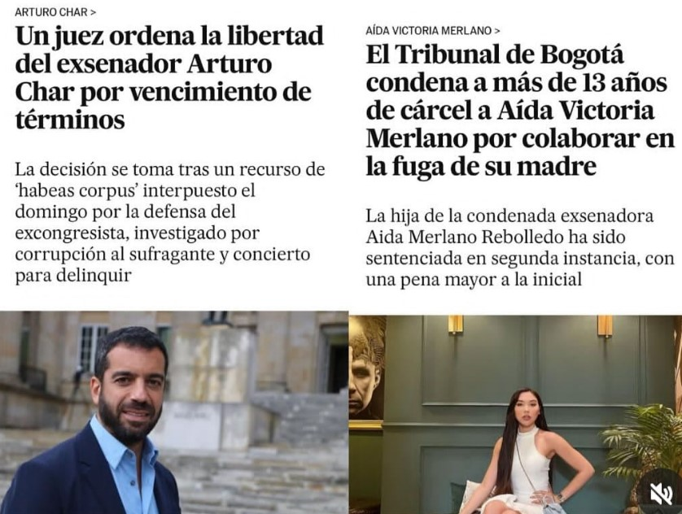
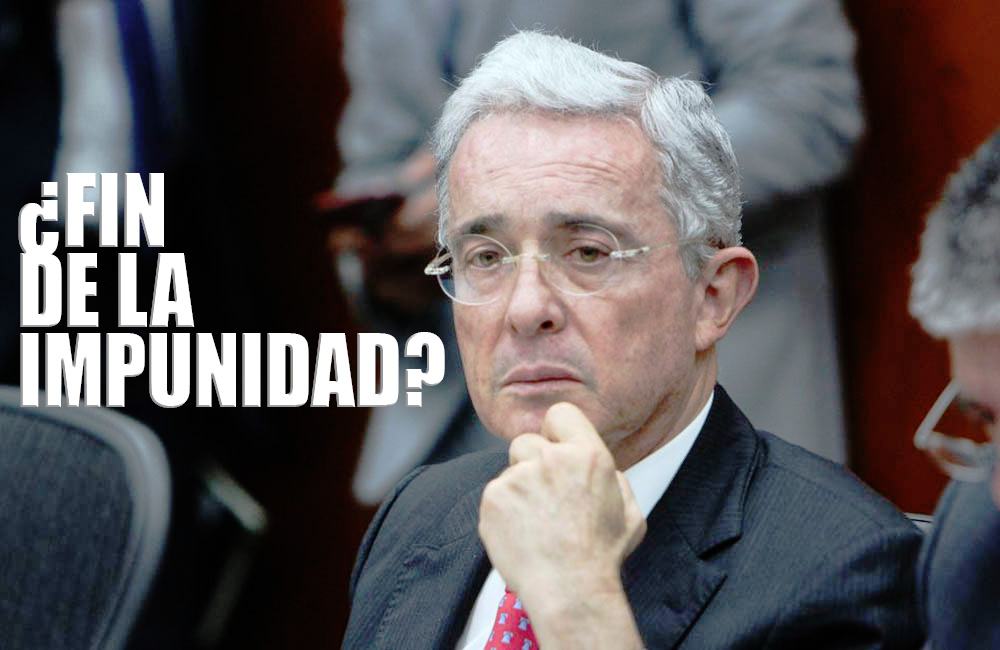
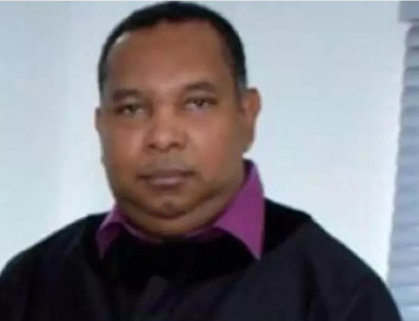
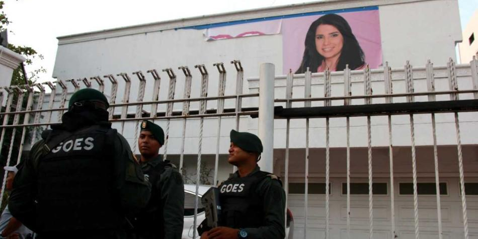
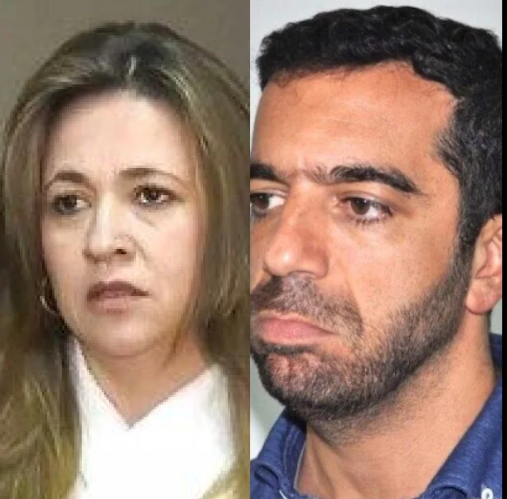

*Las dos caras de la Justicia selectiva.La prensa internacional registró estos dos hechos. /El País de España.*

Para ejemplificar las dos caras de la justicia selectiva basta contrastar **dos casos judiciales** protagonizados por dos familias. La una, la más poderosa de la Costa Caribe de Colombia: _el Clan Char_. Y la otra, fragmentada o disfuncional de las barriadas de Barranquilla, las Merlano Rebolledo. Pero las dos están atadas a dos hechos judiciales: **«Casa Blanca»** y la fuga de la cárcel de la condenada exsenadora **Aida Merlano Rebolledo**.

La principal protagonista del escándalo es **Aida Merlano**. Una madre soltera, que en (2011) de _mochilera_ saltó a ser la diputada más votada de toda la historia del Atlántico. Su acto culmen de su meteórica carrera política fue su elección como senadora en 2018.

Aún cuando ambas familias (Char y Merlano) están implicadas en el mismo delito y en los mismos hechos, en tanto, las Merlano recibieron el correazo de frente y del lado de la hebilla. Ellas hoy sufren las heridas de esa misma justicia de mano frágil para con los poderosos. Pero de mano fuerte e inclemente para los nacidos en barrios populares. Desafortunadamente, este es el mensaje o mal mensaje que recibimos del aparato judicial en Colombia.

## ¿**«**Cuánto tienes para el fiscal o juez**»**?

Ahora, cuando la justicia en segunda instancia, blandió el lado de la hebilla de esa correa de doble rasero para castigar a la _influencer_ **Aida Victoria Merlano**, pone de presente su doble connotación: **la justicia para los poderosos y la justicia para los débiles.** No se trata de cuestionar la decisión judicial en el caso de **Aida Victoria, porque existen evidencias de que sí participó en la fuga de su madre.** Se trata de poner la balanza de la justicia en su propia dimensión. Porque salir airoso de un proceso judicial ya no es por la capacidad de la defensa de argumentar y demostrar la inocencia de su defendido sino de quién tiene o no poder político y económico.

En este punto, una pregunta válida es **¿«cuánto tienes en la bolsa y te diré en qué sentido va el fallo?»** Desafortunadamente, la sentencia del juez tiene su precio en la mayoría de los casos, incluso, para resolverlo en derecho. Un vencimiento de términos, también. Esto no es un juicio a priori o un comentario del periodista. Es una realidad, pública y que salta groseramente a simple vista. Un hecho del cual debe ocuparse la fiscal **Luz Adriana Camargo** y la misma Corte Suprema de Justicia. Aquí presentamos las evidencias.

¿Te interesa? [¿Arturo Char tendría la misma suerte de Aída Merlano? (I)](/articulos/arturo-char-tendria-la-misma-suerte-de-aida-merlano-i/)

## Los protagonistas

*Aidaecándalo, el idilio con Alex Char/Cortesía.*

Aparte de los otros comprometidos por el caso de **«Casa Blanca»**, existen tres protagonistas por su papel en la política del Atlántico y el país. **Alejandro Char, Arturo Char y Aida Merlano**. Y la cuarta, es una llamada _influencer_ que aprovechó el escándalo para lanzarse al estrellato de esos constructores de contenidos de las cosas vanas de la que gustan las mentes alienadas.

De manera que Alejandro y Arturo, siguiendo los preceptos de su padre **Fuad Char** **Abdala**, arquitecto del entramado donde involucró a sus hijos y parientes, hoy aparecen como los grandes beneficiarios de la _justicia selectiva_. Habiendo todas las evidencias de que también participaron y se beneficiaron de ese concierto para delinquir. Al extremo, que el mismo abogado del clan Char, **Diego Muñeton**, **fue sancionado disciplinariamente**, por el Consejo Superior de la Judicatura por haber presionado y sobornado a la excongresista Aida Merlano, con el objeto de favorecer a sus clientes. A pesar de estas evidencias, siguen siendo intocables.

Vale decir que a Alejandro no lo han imputado. Al segundo de los Char, la Corte Suprema de Justicia ordenó medida privativa de la libertad en cárcel. Pero con una estratagema jurídica, al parecer, diseñada por el jefe de su defensa, el bogotano **José Luis Barceló Camacho**, expresidente de la Corte Suprema de Justicia. Él estructuró el argumento del vencimiento de términos con la presunta complicidad de su vieja apadrinada, la magistrada **Cristina Lombana Velásquez**. Barceló fue el magistrado ponente del fallo que absolvió a la magistrada investigadora en el proceso penal por la pérdida de **$1 mil millones de pesos** cuando ella era juez Penal Militar. Además, Lombana llegó a la magistratura de la mano de Barceló. Pero, la mujer de toga, no se declaró impedida y la Corte pecó, al parecer, de prevaricato.

¿Te interesa? [¿Prevaricó la Corte al trasladar a Arturo Char a Malambo con Aida Merlano?](/articulos/prevarico-la-corte-al-trasladar-a-arturo-char-a-malambo-con-aida-merlano/)

[¿Caerá el imperio Char-Gerleín-«Yuyo» Daes con las confesiones de Aida Merlano? (I)](/articulos/caera-el-imperio-char-gerlein-yuyo-daes-con-las-confesiones-de-aida-merlano-i/)

## La justicia selectiva de _Los intocables_

*¿Fin de la impunidad? El intocable mayor creador del régimen bonapartista que se tomó la Fiscalía desde su primer gobierno.*

Por tanto, asistimos a una **justicia selectiva** que hoy **cierra los ojos** cuando se trata de condenar a los poderosos y **los abre** cuando los victimarios no tienen la capacidad para torcerla. Es decir, la justicia se hace la de la vista gorda para unos y para otros ve hasta en la oscuridad para castigar. Como esta justicia privilegia a los Char, lo está con _Los intocables_ o _Los innombrables_ dueños de media Fiscalía desde 2004 cuando llegó a ese cargo **Luis Camilo Osorio Isaza**, el primer _fiscal de bolsillo_ de **Álvaro Uribe Vélez**, el ingeniero del Nuevo Estado. Un Estado guiado por la nueva élite impulsada por **dos motores poderosos**: el narcotráfico y el paramilitarismo.

De hecho, es una _justicia incierta_, llena de incertidumbre, cuya dilación es el arma mortal para acabar con la _justicia justa_. Esa arma se utiliza en los procesos contra los poderosos: _el vencimiento de términos_. Si bien es un recurso garantista para que la morosidad de la justicia no atente contra los derechos fundamentales del procesado, es una manera disimulada de legalidad que blinda a los poderosos. Ya sean del mundo de los negocios o del bajo mundo.

En consecuencia, el litigio real en la Costa Caribe está mediado por las dádivas de los poderosos, cualquiera sea su pelambre. Desde 2004, la Fiscalía fue copada por la dirección política del **paramilitarismo triunfante**. Con el **Decreto 4057 de 2011,** que disolvió formalmente el DAS, cooptado por el paramilitarismo de **Jorge Noguera Cote** (condenado a 25 años), ahijado político de **Álvaro Uribe Vélez**, terminaron de formalizar la toma de la Fiscalía por el paramilitarismo. Investigadores, oficiales, jefes y subjefes pasaron a formar el CTI y los nuevos fiscales que hasta hoy perduran. ¿Quieren más evidencias?

¿Te interesa? [Se derrite el teflón del Califato Daes—Char y la ética del exmagistrado Barceló (VIII)](/articulos/se-derrite-el-teflon-del-califato-daes-char-y-la-etica-del-exmagistrado-barcelo-viii/)

## Demóstenes, un ejemplo vivo

*Demóstenes Camargo, el fiscal de Uribe que llegó a magistrado del Tribunal Superior de Barranquilla ejemplo de una justicia selectiva. (Cortesía).*

De la misma manera, fiscales de esa generación que data de 2004, pasaron a ser jueces o magistrados de los tribunales de la justicia. Un prototipo de estos administradores de justicia, ejemplo vivo de la justicia injusta, es el actual magistrado del Tribunal Superior de Barranquilla, **Demóstenes Camargo de Ávila**, abogado afrodescendiente de la Universidad de Cartagena. Como fiscal, persiguió a sus hermanos de etnia y a los líderes populares.

De acuerdo con la versión entregada por un familiar a **VoxPopuli Digital**, estudió con mucho trabajo. En Cartagena de Indias vivió en casa de unos parientes que lo acogieron. Procede de una familia de estrato 1. Logró sobresalir como fiscal gracias al presidente **Álvaro Uribe Vélez**. Se entregó a él como se entregan los _esclavos por naturaleza_, seres alienados que no piensan por sí mismos, tal como lo define **Aristóteles**, filósofo de la antigua Grecia. Pero, ya en la cúspide del éxito, como cualquier individuo alienado, se olvidó de sus parientes, según el testimonio referenciado.

Hoy, Demóstenes está en desgracia ante la misma justicia. El 9 de noviembre de 2020, **fue imputado junto al otro magistrado Jorge Mola Capera, por prevaricato por acción ante la Corte Suprema de Justicia**. Presuntamente _abrió las manos_ como administrador de justicia para recibir las dádivas de uno de los bandos que se disputan el patrimonio de la **Fundación de Acosta Bendeck**, especialmente de la **Universidad Metropolitana de Barranquilla.** Es una justicia que mantiene a los poderosos libres, aunque hayan las evidencias en su contra que _saltan a la vista_. Pueden usar cianuro para eliminar a los testigos de sus crímenes con la seguridad de que saldrán libres para seguir delinquiendo con el amparo de la impunidad. Pero esto no es eterno.

## El fantasma de «Casa Blanca» 

*Una evidencia del pacto Aida Merlano y Arturo Char, los votos a la cámara iban para la fórmula del expresidente del senado. En «Casa Blanca» se fabricaron esos votos. ¿Por qué no han tocado a Llinás?*

El modus operandi de los Char es tener dos o tres empresas tipo «Casa Blanca». Funcionan como una empresa temporal. Políticos que bebieron de la fuente de «Casa Blanca»: concejales, diputados y candidatos cercanos a los Char y sus aliados. Reciben crédito del banco Serfinanza. El mismo Alejandro Char recibió un préstamo de $500 millones en 2015 para su campaña electoral. O sea, esos políticos son partes del concierto para delinquir descubierto en la condena contra Aida Merlano. Pero especialmente, el senador **Arturo Char Chaljub** y su fórmula, **Lilibeth Llinás**, hermana del entonces diputado charista **Adalberto Llinás**. La única condenada, hasta ahora, es Aida Merlano Rebolledo, muy a pesar de existir pruebas contundentes contra Llinás y Char. **La Corte Suprema de Justicia engavetó el proceso contra Arturo Char por más de 2 años**. Lilibeth Llinás sigue al servicio del _Califato Daeschariano_ sin que le pase nada.

Al regresar Aida Merlano a Colombia, deportada el **10 de marzo del 2023** desde Venezuela por el gobierno de **Nicolás Maduro** y recibida como una diva por el gobierno de Gustavo Petro, la Corte Suprema de Justicia se vio en la necesidad de desempolvar el proceso contra Arturo Char.

Por esa razón, 14 días después, la Corte Suprema de Justicia rechazó la solicitud de la defensa del expresidente del senado Arturo Char Chaljub. Buscaba detener el proceso por los presuntos delitos de concierto para delinquir y corrupción al sufragante.

## La fuga de Aida Merlano

*Esta es una de las «Casa Blanca» usada por el charismo.*

Mientras Arturo y Alejandro Char gozan de las mieles del poder, Aida y, ahora, su hija, Aida Victoria, prueban el rigor de la privación de su libertad. La hija mayor de la condenada exsenadora, cuya figura _naranjo en flor_, se marchitará inevitablemente en la cárcel. No tiene escapatoria. Va a la cárcel. Son 13 años. Si le va bien, pagaría efectivamente 8 años.

Los que financiaron el escape de Aida Merlano siguen libres. Su examante, **Alejandro Char Chaljub**, es intocable y seguramente espera que esa justicia lo trate con el hilo de la correa de esa justicia injusta. En tanto que la emergente, ambiciosa y escaladora dama de las barriadas de Barranquilla se hundirá en el barro de la cárcel, junto a su hija que siguió los pasos de su madre.

Así como Fuad Char crió a sus hijos para burlarse de la ley, Aida Merlano madre crió a su hija a su imagen y semejanza. La vida no te da sorpresa. La vida te da lo que le pides. A sus 15 años (_naranjo en flor_) la exsenadora ya despuntaba en el liderazgo juvenil conservador de los Gerlein. Su objetivo era escalar en el poder político. Para lograrlo, se hizo _sugar baby_ del _sugar daddy_ setentón de **Julio Gerlein Echeverría**. Uno de los caprichos de ella fue que su _sugar daddy_ la llevara al senado por el partido Conservador en reemplazo de **Roberto Gerlein Echeverría**. Esto creó un cisma en la familia conservadora que terminó reduciendo a escombros a «Casa Blanca».

## La correa de la justicia selectiva

*¿Prevaricó la Corte con la libertad de Arturo Char? La actuación de la magistrada Cristina Lombana refleja la Justicia selectiva.*

De una u otra forma, servir de calancho a los grandes pudientes para burlar la justicia, siempre termina mal. Aida Merlano junto a su hija, que siguió su ejemplo, tuvo la misma suerte: la cárcel. ¿Acaso el pronóstico que VoxPopuli Digital hizo el 22 de diciembre fue desacertado?

> «El llamamiento a proceso penal por corrupción al electorado de uno de sus más destacados líderes, **el senador Arturo Char** **Chaljub**, hermano de **Alejandro Char** **Chaljub**, será uno de los juicios más espectaculares de esta década. Este proceso podría marcar el inicio del **fin de uno de los imperios políticos** que se ramificó en todas las esferas de **una ciudad que en otrora fuera un remanso de paz**»

¿Te interesa?  [¿Fuad Char y sus hijos responderán por «Casa Blanca»? (II)](/articulos/fuad-char-y-sus-hijos-responderan-por-casa-blanca/)

## ¿Caerá Alejandro Char?

El pronóstico de la caída del **Califato Daeschariano** técnicamente no se ha cumplido. Pero estámos en sus albores. Por mucho que evadan la justicia y la verdad, ésta saldrá a flote de las cloacas del Estado. Ahora mismo no pueden vivir tranquilos y felices. Si la cadena se rompió por el eslabón más débil, como fue **Aida Merlano Rebolledo**, seguramente los más fuertes caerán más temprano que tarde.

**¿Alejandro Char Chaljub será el próximo que caerá?** Si es posible. Siempre y cuando la nueva Fiscal cambie la estructura ejecutiva de la Fiscalía Seccional del Atlántico y los fiscales delegados ante el Tribunal Superior de Barranquilla y la Corte Suprema de Justicia. Y no solo basta que los cambie, es necesario que los nuevos lleguen con la **justicia justa** y no **la justicia selectiva** que se pone al servicio del buen postor. Así caerían administradores de justicia que como **Cristina Lombana**, J**orge Mola Capera y Demóstenes Camargo**, se ponen al servicio de los dadores de dádivas y de la mafia.