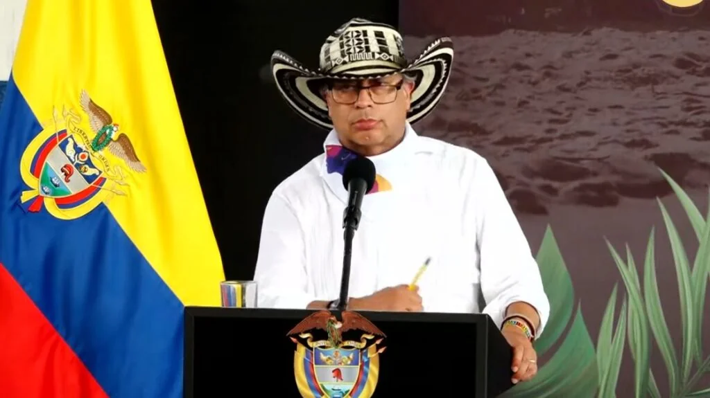
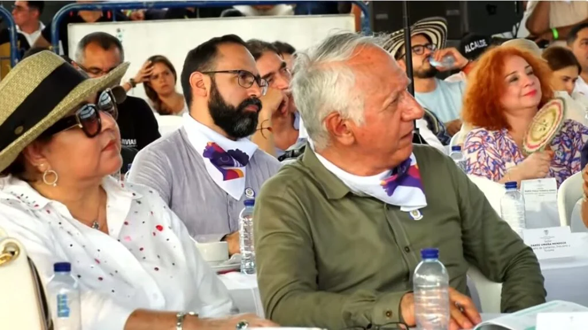
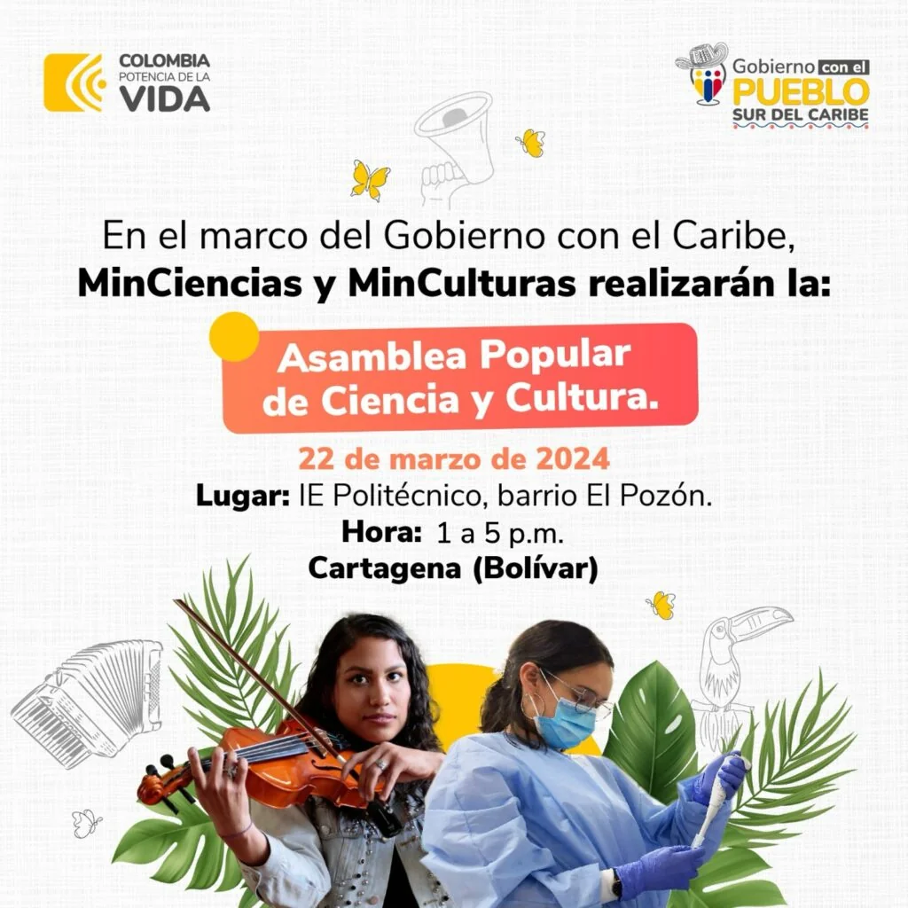
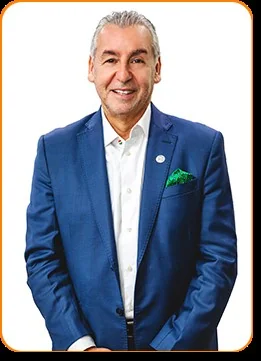

*"No soy un tirano. (...) estábamos en la bobería", presidente Petro*

> "¡No soy un tirano! No somos de la oligarquía. Yo no estoy construyendo una tiranía sino una democracia.

El presidente Gustavo Petro se está radicalizando cada día más. La sola frase "No soy un tirano" lo define todo. Teóricamente, rompió la metodología transaccional y conciliadora con la oligarquía que anunció en su discurso del 7 de agosto de 2022. Allí inauguró un gobierno compartido con las oligarquías expresadas a través de sus partidos políticos. Ahora su discurso está más cargado hacia la izquierda. Se hace monolítico, impositivo y fustigador y anti oligárquico, como en los viejos tiempos de sus luchas parlamentarias.

¿Te interesa? [El presidente Petro ya está en la Costa Caribe](/articulos/etro-ya-esta-en-la-costa-caribe/)

## Los ministros atentos

Ello es tan cierto que, incluso, regaña a sus funcionarios en público cuando no están presentes en los eventos presidenciales, como este denominado **el Gobierno del Pueblo en el Caribe**.

## En Santa Cruz de Mompox

Hoy, el presidente y su comitiva presidencial llegará a Santa Cruz de Mompox. La cita está programada para las 11 de la mañana. Al parecer, el evento de Cartagena será reservado sin presencia del público.

¿Te interesa? [¿Petro radicaliza el clima político al pensar en la Constituyente?](/articulos/petro-radicaliza-el-clima-politico-al-pensar-en-la-constituyente/)

## Asamblea Popular en El Pozón

Para la 1 de la tarde hay un evento especial en El Pozón denominado **Asamblea Popular de Ciencia y** Cultura. Deben asistir varios ministros y directores de unidades. Pero no se confirmó la asistencia del presidente Gustavo Petro.

Todo indica que el presidente estará en un encuentro reservado en el hotel Hilton con algunos mandatarios y otros personajes de la región, especialmente empresarios.

## El otro Petro

*Jorge Eduardo Londoño Ulloa, director del SENA.*

En el atardecer marino de Santiago de Tolú, Sucre, al norte de Colombia, pronunció su acostumbrado discurso kilométrico en el marco de un Consejo de Ministros. Además de líderes sociales y políticos del Pacto histórico, estaban el canciller, los ministros del sector social el director del Departamento de la Prosperidad Social y de asistencia. Se molestó que no estuviese el director del Sena, **Jorge Eduardo Londoño Ulloa**. Interrumpió su discurso donde dijo que _no soy un tirano_ y que la oligarquía le dio **las espaldas al mar** para referirse a la falta de compromiso de los funcionarios. Además, aclaró:

> "El poder del pueblo se expresa algunas veces a través de las elecciones cuando no le venden el voto a un corrupto o a un narcotraficante que lo único que le interesa es el billete del pueblo."

Explicó Petro que el uribismo tiene 20 años gobernando en el país y por eso frenan todas las decisiones de su gobierno. Quiso decir que la tecnocracia uribista no permite que las decisiones lleguen al pueblo.

> "Si le hacemos caso a nuestra cabeza, de pronto construimos una tiranía. Y si le hacemos caso al que está abajo, lo que podríamos construir es una bobería. Yo creo que al principio el gobierno (de Petro) estaba metido en la bobería"

## La única voz:"No soy un tirano"

En tanto que en Tolú se refirió a "no soy un tirano" y al tema del mar, en San Onofre y Palmitos, poblaciones de víctimas del conflicto se refirió a la reforma agraria. Además, en su recorrido por Sucre, Petro habló se refirió a la existencia de centros de operación del paramilitarismo en esta subregión. En Palmitos, anunció la compra por parte del Gobierno Nacional de **1.414 hectáreas de tierra al empresario de Alquería, Carlos Enrique Cavelier** que el Gobierno entregó al campesinado. El predio, ubicado en el corregimiento de Aguas Negras, lo componen cuatro fincas: **El Mono, Buenos Aires, Zipataca y La Comandancia**.

> “Si quienes tienen la tierra hoy, por miles de hectáreas, en el Caribe colombiano, nos la venden y nosotros la repartimos al campesinado, aquí habrá paz por generaciones"

De manera que durante la jornada **'Gobierno con el Pueblo en el Sur del Caribe'** se entregaron **4.400 hectáreas** de tierra a campesinos de la región. Es la cifra revelada por el presidente Gustavo Petro. Así se avanza en el Acuerdo de Paz entre Gobierno y Farc de 2016, según manifestó.

Cada día el discurso del presidente Gustavo Petro se parece a lo que le caracterizó en sus debates de control político. ¿Hasta dónde llegará su discurso?