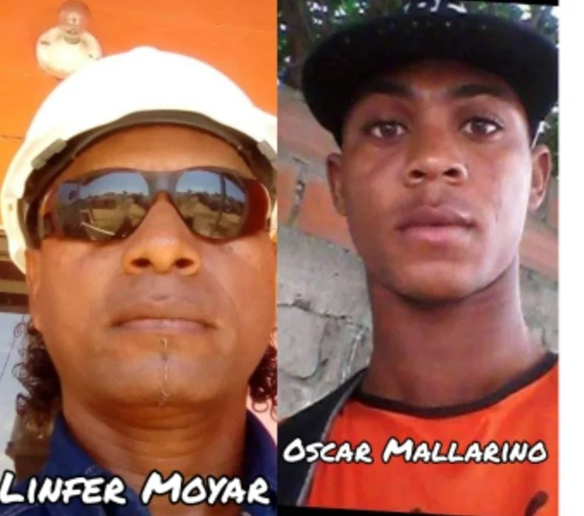
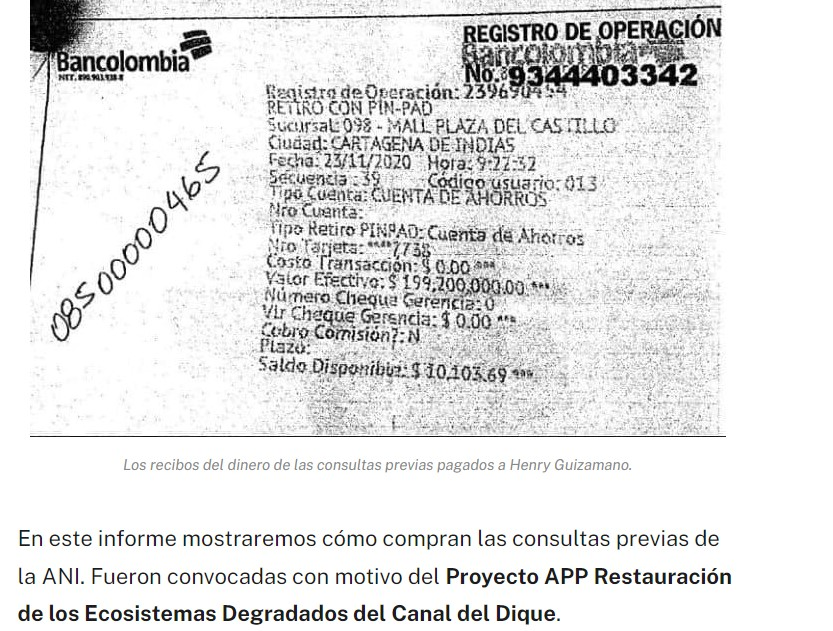
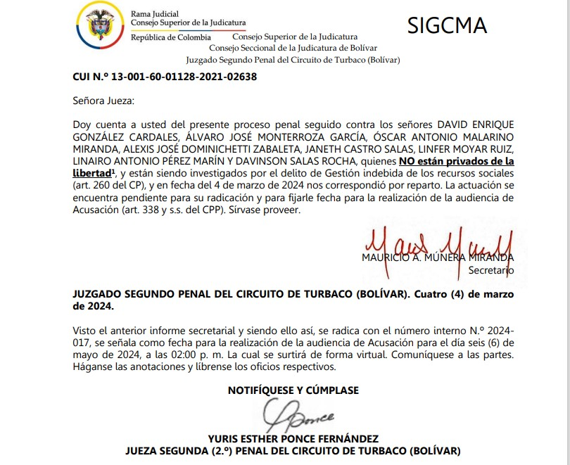

*Dos líderes afros presuntos implicados en el Cartel de Consulta Previa. Henry Guizamano Vivas y David González Cardales. Este último llamado a juicio.*

Un verdadero «tatequieto» al **«Cartel de la Consulta Previa»** le propinaría el fiscal 22 Seccional Bolívar con sede en Turbaco, **Julio Torres Pereira**, quien presentó escrito de acusación por presuntas falsedades en las consultas previas realizadas por la ANI. En el gobierno de Gustavo Petro se adjudicó el contrato de concesión de **$3.3 billones** a la controvertida empresa española, SACYR. Por esta razón, la juez Segundo Penal del Circuito de Turbaco, **Yuris Ponce Fernández**, llamó a juicio de acusación y medida de aseguramiento a 7 directivos del consejo comunitario de Rocha (Arjona) y al representante legal de Coriambiental, **David González Cardales**.

El radicado del juicio es el **N.º 2024-017**. Los líderes, presuntamente se apropiaron de **$500 millones** transferido por la ANI sin hacer dichas consultas.

Mientras tanto, existe otro proceso penal contra el líder afro **Henry Guizamano Vivas,** quien goza de un esquema de seguridad de la UNP por una supuesta amenaza**.** Este proceso podría tener graves consecuencias penales para él y sus posibles cómplices, de encontrarse pruebas para acusarlo.

En el Canal del Dique la situación de las presuntas irregularidades con las consultas previas es un problema casi generalizado. En el caso de González Cardales y Henry Guizamano, se encuentran involucrados directivos de 8 consejos comunitarios en el área de influencia del Canal del Dique: **Leticia, Recreo, Lomas de Matunilla, Bocacerrada, Puerto Badel, San Antonio, Labarcé**, entre otros. El proceso contra Guizamano es el más lento para que la Fiscalía emita la resolución de acusación como en el caso de Rocha.

¿Te interesa? [Por corrupción, en Rocha, denuncian a exdirectivos de consejos comunitarios](/articulos/por-corrupcion-en-rocha-denuncian-a-exdirectivos-de-consejos-comunitarios/)

## Voz a la comunidad

Recordemos que durante dos años y medio, **VoxPopuli Digital** promovió la **Alianza Social para la Defensa y el Desarrollo del Canal del Dique** con el fin de que el gobierno nacional de Duque y, luego, el presidente Petro, escucharan las inconformidades de las organizaciones sociales. Le pusimos voz a las comunidades y se rompió el silencio cómplice de la **Gran Prensa** y de los círculos de poder del país y de la región que presentaban el megaproyecto como la panacea para el desarrollo de la población.

## El delito del Cartel de la Consulta Previa

*Tatequieto al Cartel de la Consulta Previa, dos de los presuntos implicados.*

Los delitos que se investigan por parte de la **Juez Segunda Penal del Circuito de Turbaco** tienen pena privativa de la Libertad. Esto significaría que con una posible condena, los acusados podrían ir presos. Sería la suerte de **David González** y los 7 directivos del consejo comunitario de Rocha (Arjona): **Linfer Moyar Ruiz**, exrepresentante de la Junta del Consejo Comunitario de Rocha; **Néstor Iriarte Llerena**, expresidente de la Junta del mismo consejo; **Alexis Dominicheti Zabaleta**, exrepresentante legal; **Linairo Pérez Marín**, tesorero; **Davinson Salas Rocha**, vicepresidente; **Janeth Castro Salas**, secretaria; **Óscar Mallarino Miranda**, fiscal.

El artículo 260 del Código Penal Colombiano, dice:

> «El que con el propósito de adelantar o gestionar proyectos de interés cívico, sindical, comunitario, juvenil, benéfico o de utilidad común no gubernamental, capte dineros sin el lleno de los requisitos señalados en la ley para tal efecto, o no ejecute los recursos recaudados conforme a lo señalado previamente en el respectivo proyecto, incurrirá en prisión de cuarenta y ocho (48) a ciento ocho (108) meses».

## Nota aclaratoria

Las investigaciones periodísticas de **Vox Populi Digital**, por su fuerza argumentativa y probatoria, se constituyen en denuncias para que se active la capacidad oficiosa de la Fiscalía General de la Nación. Se trata de hacer justicia y encontrar la verdad verdadera. Esta es la misión del periodismo investigativo que ejercemos objetivamente.

Cuando el 13 de septiembre de 2023, el fiscal Julio Torres formuló imputación a los directivos comuneros, uno de ellos me atacó verbal y públicamente en un evento que convocó la parlamentaria **Dorina Hernández** en Arjona. Frente a ese alevoso ataque, este periodista se quedó callado. Se responde con hechos y no con palabras. Este es un hecho judicial.

¿Te interesa? [Cómo compran las consultas previas de ANI a los afros](/articulos/como-compran-las-consultas-previas-de-ani-a-los-afros/)

## ¿Se descubrió el Cartel de Consulta Previa?

*Artículo publicado el 6 de mayo de 2021 contra el Cartel de la Consulta Previa.*

En ese sentido, **VoxPopuli Digital** visitó, verificó y comprobó la falsedad de dichas consultas. En las diferentes transmisiones realizadas en vivo, las mismas comunidades denunciaron que **ninguna de las 16 consultas pagadas por la ANI fueron efectivamente realizadas**. Con este mecanismo se buscaba establecer la afectación de la población y su medio ambiente de esta megaobra denominaba _Restauración de los ecosistemas degradados del Canal del Dique_. De esta manera, se establecería un plan de inversión para mitigar el impacto social y ambiental.

Vale decir que en la investigación de **VoxPopuli Digital** y las denuncias de algunos veedores de las mismas comunidades, se pudo establecer un **patrón criminal en las supuestas consultas previas.** Patrón construido sobre una supuesta autonomía de los consejos comunitarios donde creen que pueden hacer todo lo que les dé la gana. Por esta razón, las consultas se convirtieron en un acto de corrupción y un pretexto para esquilmar recursos sociales (comunitarios) que se transforman en más pobreza para estas regiones afros. Así se desnaturaliza este mecanismo democrático que es un derecho fundamental de las poblaciones afros, palenqueras e indígenas.

Se supone que la consulta previa permitiría que los grupos étnicos incidan en las decisiones administrativas, legislativas y de otro orden que les afectan. A través del **ejercicio transparente** de este mecanismo, teóricamente, se protege los derechos de las comunidades sobre sus saberes y sus riquezas.

¿Te interesa? [Por corrupción, en Rocha, denuncian a exdirectivos de consejos comunitarios](/articulos/por-corrupcion-en-rocha-denuncian-a-exdirectivos-de-consejos-comunitarios/)

## El patrón criminal del Cartel de la Consulta Previa

Sin embargo, la realidad es otra. La realidad, es todo lo contrario a lo que la Constitución y la ley dice: **las consultas previas son compradas como las compró la ANI.** Usan a los líderes como sus intermediarios para cometer estos delitos.

Así instrumentalizan a los consejos comunitarios y demás organizaciones populares para sus beneficios particulares. Desnaturalizaron el mecanismo de participación y lo pusieron al servicio de la voracidad de la multinacional española que obtuvo el contrato de concesión por un período de 15 años y un valor incalculable. La estimación inicial es de **$3.3 billones**. En el ámbito del gobierno del presidente se está calculando en más de **$7 billones**. Antes de iniciarse el período de adjudicación, **Poldy Osorio**, la vicepresidenta de Estructuración de la ANI de 2019, dijo que la nación debería invertir más de **$4.5 billones**. Y esta fue una cifra conservadora.

El proyecto se inició en el gobierno de Iván Duque y se debió adjudicar en junio de 2022. Pero, el movimiento social que lideraba la **Alianza Canal del Dique** logró que se aplazara hasta cuando entrara el nuevo gobierno. No obstante, el presidente Petro no escuchó a las comunidades cuando en septiembre de 2022 llegó a Santa Lucía. Y finalmente lo adjudicó sin tener en cuenta las observaciones que se les hicieron al proyecto en diferentes instancias como la falacias de la consulta y de la socialización de esa iniciativa.

¿Te interesa? [¿ANI viola el derecho de la consulta previa? (II)](/articulos/ani-viola-el-derecho-de-la-consulta-previa-ii/)

## David González y Henry Guizamano

De acuerdo a la investigación realizada por **VoxPopuli Digital**, tanto D**avid González Cardales como Henry Guizamano Vivas**, al parecer, se enriquecieron ilícitamente con lo producido de cuantas consultas previas se hicieron en Cartagena. No en vano, en el caso de Guizamano, comenzó su carrera delincuencial esquilmando los recursos sociales entregados a los consejos comunitarios asociados a ASOCOC. Una rápida auditoría forense de los ingresos por concepto de consulta previa y compensaciones de los consejos comunitarios donde tuvo incidencia, por ejemplo, Tierra Baja, se podría establecer la cantidad de recursos que dilapidaron.

Muy pocas consultas previas se han hecho realmente en la región Caribe. **Casi todas son compradas** como se compran los votos en las poblaciones más empobrecidas, tal como se definió en este patrón criminal donde se encuentra involucrado **David González Cardales** y su empresa Coriambiental. La construcción de este patrón empieza desde arriba con funcionarios corruptos del orden nacional cuando el proyecto viene del centro. Se inicia en la **Dirección de Autoridad Nacional de Consulta Previa del Ministerio del Interior**. De aquí se convoca a los consultivos nacionales o departamentales y estos se reparten las consultas que se deben hacer en su área. En este caso, a Henry Guizamano le dieron cuatro consultas por un valor de casi $2 mil millones. Igual para González Cardales.

## Consultivos se enriquecen ilícitamente

En ese sentido, uno de los consultivos que, al parecer, más se enriqueció con estas falsas consultas es **Henry Guizamano**. Utiliza para este propósito una Ong llamada _Arca de Esperanza_. Este líder, que proviene de la región pacífica, construyó unas _relaciones in_apropiadas con funcionarios del ministerio del Interior que le permitió un tráfico de influencia para liderar las consultas previas. La denuncia contra Guizamano la coadyuvó VoxPopuli. En 2021 fue presentada por Corpolucha ante la Fiscalía. Pronto llamarán a juicio. La veeduría solicitará la extinción de dominio a los presuntos implicados.

En 2021 **VoxPopuli Digital** dijo:

> No obstante, **Henry Guizamano no sería el único de incurrir en una presunta irregularidad o delitos señalados en el Código Penal**. También estaría incurso altos funcionarios de la ANI. Nos referimos concretamente a la vicepresidenta de Estructuración, **Diana Cecilia Cardona Restrepo**, y el vicepresidente de Planeación, Riesgos y Entornos, **Diego Alejandro Morales Silva.**

Además del delito señalado, lo que se tipifica un concierto para delinquir agravado, lo cual daría una pena mayor, por lo menos 9 años efectivos de cárcel. Pero, este tema lo abordaremos en la próxima entrega.

Por ahora, podemos anunciar de buena fuente que en Gambote la corporación **Colectivo de Abogados del Karibe** (Abokar), de la cual son miembros **Jasmar Pájaro**, **Oscar Chavez**, **Moises Pérez**, asesores de varias comunidades y contratistas de **Ecosistemas Dique**, estarían comprometidos con un un desfalco millonario. Aquí aparece como víctima la comunidad del corregimiento de Gambote (Arjona) en la que presuntamente están perdidos **$3.800 millones**. Abokar preparó una [demanda de tutela](/articulos/documents/10635/114334401/1_110010315000202203981002DemandaWeb202272115396_T133035097800610357+%281%29.pdf/792cf7b8-8013-475a-ae1c-2bd01a94f77e) contra el proyecto del Canal del Dique en nombre de la comunidad de Asociación Afrocolombiana Familiar del Rincón del Mar- AFROMAR. Pero extrañamente ahora es contratista de **Ecosistemas Dique** de SACYR Concesiones.

El caso de **Pasacaballos** amerita una entrega especial sobre los aportes de Cormagdalena, cuyo director es Álvaro Redondo. Son más de $809 millones que están embolatados por concepto de consulta previa.

**Leer el escrito de acusación de la Fiscalía 22 Seccional de Bolívar**:

001-Escrito-acusacion-David.-E.-Gonzalez-C.-y-otros (documento no disponible)Descargar (documento no disponible)

## Los otros 7 implicados

En la consulta del consejo comunitario de Rocha, corregimiento de Arjona Bolívar, hicieron un _parampam_ con la consulta previa. No hicieron nada y la plata se la embolsillaron los directivos y el representante legal de Coriambiental, David González Cardales. Así lo lo estableció la Fiscalía en la investigación que le permitió emitir la resolución de acusación ante el Juzgado Segundo Penal del Circuito de Turbaco.

Los implicados son: **Linfer Moyar Ruiz, exrepresentante de la Junta del Consejo Comunitario de Rocha; Néstor Iriarte Llerena, expresidente de la Junta del mismo consejo; Alexis Dominicheti Zabaleta, exrepresentante legal; Linairo Pérez Marín, tesorero; Davinson Salas Rocha, vicepresidente; Janeth Castro Salas, secretaria; Óscar Mallarino Miranda, fiscal; y David González Cardales**, representante legal de la empresa Coriambiental.

En este caso concreto, VoxPopuli Digital presentó el soporte de su investigación y entrevistó a **Edison Maza Miranda** y otros líderes que presentaron la denuncia ante la Fiscalía. Además, se pudo establecer que los directivos del consejo comunitario de Rocha, en 2018, desaparecieron por arte de magia $1.950 millones como compensación para las comunidades. Son recursos resultados de una supuesta consulta previa con la empresa Promigás. No hicieron estudios de ninguna clase, además despilfarrar los dineros de la consulta, se quedaron con la mayor parte de los dineros de la supuesta compensación.

**Leer el auto de Juzgado Segunda Penal**:

2024.03.04\_2024-017-Avoca-conocimiento (documento no disponible)Descargar (documento no disponible)

Próxima entrega: El cartel de la Consulta Previa el caso de Gambote y Pasacaballos, la ANI y el ministerio del Interior.