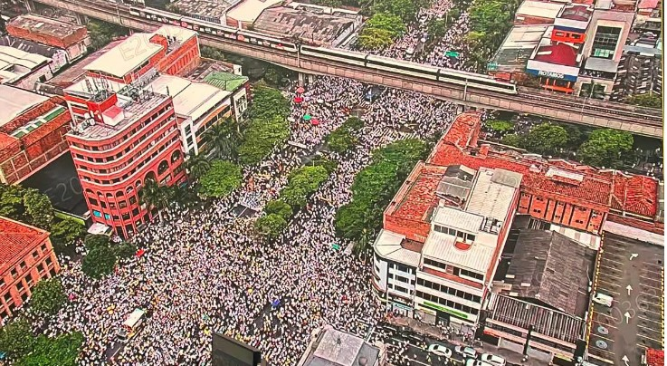
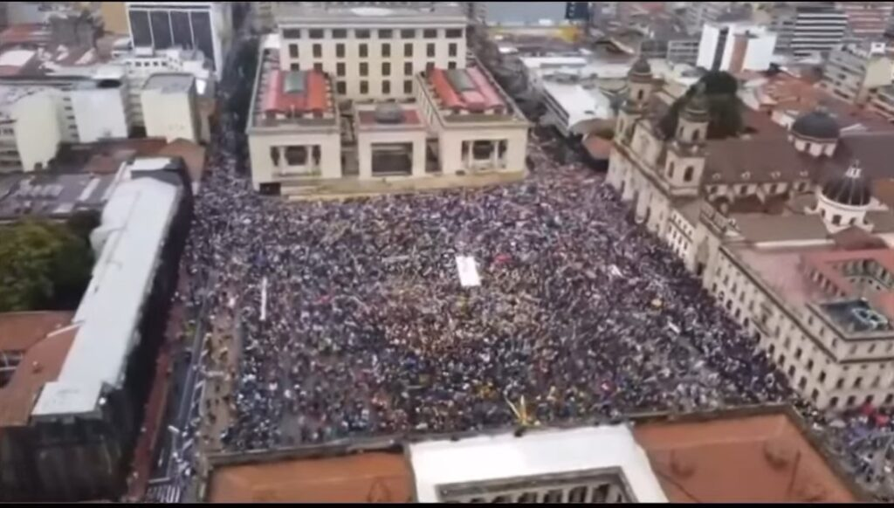

*Medellín, 21/04: La primera zarandeada social al gobierno de Petro. (Cortesía/Semana).*

¿Las marchas masivas e históricas del **21/04** obligarían a un cambio de curso del único gobierno de izquierda de los últimos 100 años? ¿Frenarían los proyectos de reformas? Sin duda, este movimiento social zarandeó fuertemente los cimientos políticos del gobierno que debe provocar consecuencias. Como muchas veces los mandatarios viven en **la burbuja del poder**, aupados por un grupo de áulicos, el mandante debe zarandearlo para que lo escuche. Por ende, pareció que la gente agarró al Presidente de los dos hombros y le dijo en su cara:

> !Hey, Petro! ¿Qué te pasa? ¿Dónde está el cambio? ¡Escucha!

En efecto, esa zarandeada expresó el inconformismo contra su modelo de _gobierno compartido_ y su metodología poco participativa de sacar adelante las reformas. No construyó el diálogo social con todos los sectores, especialmente los trabajadores de la salud. La sociedad no tuvo claridad de la esencia de sus reformas. En cambio, privilegió el acuerdo por arriba que por el de abajo. Modelo en el cual la oligarquía siguió mandando a través de sus partidos tradicionales tanto en el orden nacional como regional. Así **se aplazó el cambio prometido**. Petro no rompió con la continuidad del régimen **neobonapartista uribista**. Más bien, le insufló respiración _boca a boca_ a **Álvaro Uribe**, quien estaba a punto de ser un cadáver político insepulto. No solo le dio vida sino que lo convirtió en el jefe de la oposición, desplazando a **Rodolfo Hernández**.

Precisamente, la cuna del **neobonapartismo uribista**, Medellín, fue la ciudad capital donde más se movilizó la gente. Le siguió Bogotá, Bucaramanga y Cali. Barranquilla, feudo del petrismo, también se manifestó. La información fue suministrada por las mismas autoridades. Se estima que los movilizados **fueron más de 400 mil** en todo el país, aunque la oposición dice que mucho más o el oficialismo dice que menos de 250 mil**.** Son comentarios u opiniones respetuosas, pero falsean la realidad que es contrario al análisis basado en hechos.

¿Te interesa? [Once razones para insistir en el paro contra la reforma tributaria](/articulos/once-razones-para-insistir-en-el-paro-contra-la-reforma-tributaria/)

## ¿Izquierda o derecha?

Como la protesta social no está escriturada a ningún partido o movimiento ideológico, no se puede inscribir el movimiento **21/04** a la falsa disyuntiva de izquierda o derecha, como los oficialistas y la oposición quieren mostrarlo. O atribuirlo a una mera manipulación de los medios de comunicación. En su esencia, hizo presencia una clase media que, por ejemplo, **siente miedo** de ser despojada de sus pensiones logradas con sacrificio. O unos sindicatos de médicos temerosos de perder sus posiciones de poder. Pero, esa apreciación no es óbice para desconocer las marchas de abril. Son hechos. **¿Acaso la protesta social está escriturada a la izquierda?** Indudablemente que no.

De esa manera, las movilizaciones sociales del **21/04**, deberían **activar el botón de pánico** del gobierno, no para victimizarse frente a la derecha colombiana. No para descalificarla. ¡No! Es una alarma para que Petro gobierno y ejecute su **Plan de Desarrollo Nacional Potencia Mundial de la Vida** y su Presupuesto Plurianual. En este sentido, si Petro es consecuente con su discurso sobre lo popular, debe escuchar a la gente. Por tanto, debe olvidarse de los proyectos de reformas y dedicarse a gobernar. ¿Acaso no puede ajustar el modelo vía decreto y acción gubernativa? ¡Claro que sí! Se trata de usar el poder que el pueblo le confirió dentro de las limitaciones que la democracia plantea. Él fue elegido el 20 de junio de 2022 para gobernar a Colombia y no para salvar el mundo o vivir en una eterna oposición contra el Estado. Gobernar sí, y olvidarse del X.

Si cerca de medio millón de colombianos se movilizaron en un día de descanso, precedido de un día cívico, refleja la voluntad popular. Que, en su mayoría, no eran sindicalistas y empobrecidos, es cierto. Pero había gente de todos los colores e intereses que se movilizaron en este **21/04**, según las mismas autoridades. Fueron contundentes las marchas y manifestaciones de Medellín, Bogotá y Bucaramanga. En la cuna del petrismo (Barranquilla), la marcha se hizo sentir. Este es un hecho político y social de suma importancia que **el gobierno no puede soslayar** ni la oposición sobredimensionar.

¿Te interesa? [En Colombia ¿Golpe de estado o gobierno transicional?](/articulos/en-colombia-golpe-de-estado-o-gobierno-transicional/)

## Del 28/04/21 al 21/04/ 24

Por ende, las marchas de hoy fueron una continuidad del **movimiento de abril del 2021**, que reventaron por el detonante de la Reforma Tributaria que afectaba a la clase media. Exactamente hace 3 años, cuando el presidente **Duque Márquez** había traspasado la mitad de su gobierno, trastabilló pero no cayó. El establecimiento político le dio todo su apoyo. Apoyo que hoy no tiene Gustavo Petro. Sin tanta ciencia, esto lo debe hacer entrar en conciencia.

Por el contrario, el establecimiento dominante está inconforme con el gobierno de Petro, incluso, aquellos que han recibido grandes beneficios de este modelo de gobierno compartido. Además, durante estos 20 meses de Petro, **los ricos se han hecho más ricos**, según la famosa lista de Forbes. Y Petro se reúne a manteles con ellos, como el 23 de noviembre de 2023. Por tanto, el fenómeno de las marchas merece una reflexión sin sesgo político o ideológico que le permita al gobierno un cambio de frente. Si no lo hace, **la protesta social contra su gobierno se va a escalar como le sucedió a Iván Duque**.

## Mucha incertidumbre

La inmensa mayoría de la gente que salió a protestar no lo hizo por razones partidarias ni ideológicas. Todo indica que están atemorizados. ¡Es verdad! Y cuando las masas están atemorizadas por la incertidumbre, son sujetos de fácil manipulación. La incertidumbre crece, porque el cambio no ha llegado. Sigue la misma pobreza y la escasa inversión social. Los mismos con las mismas siguen ejerciendo el poder. Esto crea desazón y baja autoestima de los líderes sociales y políticos que participaron en el triunfo electoral de Gustavo Petro.

Mientras tanto, la pobreza sigue su curso cotidiano y las perspectivas se hacen más oscuras. El sueño del cambio se esfuma lenta, pero, inexorablemente. Por tanto, las marchas del 21/04/24 deben tener consecuencias en el gobierno. El presidente Petro debe reflexionar y hacer un cambio de frente. ¡Esta es la oportunidad!

¿Te interesa? [En Colombia, murió Lucas y 39 jóvenes, “pero no detendrán la primavera”](/articulos/en-colombia-murio-lucas-y-39-jovenes-pero-no-detendran-la-primavera/)

## Vea el análisis de Lucio

https://youtu.be/hU8dHHRRIF0

## Contexto histórico

Desde la década de los 70 el movimiento social y político construyó una visión anti Frente Nacional. Fue una lucha denodada contra el régimen bipartidista liberal-conservador que se distribuía el gobierno milimétricamente. Las calles y las plazas de la protesta social eran dominadas por la izquierda, excepto en épocas electorales que las hegemonizaba el liberalismo y el conservatismo. Este fue el sustento del período _frentenacionalista_ que entró en crisis después del gobierno de **Alfonso López Michelsen** (1974-78). La _ventanilla siniestra_ del Banco de la República permitió la legalización de dineros ilícitos que desfiguró la economía y la política colombiana.

En los años 80 salíamos a las calles y gritábamos: _el pueblo habla, el pueblo manda_ mientras las élites económicas y políticas se acomodaban a la economía del narcotráfico. En los 90, aparte de lograrse una nueva constitución, se afianzó el _capitalismo sanguijuela_ y la economía subterránea. Como las Farc se iba a tomar el poder, según nos hicieron creer, construyeron una opinión pública de extrema derecha para justificar la política de exterminio. El establecimiento construyó un enemigo común como pretexto para el exterminio político y social. En los 2000, el poder paramilitar triunfó y se consolidó una opinión de extrema derecha bajo el **_régimen neobonapartista_** de Álvaro Uribe.

¿Te interesa? [Desencantados los trabajadores colombianos](/articulos/desencantados-los-trabajadores-colombianos/)

## 21/04: Los descontentos

La derecha oportunista colombiana en el **21/04** sacó pecho. La Gran Prensa se puso a su servicio, como era de esperarse. Pero, el gran malestar del pueblo contra el gobierno compartido de Gustavo Petro se debe a que el cambio prometido con el Plan de Desarrollo _Potencia mundial de la vida_ no lo ha materializado. Lo poco que ha hecho no se siente. Aunque tiene un poder en el sistema de la información (RTVC, Cadena Nacional, unidades de comunicación en cada ministerio y dependencia nacional, y un abultado presupuesto para la propaganda) ¡no lo saben usar! Todos giran en torno al _tuiter_ del Presidente.

El domingo marchó gran parte de los descontentos que votaron por Gustavo Petro. Que la oposición y la extrema derecha se apropien de este capital político, es otra cosa. **El país no puede regresar a los tiempos de Uribe**, Santos o Iván Duque, **aunque fracase el gobierno de Petro**. La promesa de un cambio se quedó en anuncios de buenas nuevas que no han llegado. El gobierno se sometió a un desgaste innecesario con los consabidos proyectos de reformas. ¿Esto lo entiende el Presidente?

De tal suerte, que Petro no escuchó las voces que le decían que recogiera esas reformas y se dedicara a gobernar. No lo hizo, y ya está pagando las consecuencias de su propia inconsecuencia.

No obstante, la fe y la esperanza de un cambio se mantienen intactas. Se está demostrando que el cambio verdadero no lo porta ni la derecha ni la izquierda. La salvación del país no depende de ningún líder preclaro. La salvación es de cada individuo. ¡Así es la libertad! Esto significa que el poder reside en los mandantes y no en los mandatarios. Que el constituyente primario es el que manda. ¿Obedecerá Petro a ese mandato popular? En las marchas estaban colombianos que votaron por el cambio, que se esperanzaron en lo que venía, pero que muchas de esas promesas se han quedado en eso, en promesas. Por supuesto, ahora la derecha pretende sacar pecho y provecho.

¿Te interesa? [De Petro a Castillo ¿gobierno compartido o golpe blando? (I)](/articulos/de-petro-a-castillo-gobierno-compartido-o-golpe-blando-i/)

## La salida a la crisis política del **21/04**

*¿Salida a la crisis del 21/04? Construir poder ciudadano y retirar los proyectos de reformas.*

En la próxima entrega detallaremos este tema. Los sectores populares y los que votaron por un verdadero cambio deben advertirle al gobierno que la “zarandeada” es para dedicarse a implementar el plan de desarrollo y ejecutar el presupuesto. Menos anuncios y más hechos. Aquí van algunas propuestas para el presidente Petro con el fin de que no deje el trasero _fuera de toldo_, como decimos en la Costa Caribe.

Son tres propuestas que se desprende de este análisis:

## **Primero. Construir mayor poder ciudadano.**

**Que gobierne el pueblo**. No se trata de que el poder constituyente se convierta en una frase hueca, o en pura propaganda, sino que sea real. Debe haber un control social en en cada ministerio. Sus funciones son de vigilancia y control en la ejecución del plan de desarrollo y de las políticas gubernamentales. Que verifique que la inversión llegue realmente a la gente. Así habrá verdadero poder ciudadano y no sea un poder simbólico y discursivo.

## **Segundo. Retirar las reformas.**

El “capitalismo sanguijuela” no puede vivir sin desangrar al Estado. Urge una ejecución acelerada del presupuesto nacional y atención de las necesidades de la gente, en vez de dejar los recursos en las fiducias para enriquecer al sector financiero. Que se canalicen y centralicen los recursos en función de las necesidades de la gente: más acueductos, más universidades y escuelas; más hospitales; más vías para los campesinos. Urgente impulsar la soberanía alimentaria.

## **Tercero. Renegociar la deuda pública.**

Suspender de inmediato _la regla fiscal_ para direccionar los recursos a la inversión social efectiva. La regla fiscal no ha servido para lo que le dio vida: la deuda pública. De 200 billones de deuda en 2011, se disparó a $800 billones, ante de que llegara _el gobierno del cambio_.

Como se citó, hace 3 años se inició el **Paro Nacional contra Iván Duque Márquez**. En las primeras de cambio, el gobierno retiró la reforma tributaria, después que la protesta se escaló. Su respuesta fue tardía y el movimiento se prolongó. Fue una acción de masas permanente. ¿Podrá suceder lo mismo en esta ocasión? Lo más probable es que las próximas jornadas sean más contundentes y más masivas. El gobierno de Petro no se debe someter a la presión social. ¡Sería un error garrafal! Si es un gobierno democrático, debe atender a la protesta social. Por tanto, las reformas deben ser retiradas y hacer un cambio de frente de su modelo de gobierno compartido.