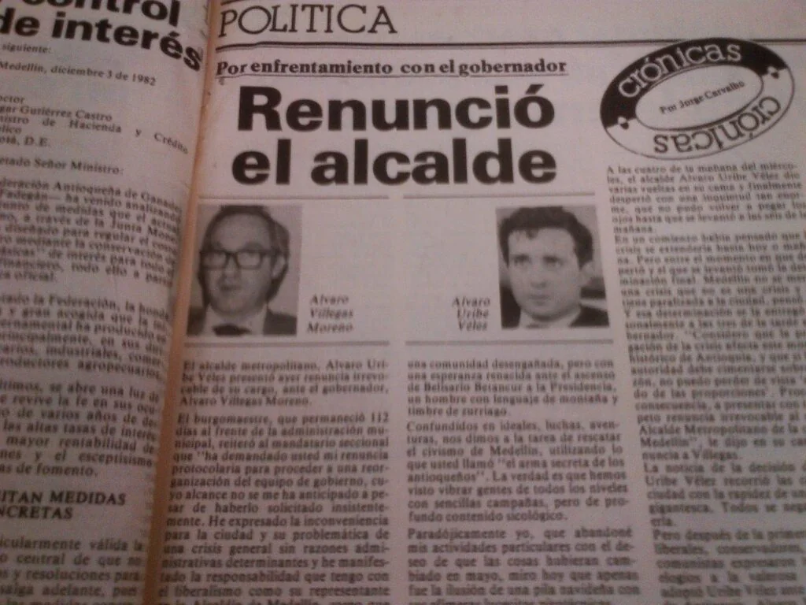
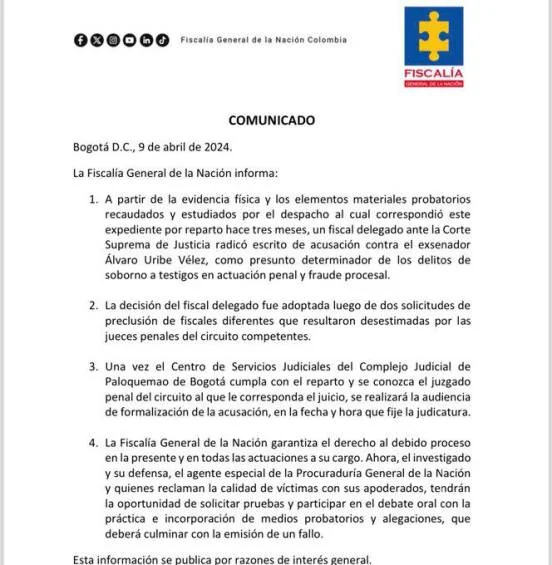

*A juicio Álvaro Uribe por coparticipación en 5 delitos.*

**A juicio Álvaro Uribe** **Vélez**, expresidente, exsenador, exgobernador y exalcalde y máximo jefe de la extrema derecha colombiana. Al parecer, más de 40 años en el crimen, delinquiendo y evadiendo la justicia desde cuando (1982) el gobernador de Antioquia, **Álvaro Villegas Moreno**, lo nombró alcalde de Medellín por su relación con el naciente **cartel del narcotráfico**. Ninguna autoridad judicial se atrevió a llegar tan lejos como hoy, **Día Nacional de la Memoria y Solidaridad con las Víctimas**, lo hizo el fiscal delegado ante la Corte Suprema de Justicia, **Iván Villarreal Pava**.

En efecto, el fiscal libró resolución de acusación contra Uribe porque obró en **coparticipación criminal** con otras personas. Se espera que en la próxima semana se designe el despacho judicial que presidirá dicho juicio penal.

## Relación con el narcotráfico

Según registros, Uribe fue acomodándose con el pasar de los años a las más altas empresas crimínales del país, incluso, cuando fue presidente por 8 años. En sus dos periodos, dichos carteles o empresas criminales, hicieron parte dentro de su gobierno, donde varios de sus ministros han sido condenados, su jefe de seguridad, congresistas y gobernadores cercanos, entre ellos su primo hermano Mario Uribe Escobar, director y directora del DAS, el piloto oficial de su campaña electoral capturado recientemente transportando kilos de cocina al servicio del cartel de Sinaloa y quien también donó 20 millones de pesos a la última campaña para senado del líder del Centro Democrático. La lista de dichos registros crimínales es interminable. Para términar este párrafo, citemos solo dos registros más. El maximo comandante de las AUC, Salvatore Mancuso, afirmó que Alvaro Uribe hizo parte de las AUC, que participó y ordenó masacres.

## Cuando Uribe fue alcalde

Remember, cuando Uribe fue alcalde de Medellín, su padre **Alberto Uribe** pertenecía al cerrado círculo de caballistas que devinieron en grandes narcotraficantes. Esa vez tan solo duró en el cargo tres meses por sus presuntos nexos con **Pablo Escobar** y del viejo **Fabio Ochoa Restrepo**, padre de los hermanos Ochoa Vásquez, líderes del otrora **Cartel de Medellín**.

Pero sucedió un episodio que le hubiese frustrado su carrera política cuando solo era un bisoño político liberal promovido por empresarios y comerciantes emergentes. **El presidente Belisario Betancur Cuartas** (1982), al darse cuenta del círculo donde procedía el recién nombrado alcalde, le preguntó al gobernador de Antioquia Álvaro **Villegas** **Moreno**:

> **“¿Cómo es posible que tengamos en la Alcaldía de Medellín a una persona de quien me han dicho tiene nexos con los nαrcotrαficαntes?“**
> 
> “Secretos de un Líder”, Germán Jiménez Morales, 2014.

Frente a esa comprometedora pregunta, el gobernador solo le quedó encubrir al frustrado alcalde y defender su "honorabilidad" para crear un relato fantástico y alejado de la realidad. Allí comenzó el mito Uribe y desde el cual se creó una realidad alternativa. Como se recordará, el alcalde Uribe renunció. Una semana después Villegas lo hizo ante el presidente Belisario Betancur, quien estaba molesto por ese nombramiento. Antes de 1986, los alcaldes eran nombrados por los gobernadores y éstos por el jefe del Estado.

## **A juicio Álvaro Uribe**

El llamado a juicio a Álvaro Uribe Vélez por su coparticipación criminal en cinco delitos donde actuó como determinador, la Fiscalía estima que el imputado conocía los hechos y fue consciente de cada uno de sus actos  
y consecuencias. De la misma manera, encaminó su objetivo delictual trazado con **dolo directo**, en beneficio propio o de terceros, y en **menoscabo de la eficaz y recta impartición de justicia y de derechos o intereses superiores de sus víctimas**.

De esa forma Álvaro Uribe Vélez, según la Fiscalía, determinó la comisión de las conductas punibles descrita en la resolución de acusación:

1.  Determinador del concurso homogéneo y sucesivo de tres (3) **delitos de soborno** en la actuación penal sobre los testigos Carlos Enrique Vélez  
    Ramírez, Juan Guillermo Monsalve Pineda, y Eurídice Cortés Velasco.
2.  Determinador del concurso homogéneo y sucesivo de dos (2) punibles de **fraude procesal** cometidos en las situaciones puntuales explicitadas en el escrito de acusación. Se trata de la investigación previa con radicado **No 38451** que adelantaba la Sala de Instrucción No. 2 de la Sala de Casación Penal de la Corte Suprema de Justicia contra el senador **Iván Cepeda Castro**. Uribe determinó a otros para lograr los documentos y testimonios falsos antes reseñados y con los que igualmente indujo en error a esa corporación judicial. En especial para que, con base en ellos, emitiera auto de apertura de instrucción contra el senador del Pacto Histórico.

## El agravante

De acuerdo con la Fiscalía, el expresidente Álvaro Uribe tiene una atenuación y es que carece de antecedentes judiciales, pese a la estela de conductas reprochables en las que se ha visto envuelto a lo largo de su vida política y de gestión pública como alcalde, gobernador, presidente y senador.

En tanto sobre el aspecto agravante, el fiscal dijo:

> Con relación a las de agravación, por un lado se aquilata que su proceder lo llevó a cabo abusando o desconociendo la posición distinguida que ocupaba en la sociedad, especialmente por los cargos que había ostentado, su posición económica, ilustración, poder y autoridad política.
> 
> Resolución de Acusación (clic aquí (documento no disponible)).

## Las posibles penas

Respecto al fraude procesal, el expresidente Uribe se verá compelido eventualmente a una pena que va entre 6 a 12 años de prisión. Tomando en cuenta el aspecto agravante, el juez de la causa lo podría condenar a la máxima pena, es decir, 12 años.

>  El que por cualquier medio fraudulento induzca en error a un servidor público para obtener sentencia, resolución o acto administrativo contrario a la ley, incurrirá en prisión de seis (6) a doce (12) años, multa de doscientos (200) a mil (1.000) salarios mínimos legales mensuales vigentes e inhabilitación para el ejercicio de derechos y funciones públicas de cinco (5) a ocho (8) años.

Respecto al delito de soborno presuntamente cometido por Uribe, recibiría una pena hasta de 12 años.

> "El que en provecho suyo o de un tercero entregue o prometa dinero u otra utilidad a persona que fue testigo de un hecho delictivo, para que se abstenga de concurrir a declarar, o para que falte a la verdad, o la calle total o parcialmente, incurrirá en prisión de seis (6) a doce (12) años y multa de cincuenta (50) a dos mil (2.000) salarios mínimos legales mensuales vigentes."

## Lea (aquí (documento no disponible)) la resolución de acusación

Hagamos memoria. El 23 de mayo de 2023, el Juzgado Cuarenta y Uno Penal del Circuito de Bogotá, negó la solicitud de preclusión de la acción penal adelantada contra el exsenador ÁLVARO URIBE VÉLEZ, por las causales, los motivos y en los términos expuestos en cada uno de los eventos del auto emitido y que retomó el fiscal delegado.

Un año después de ese auto, Álvaro Uribe Vélez se sentará en el banquillo de los acusados, seis años después de cometer los posibles delitos.