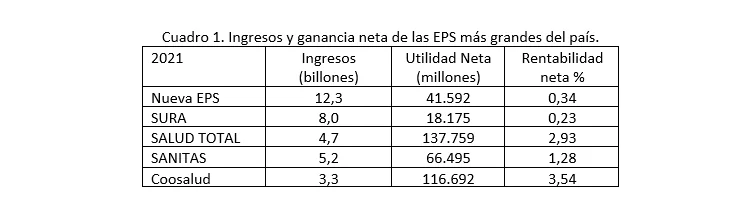

*Una de las escenas de la Comisión VII antes de decidir la negativa de la Reforma a la Salud. En el fondo, el cuadro de Jorge Eliécer Gaitán. Cortesía.*

¿«Acto heroico»? La clase política puso a los colombianos frente a una falsa disyuntiva: **salvar las Eps o hundir la reforma a la salud**. El pulso político al interior de la Comisión VII del senado, como ya se sabe, se definió a favor de hundir la tan accidentada reforma que se llevó a 5 ministros. Al mismo tiempo, el gobierno se acordó que tenía Ministerio de Salud y, además, Superintendencia de Salud, las cuales soltó como perros tras la presa putrefacta del sistema.

El calificativo de «acto heroico» que **Lidio García Turbay** ―el senador liberal más votado de esa colectividad que en las primeras de cambio se declaró pro gobierno― le dio al hundimiento a la reforma, resume la percepción del hecho político más importante de lo que va del 2024. Pero esta apreciación es débil y carece de sustento objetivo, tal como se analizará.

## ¿Dónde está lo heroico?

¿«Acto heroico», cuando varios partidos, entre ellos el **Centro Democrático** y el partido Conservador, aceptaron que recibieron financiación de **Keralty**, la dueña de la Eps de Sanitas? Esta financiación elimina el calificativo de heroísmo desafiante para ser defensores de un sistema, cuyo fin es la rentabilidad y no la satisfacción de un derecho humano fundamental.

Por otra parte, la victoria de los partidos Liberal, U, Conservador, que al comienzo de este mandato se plegaron al gobierno del presidente Petro como socios oportunistas, finalmente mostraron su verdadera catadura y se unieron a la extrema derecha representada por el Centro Democrático.

De la misma manera, los progresistas anidados en el gobierno, carecieron de una estrategia sólida y versátil. Aunque el Pacto Histórico tenía la presidenta de la Comisión VII con **Martha Peralta** **Epiayú**, ésta veía con impotencia la incapacidad de su colectividad para atraer a otros senadores que se sumaran a la causa de su Reforma a la Salud. Además, actuaron cansados, sin brújula y sin sentido de pertenencia. No tenían más argumentos que radicalizar su discurso.

El Ministro del Interior, el payanés **Luis Fernando Velasco Chaves**, hizo todo lo posible por buscar la conciliación. Marcó diferencia con el ministro de la Salud, el tolimense **Guillermo Alfonso Jaramillo**, quien lució un poco cansado. Su discurso radical de la corrupción y la descalificación a sus oponentes como vendidos al sistema de salud, realmente no caló y rechinó en esa célula legislativa.

https://twitter.com/MinInterior/status/1775661731555012962

Persistirán . . . ¿legalmente?

## Dos concepciones y el capitalismo sanguijuela

Sin embargo, lejos de ser un «acto heroico», demostró que la Comisión VII siguió los preceptos de los que dictaminaron la ley 100/93. Y estos que la diseñaron, no lo hicieron para favorecer a la inmensa mayoría de la población que se encontraba sin cobertura. Los _lobbistas de las multinacionales_ de la salud solo querían que _Papá Estado_ le entregara en bandeja de plata el jugoso negocio de la salud.

Recordemos, a lo largo de estos 100 últimos años, en Europa, África y América Latina, prima dos enfoques de la salud, con algunas excepciones, por ejemplo, Cuba o Venezuela. Esta última es una deplorable copia del modelo cubano. Son dos enfoques unidos por un **emprendimiento parásito** del _capitalismo sanguijuela_. El enfoque keynesiano, _estado benefactor_ o _progresista_ y el enfoque neoclásico o neoconservador. En el primero, el Estado se convierta en _una teta_ en la cual los más pobres pueden chupar gratis directamente de la vaca. En el segundo, el Estado le da la vaca a un capitalista o inversionista nacional o internacional para que le dé la leche al más pobre. Y por esta intermediación ellos cobran. Además, se valen de otras artimañas para multiplicar su rentabilidad.

Al surgir el _estado benefactor_ para hacerle frente a la Gran Depresión de los años 30, se diseñaron las principales políticas de salud pública para extender el beneficio a toda la población a través del subsidio.

Dentro del concepto de _New Deal_ del presidente de los Estados Unidos de América, **Franklin Roosevelt**, este país transformó, sus políticas públicas de salud para atender a esas masas desprotegidas que se morían en las calles de las principales ciudades en las épocas de invierno. Rápidamente Europa adoptó este modelo después de la Segunda Guerra Mundial. Francia, con el general **Charles De Gaulle** (1945), introdujo un modelo que fue replicado al año siguiente por el colombiano.

¿Te interesa? [«Sí a la reforma, pero no de esa forma». La derrota de la clase política (I)](/articulos/si-a-la-reforma-pero-no-de-esa-forma-la-derrota-de-la-clase-politica-i/)

## López, el reformador

A principio del siglo XX, la salud seguía siendo un acto de caridad del Estado y los que tenían el medio económico disfrutaban del servicio. El capitalismo _manchesteriano_ solo explotaba la fuerza de trabajo de sus obreros y empleados sin ninguna seguridad social.

En este sentido, se entendió la gran reforma a la salud y a la seguridad social introducida por la _Revolución en Marcha_ del presidente **Alfonso López Pumarejo** con la **ley 90 de 1946** que perduró hasta la **Ley 100/93**. Pero una cosa son los políticos de Francia y otra los políticos de Colombia. De Gaulle no tiene comparación con López.

Por esa razón, el modelo adoptado por Colombia devino en crisis por su poca cobertura en la prestación del servicio a los más necesitados y por su alta putrefacción política. Esta población era atendida directamente por el sistema hospitalario del Estado. El médico del pueblo se hacía rico a los 5 años del ejercicio de su profesión cuando cubría un servicio que el Estado era deficiente, especialmente en el campo. En tanto los políticos colombianos (conservadores o liberales) actuaron como **sanguijuela sobre el sistema hospitalario estatal** que ofrecía directamente al beneficiario. Así quebraron poco a poco el sistema hospitalario.

¿Te interesa? [Reforma a la salud: ¿a la francesa o cubana? (II)](/articulos/reforma-a-la-salud-a-la-francesa-o-cubana-ii/)

## ¿«Acto heroico»?

Con el fin de tener una idea clara y objetiva de la rentabilidad del negocio de la salud, basta comparar los ingresos netos de las Eps con las empresas comunes de Colombia. Por ejemplo, veamos los ingresos de las principales EPS en el ejercicio financiero de 2021:

Como se puede apreciar en ese cuadro elaborado por el Ministerio de la Salud con el apoyo de expertos del Banco Mundial y de la Organización Panamericana de la Salud, encontró que esas Eps eran las más sólidas, porque presentan una situación de “bajo riesgo financiero y de sobrevivencia”. Pero, hoy, Sanitas y la Nueva EPS acaban de ser intervenida y Sura está a punto de serlo.

Ahora bien. En el 2023, las EPS recibieron del Estado la astronómica suma de **$58 billones** por concepto de Unidad de Capitación. Es decir, **$1.289.246,4** por afiliado del régimen contributivo, en tanto **$1.121.396,40** del régimen subsidiado. Esto cubre supuestamente el 96% de la población. El 49% pertenecientes al régimen contributivo y 47% al subsidiado. Los regímenes de excepción cubren el 4%, si nos atenemos al estudio citado del Ministerio de Salud.

De hecho, si, en 2021, sus rentabilidades se contrasta con la de las 1.000 empresas más grandes por ingresos que anualmente publica la Supersociedades, cuyo promedio fue del **14,3%**, podríamos concluir que no sería atractiva para un inversionista que solo busca la alta rentabilidad.

## ¿«Acto heroico» defender la integración vertical del negocio?

*Jaime González Montaño, 25 años detrás de Coosalud. De mondado a empresario exitoso de la salud. Presuntamente patrocina concejales, diputados, senadores y mandatarios.*

Si Sanitas solo produjera 1,28% para el español **Joseba Grajales**, dueño de la multinacional Keralty, desde hace rato se hubiese ido de Colombia. Puesto que sus ganancias netas están muy por debajo de la rentabilidad promedio de las empresas colombianas, que fue del **14,3%**.

¿Dónde está el negocio, socio? Es la pregunta que el común de los mortales se haría. **La clave está en la integración vertical**. No solo la red hospitalaria pertenecen al mismo grupo económico dueño de las Eps sino que muchas de esas IPS sus verdaderos dueños son sus ejecutivos, consejeros o los inversionistas a través de terceras personas.

Las pequeñas Eps usaron la misma estrategia, pero a través, presuntamente, de una red de testaferros. Esa es la razón por la cual algunas EPS pequeñas lograron sobrevivir frente a las grandes como Sura, Sanitas o Salud Total. En una próxima entrega citaremos, entre ellos, el caso de **Coosalud o Mutual Ser**, que son de la región Caribe y que sus consejeros y directivos están boyantes financieramente. Basta hacer una **auditoría forense** para darse cuenta de esta situación.

Las EPS, cómo se puede ver, no generan valor agregado. Pero en el 2021, un año después de la pandemia, recibieron **$20,2 billones** al capital presente en el sector de la salud. ¿Por qué fue posible? Por la integración vertical. En otra entrega explicaremos este fenómeno.

## ¿«Acto heroico»?

Finalmente, si queremos una respuesta que se acerque a la realidad, debemos decir sin tapujos que **no es ninguna victoria significativa**. Mucho menos un «acto heroico», como lo reclama el senador carmero **Lidio García Turbay**. No hay una pizca de heroísmo.

Por ejemplo, un acto heroico sería sacar una reforma alternativa a la del gobierno. Una reforma que corrija los problemas estructurales del sistema con el fin de hacerla, en la práctica, un derecho fundamental y no un negocio de empresarios del _capitalismo sanguijuela_ que no son capaces de acumular capital original a partir de sus actividades emprendedoras sino chupando los recursos del Estado.

Si bien la **Ley Nº 1751** introdujo el derecho fundamental a la salud, en la práctica, hace falta mucho. No tanto por falta de ley sino porque se crean trampas para evadir el espíritu de esas leyes. En última instancia, es un problema del Ser y no del tener.