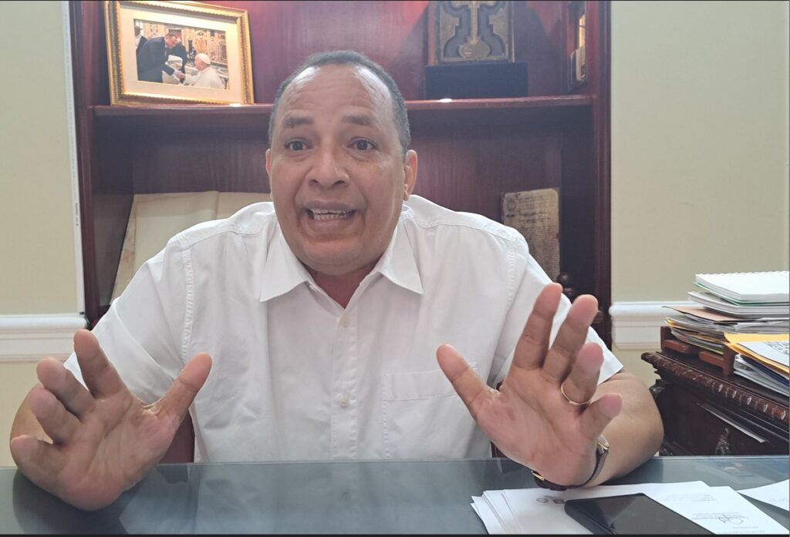
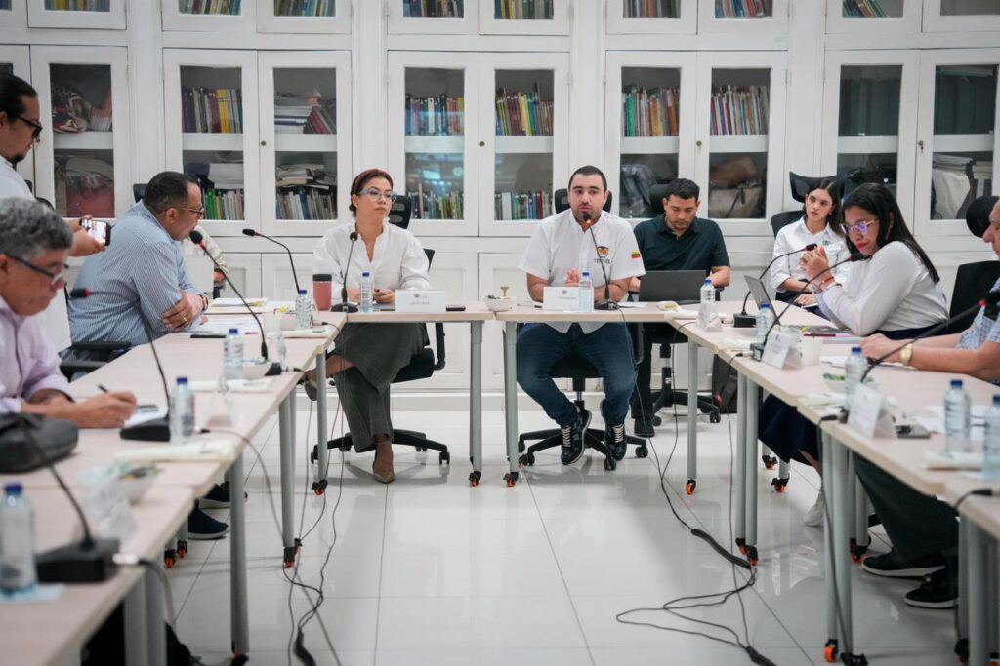
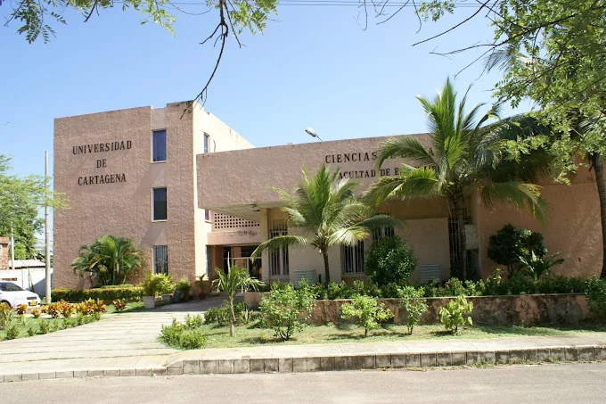

*¿"El Vómito prieto" de la UdeC? Dos cuentos y la historia verdadera. En la entrevista que el rector William Malkún concedió a VoxPopuliDigital*

«El Vómito prieto» (devolver los $200 mil millones) tiene dos cuentos y una historia verdadera, al decir del rector de la Universidad de Cartagena, **William Malkún Castillejo**. Uno contado por Ecopetrol sacado de las artimañas jurídicas. El otro es la **acción de cumplimiento** que favoreció en 2007 a la Universidad de Cartagena en primera y segunda instancia. La historia verdadera dice que realmente el deudor es Ecopetrol y no la universidad **101° de América Latina** y 1.201° del mundo, con más de 100 doctores, según el **[World University Rankings 2024](/articulos/world-university-rankings/universidad-de-cartagena)**.

Por su parte, el gobernador de Bolívar, **Yamilito Arana Padauí**, ratificó en el último Consejo Superior de la UdeC que apoyará a la bancada de Bolívar en el proyecto de ley para exonerar a la institución de esa obligación. Pero es una obligación adquirida a través de una estratagema jurídica por parte de los abogados de Ecopetrol como se demuestra en el presente trabajo.

¿Te interesa? [La impagable deuda de la UdeC a Ecopetrol: Petro y Yamilito piden condonarla](/articulos/la-impagable-deuda-de-la-udec-a-ecopetrol-petro-y-yamilito-piden-que-la-condonen/)

## Unidos por la UdeC

*Aspectos del primer Consejo Superior de 2024 presidido por el gobernador Yamil Arana Padauí para respaldar a la Universidad en este momento crucial.*

La idea es que esos **$200 mil millones** se queden en la institución. Por esta razón el gobernador respalda íntegramente al rector para lograr ese objetivo. No es hora de pugnas internas sino unificar a la comunidad universitaria para que la institución salga adelante. Ese fue el mensaje central del gobernador Arana cuando presidió el primer Consejo Superior de este año.

> “Este proceso que está viviendo la Universidad de Cartagena ante un fallo del Consejo de Estado ha unido a todo el departamento para defender los intereses de esta institución. Le hemos pedido al gobierno nacional que interceda ante Ecopetrol para que condone la deuda”

No obstante, al mismo tiempo que hacen gestiones frente al gobierno nacional y el mismo Ecopetrol, la idea es apoyar a la bancada bolivarense en el congreso para aprobar un proyecto de ley que exonere esa deuda.

> “Tenemos que (...) rodear a los amigos del congreso que han emprendido una lucha social que es la lucha de todos los bolivarenses y estudiantes de toda nuestra región”
> 
> Yamil Arana, gobernador, al salir del Consejo Superior.

## El origen del «vómito prieto»

En la primera entrega se aclaró los orígenes de este diferendo jurídico que ya había sido ganado en primera y segunda instancia por la UdeC en 2010. Es decir, había pasado a lo que la ciencia de la jurisprudencia llama _cosa juzgada._

Pero el tema que quedó en suspenso fue el **_quantum_**. Ante esa situación, el Tribunal Administrativo de Bolívar ordenó al **Juzgado 13 Civil del Circuito de Cartagena** que, a su vez, ordenara a la Contraloría General de la República (CGR) realizar la liquidación respectiva de la deuda que Ecopetrol le debía pagar a la Universidad. Se hicieron dos pagos equivalentes a **$49 mil millones**. Pero la liquidación de la CGR era superior a $150 mil millones.

Ahora bien, en 2012, la poderosa petrolera estatal, mediante una estratagema jurídica burló el principio de **cosa juzgada** que fue el primer cuento de esta verdadera historia. Lo primero que hicieron los abogados fue presentar el consabido derecho de petición a la universidad para que le devolviera el dinero bajo el supuesto _pago indebido_. Por supuesto, la UdeC le respondió que no mediante una resolución. Oh, error! Los abogados demandaron la resolución e iniciaron un segundo pleito que terminó con el fallo adverso del Consejo de Estado para inducir al «vómito prieto».

Allí comenzó el segundo cuento de la historia del _vómito prieto_ de la universidad mejor posicionado del Caribe colombiano y una de las 10 mejores universidades públicas de Colombia. Todos estos buenos indicadores se lograron, principalmente con la gestión de los dineros de la _estampilla universitaria_. Para una sola muestra, la universidad pasó de tener 5 doctores que eran venerados y consentidos por la misma universidad, a tener hoy más de 100 doctores.

## El primer cuento.

El rector de la mejor universidad pública del Caribe, **William Malkún Castillejo**, en entrevista concedida a **VoxPopuli Digital**, al mejor estilo del historiador, lanzó esta idea de los dos cuentos y una historia que nos pareció genial para narrar la verdadera historia del _vómito prieto_.

Todo empezó en una acción de cumplimiento de la **ley 1495 de 2011** (estampilla universitaria) interpuesta por el rector de la época, **Germán Arturo Sierra Anaya**, contra Ecopetrol por la exportación de petróleo por el puerto de La Heroica. La deuda de esa empresa ascendía a más de **$150 mil millones** de la época, según la CGR.

Ante esa decisión judicial favorable a la universidad en las dos instancias, se presentaron dos tutelas que fueron falladas ratificando la decisión del Tribunal Administrativo de Bolívar de que Ecopetrol cumpliera y pagara la deuda contraída.

## Cómo se invirtió el «vómito prieto»

*Este es uno de los edificios del campus Zaragocilla donde se invirtió el dinero que Ecopetrol dice que le devuelva.*

Hasta allí todo estaba bien para la Universidad de Cartagena. Los dineros se incorporaron al presupuesto de la estampilla, según lo dictaminó la ley 1405 de 2011, y se invirtieron así:

>  "35% para la construcción de varias edificaciones de la sede de Piedra de Bolívar, la sede de Zaragocilla, San Pablo, Magangué y El Carmen de Bolívar. adecuación, remodelación, mantenimiento de la planta física, escenarios deportivos, bibliotecas, tecnología, bienestar universitario, educación virtual y demás bienes..."

En efecto, en estos 15 años la universidad viene dando un salto cuantitativo y cualitativo que no solamente se le reconoce en el ranking de América Latina sino mundial. Pero esto no es todo. La institución se viene expandiendo por la geografía del departamento de Bolívar. En Magangué existen dos sedes muy importantes para el avance de esa subregión. Lo mismo que en los Montes de María. Hoy, la universidad llega a los 26 mil estudiantes. Antes de las estampillas, llegaba a 7 mil.

En términos específicos, los dineros que pagó Ecopetrol están allí, en la construcción del edificio CeTIC del campus de Zaragocilla, o la sede de San Pablo y de Piedra de Bolívar. Y en cada uno de los estudiantes que recibieron apoyo de Bienestar Universitario. ¿Será que a cada uno de los 26 mil estudiantes Ecopetrol lo inducirá al «vómito prieto» para recibir esos $200 mil millones?