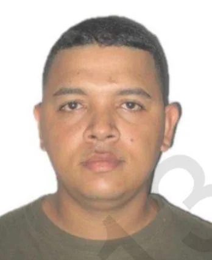
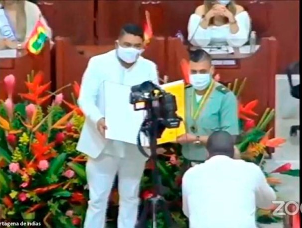
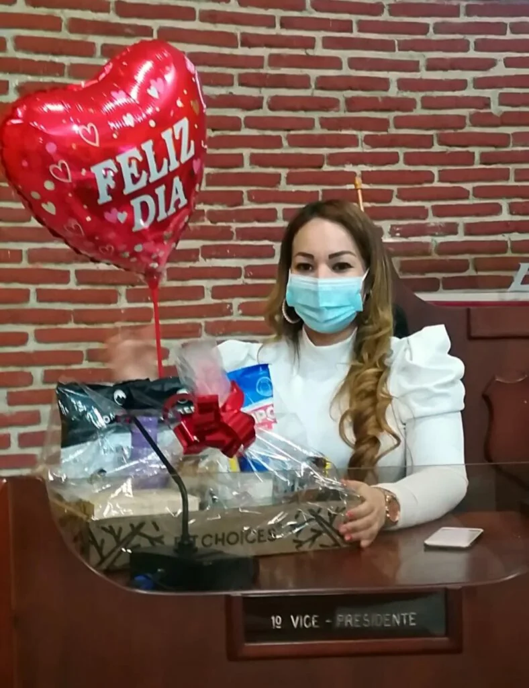

*¿Corrupción judicial? Mírenlos allí. Quien toma la selfie es el contralor distrital de 2021, Fredy Quintero. En el fondo la pareja de aliados muy sonrientes, Pedro Aponte y Luis Cassiani. ¡A manteles tendidos!*

Se cierra el cerco judicial al concejal Aponte. Con el llamamiento a juicio al capitán **Iván Darío Cadena Tanganá**, condecorado con la **Gran Cruz** **de la Independencia de Cartagena**, al parecer, expareja del exconcejal **Luis Cassiani Valiente**, se cierra poco a poco el cerco judicial al concejal _sub judice_ **Pedro Aponte García** (Cambio Radical). Sería _el hombre de atrás_ que determinó el complot del **kilo de droga** contra **Gloria Estrada Benavides**, en la época de los hechos, presidenta del concejo distrital de Cartagena, y su pareja permanente, el empresario **Martín Barreto de la Hoz**.

Este hecho sucedió el **14 de enero de 2022**, cuyas hipótesis **VoxPopuli Digital** construyó objetivamente en su momento, muy a pesar de que todos los medios de prensa, incluso, el alcalde Dau, anticipadamente procesaron y condenaron a la concejal liberal. Ahora se está comprobando una a una esas hipótesis. Esto resultó de una investigación y un razonamiento deductivo sin sesgos. La historia sucedió como la puesta en escena de un guión de una película de suspenso, cuyo desenlace sólo sabía su determinador, al parecer, Aponte García apodado en su localidad «el Patrón». ¡La sorpresa! No solo Cadena Tanganá sabía del suceso futuro sino también varios ediles, concejales, incluso, hasta el mismo alcalde de ese año.

[Caso Gloria Estrada: Sospechosa conducta de una juez y un edil (I)](/articulos/caso-gloria-estrada-sospechosa-conducta-de-una-juez-y-un-edil-i/)

¿Te interesa? [Mira la teoría del “hombre de atrás” en el complot contra Gloria Estrada](/articulos/mira-la-teoria-del-hombre-de-atras-en-el-complot-contra-gloria-estrada/)

## En las pasarelas de Ternera ¿Tanganá y concejal Aponte?

No obstante, no solo se irían tras las rejas el actual concejal de Cambio Radical Pedro Aponte García, sino también el exalcalde local **Andy Reales Arroyo**. Además, detrás de ellos desfilaría en las pasarelas de **San Fernando de Ternera** el exalcalde **William Dau Chamat** siempre y cuando se le compruebe que sabía del hecho y no presentó la denuncia respectiva. Aunque algunas fuentes manifiestan que también Dau sabía del complot, pero se calló. Lo mismo que varios concejales y ediles cómplices o encubridores. Todos sabían lo que le sucedería a **Gloria Estrada Benavides,** la _mandamás_ del concejo de Cartagena de aquellos tiempos. Aparte de presidenta, era dueña de la coalición. Ella, juntos a sus aliados, manejaba políticamente la Contraloría Distrital y tenía su incidencia en la Personería Distrital.

De manera que los indicios apuntan al alcalde, al alcalde menor, a varios concejales y ediles. Ellos como al propio Cadena Tanganá cometieron el mismo patrón del crimen. La diferencia, el oficial de policía le asesoró a Pedro Aponte la forma cómo debía hacerlo. Causa curiosidad que la fiscal de estos procesos, **Dora Patricia Cáceres Puentes** y los que han actuado en representación del ministerio público tienen una conducta muy complaciente con el hoy exalcalde **William Dau** **Chamat** y algunos políticos de su cuerda.

## La justicia selectiva de Dora Cáceres,

*Dora Patricia Cáceres Puentes es doctora en derechos de la Universidad Externado. /Captura de pantalla.*

La argumentación de la fiscal Cáceres Puentes para llamar a juicio a Cadena Tanganá fue timorata. Débil. Vulnerable. Carente de contundencia argumentativa para involucrar la complicidad de algunos políticos. El hilo conductor de su débil argumentación, lo tejió con delicadeza cuidándose de no involucrar a otros actores políticos del complot. ¿Trató de encubrir a alguien? **Esta conducta es atípica en una veterana fiscal con doctorado en derechos.** Este hallazgo en el análisis periodístico, nos propone varios interrogantes que deben responder la directora saliente y la entrante. Pero también la misma fiscal.

¿Qué intereses políticos tiene la fiscal **Dora Patricia Cáceres Puentes**, cuya productividad fue deficitaria en este período de la administración de **Iveth Hernández Sampayo**? ¿Qué pasará con estos fiscales de Bolívar que fueron improductivos durante la nefasta gestión de Hernández Sampayo, herencia del exprocurador conservador **Alejandro Ordoñez**? ¿Por qué no lo hizo con Dau y los concejales y ediles que presuntamente lo sabían? Ni siquiera los llamó a declarar dentro del caso Cadena Tanganá. ¿Por qué en la ruptura del proceso de Alexander Mercado, autor material del crimen junto a sus dos delincuentes patrulleros, NO se abrió una línea investigativa contra estos personajes? ¿Por qué la fiscalía no pidió detención intramural contra Salas Mercado, el principal cabecilla del crimen material?

*Alexander Salas Mercado, el patrullero que presuntamente recibió una buena porción de los $40 millones que dijo el concejal Aponte en la conversación con Cadena Tanganá tenía para invertir en el complot.*

## ¿Quién protege a Salas?

Sin duda, dado a la omisión de la fiscal **Dora Patricia Cáceres Puentes**, imperiosamente debe ser investigada por este caso y por otros. Por ejemplo, los procesos de corrupción contra **William Dau Chamat**. ¿Dónde están las denuncias que se hizo por la contratación del Covid/19? ¿Las engavetó? ¿Las congeló? Es fácil adentrarse en la investigación del comportamiento de sujetos sin poder político o económico. Pero se necesita valentía ética cuando se enfrenta el poder real de la política y de la economía. Los tres expatrulleros que presuntamente cometieron el crimen material siguen libres: **Alexander Mercado**, **Esleider López y Yosman Orozco Benavides**. ¿Libres para seguir delinquiendo? Esta es nuestra justicia, señora directora de fiscalía de Bolívar **Elizabeth Gómez Mejía**. Se espera más de usted.

Es así que el **Juzgado** **Octavo Penal Municipal de Cartagena** el 12 de enero de 2023 pudo adoptar un prevaricato cuando decidió no imponer la medida de aseguramiento en prisión contra **Alexander Salas Mercado**. Se indicó que alguien de arriba lo está protegiendo. ¿Cuánto costaría esa libertad? Es la pregunta lógica que se plantean los usuarios de la Fiscalía.

¿Te interesa? [La historia de un prevaricato. Caso Gloria Estrada? (I)](/articulos/la-historia-de-un-prevaricato-caso-gloria-estrada-i/)

## El motivo del complot

*El concejal Luis Cassiani entrega la Gran Cruz de la Independencia al teniente (2021) Iván Darío Cadena Tanganá./Captura de pantalla.*

Sin embargo, el llamamiento a juicio contra Tanganá se sustenta a partir de la rivalidad política al interior del concejo, cuyo detonante llevó al edil de la época, **Pedro Aponte García** a cranear y ejecutar el consabido complot. Aunque la resolución de la fiscal Dora Cáceres no lo cita, sin duda, debe decirse que dicha rivalidad se originó en el seno del concejo, por un lado. Y por el otro, en el control de la localidad 2 con el alcalde local **Andy Reales Arroyo**. En el primer escenario, la cabeza visible de la coalición minoritaria era **Luis Javier Cassiani Valiente**. Tanto el alcalde Dau Chamat como la coalición minoritaria liderada por Cassiani se beneficiaron con la caída estrepitosa de Gloria Estrada. ¿Lo analizó Dora Cáceres? No. Omitió este hecho. ¿Deliberadamente? No se sabe.

En las elecciones de 2019, Pedro Aponte apoyó a Cassiani en la lista de Cambio Radical. Ellos podrían tener razones para ser cómplices del delito, ya que se disputaba el poder político que deviene en poder económico. La razón de esa rivalidad en el concejo se debió, precisamente, porque **Gloria Estrada** fue elegida presidenta del concejo el **11 de octubre de 2021**.

La concejal liberal hizo coalición con algunos conservadores como **Alfonso Marín Villalba**, contra quien Dora Cáceres le puso velocidad a su proceso para darle casa por cárcel. El Juez Quinto Penal del Circuito con funciones de Conocimiento, tumbó la medida de aseguramiento no privativa de la libertad que cumplía el socio de Gloria **por una denuncia que presentó el alcalde William Dau Chamat.** ¿Te la pillaste? ¿Justicia selectiva? Mientras por un lado se cocinaba el complot contra Gloria Estrada, por el otro se agilizaban los procesos penales contra sus aliados. ¿Se pusieron de acuerdo? ¿Cómo se explica estas paradojas de la justicia? ¿Puede quedar esto impune?

¿Te interesa? [La autoría intelectual de la treta criminal contra Gloria Estrada, rival del alcalde Dau (III)](/articulos/la-autoria-intelectual-de-una-treta-criminal-contra-gloria-estrada-rival-del-alcalde-dau-iii/)

## El poder de Gloria y Dora

*Gloria Estrada, cuando solo era la vicepresidenta del concejo de Cartagena y no se había presentado la rivalidad con el concejal Aponte.*

Con la presidencia y la coalición mayoritaria, sin saber lo que le deparaba el futuro, el 18 de noviembre de ese mismo año, **Gloria Estrada** tumbó al contralor distrital encargado **Fredy Quintero** (cuota de Cassiani Valiente) e hizo elegir a **Rafael Castillo Fortich**.

Cuando Castillo Fortich se posesionó en el cargo, lo primero que hizo fue revisar varias investigaciones por **detrimento patrimonial** que estaban en curso contra el alcalde local, **Andy Reales Arroyo**. A raíz de esta situación, el contralor expidió la resolución **No 390 del 30** de noviembre de 2021 mediante la cual tumbó del caballo a Reales. Este se cayó pero se levantó con la ayuda de Pedro Aponte, quien al parecer, se gastó **$500 millones** con la ayuda de su senador de Cambio Radical, según una fuente cercana al concejal.

De hecho, el 31 de diciembre de ese año, el alcalde **William Dau Chamat** expidió el decreto de suspensión. Lo hizo por exigencia de la contraloría. Por la noche, el alcalde _zambiloco_ hizo una transmisión refiriéndose al caso. Al parecer, los dos unieron fuerza para acabar con la novata concejal liberal que irrumpía como si fuera _uranio enriquecido_ que hizo explotar en átomos la coalición dominante de veteranos concejales.

Igualmente, esos personajes, que no han sido vinculados, estarían incurso en el mismo delito a título de dolo, presuntamente, cometido por el capitán **Cadena Tanganá**. Ellos sabían que un presunto y potencial delincuente, revestido de edil, iba a cometer un delito. Pero no cumplieron con el deber constitucional y legal de poner en conocimiento ante las autoridades competentes dicha situación ilegal. Con esta conducta dolosa, (lo hicieron a propósito) se comprometerían en la comisión del mentado crimen.

¿Te interesa? [¿La policía sembró el kilo de cocaína? Caso Gloria Estrada](/articulos/audiencia-publica-o-privada-la-policia-sembro-el-kilo-de-cocaina/)

## Por encubrir al concejal Aponte

Esos servidores públicos que estuvieron detrás del perverso complot para derrotar moral y políticamente a Gloria Estrada y su marido Barreto de la Hoz, estarían en la **picota pública** de la misma manera como está el capitán Cadena Tanganá. Existen pruebas irrefutables para inferir razonablemente que no solo el capitán Cadena Tanganá se iría a la cárcel. La lista está creciendo, amén de los tres patrulleros que recibieron **$15 millones** de _las **40 tablas**_ (así le dijo textualmente Aponte a Cadena Tanganá) que Aponte ofrecería al mayor **Gustavo Adolfo Bueno Aguilar** para _hacer la vuelta_. Ellos sabían con anticipación el drama y la tragedia que el futuro le depararía a Estrada y a su compañero Barreto.

Tanto es así, que algunos de ellos solo esperaban el día señalado. Se sabía que del mes de enero de 2021 no pasaba. Gloria tenía que caer. Así se podía recomponer la coalición y Andy Reales podría regresar a su cargo, como en efecto regresó con la ayuda, presuntamente de un **senador de Cambio Radical**, de cuya situación debe conocer la **Corte Suprema de Justicia** y la fiscal debería compulsar copia.

En la **próxima entrega** analizaremos el caso del exconcejal Luis Javier Cassiani Valiente y de otros concejales en el complot y el juicio contra Cadena Tanganá.

[Escrito\_de\_Acusacion\_](/wp-content/uploads/2024/04/Escrito_de_Acusacion_CADENA1.pdf)[Descargar](/wp-content/uploads/2024/04/Escrito_de_Acusacion_CADENA1.pdf)

vcvc