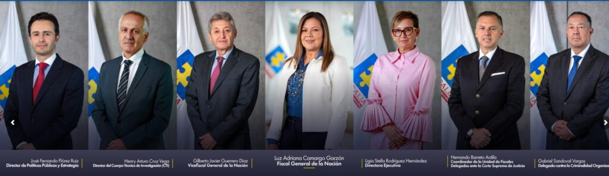
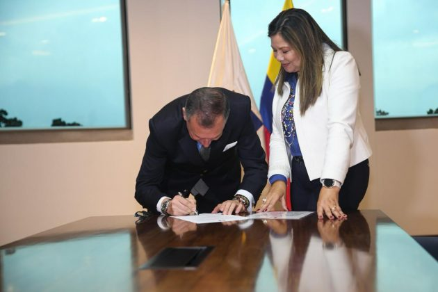

*Este es el equipo de la fiscal Luz Adriana Camargo. ¿Revolcón en la Fiscalía?*

Hoy quedó evidenciado que la fiscal, **Luz Adriana Camargo**, quiere hacer un revolcón en la Fiscalía para combatir la **corrupción de alta gama** anidada desde los tiempos de **Luis Camilo Osorio Isaza**. Con su nuevo equipo iniciará un remezón de **fiscales delegados ante la Corte Suprema de Justicia** (CSJ). La corrupción en la Fiscalía es más evidente en esa instancia, porque también investiga a los mismos fiscales.

Dentro de estos cambios estaría el fiscal delegado que llamó a juicio al expresidente **Álvaro Uribe Vélez**. Sin embargo, esto sería especulación, ya que la decisión la tomará dentro de su ámbito legal la propia fiscal respecto a la continuidad de **Iván Villarreal Pava** en el juicio contra el exalcalde, exgobernador, exsenador y expresidente.

## La esperanza: ¿Revolcón en la Fiscalía?

*La esperanza: ¿Revolcón en la Fiscalía?/Fiscalía. Hernando Barreto Ardila, director de Fiscales Delegados ante la Corte Suprema de Justicia tomando posesión ante Luz Adriana Camargo.*

Como se analizó en el artículo de hoy de **VoxPopuli Digital**, se espera de la fiscal una transformación del ente investigador capturado por las diferentes mafias del país:

> «¿Luz Adriana Camargo Garzón podrá acabar con el blindaje de Los Intocables? El tiempo pasa y será testigo de la actuación de la nueva fiscal sobre la que recae la esperanza de las víctimas de estos genocidas».

En efecto, hoy el coordinador de la **Unidad de Fiscales Delegados** ante el máximo tribunal de justicia ordinaria, **Hernando Barreto Ardila**, siguiendo orientación de la fiscal **Luz Adriana Camargo**, ofició a cada uno de ellos para que presenten renuncia protocolaria en forma inmediata.

¿Te interesa? [Los Intocables siguen delinquiendo](/articulos/los-intocables-siguen-delinquiendo-y-la-fiscalia-lo-sabe/)

## La renuncia protocolaria

Según la periodista **Sylvia Charris**, de Cambio, en la tarde de hoy se conoció la solicitud de renuncia. Si bien son renuncias protocolarias, es muy probable que la nueva fiscal busca ajustar su equipo a las pretensiones que se propone con el ente investigador. El anterior fiscal **Francisco Barbosa**, un año antes de su retiro forzoso, había hecho lo propio, por lo cual ajustó su equipo de fiscales delegados.

Es importante saber si el fiscal delegado para el caso del expresidente Uribe seguirá. El pasado 9 de abril, emitió resolución de acusación. Así salvó el proceso de un posible **vencimiento de términos**. Con esa decisión, cortó la línea de tiempo que se acercaba a los 90 días legales.

Un caso sensible a los expresidentes **Álvaro Uribe y Juan Manuel Santos** es el proceso de **Odebrecht.** Se desarrolla el juicio contra el exministro y candidato a la presidencia de la República **Óscar Iván Zuluaga** y su hijo David, gerente de su campaña presidencial. También llama la atención los procesos contra fiscales delegados que están incurso en delitos. Por ejemplo, investigan a fiscales delegados por corrupción como el cartagenero **Paulo Xavier Romero Julio**, quien, al parecer, extorsionó al concejal de Cartagena **Jorge Useche** a cambio de dádivas y puestos. O el fiscal estrella **Daniel Hernández** dentro del caso Odebrecht.

Como se sabe, a Hernández se le acusa de prevaricato, favorecer a los ejecutivos de Odebrecht, y presionar al exsenador Otto Bula para que no delatara a los demás implicados.

## ¿Quiénes investigan?

Los fiscales delegados judicializan a los funcionarios que tienen fuero legal. Entre ellos están:

El Viceprocurador, Vicefiscal, magistrados de los Consejos Seccionales de la Judicatura del Tribunal Superior Militar, del Consejo Nacional Electoral,  
Fiscales Delegados ante la Corte Suprema de Justicia y Tribunales, Procuradores Delegados, Procuradores Judiciales, Registrador Nacional del Estado Civil. Director Nacional de Fiscalías (Delegados) y Directores seccionales de Fiscalía 7.

Esperemos que la nueva escoba de la Fiscal le sirva para volar y conjurar la **corrupción de alta gama** que está incrustada desde las altas esferas de esa institución hasta en los mismos investigadores y funcionarios de menor rango.