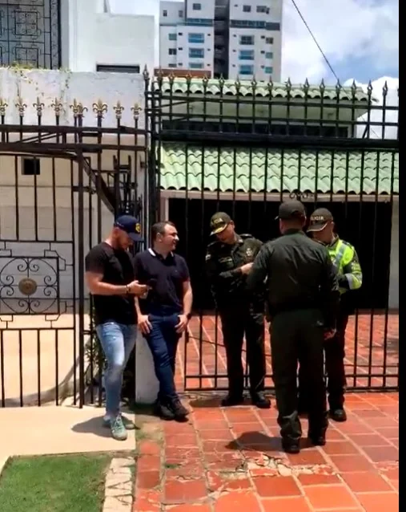
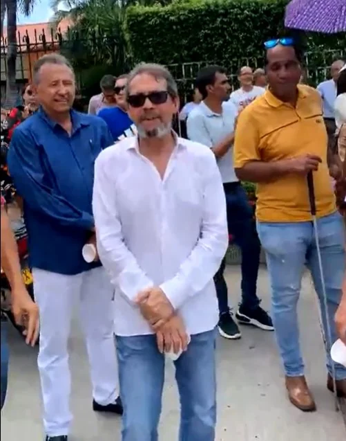

*La entrada de la casa de “Alejandro Char construye tu felicidad” en Campo Alegre.*

**“Alejandro Char construye tu felicidad”** y las casas construidas en Campo Alegre, entre 2002 y 2005, se vinieron abajo en menos de 4 años. Las 400 familias que compraron, desde entonces, viven un drama que pronto cumplirá 20 años. Demandaron y ganaron los fallos judiciales. Pero ni Alejandro Char ni el Distrito, hasta hoy, han cumplido. Por esta razón, esas familias hicieron un plantón hoy 5 de mayo denunciando la corrupción judicial y distrital que no les pagan las indemnización a que tienen lugar.

Pero el ingeniero Alejandro Char no dio la cara. Nunca apareció. Y los del plantón debieron marcharse no sin antes manifestar su inconformismo. Pero se notó la no presencia de los medios de comunicación cubriendo la protesta contra el alcalde Char en su propia residencia.

## El verdadero Alejandro Char

En efecto, el caso Campo Alegre retrata el verdadero carácter y la esencia de **Alejandro Char Chaljub** que la ciudadanía desconoce. Su verdadera catadura está retratada con Campo Alegre. Los barranquilleros no lo sabían porque sus publicistas y periodistas _construyeron un relato fascinante de su personalidad de bacán_, de empresario exitoso. Relato que es paja de la fina.

No obstante, la realidad es muy distinta. Como constructor fracasó. Las casas de sus dos proyectos se cayeron. Hoy es una **tragedia griega** para los que las adquirieron. Pero una prueba fehaciente del verdadero Alejandro Char.

El hoy tres veces alcalde de Barranquilla, Alejandro Char, fracasó doblemente, porque quedó endeudado en 2007. No fue procesado ni penal ni disciplinariamente por los hechos de corrupción que cometió al lado de los Nule, debido a la gran influencia que el jefe de la Casa Char tenía. La contraloría lo sancionó por no terminar las obras de una de las sucursales de la Dian. Su padre **Fuad Char Abdala** tuvo que pagar más de $20 mil millones antes de inscribirse como candidato a la alcaldía que ganó en 2008.

Los asesores de marketing venden a Alejandro Char como ingeniero civil graduado de la Universidad del Norte, especializado en ingeniería de proyectos mineros. Además, de alta gerencia en la Universidad de los Andes y magíster en gerencia de proyectos del Georgia Institute of Technology. Pero la realidad es que esos títulos, si los posee, no le han servido de nada como ingeniero. Si a un ingeniero constructor todo se le cae ¿cómo se llama eso? Su padre, como buen empresario que es, descubrió que para eso no sirve.

## Alejandro Char, el político

Entonces, Fuad Char lo convirtió en político profesional. Fue un discreto concejal del partido Liberal en 1997. En 2003, le fue medio/medio en un año cuando reemplazó en la gobernación al locutor **Ventura Díaz**, quien fue suspendido del cargo.

Pero Char se presentó en las elecciones de 2007 como el ingeniero que _construye la felicidad de la gente_. El constructor de viviendas para una clase media ávida de resolver su hábitat. El empresario que hacía parte del emporio Olímpica, etc. Esa publicidad engañosa caló en una ciudad dominada por el junior, los carnavales y los medios de comunicación de Olímpica.

Como alcalde-ingeniero hizo la revolución del pavimento. Hasta los arroyos los pavimentó. Descubrió que las megaobras deslumbraban a la opinión pública arribista que se fue apoderando de Barranquilla, gracias a una clase empresarial y política que se confabuló con el capital ilegal que inundó la ciudad en los años 70.

En esa primera alcaldía el dicho popular fue:

> "El alcalde Char roba, pero hace".

## Campo Alegre, el fantasma de Char

*Roberto Tapia Ahumada, uno de los abogados de los damnificados./Captura de pantalla.*

Fue la principal publicidad engañosa que le surtió efecto en la manipulación de la población. Como ingeniero constructor de vivienda para la clase media, logró vender sus dos proyectos que demostraron, no solo su mediocridad como empresario, sino también ser un individuo sin escrúpulos para engañar a la gente con su falsa personalidad.

Pocas veces Alejandro Char habla sobre Campo Alegre. Por lo menos, no lo hace con la prensa. Le tiene miedo. Y como ingeniero sabe que fracasó en esos proyectos de vivienda. Por esta razón debe nombrarse otro  [alcalde ad ho](/articulos/normativa/normativa/DECRETO%20397%20DEL%2007%20DE%20MARZO%20DE%202016.pdf)c como en 2016 para ponerle fin al sufrimiento de las familias damnificadas por el fracaso de Alejandro Char como constructor.

 En 2011 el Distrito se gastó [35 mil millones](/articulos/local/local/34900-millones-se-ha-tragado-la-ladera-en-campo-alegre-y-falta-m-s-49354) de pesos en la estabilización de la ladera que desde los años 70 presenta deslizamientos. Fue la zona donde Alejandro Char construyó sus proyectos con la licencia que su amigo alcalde de la época, **Humberto Caiaffa**, le concedió.