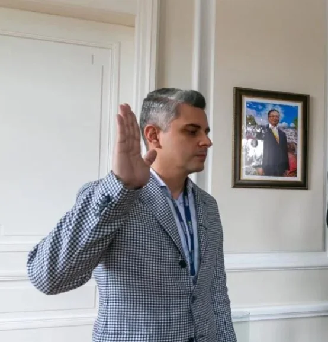
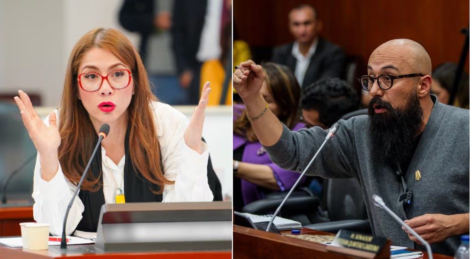
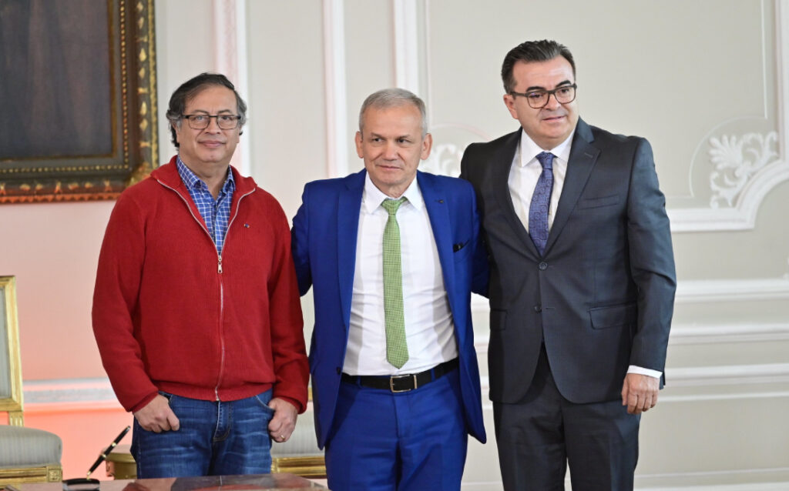

*¿«Las bisagras del gobierno»? / UNGRD CAJA MENOR*

¿Por qué les llaman **«Las bisagras del gobierno»** a los funcionarios que ocuparon la Subdirección de Manejo de Desastres? ¿Son los hombres bisagras del gobierno? Para responder estas preguntas debemos partir de tres elementos fundamentales. **El primero**. Tenemos un congreso que funciona mediante un sistema mercantil de transacción. **Lo segundo**. El papel de los personajes directamente involucrados en estos casos de corrupción es de **bisagra entre el ejecutivo que corrompe y el legislativo que extorsiona**. Por tanto, se presenta una **tercera premisa**: Se configura un **_«_dame y te doy»** (delito de cohecho) como en el viejo caso de la **«Yidispolítica»**. Es decir, La UNGRD la transformaron en una caja menor para comprar favores políticos.

En consecuencia, la conducta de estos personajes marca la continuidad y el _modus operandi_ del **fenómeno de corrupción** y de poca efectividad de la acción de la Unidad Nacional de Gestión del Riesgo y el Desastre―UNGRD en fenómenos naturales o pocos naturales como La Mojana, La crisis de agua de La Guajira o el fenómeno del Niño. Esta conducta hace del discurso de adaptación al cambio climático una demagogia y una alegoría a la manipulación y al engaño.

## La Corte y la Fiscalía

*¿«Las bisagras del gobierno»? . Diego Vargas Vega/UNGRD.*

La Fiscalía y la Corte Suprema de Justicia pueden y deben construir líneas investigativas sostenibles para erradicar estas **_«_**ollas podridas**»** protagonizadas por **¿«Las bisagras del gobierno»?** Tal como lo hizo con **_«_**Las marionetas**»**,

Para ello, basta con analizar los hallazgos en la actuación de los subdirectores de Manejo de Desastres desde la misma creación de la UNGRD en el gobierno de **Juan Manuel Santos**.

En ese sentido, se entendería que la llegada del exconcejal **Carlos Carrillo** a la dirección de esa entidad sería para transparentar dicha institución. Pero lo que se está observando es una persecución contra los parlamentarios que le _hicieron conejo_ (no cumplieron sus compromisos) al gobierno. Es decir, que el gobierno les dió, pero ellos no fueron generosos en los trámites de las reformas.

¿Te interesa? [De Sneyder a Ariel, ¿el otro ariete de la](/articulos/de-sneyder-a-ariel-el-otro-ariete-de-la-corrupcion-en-la-ungrd-i/) corrupción?

## **_«_Incompetencia suprema»**

*La parlamentaria de Alianza Verde calificó de «Incompetencia suprema» a Carlos Carrillo en la UNGRD. ¿«Las bisagras del gobierno»?/Cortesía Colprensa.*

Sin embargo, el ataque frontal de Carrillo contra algunos parlamentarios en el debate realizado este 28 de mayo en la Comisión VI de la Cámara, lo dice todo. La actuación de Carrillo fue calificada de **_«_incompetencia suprema»** por la parlamentaria **Catherine Juvinao**. Dice mucho de su verdadero papel en la UNGRD, más allá de su grandilocuente discurso contra la corrupción. En el debate, fungió de inquisidor contra los parlamentarios y no como funcionario que debía responder por los resultados de su gestión para corregir lo actuado. Actuación que es deficitaria, según la evaluación que le hicieron.

En ese debate contó con el beneplácito de la presidenta de esa unidad legislativa, **Susana Gómez Castaño**, también conocida como _Susana Boreal_, muy proclive al gobierno y a la _mariacachafa_, la hierba que la hace volar con los vientos del norte.

¿Te interesa? [«Atrapasueños» del ICBF, sueños son (I)](/articulos/atrapasuenos-del-icbf-suenos-son-i/)

## **¿«Las bisagras del gobierno»?**

*¿Entre el presidente y Olmedo, el hombre bisagra de presidencia? ¿«Las bisagras del gobierno»?/Cortesía Colprensa../Presidencia.*

Todos los gobiernos que suceden en el siglo XXI ―incluyendo el de Gustavo Petro― cayeron en las profundidades de la corrupción y de la demagogia. La confesión mayor de **Olmedo De Jesús López Martínez**, exdirector general de la UNGRD, es la apropiación indebida de **$380 mil millones** para comprar congresistas con el fin de **facilitar el trámite de las reformas y la obtención de créditos oficiales**. Lo que está diciendo es que su conducta no fue un acto aislado. Por el contrario, su **rol fue de bisagra** entre el alto poder y el congreso. Papel que también debió asumir la mensajera **Sandra Ortiz**, ex Consejera para las Regiones.

Por ende, es una consecuencia sistémica que tiene el sello estratégico de **gobierno compartido** del **presidente Gustavo Petro**. Es decir, que las bolsas de dinero de Olmedo López están conectadas, al parecer, con las bolsas de dinero de los funcionarios que ocuparon la Subdirección de Manejo de Desastres, como **Diego Vargas Vega**, en cuya bolsa había $500 millones, pero él dijo que eran $5 millones. O las bolsas desaparecidas en la casa de **Laura Sarabia Torres**.

Si no es un problema mayor, ¿por qué se armó un operativo policivo que involucró a la seguridad presidencial? No fue un caso menor. La Fiscalía debe ser eficiente en este hecho. Por una sola razón, debe demostrar que no es fiscalía de bolsillo del presidente. Además, estamos con un gobierno que nos prometió un cambio total. Por tanto, debemos ser más exigentes.

Por supuesto, las órdenes no las dió el primer y, quizás el único presidente progresista que tendrá Colombia en la primera mitad de este siglo. Esta predicción que obedece al análisis objetivo de las condiciones objetivas, por tanto, no es pura especulación.

¿Te interesa? [Ética y no estética con los nuevos directores seccionales y fiscales](/articulos/etica-y-no-estetica-con-los-nuevos-directores-seccionales-y-fiscales-delegados/)

## **¿«Las bisagras del gobierno»?** Olmedo, Sneyder y González

En efecto, Olmedo López confesó que, una vez recibió las directrices de lo que llamó **«el cónclave»** del _buró político_ del **Pacto Histórico** enclavado en la cúpula del gobierno, le encomendó al Subdirector de Desastres, **Sneyder Pinilla**, cumplir esas órdenes supremas. Esta es la causa por la cual fue llamado a declarar el próximo miércoles **5 de junio** ante la **Corte Suprema de Justicia (CSJ)**. Asimismo, lo hará **Carlos Ramón González**, director de la Dirección Nacional de Inteligencia (DNI). Ellos fueron los **_hombres bisagras_** del supuesto caso de los $4 mil millones. En tanto a González se le considera el _hombre bisagra_ entre el presidente y el buró político, del cual emanan las órdenes del gobierno.

Como se recordará, Sneyder incriminó inicialmente a los presidentes del Congreso **Iván Name** y **Andrés Calle** a quienes supuestamente les entregó **$3 mil y $1 mil millones**, respectivamente. Pero también dijo tener prueba contra 15 congresistas. En este sentido, el magistrado **Francisco Farfán** de la CSJ abrió una investigación preliminar.

Por esa razón, llegó en el día de hoy al búnker de la fiscalía con varios cartapacios de documentos que contiene, al parecer, las pruebas que soportan sus denuncias. Se espera que la Corte Suprema de Justicia tome en cuenta las mismas denuncias del presidente de investigar 8 años de corrupción de la UNGRD.

Por ejemplo, durante el gobierno del presidente **Iván Duque** la UNGRD **¡manejó $15 billones!** Mucha comida para las **_«_**ratas de alcantarilla», como lo dijera cínicamente el propio Duque.

## Los Sancho Panza

Las evidencias indican que todos los directores de la UNGRD tuvieron sus Sancho Panza para conseguir dinero en efectivo. **Olmedo López**. ****«El Mono»** González** y **Juan Fernando Velasco.** ¿Se estaría revelando un patrón criminal para expoliar ilegalmente las arcas de la UNGRD y corromper la esencia de la democracia que es el control político, la veeduría y el control social?

**Atención a este dato**. La Fiscalía descubrió un entramado, cuyo jefe era el senador liberal **Mario Castaño**, presidente de la Comisión Cuarta del senado conocido como [****«****Las marionetas****»****](/articulos/negocios-fantasma/castano-y-sus-marionetas/). La Corte Suprema de Justicia asumió la investigación y ordenó la captura del senador liberal. Pero, el parlamentario murió extrañamente dos días antes de declarar en esa corporación que comprometería a altos funcionarios y colegas suyos. La causa de su muerte no está plenamente establecida, cuyo misterio, que para el director de la UNGRD **Carlos Carrillo,** produce mucho miedo.

En la próxima entrega: de ****«****Las marionetas****»**** a «Los hombres bisagra».