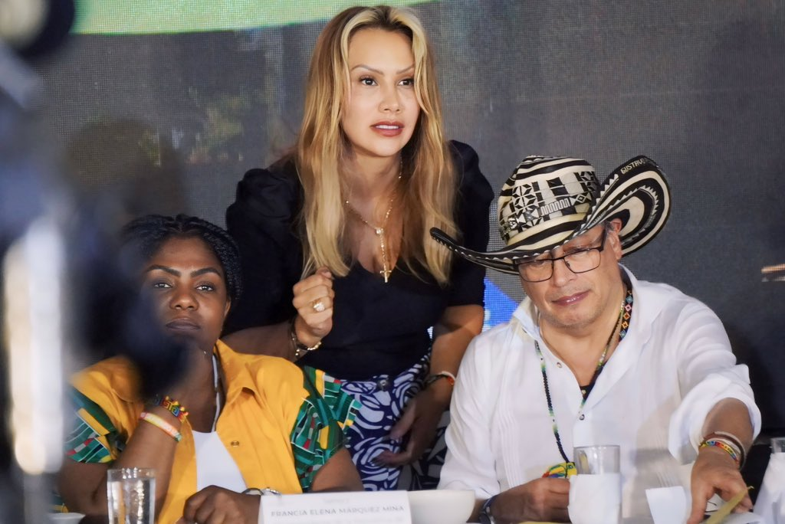
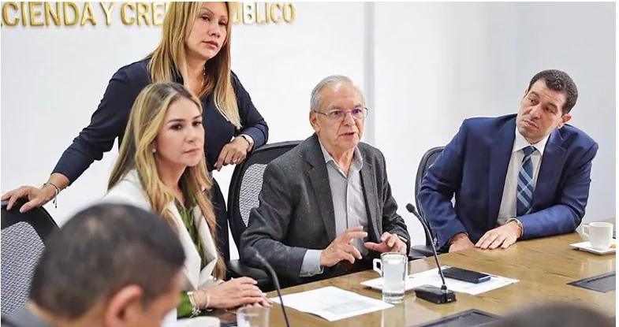

*¿Caso aislado? Sandra Ortiz, «la Mona de las tulas», la sombra del presidente Gustavo Petro y de la vicepresidenta Francia Márquez./presidencia.*

¿Sandra Ortiz **―**«la Mona de las tulas» y los niños wayúu**―** será la segunda mujer del alto poder que cae por las tulas de dinero y que regresará con más poder como le sucedió a **Laura Sarabia Torres**? Nadie lo extrañaría si tiene mente abierta y pensamiento crítico. Por esta razón, **Snayder Pinilla**, exsubdirector de la UNGRD, se destapó e invitó al exdirector de esa entidad, **Olmedo López**, a romper el silencio cómplice. Aclaró que él solo fue un mensajero para salvar las reformas del gobierno.

En efecto, es la misma razón de estado, según él, por la cual, al parecer, el 28 de septiembre de 2023 **―**un mes antes de las elecciones regionales**―** le llevó dos tulas con billetes de $100 mil y $50 mil a otra mensajera, la Consejera para las Regiones, «la Mona» **Sandra Ortiz**, una progresista _uña y mugre_ del presidente Petro.

Por esos hechos, el presidente debería contemplar la decisión de recoger sus reformas sociales contaminadas por un congreso podrido. Además, debería apelar al artículo tercero de la Constitución Nacional donde «la soberanía reside en el pueblo».

## «La Mona de las tulas»

*Ricardo Bonilla, el adalid de las finanzas del gobierno del cambio. Detrás, «la Mona de las tulas», haciendo arreglo con la gobernadora de los Gnecco, Elvia Milena Sanjuán./Presidencia.*

Sandra Ortiz **―**ahora **«la Mona de las tulas»―** acompañaba al presidente del cambio a todas las regiones. Hasta fue protagonista en La Guajira, de cuya visita, al parecer, extrajeron los **$4 mil millones** de la coima pagada por el contratista de los carrotanques destinados a **los niños wayúu**. Y esto no es calumnia de la Gran Prensa de derecha.

Es más, el presidente Gustavo Petro **―**en un afán de lavarse las manos, _a lo Poncio Pilatos_**―** el 3 de mayo lo reconoció y le echó comida a los tiburones: Retiró de un tajo a Sandra Ortiz**.** Extrañamente, también al Secretario de Transparencia de la Presidencia, el progresista y petrista **Andrés Idárraga**, quien se destacó por sus denuncias anticorrupción. Si no fuera cierto, no hubiese aceptado con tanta rapidez la credibilidad de los hechos. Su declaración se convirtió en una **confesión de parte del gobierno** nacional que debe responder por ello.

¿Te interesa? [Reforma Pensional: ¿Salvavidas a las AFP o bienestar de los trabajadores? (I)](/articulos/reforma-pensional-salvavidas-a-las-afp-o-bienestar-de-los-trabajadores/)

## Los destinatarios

Sin embargo, los tiburones quedaron hambrientos. Snayder concedió la entrevista a Semana. Sus declaraciones pulverizaron la actitud presidencial. Y dijo que ese dinero **―**el cual era para los niños wayúu**―** terminaron enriqueciendo a los políticos progresistas del cambio para tramitar las reformas y créditos solicitados por el Ministerio de Hacienda. Lo mismo que sucedió en el _régimen neobonapartista_ de Uribe con la _**Yidispolítica**_. ¿Quiénes eran los destinatarios? Uno era copartidario de Sandra Ortíz, el presidente del congreso, el barranquillero **Iván Name**, del partido Alianza Verde. Y por otro lado, el presidente de la Cámara de Representantes, el liberal progresista cordobés **Andrés Calle**.

Según Snayder **―**en entrevista con Vicky Dávila, directora de Semana**―** le entregó el dinero a **_«la Mona» de las tulas_** cerca al hotel Tequendama Suites Bogotá. Eran dos morrales negros que contenían **$3 mil millones**. Ella, al decir de Pinilla, estaba con un esquema de seguridad. Hasta allí cumplió como mensajero de **Olmo López**.

De la misma manera hizo con los otros mil millones de pesos que fueron entregados en el edificio de Montería donde reside Andrés Calle, el presidente de la cámara de representantes donde ahora debe transitar la reforma pensional y laboral.

¿Te interesa? [¿La cámara corregirá reforma pensional chueca? (II)](/articulos/la-camara-corregira-reforma-pensional-chueca-ii/)

## La plata de los niños de La Guajira

*El presidente Petro y Sandra Ortiz, «la Mona de las tulas», saludan a los niños wayuús a su llegada a Riohacha al bajarse del avión Number One de la Fuerza Aérea Colombiana. ¿Propaganda política del gobierno del cambio que costó $185 mil millones? Los niños se siguen muriendo de sed por la avaricia de funcionarios del cambio.*

¡Atención! Lo más impactante e indignante es que ese dinero procedía de un cuestionado contrato por valor de $46 mil millones concebido con urgencia a la luz del cumplimiento de la **sentencia T-302-2017** emitida durante el gobierno de **Juan Manuel Santos**. Un contrato del gobierno del cambio que frustró el suministro de agua potable con los carrotanques adquiridos de urgencia y que yacen llenos de polvo estacionados, sin uso, en la base militar de Uribia, La Guajira.

Vale decir, que de esos niños vulnerables de La Guajira, murieron **265**. De ellos, 95 bajo la tutela del ICBF durante el gobierno de Iván Duque y seis meses del Cambio prometido por Gustavo Petro Urrego, de acuerdo al informe de la Contraloría General de la República que auditó el período 2019**―**2022\. Pero, tal tendencia de muerte continuó durante 2023. Ni siquiera se interrumpió con las medidas extraordinarias adoptadas por el gobierno del cambio de Gustavo Petro.

Como se sabe, la Corte Constitucional emitió la citada sentencia (**T-302 de 2017**) que obligaba a una intervención masiva del Estado para reestablecer los derechos fundamentales violados a la población infantil de la región. Una población indígena que se muere paulatinamente por falta de comida y agua. Pero, sobre todo, por la corrupción durante los 20 años del régimen uribista, y los 18 meses del gobierno del cambio.

¿Te interesa? [¿Los rateros de Odebrecht? Se reanuda proceso contra Óscar Zuluaga (II)](/articulos/los-rateros-de-odebrecht-se-reanuda-proceso-contra-oscar-zuluaga-ii/)

## Sandra Ortiz y los políticos progresistas

El presidente Petro, atendiendo esa sentencia, emitió el decreto de emergencia económica, social y ecológica en la región que cuatro meses después tumbó la misma Corte Constitucional. Solo dejó en pie el tema del agua. Durante una semana el gobierno del cambio despachó en Riohacha. Allí anunció en junio 2023 una inversión de urgencia de $185 mil millones para los niños wayúu.

> “Es absolutamente pertinente decretar la emergencia económica y social porque se avecina una calamidad pública. Porque los modelos climáticos nos anuncian, con cada vez mayores probabilidades, la cercanía de una sequía que nunca antes se había visto”
> 
> Gustavo Petro, 2 de julio de 2023

Su discurso fue ampliamente aplaudido por propios y extraños, _tirios y troyanos_, progresistas y no progresistas. Aplausos cerrados y de pie de los contratistas que acompañaban a «la Mona» **Sandra Ortiz** en su recorrido por La Guajira. Aplausos de Sneyder Pinilla, Olmo López y de sus contratistas que constituían una flotilla. Si, una flotilla de saqueadores que **recogían el botín** como si fueran los conquistadores de una tierra indígena saqueada históricamente por el pensamiento colonialista.

De hecho, es la visión **_bogocéntrica_** de este gobierno del cambio **―**herencia maldita de la **visión eurocéntrica―** que busca salvar a los niños wayúu del hambre y la sed. Es la misma visión de los europeos de **1492** que vinieron a salvarnos el alma y de la pobreza cuando vivíamos apegados a la naturaleza y no al principio de acumulación capitalista del mercantilismo fenicio.

## Del dicho al hecho

/articulos/petrogustavo/status/1786953317114946005

Así anunciaron las obras con los carrotanques. ¿Sucederá lo mismo? VoxPopuli Digital visitará por su propia cuenta a La Guajira para comprobar las realizaciones anunciadas.

Sin embargo, del discurso brillante a realizaciones del presidente existe una gran distancia cuando no se tiene en cuenta a la gente. El _poder popular_ queda en la nebulosa. Es cuando los oportunistas de siempre, de todos los colores, asumen el poder que deviene en corrupción escandalosa. O, como decía mi abuela **Ana Luisa Martínez Sanes**: **_del dicho al hecho hay mucho trecho_**.

El brillante discurso presidencial de la pobreza, de la niñez, del agua, del cambio climático, de la soberanía alimentaria, produce más pobreza mental cuando no está íntimamente relacionado con la praxis del individuo, esto es, del Presidente. Si las obras de gobierno no aparecen en casi dos años de gestión, es un desastre nacional. Además, de una frustración histórica para las generaciones presentes y futura que creyeron en la brillantez de ese discurso.

Entonces y solo entonces **―**apelo a la valentía del periodista**―** la gente que creyó en ese anunciado cambio, viene calificando al gobierno progresista de conducta chueca a contrapelo del **poder popular**. En su praxis política, el discurso presidencial se transformó en una versión de izquierda del cinismo de los que detentan el poder político y económico.

## El poder del pueblo

De manera que los derechos fundamentales a la alimentación, la salud, el agua potable y a la participación de niñas y niños Wayúu quedaron en el brillante discurso. Un discurso que no entiende la gente. ¡Agua! ¡Comida! Es lo que necesitan los niños wayúu.

Este sábado, 4 de mayo, el presidente Gustavo Petro llamó a las fuerzas militares a proteger el agua. Pero lo que debería hacer es devolverle el poder al pueblo ya que el artículo 3 de la Constitución Nacional dice:

> **_«_**La soberanía reside exclusivamente en el pueblo, del cual emana el poder público**_»_**. 

La pregunta que viene: ¿Se inmolará Sandra Ortiz, **_«la Mona» de las tulas_** por el presidente Petro, como lo hicieron los ministros de gobierno del presidente **Álvaro Uribe**: Sabas Pretelt de la Vega y Diego Palacio Betancourt, y el exdirector del DAPRE, Alberto Velásquez Echeverri? En la próxima entrega ese será el objeto del análisis. ¡Feliz domingo!