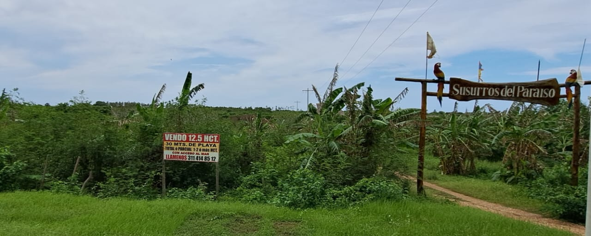
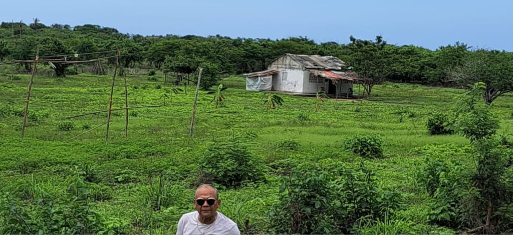
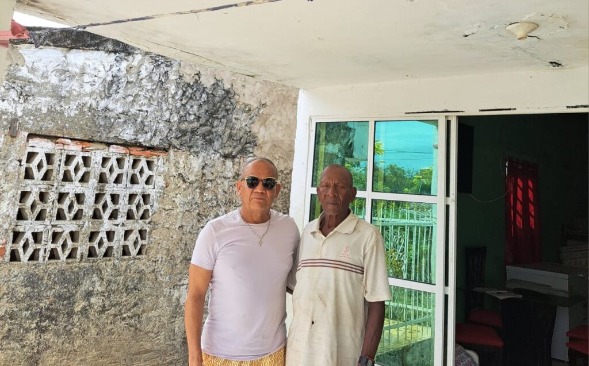

*Al norte de Cartagena, kilómetro 21, tierra despojada. Son 12,5 hectáreas despojadas a Eddy Marina Aguacha de López, y las tienen a la venta.*

Tenga mucho cuidado. Si quiere comprar propiedades en Cartagena, fíjese que no sea tierra despojada que le cause un grave problema y le quite su tranquilidad. Esta historia se refiere al caso de un grupo de usurpadores que se concertaron en una supuesta empresa asociativa de campesinos para despojar a sus legítimos dueños de **12,5 hectáreas** de tierra en jurisdicción del corregimiento **Arroyo de Piedra** (Cartagena). Ahora sus hijos ―continuando con el legado criminal de sus padres― las están vendiendo a terceros sin anotar que es un predio despojado, objeto de dos visitas por una demanda radicada en la **Unidad de Restitución de Tierras (URT)**.

Lo increíble historia, es que los hijos de los primeros usurpadores, cuatro de los cuales ya murieron, continúan usando el terror y el acoso que sus progenitores utilizaron para sacar a sus legítimos dueños. Este presunto concierto para delinquir, ―planeado en sus inicios por el abogado **Álvaro Perea Castro** (q.d.e.p.), pionero de los usurpadores de tierra en el norte― tiene ya 30 años.

Ahora cuentan con la asesoría de nuevos abogados que le dan apariencia legal a una conducta ilícita y criminal. Además, tienen financiadores que son los determinadores de este presunto crimen.

¿Te interesa la primera entrega? [El defraudar y despojar de una asociación para delinquir (I)](/articulos/el-defraudar-y-despojar-de-una-supuesta-empresa-comunitaria-i/)

## El despojo

*En el fondo aparece la vivienda construida por Eddy Marina Aguacha de López. Aquí están las 12,5 hectáreas (tierra despojada) que colinda entre la carretera Vía al Mar y el Mar Caribe./VoxPopuli.Digital.*

Como lo documentamos en la primera entrega de este seriado, la primera generación de despojadores fue orientada jurídicamente por el ya desaparecido **Álvaro Perea Castro**, la _oveja negra_ de la prestante familia de **Napoleón Perea Castro**, legendario locutor de los 80 y 90. El mentado abogado tuvo problemas policiales y judiciales por su forma ilícita para adquirir tierra. Para materializar estos hechos, alentaba a nativos de _mala conducta_ a invadir las tierras y sacar por la fuerza a sus legítimos dueños, tal como lo hicieron en 1992 con la señora **Eddy Marina Aguacha de López**, quien hoy tiene 70 años.

Como ya se informó, a la altura del kilómetro 22, vía al mar, existe un globo de terreno de 18 hectáreas que el **Círculo de Obreros de San Pedro Claver** le entregó en 1991 a un grupo de campesinos. Los organizó en la **Empresa Asociativa Comunitaria Campesina de Arroyo de Piedra**\-EAT. La idea era que trabajaran la tierra entregada y se ganaran el pan de cada día.

Sin embargo, sus directivos se dedicaron a engañar y delinquir con esa propiedad. No solo decidieron vender sino también estafar a terceros. Como se dijo, es una historia que ya data de 30 años. La primera que compró el predio a la EAT fue **Aguacha de López**, quien tomó posesión del predio una vez se hizo la protocolización de la venta. Pero, en la noche del **22 de marzo de 1991** se presentó un grupo de encapuchados en las **12,5 hectáreas** de **Eddy Marina Aguancha de López**. Luego de quemar el rancho y destruir el cultivo, amenazaron al vigilante que vivía con su familia. La pareja de esposos reconstruyó el rancho. Pero, posteriormente, el 4 de abril, o sea, 12 días después, el mismo grupo de delincuentes se presentó amenazando al vigilante y sacándolo violentamente.

Luego de esos hechos victimizantes, la **Empresa Comunitaria Campesina de Arroyo de Piedra**, cuyo presidente era **Clemente Teherán**, invadió el lote con sus directivos. Estos solicitaron amparo policivo con la asesoría del abogado **Perea Castro**. Ahora sus hijos continúan en esta empresa criminal sin que las autoridades hayan resuelto el citado crimen.

## Estos son los usurpadores originales

La citada empresa campesina, no puso a producir las tierras y los verdaderos campesinos tampoco sacaron provecho lícito de su actividad, porque algunos de ellos se concertaron para el engaño y el fraude. En aquella época, la junta directiva estaba integrada por las siguientes personas, la mayoría ya muerta:

*   **Clemente Teherán Noriega, presidente**
*   **Miguel Arcángel Gómez Teherán, Vicepresidente**
*   **Renzo Zúñiga Gómez, vocal**
*   **Edinson Zuñiga Gómez**
*   **Wilberto Teherán Noriega**
*   **Emiro Zuñiga Gómez**, vocal de la empresa.
*   **Guillermo Teherán**
*   **Leopoldo Caro Restrepo**

## Una tierra que les trajo desgracia

De la lista anterior, son muy pocos los sobrevivientes. Dentro del proceso de investigación, fui a la residencia de **Renzo Zúñiga Núñez**, sobrino de **Renzo Zúñiga Gómez**, quien falleció hace tres años. Está ubicada frente a la Estación de Policía de Arroyo de Piedra. El citado personaje no se encontraba. En su lugar, me atendió su esposa. Le dejé dicho que estaba investigando el caso del lote de terreno que adquirieron ilícitamente en Arroyo de Piedra.

En tanto visité a **Miguel Arcángel Gómez Teherán**, quien en un tono amigable, me dijo que quería conciliar con los dueños de la tierra, porque casi todos sus compañeros se habían muerto. Él quería "algo" antes de morirse. Me habló de que esa tierra le había traído desgracia para su familia. Recordó que uno de sus hijos lo mató un vehículo en la Vía al Mar cuando salía de esos terrenos.

Contrario a Miguel Arcángel Gómez, Zuñiga Núñez, me dijo que no quiere devolver la tierra. Entonces, le manifesté que estaba investigando el caso de esas **12,5 hectáreas** y quería saber la versión de él. Me dijo que no quería hablar y que tenía abogado para ello. Le pedí que me contactara al abogado. Pero me argumentó que no se acordaba del nombre ni tampoco tenía su contacto.

## El abogado de Renzo Zúñiga

No obstante, el 11 de junio, es decir, al día siguiente, me llamó quien dijo ser el abogado **Omar Cabeza**. Me dijo que sólo ahora está tomando el caso que lo tenía otro abogado. Agregó que le preocupa la información que **VoxPopuli Digital** publicó en el sentido de que esas **12,5 hectáreas** sean las mismas tierras que dice poseer la Empresa Comunitaria Campesina de Arroyo de Piedra. Le dije que sí, allí están los documentos que lo señala. Una sola revisión de los mismos, bastaría para darse cuenta de ello.

En consecuencia, le manifesté al abogado que esas **12,5 hectáreas** se desprendieron de un globo de tierra mayor de **18,5 hectáreas** escrituradas a la empresa asociativa. Pero después de la venta (1991), se hizo el deslinde de las 12,5 hectáreas que le pertenecen a Eddy Marina Aguacha de López, tal como lo señalan los documentos adjuntados y publicados en lamprimera entrega.

El abogado Cabeza debe saber que existe un proceso de restitución de esas tierras. Que ya se han hecho dos visitas oculares por parte de la Agencia Nacional de Restitución de Tierras (ANRT). Qué los propietarios le vendieron el hecho litigioso a unas personas de Medellín que están dispuestas a recuperar esas tierras. Que las víctimas del despojo, concomitante a ello, presentarán una denuncia penal contra todos los que están ocupando ilícitamente el terreno.

Cuando estaba en la casa de **Miguel Arcángel Gómez Teherán**, vicepresidente de la empresa comunitaria para la época de los hechos de despojo, se me presentó **Renzo Zúñiga Núñez**. Estábamos frente a la Inspección de Policía de Arroyo de Piedra. Llegó alterado y nervioso a increpar al periodista.

## Amenaza contra el periodista

*Uno de los pocos sobrevivientes de la Empresa Asociativa Campesina de Arroyo de Piedra, Miguel Arcángel Gómez Teherán que quiere terminar a bien con ese pleito./VoxPopuli Digital.*

Para escribir esta entrega, debí visitar los predios de las **12,5 hectáreas** y entrevistar a testigos que me aseguraron que Eddy Marina Aguancha es la legítima dueña, pues, se la compró en buena forma a la Empresas Asociativa. Algunos me manifestaron que esos directivos campesinos «son unos bandidos que han vivido ilícitamente de esas tierra en perjuicio de los campesinos de bien de Arroyo de Piedra».

Por ejemplo, uno de los testigos, cuyo nombre me pidió que no publicara por temor a una violenta reacción contra él, le manifestó a este periodista, que da fe que los esposos López Aguancha pagaron debidamente el costo de la adquisición de la tierra. Al respecto, dijo:

> «Yo era uno de los que le entregaba la plata a Renzo Zúñiga de la empresa y recibía los recibos que ellos firmaban. Allí está la escritura que usted publicó en ese escrito».
> 
> Testigo que está dispuesto a declarar ante la Fiscalía.

## Fiscalía: ¡Escuche la amenaza!

Como los sucesores de este despojo se ven descubierto con la investigación periodística que pongo al servicio de la Fiscalía, arremetieron contra el periodista. Al día siguiente de la visita ocular que hice, este periodista comenzó a recibir reiteradas amenazas de muerte. Incluso, recibí una llamada de quien dijo ser **Emiro Zúñiga.** La amenaza fue brutal cargada de ira y odio, tal como se puede apreciar en el siguiente audio:

Para cometer este delito, desplazaron violentamente a sus propietarios quemando el rancho y amenazando a sus propietarios. Ahora implementaron el mismo método para que el periodista de **VoxPopuli Digital** no siga publicando. Una vez que estuve en los predios para verificar la información, estallaron violentamente con improperios y amenazas de muerte. Como mi deber es escuchar las partes, se les visitó para escuchar su versión de los hechos. Cuando supo que lo estaba buscando, **Renzo Zúñiga Núñez**, llegó alterado y le manifestó al periodista que no quería referirse a dichos hechos. Que si quería saber algo, debía entrevistar a su abogado. Le manifesté que me diera el contacto del mismo, pero tampoco lo hizo.

Todo indica que para cometer ese ilícito, vienen contando con la asesoría de abogados y de supuestos financiadores que se prestan para estas presuntas fechorías. (En la próxima entrega citaremos algunos nombres).

## Acción de la URT

Lo paradójico del asunto es que Renzo Zúñiga Gómez pidió la restitución del predio, pero la Unidad de Restitución de Tierras (URT) se lo negó. En cambio, a raíz de la demanda de la víctima, realizó dos visitas a las **12,5 hectáreas** de tierra ubicadas en Arroyo de Piedra, corregimiento de Cartagena.

Razón tiene la víctima de esta acción, **Eddy Marina Aguacha de López**, de 70 años, sus agresores son violentos y dispuestos a atentar contra la vida de los justos reclamantes. Como agravante, vienen vendiendo el predio y estafando a ingenuos compradores con el apoyo de un abogado sin que las autoridades actúen debidamente para terminar con esta grave situación.

En la próxima entrega hablaremos de la historia de sus abogados y de un comerciante de apellido Estupiñan que les viene financiando esta empresa criminal. Actuaría como determinador de este delito.