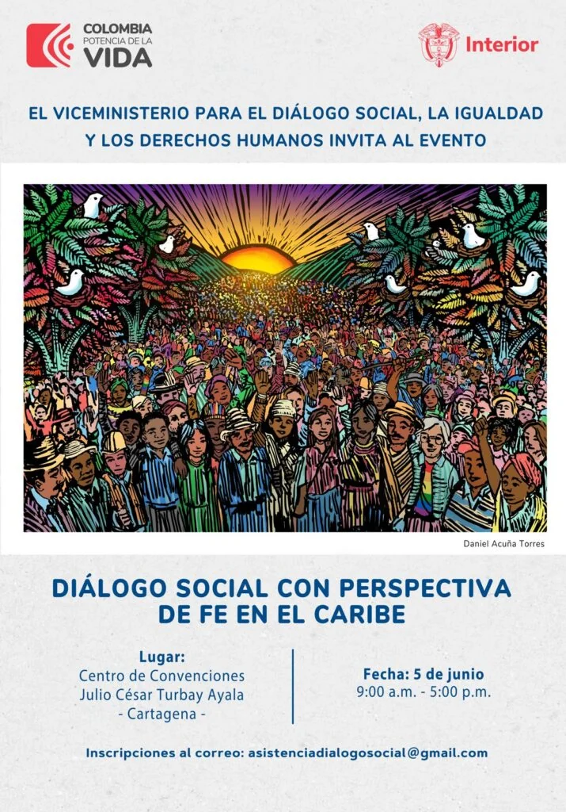

*Diálogo Social de Fe con la viceministra para el Diálogo Social, Lilia Solano, próxima directora de la Unidad de Víctimas, en los tiempos de defensora de los derechos humanos, 2018 en Cartagena.*

El gobierno nacional, a través del viceministerio del Interior para el Diálogo Social, liderado por la defensora de los derechos humanos, Lilia Solano, iniciará con el Caribe colombiano un proceso **Diálogo Social con Perspectiva de Fe**. El evento se realizará este miércoles **5 de junio** desde las 9 de la mañana en el Centro de Convenciones de Cartagena de Getsemaní. Allí participarán todas las personas y organizaciones que a bien gusten inscribirse previamente.

Hasta el momento no se tiene confirmada la asistencia del presidente Gustavo Petro, pero todo indica que se podría presentar. Por lo menos está en la agenda. Quien sí está confirmada es la asistencia del ministro del Interior, **Juan Fernando Velasco**.

## La política de fe

*Diálogo Social de Fe*

Para el gobierno nacional, los constructores de fe constituyen un sector muy importante dentro del proceso de creación de tejido social para la paz y la protección de los sectores más vulnerables del país.

> ... resulta importante que, mediante este evento, se generen puentes entre la institucionalidad del Estado y las expresiones sociales de fe, con el fin de fortalecer las iniciativas en pro de la paz y la defensa de la vida.
> 
> Convocatoria

Por esa razón, es supremamente importante la participación de sacerdotes, pastores, feligreses de todas las vertientes y líderes sociales asistan a este Diálogo Social con Perspectiva de Fe.

## Inscríbase aquí

Para efecto de su participación y facilitar el ingreso, se requiere diligenciar el siguiente formulario de inscripción: (Déle clic).  
[Inscripción en el evento](/articulos/forms/d/e/1FAIpQLScNQ_MHXap9ZUgwI26uG1im-kZMCqj_D6LTdX4W9n4m5VmgAw/viewform?usp=pp_url) o dirigirse a esta dirección de correo: asistenciadialogosocial@gmail.com