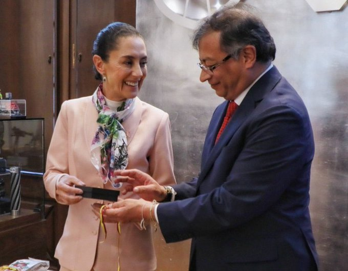

*¿Por qué ganó Claudia Sheinbaum, la todopoderosa?*

**Claudia Sheinbaum**, con el 58,58% de los resultados electorales, México se apresta a prolongar un régimen de 12 años de gobierno de izquierda inaugurado por el actual presidente **Andrés López Obrador-AMLO**. De igual manera, la coalición política de **Morena, Verde y PT** ganó la alcaldía de Ciudad de México, y 23 de los 32 estados mexicanos. Además, eligieron la mayoría calificada del parlamento, lo cual hará todopoderosa a la nueva presidenta.

En palabras coloquiales del Caribe, hubo un barrejobo de la izquierda mexicana sobre la derecha opositora. Esta formó la coalición Fuerza y Corazón alrededor del nombre de otra mujer, **Xóchitl Gálvez**, que representó al PRI, PAN y PRD.

¿Te interesa? [A juicio criminal Álvaro Uribe por 5 delitos](/articulos/a-juicio-alvaro-uribe-por-coparticipacion-criminal/)

## ¿Por qué ganó Claudia Sheinbaum?

La superpoderosa presidenta electa, Claudia Sheinbaum, iniciará un mandato de 6 años por un camino muy expedito labrado por López Obrador. Tendrá la misma estrategia política que le permitió a este mandatario mantenerse en las preferencias populares mexicanas.

Existen varios hechos que los analistas internacionales proponen para explicarse esta significativa victoria que le sacó a la candidata de la derecha 30% de diferencia. Se prevé que recibió 35 millones de votos, cinco más que AMLO en las pasadas elecciones. Una votación histórica.

¿Te interesa? [«El Congreso es popular o espera los aplausos de los bandidos](/articulos/el-congreso-es-popular-o-espera-los-aplausos-de-los-bandidos-petro/)

## 1\. Favoritismo del presidente

Claudia Sheinbaum recibió el 58,58% del electorado. Es decir, cifra cercana al 60% de favorabilidad que AMLO tiene actualmente. Esta imagen positiva la obtuvo pese a tener en su contra a los medios de la Gran Prensa Mexicana. La estrategia fue simple. Gobernó con su coalición, obtuvo resultados en su gestión económica, social y política y puso en práctica una estrategia de comunicación directa con los mexicanos.

## 2\. Buenos resultados económicos

El presidente de México **Andrés Manuel López Obrador**, AMLO, llegó al poder el 1 de diciembre de 2018. Presentó su propuesta de gobierno la Cuarta Transformación, un ambicioso programa de izquierda.

Ya con el sol a suS espaldas, AMLO tiene una aprobación que ronda el 60% según distintas encuestas. Su colega de izquierda en Colombia, Gustavo Petro, solo tiene el 30%. Precisamente el presidente colombiano dijo en su cuenta de X:

> México eligió a una progresista como la primera presidenta de su historia. Es un triunfo para el pueblo mexicano y para su democracia. Felicitaciones a mi amiga Claudia Sheinbaum, juntos trabajaremos por ver a América Latina unida y progresando.

/articulos/petrogustavo/status/1797505023238373859

¿Por qué esa aprobación a pesar de tener a los grupos de poder en su contra y la Gran Prensa? Sin duda, los hechos de gobierno a nivel económico y sociales. Los mexicanos mejoraron sus ingresos económicos en sus 6 años de gobierno. Por ejemplo, el salario tuvo un incremento real de 120% sobre la inflación y el poder adquisitivo aumentó. Es decir, que la plata rinde, después de 35 años de estancamiento.

En lo social, los resultados fueron espectaculares. Se destaca, por ejemplo, que más de 5 millones de personas salieron de la pobreza durante el sexenio. Desde hacía 16 años no se veía este hecho si se compara los hechos de 2018 y 2022.

## 3\. Bien con los empresarios

Muchos pensaban que ahuyentaría a los empresarios y la inversión extranjera. Pero no fue así. Para explicarse este comportamiento paradójico del presidente mexicano, el analista **Jorge Zepeda Patterson** le dijo a la [BBC de Londres](/articulos/mundo/articles/cv22e6g3x59o) :

> «AMLO es **conservador en lo económico y populista de izquierda en lo social**».

En efecto, en su seis años de gobierno, AMLO **mantuvo el equilibrio macroeconómico** combinado con una relativa sanidad de las cuentas fiscales y la inversión extranjera llegó a niveles históricos.

¿Te interesa? [«Atrapasueños» del ICBF, sueños son (I)](/articulos/atrapasuenos-del-icbf-suenos-son-i/)

## 4\. El discurso de **Claudia Sheinbaum**

Sin tener la elocuencia del presidente, **Claudia Sheinbaum** logró conectar con las mayorías mexicanas. Mantuvo su propio perfil sin imitar al presidente AMLO. Le puso su toque femenino y de científica.

Sin lugar a equívocos, se consolidará un nuevo régimen político de izquierda en México. Se mantendrá un modelo económico conservador y, al mismo tiempo, una ambiciosa agenda social para ir cerrando las brechas en un México que sigue siendo violento y desigual.