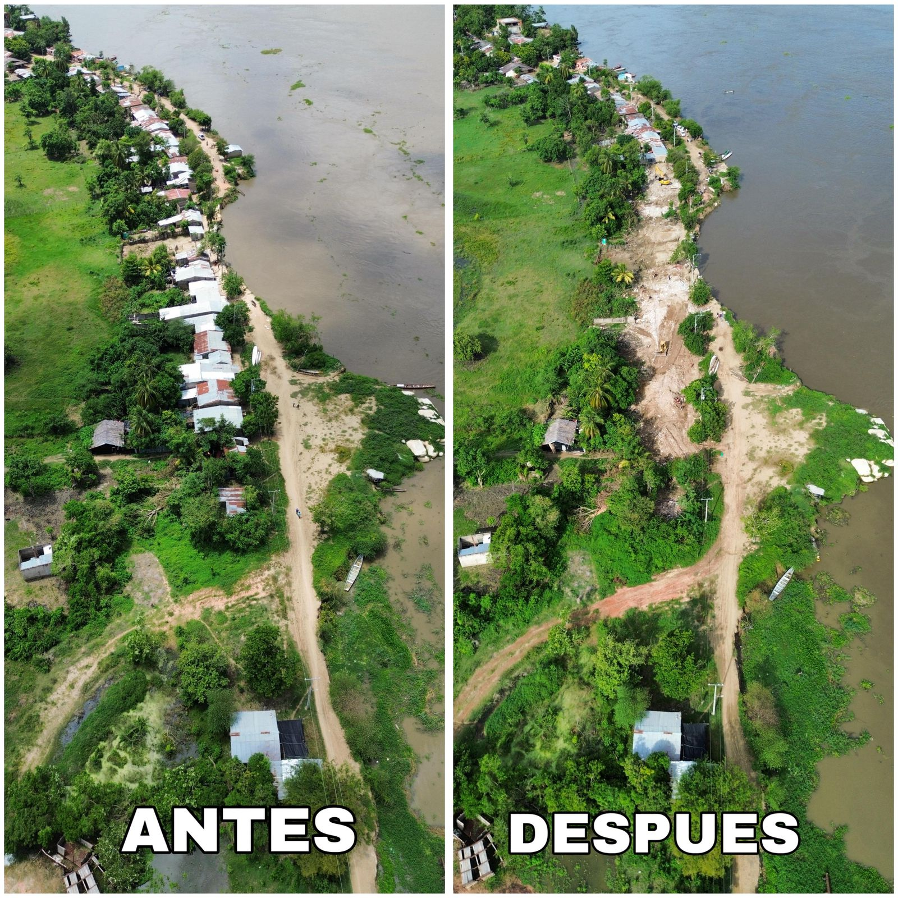
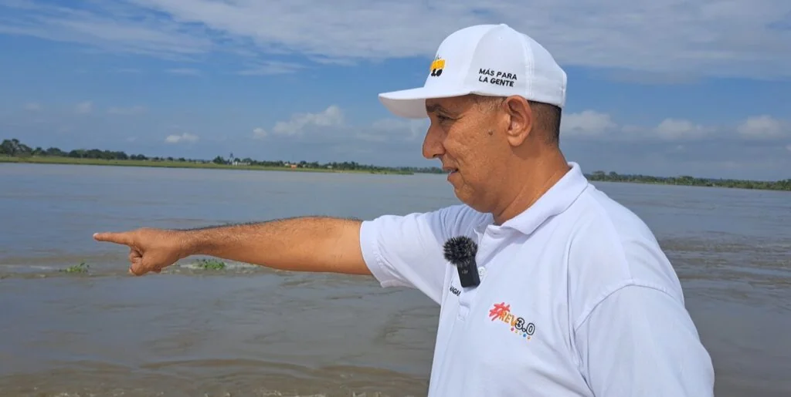
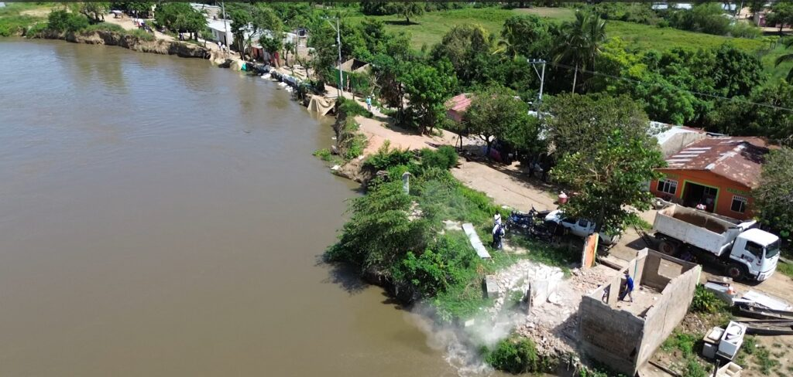

*Girardot: ¿Se conjuró el hundimiento de Magangué? A la izq. el sector más crítico de Girardot todavía con las viviendas en pie. A la der. la zona totalmente despejada. /Cortesía Prensa alcaldía de Magangué.*

¿Se conjuró el hundimiento de Magangué? Con los dineros disponibles para la **Revolución Comunitaria**, el alcalde **Pedro Alí Alí**, reubicó a las 25 familias que se encontraban en la zona crítica del barrio Girardot, al sur de la ciudad, zona ribereña del Magdalena en el departamento de Bolívar. Este asentamiento de más de 40 años, había frenado las obras de protección del dique que los contratistas de la UNGRD venían reforzando.

El desalojo voluntario de las familias afectadas, en teoría, sería un parte de tranquilidad que reporta la alcaldía, como en efecto lo hizo el alcalde Alí en entrevista exclusiva a **VoxPopuli Digital** en el sitio de las obras de mitigación. Al mismo tiempo, esta entrevista se convirtió en una visita ocular a las obras que se vienen adelantando. Vale decir que son obras de protección y otras de mitigación urgentes.

## VEA: ¿Deben estar tranquilas 30 mil familias?

https://youtu.be/uJDD9Kx1eFY

¿Se detuvo la emergencia? Vea la primera parte de este documental.

¿Te interesa? [Una bomba de 47 años evita que Magangué se ahogue](/articulos/una-bomba-de-47-anos-evita-que-magangue-se-ahogue/)

## Desalojo pacífico

*Girardot: ¿Se conjuró el hundimiento de Magangué?*

Una de las tareas obligadas de la alcaldía de Magangué era la reubicación de **25 familias** asentadas en la zona crítica del barrio Girardot. En julio de 2023, después de una inspección judicial, la [Procuraduría](https://www.procuraduria.gov.co/Pages/procuraduria-pidio-reubicar-familias-magangue-riesgo-inundaciones.aspx) conminó a la alcaldía a reubicar a **114 familias**.

Como se recordará, la entidad lideró una mesa de trabajo con autoridades municipales y funcionarios de la UNGRD. En esta se **escuchó las inquietudes y necesidades de los habitantes del sector**, que se encuentran sobre la ribera del río. Ellos reclamaron **acciones urgentes para prevenir graves afectaciones a su integridad.** 

*Emergencia Girardot: ¿Se conjuró el hundimiento de Magangué?*

Pero, esa cifra inicial se redujo a **25 familias**, ya que estaban en el sitio más complicado de Girardot. Hoy, después de un gran esfuerzo de diálogo edificante y de comprensión de la incertidumbre de las familias afectadas, desalojaron voluntariamente.

Cada representante de esas familias recibieron la suma de **$30 millones** como compensación para pagar arriendos mientras se construyen sus respectivas vivienda como parte del acuerdo. Las familias se diseminaron por diferentes sectores que igualmente se encuentra en zona cenagosa por debajo del nivel del río Magdalena.

## Tomás, el último de Girardot

*Tomás Mercado, líder del barrio Girardot: "Salimos para salvar a 30 mil familias".*

Muy temprano llegamos a la casa donde vive el último de los desalojados de Girardot: Tomás Mercado. Ahora vive en arriendo. Paga $300 mil mensuales en una vivienda humilde. No se sienten bien. Según él, la salida fue un proceso traumático, ya que la Oficina Municipal de Gestión del Riesgo y Desastre demoró demasiado para dialogar efectivamente con los voceros de los damnificados.

La visita a Tomás fue muy esclarecedora para entender al grupo de damnificados.

> Nosotros salimos para salvar 30 mil familias que viven en un inminente peligro en Magangué. Si no le hacen el trabajo que van a hacer en Girardot, se desbordaría el río Magdalena.

VoxPopuli Digital encontró a Tomás en el barrio Nueva Colombia, a 500 metros del barrio Girardot. Toda esa zona fueron aterradas y se convirtieron en los nuevos barrios subnormales de Magangué, después de la década de los 80 cuando se consolidó la Misión Holandesa que llegó en los años 70.

Por esa razón, el peligro seguirá inminente para el 30% de la zona urbana de Magangué. Así lo precisamos en un artículo publicado hace 4 años:

> Pero el crecimiento poblacional estuvo aparejado con la destrucción de un ecosistema de ciénagas y humedales ricos en aves, peces, flora, y un ejército de pescadores que surtían a Magangué y ciudades como Barranquilla y Cartagena.

## La crisis de la UNGRD

Como algo adicional, el problema quedaría latente a raíz de la crisis de corrupción de la UNGRD y de la falta de pago a muchos contratistas que, habiendo terminado las obras, la entidad no las recibe. Este fenómeno se presenta desde el gobierno de Iván Duque.

El director de la entidad, Carlos Carrillo, se comprometió con el alcalde de Magangué reanudar las obras de contención del jarillón del barrio Girardot. La obra consiste en la creación de tres espolones que tienen una altura aproximada de 18 metros desde el fondo del río Magdalena.

## El hundimiento de Magangué

*Guillermo Torres Navas, constructor Naval, manifiesta que la solución sostenible de Girardot es hacer un corte del espolón natural que se formó entre La Peña y Pueblo Nuevo de la margen izquierda del río, diagonal al barrio Girardot.*

De hecho, una vez cumplido el desalojo de la zona crítica de Girardot y de que haya salido el último de los damnificados, Tomás Mercado, su esposa y sus hijos, la UNGRD tendrá un año para entregar los tres espolones que hieren el río Magdalena. Estos espolones detendrían la fuerza del río que viene erosionando y debilitando el jarillón de Girardot.

Por tanto, el hundimiento de Magangué se detendría por ahora. Al crearse los espolones artificialmente, las corrientes se devolverían en sentido opuesto a Girardot, esto es, a La Peña, ubicada en la margen izquierda del Magdalena.

Ese fenómeno está provocando una erosión escalonada en La Peña, cuya calle principal se la viene comiendo el río Magdalena desde que se creó el principal espolón en Girardot.

Debido a esa situación, para Guillermo Torres Navas, constructor naval (hermano del periodista) la solución de la UNGRD no es sostenible con la vida del río. Pues, traslada el problema a La Peña y demás poblaciones ubicadas en la margen izquierda del río. En la próxima entrega analizaremos la propuesta de Torres, dueño de la firma Astilleros La Peña.