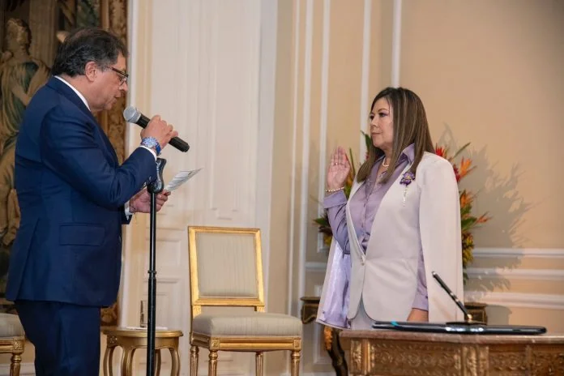
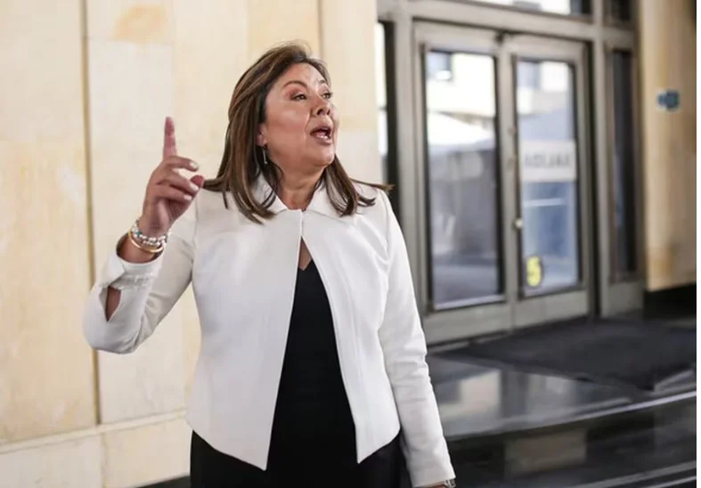
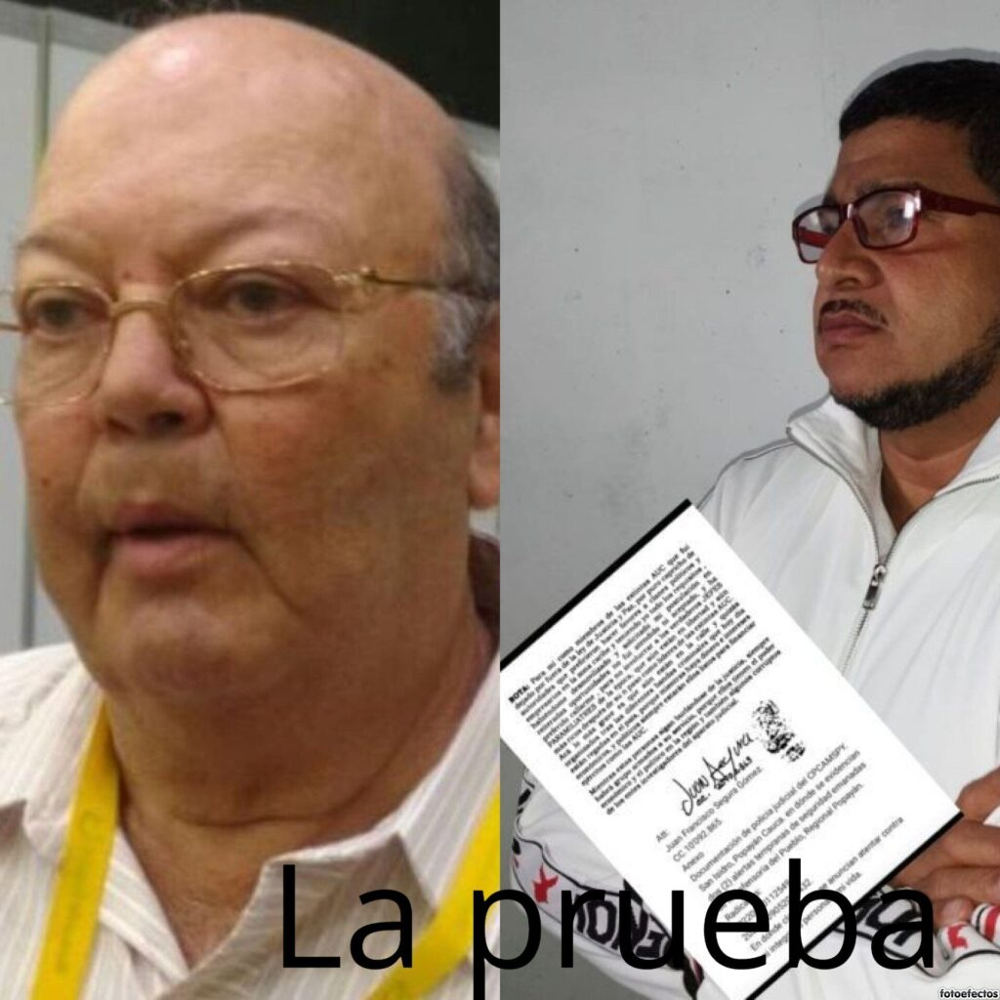
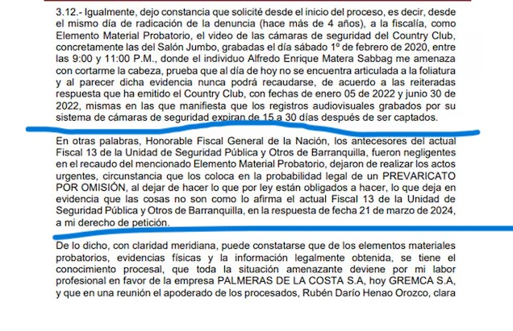
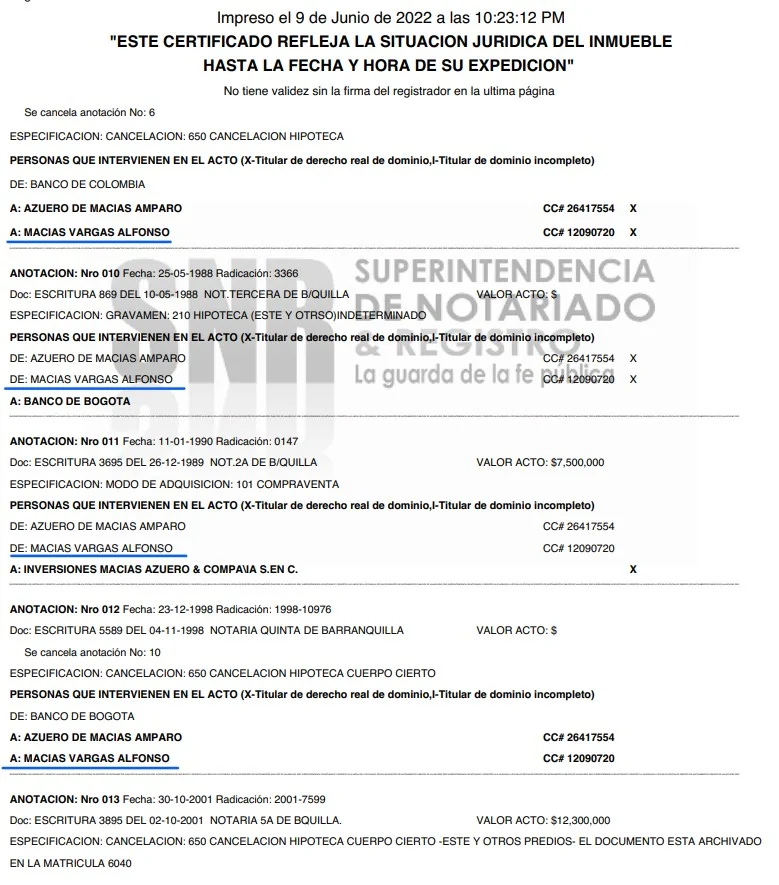
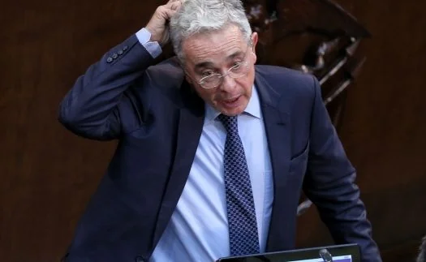

*La sombra de los Cien Días de Luz en la Fiscalía: «Los Intocables». Aquí cuando tomó posesión ante el presidente Gustavo Petro./Fiscalía.*

Uno de los indicadores de resultados que refleja la pobreza mental de la Fiscalía en Colombia es la impunidad de _**Los Intocables**_ y de los políticos comprometidos en corrupción administrativa. Los empresarios y reales promotores del paramilitarismo se mueren de viejos (caso Alfonso Macías) sin probar el rigor de la justicia, mientras sus acusadores son asesinados, amenazados o marginados. La sombra de los **Cien Días de Luz en la Fiscalía**, sin duda, es la impunidad de los herederos del paramilitarismo, de sus empresarios que la financiaron y de los políticos que le sacaron provecho a esa financiación.

Debemos saber que **Álvaro Uribe Vélez**, expresidente de Colombia, no es el único miembro de este exclusivo club de potentados que se constituyeron en _**Los Intocables**_ de la justicia, especialmente de la Fiscalía General de la Nación_―_FGN.

¿Te interesa? [Como buitres, «Los intocables» contraatacan a magistrado Roa (X)](/articulos/como-buitres-los-intocables-contraatacan-a-magistrado-roa-x/)

## La fiscal «soy yo»

*La sombra de los Cien Días de Luz. "La fiscal soy yo!. La impunidad de Los intocables*

Recordemos que la fiscal **Luz Adriana Camargo Garzón** se posesionó el 22 de marzo de 2024, después de un duro enfrentamiento entre el presidente y la Corte Suprema de Justicia. La Corte se había tomado todo su tiempo para deliberar sobre la elección de la fiscal. La única que se benefició de este interregno fue, sin lugar a equívocos, **Martha Mancera**, la que fuera la vicefiscal de **Francisco Barbosa**. Hoy, es una de las mujeres más poderosas que supo acomodar sus piezas en el **armatodo** de la Fiscalía.

Desde la fecha de posesión hasta ahora, la sociedad colombiana desconoce las **acciones pertinentes** **y efectivas** para cambiar el curso de la Fiscalía General que está condenada en servirle a círculos de poder legales e ilegales y no a la ciudadanía.

¿Te interesa? [«Yo voy a mandar»: la Fiscal al Presidente (I)](/articulos/yo-voy-a-mandar-la-fiscal-al-presidente-i/)

## Los Cien Días de Luz: La impunidad de «Los Intocables»

*La sombra de los Cien Días de Luz en la Fiscalía. ¿En qué quedó la investigación de este integrante de Los intocables dueño del matadero Camagüey? La impunidad de los intocables. Alias Alacrán lo acusó con documento en mano ante Justicia y Paz.*

Aunque la fiscal prometió un liderazgo para cumplir una misión humana por la **«dignidad y el bienestar de nuestra gente»**, hay una honda sospecha de que será lo mismo que sucedió con la fiscalía de **Francisco Barbosa**.

No obstante, con el [Memorando No. 0001 el 27 de junio de 2024](/articulos/colombia/wp-content/uploads/MEMORANDO-0001.pdf), la fiscal quiere direccionar el ejercicio cotidiano de los fiscales para unificar el proceso de investigación. Para esto, el citado documento presenta las reglas para que cada fiscal asuma **la responsabilidad de todo proceso penal**. Esto es, desde la indagación inicial hasta la conclusión del juicio. Por ende, se contempla **la posibilidad de cierre anticipado del caso.** 

¿Es suficiente el anuncio de nuevas reglas para asumir la investigación de los fiscales? Por supuesto que no. La clave del éxito de un gobierno o de una gestión administrativa es seleccionar bien a sus directores. Estos, **además de su competencia**, deben estar guiados por principios filosóficos, éticos y espirituales **centrados en el ser**. De este modo, se puede tener resultados óptimos para conseguir los objetivos esperados.

¿Te interesa? [Los Intocables siguen delinquiendo y la Fiscalía lo sabe (XI)](/articulos/los-intocables-siguen-delinquiendo-y-la-fiscalia-lo-sabe/)

## El caso de Orlando Jaiquel

*Fernando Orlando Jaiquel, después de una azarosa carrera judicial llega a la fiscalía seccional más corrupta de la costa Caribe. En Cartagena estuvo al servicio del exsenador Javier Cáceres Leal, ¿Está allí para hacerle el mandado a alguien?*

El equipo seleccionado, si bien tiene buena hoja de vida, la duda está en la competencia. Entiéndase este concepto como sinónimo de aptitud, habilidad y destreza.

La otra sospecha es que _―_al menos_―_ varios de los directores de fiscalía no tienen competencia ética para cumplir una labor clave para la superación de la corrupción administrativa. Por ejemplo, el caso documentado de Fernando Orlando Jaiquel, el nombramiento que hizo en el Atlántico. (Vea el artículo en el hipervínculo siguiente).

¿Te interesa? [¿Revolcón o farsa? Nuevo fiscal del Atlántico ¿mercenario de la justicia?](/articulos/revolcon-o-farsa-el-nuevo-fiscal-del-atlantico-un-mercenario-de-la-justicia/) (I)

## _**Los Intocables**_ amenazan y la Fiscalía calla

*Los Intocables que amenazan al magistrado Gustavo Roa Avendaño. ¿Qué dice la Fiscalía de esta investigación?*

Amenazar de muerte a un magistrado, un abogado o un periodista para que no cumpla con su papel en la lucha contra la impunidad, es inaceptable. Pero más inaceptable es la conducta omisiva de la Fiscalía que, por ejemplo, frente a tres casos (magistrado **Gustavo Roa Avendaño,** el abogado **Johnny González** y el periodista **Lucio Torres**), pese a existir denuncias con material probatorio suficientes, **no ha hecho absolutamente nada**. En el caso particular de este periodista, como persona protegida, las amenazas de muerte son recurrentes por aquellos que se creen afectados por el periodismo que ejercemos.

*Apartes de la denuncia presentada por el reconocido académico y jurista Johnny González contra algunos de Los Intocables.*

En tanto que el destacado académico y abogado penalista, **Johnny González**, fue amenazado de muerte por _Los Intocables_ que tuvieron la mayor participación accionaria de Palmeras de la Costa. Específicamente, presentó denuncia penal por amenaza de muerte contra **Rafael Antonio Matera Lajud, **Alfredo Enrique Matera Sabbagh** y Enrique Alfredo Pérez Matera**, nombrados y renombrados por **Salvatore Mancuso** y otros jefes paramilitares en **Justicia y Paz**.

## Finca Potosí, el cementerio paraco

Juan Francisco Segura Gómez, alias **‘Mario’** o **‘El Alacrán**’, declaró ante Justicia y Paz que el empresario Alfonso Macías Vargas, financió las acciones de los paramilitares. Este material probatorio lo tiene la Fiscalía desde antes de las compulsas de copias de los tribunales de Justicia y Paz.

> “En sentencias condenatorias del **18 de diciembre de 2018**, y 16 de diciembre de 2019, proferidas por la Sala de Conocimiento de Justicia y Paz del Tribunal Superior del Distrito Judicial de Barranquilla, en contra de desmovilizados del **Frente José Pablo Díaz del Bloque Norte de las AUC**, la referida sala procedió a **compulsar copias** de soportes y documentos procesales en los que se vinculan cómo presuntos paramilitares y/o auspiciadores de las causas delincuenciales(…)”

El mentado palmicultor y ganadero, además, dedicó su vida al crimen de lesa humanidad, específicamente a la financiación de las acciones del paramilitarismo. Aunque Alfonso Macías Vargas murió el año pasado, su hijo **Alfonso Macías Azuero**, debe ser vinculado a estos procesos de responsabilidad penal. Fue copartícipe para eliminar pruebas de crímenes de lesa humanidad y heredero de los bienes muebles, inmuebles y dineros producto de las actividades ilegales de su padre con las AUC, y también vinculado con las amenazas de muerte contra el Magistrado de Justicia y Paz **Gustavo Roa**.

*En esta finca de Potosí (Nro Matrícula: 190-6041) la Fiscalía verificó la existencia de fosas comunes producto de las actividades paramilitares de Alfonso Macías Vargas. La remoción de los cadáveres la hizo junto a su hijo, Alfonso Macías Azuero, según declaraciones de los exjefes paramilitares.*

¿Te interesa? [Los Intocables siguen delinquiendo y la Fiscalía lo sabe (XI)](/articulos/los-intocables-siguen-delinquiendo-y-la-fiscalia-lo-sabe/)

## Los Cien Días de Luz y las amenazas

Incluso, el magistrado de **Justicia y Paz, Gustavo Roa Avendaño**, ponente de dos **macrosentencias icónicas** contra el **Frente Norte de las Autodefensas Unidas de Colombia**, sufrió las amenazas de uno de los herederos de Los Intocables, **Alfonso Macías** **Vargas**, a quien en vida se le acusó de ser el autor intelectual del asesinato del **exmagistrado Enrique Camilo Aarón Noguera**. Macías murió el año pasado.

La Fiscalía se destacó en su conducta omisiva para investigarlo.

En el 2003, Macías Vargas fue condenado en primera instancia por el delito de concierto para delinquir que terminó con el asesinato de **_Juan_ Aarón** **Noguera**. Y, después de tres meses de dicha sentencia, el exjefe paramilitar **Adán Rojas** asesinó a su hermano **Enrique Camilo Aarón Noguera**, exmagistrado del Consejo Superior de la Judicatura de Santa Marta y profesor universitario. En Justicia y Paz declaró que fue por orden de Alfonso Macías. El magistrado ponente hizo el correspondiente traslado a la fiscalía. Y hasta ahora, no sucede nada.

¿Te interesa?  [«Los intocables» que amenazan magistrados, son protegidos por la Fiscalía (IX)](/articulos/los-intocables-que-amenazan-magistrados-son-protegidos-de-la-fiscalia-ix/)

## ¿Solo discurso?

En el discurso de posesión, **Luz Adriana Camargo**, dijo:

> «(...) pero (mi Fiscalía) será también implacable con los funcionarios que se involucren en actos de corrupción o desvíos de poder. La nuestra será una misión humana, una misión por la dignidad y el bienestar de nuestra gente».

¿Un funcionario que ha estado al servicio de la clase política dominante es garantía para impartir justicia? Apenas Luz Adriana Camargo publicó la lista de sus directores de fiscalía, **VoxPopuli Digital** presentó un informe sobre las dudas que rodean a algunos de sus nuevos funcionarios. Pero no escuchó ni tampoco respondió la petición ciudadana para el control social.

El anuncio más relevante que prometió para materializar la misión de su Fiscalía fue:

> «La priorización se hará de la mano del personal de las 35 direcciones seccionales del país».

Sin embargo, _del dicho al hecho hay mucho trecho_, decía mi madre. En estos Cien Días de Luz en la Fiscalía, tampoco se siente el cambio. Lo que sí se ve son las sombras.

## La misma chancleta

Otra de las cosas que decía **Teresa Moreno** cuando su hijo, por ejemplo, prometía y no cumplía: _¡Estás como las demás chancletas!_ Los litigantes consultados indican que realmente tampoco se siente el cambio en el ente acusador.

A decir verdad, las cosas no son fáciles para la fiscal Luz Adriana Camargo. Lidiar con un ente compuesto por más de 23 mil empleados, 10 sindicatos y múltiples divisiones se necesita buen tacto y buen trato. Pero, sobre todo, inteligencia.

Sin embargo, lo más grave son los diferentes intereses que se mueven alrededor de la Fiscalía. Estos intereses están cruzados, inclusive, con grupos mafiosos que mantienen en nómina a fiscales corruptos. Las investigaciones penales no avanzan contra fiscales y demás funcionarios de la Fiscalía sospechosos de ser miembros de esos grupos de poder.

## La impunidad de «Los Intocables»

*Álvaro Uribe Vélez, el intocable No 1. ¡A juicio!*

Mientras la Fiscalía se transforma en una hidra, carcomida por la corrupción, afuera el hampa se apodera de ciudades y campos. Las investigaciones penales no avanzan. Se pierden en la bruma con dilación, negligencia e impunidad. Muchos de sus fiscales hacen parte del complejo mundo de la ilegalidad. Y si responden, la respuesta es tardía. Y si aceleran, es por intereses políticos.

El vencimiento de término es uno de los recursos recurrentes para liberar a los que pueden comprar los favores de funcionarios corruptos. Y regresamos al viejo círculo. Como la justicia no opera, se premia la impunidad y esto trae más delitos. ¿La fiscal seguirá callando frente a la petición de la prensa?

Los Cien Días de Luz en la Fiscalía están matizados, sin duda por la impunidad de «Los Intocables». El principal de ellos es el expresidente **Álvaro Uribe Vélez**. Pero en todas las 32 seccionales hay decenas de intocables, especialmente en la costa Caribe y en las zonas donde el paramilitarismo fue amo y señor de esos territorios.