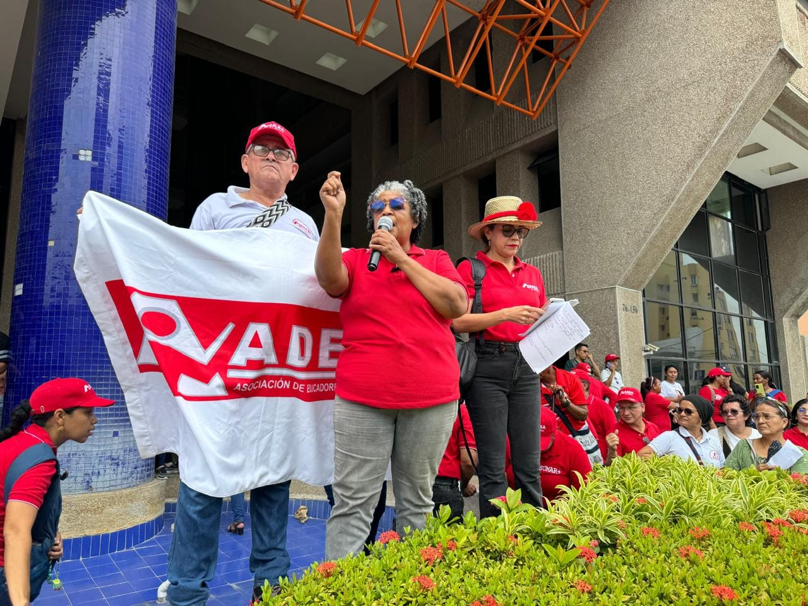
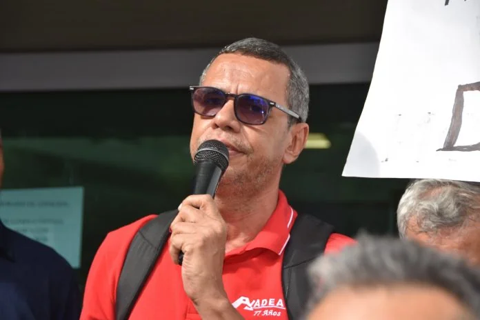

*Marinelda Salas Contreras, en un mitin, es la principal abanderada de la expulsión de Alberto Ortiz.*

¿Es un difamador de sus propios compañeros el expresidente y directivo sindical, Alberto Ortiz? La junta directiva de la Asociación de Educadores del Atlántico**―**Adea**―** filial de Fecode, expulsó al dirigente docente de Barranquilla. Lo acusó de violentar flagrantemente el mandato estatutario. Este hecho sin precedentes, ocurrió a 6 días de las elecciones para cargos directivos y delegados previstas para el 31 de julio.

Es importante aclarar que a Ortiz Saldarriaga se le aplicó la justicia sindical amparada en los estatutos de la ADEA en el marco de la autonomía sindical. Al respecto, la sentencia **C-617/8**, considera que

> «_Así en lo atinente a la autonomía sindical el artículo 3º del Convenio 87 de la OIT enuncia distintos aspectos en los cuales se concreta, al indicar que las organizaciones de empleadores y trabajadores tienen derecho a elegir libremente sus representantes, a organizar su administración y sus actividades, a formular su programa de acción y a redactar sus estatutos y reglamentos administrativos»._

_En ese contexto,_  se le brindaron las garantías procesales del caso, según el **Juzgado Cuarto Penal Municipal de Barranquilla** de Causas Mixtas con Funciones de Conocimiento.

¿Te interesa? [Filial de FECODE ejerce persecución política contra líder sindical (I)](/articulos/filial-de-fecode-ejerce-persecucion-politica-contra-lider-sindical-i/)

## Fallo de tutela

Una de esas garantías alegadas ante esa instancia judicial, es el **principio del debido proceso**. El juez, contrario al alegato del directivo de la ADEA, manifestó que se le garantizó el derecho fundamental a la defensa, ya que se le llamó a descargo.

Por ende, la anterior afirmación está sustentada con el fallo del Juez que desestimó la solicitud de amparo de sus derechos fundamentales alegados por Ortiz en la tutela que presentó contra los directivos de la ADEA.

> «En tal sentido, se tiene que, a la luz de la jurisprudencia constitucional, anteriormente expuesta, al accionante no se le violó el derecho al debido proceso y asociación sindical, pues, cuenta con todos los medios de defensa ordinarios y administrativos para su  
> defensa.»
> 
> **Juzgado Cuarto Penal Municipal de Barranquilla** de Causas Mixtas con Funciones de Conocimiento. Fallo de tutela de primera Instancia del el 4 de julio de 2024.

Ante esa situación, al juez no le quedó otra salida sino desestimar la pretensión de Ortiz Saldarriaga.

¿Te interesa? [Prácticas antisindicales que carcomen a Fecode (II)](/articulos/practicas-antisindicales-al-interior-de-filial-de-fecode/)

## La expulsión por difamador

*Por difamador, expulsado expresidente de la ADEA.*

El fallo de tutela le dio piso jurídico a la junta directiva para continuar con el **proceso disciplinario** que concluyó el pasado 24 de julio con la resolución de expulsión del procesado a la luz de los estatutos. En cuyo resuelve se dice taxativamente:

> «... Esta corporación procede a expulsar de la Junta Directiva de la Asociación de Educadores del Atlántico, (ADEA) y de la Asociación de Educadores del Atlántico, (ADEA) al miembro de la Junta Directiva Asociación de Educadores del Atlántico, (ADEA) señor ALBERTO ORTIZ SALDARRIAGA, conforme a lo expuesto en las consideraciones de esta decisión.»

Específicamente se le aplicó, entre otros, el **artículo 69** que se refiere a las **causales de una expulsión**:

*   Deslealtad sindical de acuerdo con los principios generales y universales del sindicalismo.
*   Actividades divisionistas y descrédito que afecten el buen nombre y prestigio de la asociación y atente contra la unidad de los afiliados y de la organización sindical.
*   Utilizar mecanismos, medios de quejas, calumnias, reclamos, críticas a afiliados, directivos, sub directivos y delegados que atenten contra su integridad física y moral.

De acuerdo a los directivos de la ADEA, están actuando según lo establecido estatutariamente. Los otros recursos están previstos en el escenario de la justicia ordinaria.

## Investigación y pruebas

En efecto, **el 15 de junio**, la junta directiva le abrió un pliego de cargos al profesor Ortiz por considerar que violó los principios sindicales en detrimento de la convivencia y la moralidad de sus compañeros. Este pliego se sustentó en los resultados de una **investigación interna** sobre una **publicación apócrifa** que comenzó a circular el **7 de junio de 2024** en el portal **“Opinión y Noticia”**.

El principal hallazgo de la investigación interna se refiere al hecho de que **el dominio del portal estaba a nombre de Alberto Ortiz Saldarriaga** con su respectivo número de cédula.

Llama la atención que la mentada publicación no estaba firmada ni tampoco sustentada con material probatorio o fuentes debidamente identificadas. En ella se cita los informes que publicamos en **VoxPopuli Digital** sobre el tortuoso proceso de despedido de 6 trabajadores del sindicato. Con 5 de ellos debieron de conciliar luego de recibir fallos laborales negativos en primera y segunda instancia. Por la misma vía viene el caso de **Aura Márquez** a quien se le ha desestimado su ánimo de conciliación. (En la próxima entrega sobre ADEA presentaremos los cuestionamientos del juez laboral a la presidenta del sindicato **Marinelda Salas Contreras**, quien no supo responder a las inquietudes del togado).

¿Te interesa? [Tesorero de Fecode en manos de un directivo cuestionado (III)](/articulos/tesoro-de-fecode-en-manos-de-un-directivo-cuestionado/)

## Afirmaciones temerarias

Sin embargo, lo que le complicó la situación a Ortiz fueron sus afirmaciones, que a juzgar de la junta directiva, son temerarias, sin sustentos probatorios. En este sentido, citaremos en extenso uno de los apartes de la resolución de expulsión del 24 de julio de 2024:

> _(**Alberto Ortiz Saldarriaga**) estaría atentando en contra de la honra y buen nombre, de los miembros de la junta directiva de la Asociación de Educadores del Atlántico – ADEA, la señora presidenta **Marinelda Salas Contreras**, **Henry Rada Varela, Carlota Gastelbondo, Indira Benavides, Carlos Noriega Pertuz, Eduardo Castillo Vertel**, y en contra de los ejecutivos de nuestra organización matriz FECODE, los señores: **Luis Grimaldo Mejía, María Eugenia Londoño, Domingo Ayala** y en contra de los ex miembros de la Asociación de Educadores del Atlántico – ADEA, los señores: **Luis Grubert, Adolfo Quintín y Medardo Drago**._»

El artículo habló de una red de corrupción sobre el sistema de salud docente que favorece a los citados directivos y exdirectivos sindicales de la ADEA y de FECODE. Por tanto, se infiere que de dichas afirmaciones, sin material probatorio y sin fuentes credibles que las sustenten, **se traducen en hechos difamatorios, injuriosos y calumniosos que atentan contra la convivencia sindical**.

Como el artículo era apócrifo, ADEA hizo la investigación. Tal como se citó, el dueño del dominio de la web era su compañero de lucha sindical, Alberto Ortiz. Esta es la razón por la cual se procedió a abrirle un pliego de cargos que terminó en su separación de la organización gremial de los maestros.

## Ortiz ¿difamador?

¿Qué dijo la otra cara de la moneda? Nos remitimos a un comunicado expedido oficialmente por **Alberto Ortiz**. El principal argumento del encartado es considerar que la resolución de expulsión del 24 de julio no está ejecutoriada, puesto que solo se le notificó el 25 de julio. Estima que tiene 5 días para recusarla, es decir, usar el recurso de reposición que debe presentarlo ante la misma junta directiva.

Pero, al profesor se le olvida que en un video publicado el mismo 24 de julio respondió a la resolución de expulsión. Allí no se refirió a la verdadera razón de su expulsión. En el derecho penal se refiere al tipo de **“injuria y calumnia”**, En término estatutarios (art. 69) es un comportamiento desleal, divisionista y calumnioso que atenta contra la integridad física y moral de los señalados.

El problema es que **Alberto Ortiz** es candidato a directivo de la ADEA y las elecciones se realizarán este 31 de julio. Si presenta el recurso de reposición, la junta directiva va a confirmar la expulsión. Pero, si no la presenta antes del 31 de julio, la expulsión quedaría confirmada sin utilizar los recursos estatutarios.

## ¿Difamador o víctima?

Ortiz ¿es un difamador o una víctima de la injusticia sindical? Depende de la arista desde donde se observe su comportamiento. Sin embargo, él era directivo. Compañero de las presuntas víctimas de sus afirmaciones falaces. Si bien es cierto que su postura sobre el tema de la salud de los docentes es muy criticable por parte de la mayoría, tampoco es dable expulsar a un miembro por sus críticas. Esto sería una violación a la libertad de expresión. Pero, en el caso de Ortiz se observa que sus afirmaciones no tuvieron sustentación fácticas, tal como se demostró en la misma investigación de los directivos de la ADEA.

De acuerdo a la Fiscal de Fecode, Fiscal, **María Eugenia Londoño Ocampo** existe una corriente de esta organización que defiende el sistema anterior. Incluso, hasta presentaron una proposición que iría en contravía a lo dispuesto por el gobierno del presidente Gustavo Petro.

Por tanto, Alberto Ortiz quedaría por fuera de esta contienda electoral, expulsado y sin poder usar las garantías constitucionales. O sea, que el acusador quedará sumido en el peor de los mundos.

El 25 de julio de 2024, en comunicado de prensa, **se presenta como una víctima.** ¿El motivo? “Ser el único crítico del tema de salud”. Al tiempo que se victimiza, llamó a los maestros para que voten por él y voten negativamente a la dirigencia sindical que pretende reelegirse en los cargos de dirección. Pero también arremete contra la actual junta directiva reclamando el respeto del debido.

En ese escrito se le olvidó citar la decisión del juez de derechos fundamentales que le negó el amparo y le dio fuerza de legalidad el proceso disciplinario que se le siguió respetando el derecho a la defensa. Tampoco refuta los hechos que motivaron su expulsión.

## Con la misma vara

En definitiva, **Alberto Ortiz Saldarriaga**, cuando fue presidente de la ADEA en el período anterior, omitió resolver la petición de conciliación de la extrabajadora despedida **Aura Márquez** . Cuando el periodista lo llamó, adujo la misma tesis planteada por la burocracia sindical que ahora critica y denigra por haber sido expulsado del sindicato. En esa oportunidad dijo que fue un problema provocado por el presidente (Medardo Drago) que les formalizó la situación laboral a los trabajadores de órdenes de prestación de servicios.

Hoy, que ya no disfruta las mieles del poder y es víctima de su propio invento, su ego lo hizo caer en error. El poder no corrompe, lo que corrompe es la mente egotista del humano alienado. Un hecho grave cuando se trata de docentes formadores de hombres y mujeres de los sectores sociales más empobrecidos.