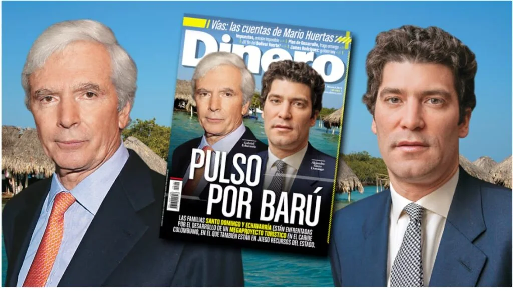
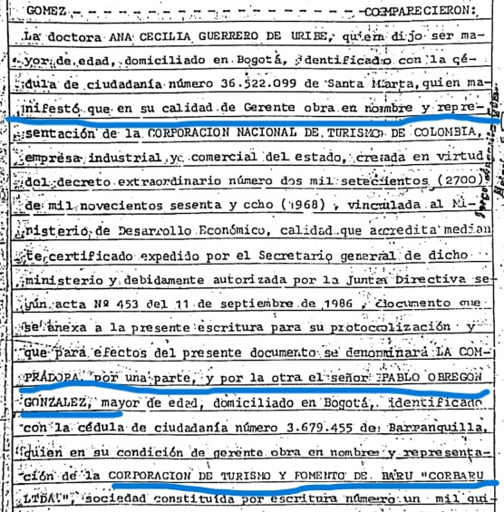

*Ricos empresarios estafaron al Estado y despojaron a nativos de Barú. La revista Dinero omitió decir que los dos empresarios estafaron al Estado/Portada de Dinero.*

¿Cómo ricos empresarios **estafaron al Estado** mediante el despojo violento a **nativos propietarios** de predios en Barú? No todos los nativos de esta isla vendieron sus predios, como hasta ahora se pretende presentar ante la justicia, el Estado y la opinión pública. Para demostrar esta fehaciente verdad, nos dimos a la tarea de seguirle el rastro al afrodescendiente **Otilio Ortega**, quien fue el principal **calanchín** de estas compras dolosas y espurias. Un rastro que nos lleva a **«**los _hombres de atrás_**»**, ricos empresarios que amasaron fortunas mediante _megaestafas_ contra el Estado y el despojo violento de los nativos.

En efecto, esta investigación no solo parte del papel jugado por **Otilio Ortega** sino de las grandes empresas que sentaron sus lares en la paradisíaca isla de Barú tras el oro de la industria del turismo. La pretensión era convertirla en una super **Punta Cana**. O un megaproyecto como la **Riviera Maya** con inversión del Estado y de privados.

No obstante, como era una inversión netamente colombiana, los ricos empresarios nacionales usaron sus influencias políticas para abultar sus riquezas a expensa del pillaje contra el presupuesto del Estado. Es la típica conducta del _**capitalismo sanguijuela**_ que caracteriza la economía del país. Las fortunas de estos emprendedores provienen de sus _relaciones incestuosas_ con la Nación.

¿Te interesa? [Se revive debate sobre despojo de Barú (I)](/articulos/se-revive-debate-sobre-despojo-de-baru-i/)

## La prueba reina

*Escritura 1541 del 27 de abril de 1972 donde Pablo Obregón vendió a la Corporación Nacional de Turismo el predio El Pajal, propiedad de Tomás Barcasnegras. El predio nunca lo vendieron y lo poseen actualmente.*

Por primera vez se presentarán casos emblemáticos con suficiente material probatorio de cómo los nativos propietarios de Barú que jamás vendieron, los despojaron con triquiñuelas y violencia. La misma institucionalidad del Estado la utilizaron para esta finalidad. Así lo confirmaron los jefes paramilitares Juancho Dique y Salvatore Mancuso en Justicia y Paz y la JEP.

En esta investigación presentaremos en forma inédita la prueba reina que determinó el asesinato de la abogada **Mauricia Lafong de la Espriella**. Ella llevó el proceso jurídico de los predios de un nativo propietario, **Tomás Barcasnegras**, quien fue entrevistado por VoxPopuli Digital.

Por tanto, la investigación muestra que uno de los asesinatos icónicos asociados a la reclamación de tierras fue la muerte de la abogada **Mauricia Lafong**. Llama poderosamente la atención que días antes de su asesinato, ocurrido el **28 de mayo de 2005** en el barrio Los Alpes, **había descubierto la prueba reina que presentaremos en VoxPopuli Digital**. Presuntamente, los involucrados de este acto fraudulento, son los **Echavarría Obregón** y los **López Obregón**, quienes adquirieron el predio El Pajal (contiguo a Playa Blanca) para vendersela a Fonade.

Por esa razón, al parecer, se produjo el crimen contra la abogada de los **Barcasnegras**, propietarios de El Pajal. El asesinato se produjo al lado de su hijo **Carlos Enrique Gómez Lafont**. Hasta ahora se desconoce quién ordenó ese homicidio.

¿Te interesa? [Despojadores de Barú: ¿Estado, Santo Domingo y Echavarría? (II)](/articulos/despojadores-de-baru-estado-santo-domingo-y-echavarria-i/)

## La fiscalía no avanzó

En esta investigación, mostraremos cómo la Fiscalía dictó medida de aseguramiento contra 14 sujetos sindicados de pertenecer a una organización sicarial de Cartagena. Pero no avanzó.

Uno de los sospechosos de ser autor material, lo asesinaron 5 años más tarde. Se trata de **Aldrin Roberto Char Puello**. En ese tiempo, la Fiscalía dijo que se identificaron los 14 presuntos miembros de esa banda criminal, que serían los responsables de los homicidios de Lafont de la Espriella y de Gómez Lafont. Pero la investigación quedó enterrada sin que se supiera más nada.

Ese hecho, puso en alerta al abogado **Héctor Pérez Fernández**, apoderado de varios nativos propietarios. El también veedor, no deja de expresar el temor reinante por esta situación que amerita una atención inmediata e integral del gobierno distrital y nacional. A su turno, los abogados de Barcasnegras, entre ellos **John Cadena** **Galvis**, también se encuentran atemorizados por los antecedentes del hecho.

¿Te interesa? [Despojo secular, tensión y miedo en Barú (III)](/articulos/tension-miedo-y-despojo-secular-en-baru/)

## Otilio Ortega: **«**Negro domesticado**»**

Empecemos por decir que Otilio Ortega fue un nativo de Barú que llegó a ser inspector de policía y el afrodescendiente más poderoso de esa isla. Apenas sabía leer y escribir. Pero, el dato diferencial de este nativo: todo ese poder era producto de su papel de negro mentalmente esclavizado y, al mismo tiempo, domesticado por los despojadores.

> **«**Los negros domesticados **vivían en la casa del amo, vestían bastante bien, comían bien porque comían de su comida**, las sobras que él dejaba. Vivían en el sótano o en el desván, pero vivían cerca del amo y querían al amo más de lo que el amo se quería a sí mismo**»**.
> 
> Malcom X. Mensaje a las bases.

A diferencia de aquellos negros esclavizados de Cartagena del siglo XVIII y XIX, Otilio fue un **_negro domesticado_**. Nunca conoció la libertad. **Malcom X**, el gran líder de la revolución de los derechos civiles de Estados Unidos junto con el reverendo **Martin Luter King Jr**, fue un duro crítico contra sus hermanos de orígenes que le servían a sus antiguos amos. Los dos dirigentes de la lucha por los derechos civiles de los negros, fueron asesinados por una sociedad intolerante y violenta que vivió de la discriminación racial por varios siglos.

¿Te interesa? [Despojo de Barú, la prueba reina (IV)](/articulos/el-despojo-de-baru-se-produjo-desde-el-estado-iv/)

## **Pablo Obregón González**: el amo

El español **Pablo Obregón González**, desde el aeropuerto Simón Bolívar de Barranquilla, llegó en un pequeño avión **a Punta Seca Barú** en los años 60. Como lo probaremos, todo hace indicar que Obregón era la punta lanza de los **Santo Domingo**, quienes muy pronto se convirtieron en los nuevos amos de la isla**.** A su llegada, Obregón encontró a un gran guía. Se trataba de Otilio Ortega. De repente, este nativo se convirtió en el puente directo con la población barulera. Su trabajo fue guiar a sus nuevos amos para la compra de pequeñas cosechas de los nativos. En un proceso de transacción comercial dominante, con esa conducta, inició una **«**compra masiva**»** de predios. Utilizó una figura jurídica predilecta: La **prescripción adquisitiva**.

Tal como lo señala la ley, es una de las formas de adquirir el **dominio** de un predio. Se da cuando se posee el bien. Es decir, cuando se actúa como el dueño del bien sin serlo, en un tiempo determinado, y el verdadero dueño de este no lo reclama en ese período.

De manera que **Pablo Obregón González** para iniciar un proceso de despojo de los **nativos propietarios**, por ejemplo, de la hacienda **Santa Ana**, se valió de ese recurso jurídico de la **prescripción adquisitiva**. Pero también puso en práctica un **patrón criminal** para despojar con apariencia de legalidad a una cantidad indeterminada de nativos propietarios. Otros, sí vendieron sus propiedades al consabida comprador que terminaron en prescripción adquisitiva.

Sin embargo, sorpresa causa cuando se descubre que **Otilio Ortega aparece en la mayoría de los principales procesos de despojo de ese corregimiento** utilizando en forma falsa ese mecanismo de legalización de la propiedad. (En la siguiente entrega se mostrará detalles de los patrones criminales de este despojo y el papel de Ortega).

## Corbarú Ltda: Ricos empresarios

En este trabajo de investigación se citarán varios casos. Uno que está muy bien documentado y hace parte de un proceso penal contra los Echavarría y Santo Domingo. Se refiere a la adquisición fraudulenta de predios que luego le vendieron a Fonade y a la Corporación Nacional de Turismo -CORTURISMO. Los **Santo Domingo**, **Obregón**, **López Obregón** y los **Echavarría** **Obregón**, adquirieron estas tierras a través de un proceso plagado de ilegalidad. El instrumento de compra de los predios fue la Corporación de Turismo y Fomento Barú-Corbarú Ltda. Le vendieron a Fonade, entidad del Estado, para un proyecto turístico multimillonario que se llamó **Playa Blanca Barú**, y luego entraron en el negocio turístico a través de **Inmobiliaria Barú Sas**.

La venta de varios predios la hizo a Fonade por la suma de $87 mil millones del año 2007, tal como se demostró en el debate citado por el congresista de entonces, **Samuel Arrieta**. Allí comparecieron, entre otros, el ministro de Comercio, Industria y Turismo, **Luis Guillermo Plata**, el alcalde de Cartagena de Indias, **Nicolás Curi** (QEPD), el _Fiscal General de la Nación, **Mario Iguarán Arana**,_ el director de Fonade, **Luis Fernando Sanz González**, Capitán de Fragata Puerto Cartagena,

Recordemos que **Playa Blanca Barú** tenía tres socios: 1) El Fondo Financiero de Proyectos de Desarrollo (**Fonade**) con **49%**. 2) **Valorem,** sociedad del Grupo Santo Domingo con **26,47%** y 3) **Inmobiliaria Barú** (24,53%), de propiedad de **Gabriel Echavarría**, familia de los dueños de la Organización Corona de Antioquia.

¿Te interesa? [El despojo de Barú por Santo Domingo y la vida del restituidor](/articulos/el-despojo-de-baru-por-santo-domingo-y-la-vida-del-restituidor/)

## La justicia ¿cómplice de los ricos empresarios?

Hasta ahora, reina la más completa impunidad. La justicia no le ha puesto cortapisa a esta cadena delincuencial que han formado verdaderos carteles inmobiliarios. Cuentan con la complicidad de la misma Fiscalía. Las denuncias las archivan. Los procesos jurídicos no caminan.

Desde mayo del 2022, por ejemplo, Tomás Barcasnegras denunció penalmente a los que les quieren despojar su predio en Barú. El caso se mantiene empolvado. La anterior directora de Fiscalías de Bolívar, **Iveth Hernández Sampayo**, se puso al servicio de la ralentización de la justicia por cerca de 10 años. Ahora, con la nueva directora **Elizabeth Gómez Mejía**, se espera que los procesos recuperen el tiempo perdido. Las víctimas presentaron una petición a la fiscal Luz Adriana Camargo para que se priorice el caso de Barú.