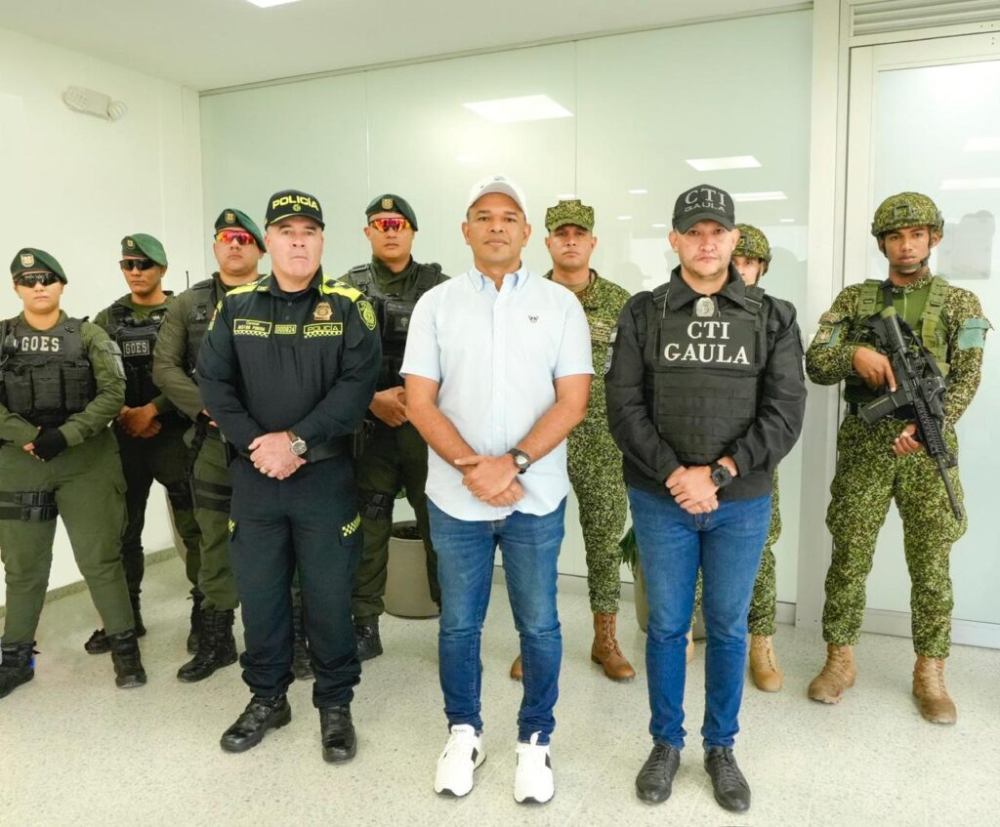
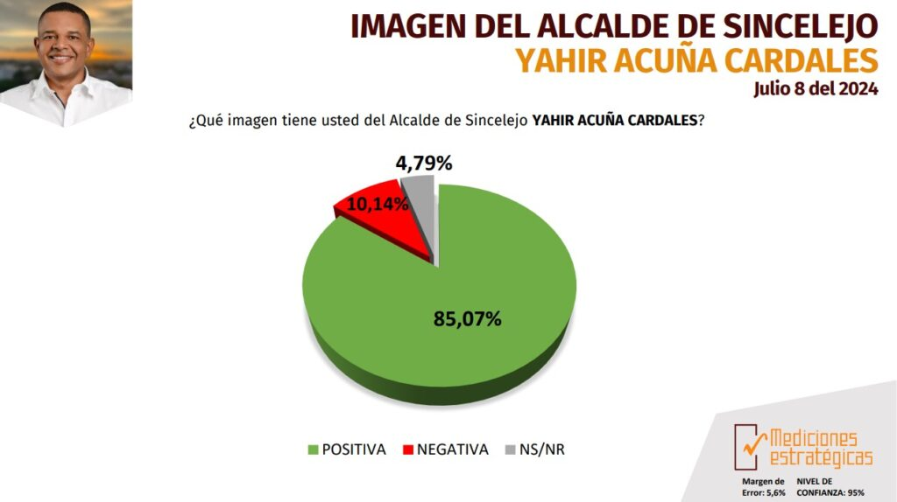
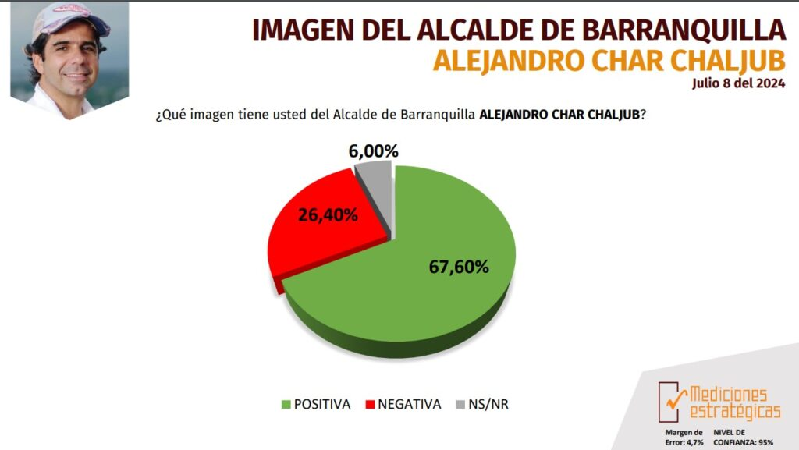
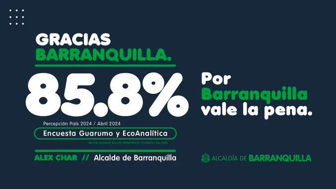
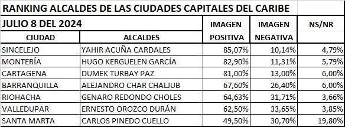

*Dumek Turbay ascendió y Alejandro Char perdió 26,1% en solo tres meses. ¿Comienza a desmoronarse el Califato Daeschariano?*

Se desploma Char. En tres meses **perdió 26,1%**. ¿Por qué tanto en poco tiempo? Es la principal noticia de la Gran Encuesta del Caribe (documento no disponible) del mes de julio. La medición del alcalde de Barranquilla nos trajo una gran sorpresa: La imagen positiva (66%) de **Alejandro Char Chaljub** está lejos del 93% de abril. Contrario a ello, la imagen positiva (**81%**) del alcalde de Cartagena **Dumek Turbay Paz** creció en forma sostenida.

En este informe analizaremos las causas de los hallazgos de esta medición del mes de julio sobre la opinión positiva y negativa en las ciudades capitales de la región.

¿Te interesa? [Petro, Char, Galán y Fico, bajan; Dumek, el mejor alcalde](/articulos/petro-char-galan-y-fico-bajan-dumek-el-mejor-alcalde/)

## La otra sorpresa

La otra sorpresa se refiere a **Jahir Acuña**, alcalde de Sincelejo. En abril alcanzó 88,1%. Aunque en julio cayó tres puntos con 85%, su imagen positiva sigue siendo muy alta, conservando el primer lugar en la costa Caribe.

Ese porcentaje de imagen positiva, indica que no hizo mella los reparos que le hicieron por sus escuadrones de seguridad privada. Probablemente en Sincelejo se desconoce su vinculación en las investigaciones relacionadas con lavado de activos, enriquecimiento ilícito y corrupción administrativa. (Espere un seriado sobre **Jahir Acuña** y su relación con **«Los Rastrojos»**).

Además, parece que la percepción ciudadana no alcanza a dimensionar los presuntos **grandes negociados** en la contratación pública para la prestación del servicio de vigilancia en las instituciones educativas, los puestos de salud y demás edificaciones oficiales del municipio. Igualmente el servicio de aseo y del suministro del **Programa de Alimentación Escolar-PAE**.

*Yahir Acuña (camisa blanca), alcalde de Sincelejo. Lo rodea la Policía, la Armada, el Gaula, el Ejército y la Fiscalía./Prensa alcaldía de Sincelejo.*

## Yamil, lidera

En la próxima entrega, analizaremos los resultados de la gobernación donde **Yamil Arana Padauí** aparece liderando la aprobación de su administración y imagen positiva de los mandatarios seccionales de la región Caribe.

## La Gran Encuesta del Caribe

La citada encuesta fue dirigida por el economista **Oscar Brieva**, gerente de **Mediciones Estratégica** avalada por el Consejo Nacional Electora―CNE.

Se adjunta los resultados de la La Gran Encuesta del Caribe (documento no disponible) (déle clic) sobre la imagen(positiva y/o negativa) y los primeros 100 días de gobierno de los alcaldes de las ciudades capitales: Barranquilla, Cartagena, Santa Marta, Montería, Sincelejo, Valledupar y Riohacha, de los gobernadores de los  
departamentos de la región caribe colombiana: Atlántico, Bolívar,  
Magdalena, Cesar, Guajira, Córdoba, Sucre y el Archipiélago de San  
Andrés, Providencia y Santa Catalina y de algunos municipios  
intermedios de cada departamento.

También presenta los resultados de la Imagen y Aprobación de gestión del Presidente Gustavo Petro Urrego y de la vicepresidenta Francia Márquez.

## La caída libre de Char: perdió 26%

Una de las grandes sorpresas de la medición fue la caída libre del alcalde de Barranquilla, Alejandro Char. En los primeros 100 días de la encuesta de abril, su imagen positiva llegó a **92,7%** por encima de todos los mandatarios de la región. Quiere decir, que en solo tres meses perdió **26,1%** con la medición de julio que se publicó hoy.

*En la encuesta de Guarumo de abril obtuvo el 85,8%. Char lo celebró con bombos y platillos. ¿Celebrará el 67% que ahora recibió de Mediciones Estratégica o el 92,7%% de Invamer Poll?*

## ¿Por qué se hunde Char?

*La Gran Encuesta del Caribe de Julio/Fuente: Mediciones Estratégica, 8 de julio 2024*

¿Por qué esta caída libre de Char? Si se cae Char, ¿se caerá el imperio? Si bien esta pronunciada baja de la imagen de Alejandro Char tendrá su consecuencia a corto plazo, no sificaría que el Califato Daeschariano se vaya a derretir de inmediato.

De acuerdo con la realidad de la gestión del alcalde de Barranquilla, observamos varios elementos fácticos que se deben tomar en cuenta para lograr una explicación objetiva de esta caída. Partimos de la desilusión del electorado amarrado que los Char tienen en Barranquilla. Esta desilusión ya comienza a cobrar sus dividendos con el deterioro de la imagen de Alejandro Char.

## Las posibles causas

**Primero**. Alejandro Char tiene el capital político de todo ganador, pero se le está gastando en la medida que el electorado comienza a desilusionarse cuando lo prometido no se vislumbra. La **seguridad ciudadana de Barranquilla** entró en una profunda crisis. Existe una **inseguridad estructural**, debido a que los grupos mafiosos se han multiplicado. El gobierno local y las autoridades militares están desbordadas por el crimen. Los delitos de alto impacto, como el sicariato y la extorsión, no dejan crecer la economía y causa un terror ciudadano.

**Segundo.** La ciudad está excesivamente endeuda. Char solo hace anuncios, pero las obras no se ven.

**Tercero.** Existe una crisis social, ya que la _economía del rebusque_ se ve agobiada por la inseguridad, la cual ocasiona más hambre y pobreza en la ciudad.

**Cuarto**. En consecuencia, los tres elementos anteriores, señalan que entró en crisis el modelo de ciudad que el Califato Daeschariano viene construyendo desde 2008, cuando fue elegido Alejandro Char por primera vez. Aquí introdujo la revolución del cemento como jalonador de su popularidad. También puso de moda una fórmula de negocio con la inversión de la infraestructura pública.

En la próxima entrega, análisis de la caída estrepitosa del gobernador del Atlántico, **Eduardo Verano de la Rosa**. Veremos el primer lugar de **Yamil Arana Padauí**, gobernador de Bolívar. Además, veremos la desilusión de los costeños por el gobierno del presidente Gustavo Petro.

https://medicionesestrategicas.com/gran-encuesta-del-caribe-julio-2024