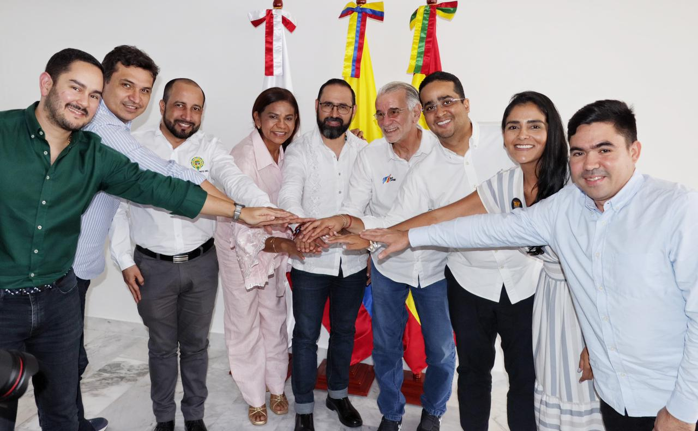

*El ministro de Minas y Energías y el gobernador Eduardo Verano de la Rosa. Air―e y Afinia ¿se prepara una nueva gran estafa?*

La creación de Air―e y Afinia fue un mal negocio para los usuarios y el Estado colombiano. ¿Ahora se prepara otra estafa en la que participan todos los estamentos que tienen que ver con la prestación del servicio de energía eléctrica domiciliaria? Hoy, 17 de agosto, se deben reunir los comercializadores con los generadores para buscar una salida a los problemas que la región Caribe afronta: mal servicio y altas tarifas. Hace una semana hubo una cumbre de gobernadores costeños con los empresarios y el ministro de Minas y Energías, Andrés Camacho.

El 10 de agosto, luego de esa cumbre de la cual fue su protagonista, el gobernador del Atlántico, Eduardo Verano de la Rosa, la calificó de reunión histórica. Dijo:

> «_Es histórico porque por primera vez estuvimos todos los actores que tenemos que ver con el sistema energético y pudimos tener un diálogo abierto y sincero en el que las generadoras nos dieron su punto de vista y llegamos a unos acuerdos que fueron plasmados en un acta_».

## ¿Una falsa esperanza?

*La Rap con algunos gobernadores de la región Caribe y el ministro de Minas y Energías. Air―e y Afinia ¿se prepara una nueva gran estafa?*

¿Esas febriles reuniones con nuevos actores y viejas mañas ―disfrazadas de **«medidas salvadoras»** como la renegociación tarifaria o [creación de una nueva empresa](https://www.atlantico.gov.co/index.php/noticias/gobernadora/24415-gobernadores-del-caribe-y-gobierno-nacional-confirman-creacion-de-la-empresa-energetica-del-caribe)― producirá una salida fallida? ¿Es una falsa esperanza para aplacar el malestar social producido por los negocios voraces del capitalismo sanguijuela? Cuando en 2020 le dieron los santos óleos a la otrora **Electricaribe**, gobernadores **charistas** como **Elsa Noguera de la Espriella** (Atlántico), y alcaldes, **como Jaime Pumarejo** (Barranquilla), prometieron que ―¡ahora sí!― se resolverían los racionamientos y altas tarifas de energía para el **Caribe colombiano**.

Sin embargo, cuatro años después, las predicciones del análisis de **Vox Populi Digital** ―desafortunadamente― se hicieron realidad. Las empresas creadas (Air―e y Afinia), tenían el mismo modelo de negocios de 1993, en el cual las empresas estatales pasaron a manos privadas del _**capitalismo sanguijuela**_.

**El 29 de septiembre de 2020**, cuando se extinguió Electricaribe y aparecieron las propuestas salvadoras de alcaldes y gobernadores con el gobierno de **Iván Duque**, se advirtió:

> «¡Advertencia! Si estás contento porque le cortaron la luz a Electricaribe ¡despierta! Las cosas pueden suceder como los precedentes históricos. Hoy presento tres. ¿Se repite la historia? Todo indica que sí».

¿Te interesa? [Le cortaron la luz a Electricaribe ¿Se repite la historia?](/articulos/le-cortaron-la-luz-a-electricaribe-se-repite-la-historia/)

## ¿Manipulan la verdad?

¿Por qué acertamos en esa predicción? Porque en el momento presente, se analiza lo que sucede, tomando en cuenta el balance real de los hechos. El caso de **Air―e y Afinia** nos permite decir que no es inédito. En ese entonces, **Voxpopuli Digital** propuso varios interrogantes orientadores que funcionaron como brújula. Así nos orientamos frente a la verdadera realidad que estaba detrás de las **supuestas buenas intenciones** de encontrar solución a dos problemas sensibles de la región: **la fragilidad del servicio y las altas tarifas que debemos pagar**.

Como Electricaribe fue intervenida por la Superintendencia de Servicios Públicos Domiciliarios, el Estado la tomó para asegurar la prestación del servicio público de energía. Propusimos unos interrogantes orientadores:

> «_La transacción económica de las dos empresas (**EPM y Energía de Pereira**) que ahora adquirieron los bienes de Electricaribe ¿a quién beneficiará? ¿De quién es el negocio? ¿Pensaron en el usuario? **¿Cómo se invertirán los 1.519,4 millones de dólares** que deberán invertir las dos empresas que obtuvieron por subastas a Electricaribe? ¿Quiénes recibieron la comisión? ¿Cómo se distribuirán el negocio los dos consorcios ganadores resultante de la transacción **Caribe Mar y Caribe Sol?** ¿Quiénes son los ganadores de esta multimillonaria transacción económica? ¿Realmente ese era el valor que se debía pagar por Electricaribe, hoy en poder del gobierno nacional?_».

## La verdad: Air―e y Afinia, la gran estafa

Hoy, 4 años después de esos interrogantes, llegamos a una conclusión inequívoca: Air y Afinia fue la gran estafa como las tres anteriores que prometieron mejorar el sistema eléctrico regional y abaratar los costos tarifarios.

En efecto, lamentamos decir que **la estrategia salvadora solo era un sainete del gobierno de Iván Duque**. La operación disfrazada de subasta, como todas las anteriores, terminó por entregar el negocio a los inversionistas y políticos antioqueños. De ese negociado, resalta el inversionista monopólico medellinense, **Alberto Ríos Velilla**, esposo de la destacada periodista, **Darcy Quin**.

Las actas de la Comisión Quinta del Senado dicen que hubo un debate sobre la venta de Electricaribe. El consorcio **Energía de la Costa**, de Ríos Velilla, dijo que pagaron la pírrica suma de **$285 mil millones**. En ese debate, el senador de la U, **José Name Cardozo**, dijo:

> «_¿Cómo vamos a recuperar el dinero que hemos invertido los colombianos en Electricaribe? Si ese era el valor de venta, el Gobierno regaló la empresa y el Consorcio obtuvo un negocio redondo_».

Por su parte, **Jorge Robledo**, fungiendo de senador, argumentó que la cifra señalada en el debate fue el precio cierto de la compra de unos activos que tienen un valor de **$2,76 billones**. Esto es, el 10% de su valor real.

Entonces, una persona sensata y consciente de la Costa Caribe se pregunta:

> «¿De quién fue el negocio, socio?»

Y en el análisis de **VoxPopuli Digital** mencionamos tres estafas anteriores a los usuarios de la región Caribe. (i) **$500** mil millones (**$5,229** billones) del **Plan Estratégico Eléctrico** (1.993) de la antigua **Corelca** y las electrificadoras departamentales. (ii) En 1998, subastaron a Transelca a ISA del grupo antioqueño dueño del Éxito. Surgieron **Electricaribe y Electrocosta** dividiendo a los usuarios en dos zonas. (iii) Las dos electrificadoras pasaron a manos de la Unión Fenosa. Entre 2000 y 2004 se produjo la crisis de ese modelo de negocios. Electricaribe se quedó con el servicio, pero finalmente fue intervenida por la Super. El martes 15 de noviembre de 2016**, la Superintendencia de Servicios empezó la toma de posesión de los bienes, haberes y negocios de la sociedad** **Electrificadora del Caribe** (Electricaribe) S.A. E.S.P.

## ¿Preparan un nuevo viejo negocio?

En el despacho del gobernador del Atlántico, **Eduardo Verano de la Rosa**, se hizo una reunión calificada de exitosa de la **RAP Caribe** y gobernadores de la región con representantes de las empresas comercializadoras de energía **Air-e y Afinia**, el ministro de Minas y Energía, **Andrés Camacho**, y los representantes de los generadores.

En esa reunión se acordó una reunión programada para hoy 17 de agosto de 2024 de las prestadoras del servicio en el Caribe colombiano con los generadores de energía. El tema central es **renegocia**r **los contratos de compraventa de energía para zonas especiales y barrios subnormales de la región.** Todo hace indicar que esta es la principal preocupación de los comercializadores de energía y no las altas tarifas domiciliarias.

Observamos en esta oportunidad a un presidente Gustavo Petro anunciando nuevas propuestas y a un entusiasta ministro de Minas y Energías, Andrés Camacho, lleno de positiva energía.

> «**La Comisión de Regulación de Energía y Gas, y desde el Gobierno Nacional, hemos emitido unas medidas para transformar el indexador de precios** al productor que aplican a los contratos de energía; y, producto de ese marco, hemos llegado a un acuerdo que durante esta semana se dará en reuniones con cada una de las empresas».

Sin especulaciones, según **Cartagena Cómo Vamos**, las tarifas de la región Caribe son las más altas, aunado a un pésimo servicio. Tenemos una tarifa de **$ 1.065** kilovatio hora a diciembre de 2023. Comparativamente las tarifas de Bogotá son un 22% más baja, es decir, $ 875. Medellín, $ 888. Por cuestiones climáticas, nosotros consumimos más energía y el costo se incrementa.

## ¿Realmente bajarán las tarifas?

La debacle de Air―e y Afinia para una prestación óptima del servicio es resultado de negocios que solo benefician a los empresarios que están detrás. En la próxima entrega responderemos a las siguientes preguntas?

> ¿Los comercializadores podrían prestar el servicio de energía con una estructura de costo a pérdida? ¿El capitalismo sanguijuela es solidario? ¿Es una falsa promesa en la que también participa el gobierno?