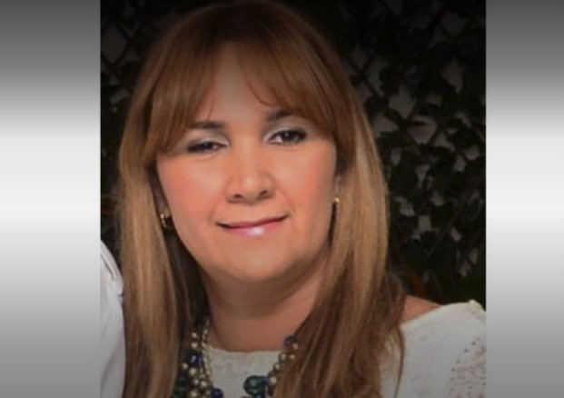
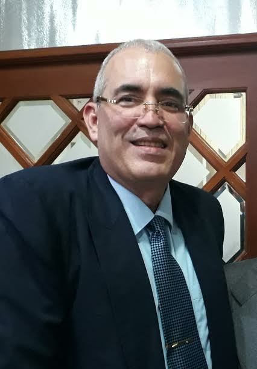
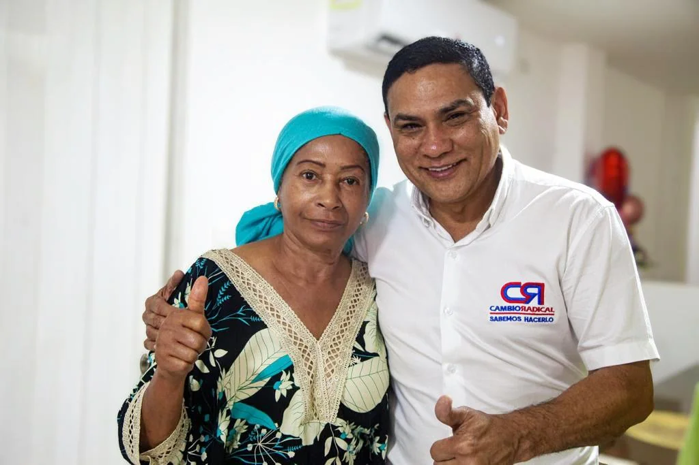

*La fiscal del paramilitarismo y la crisis moral de la Fiscalía./Cortesía.*

La confirmación del fallo condenatorio de la **Corte Suprema de Justicia** del **Tribunal Superior de Bogotá** contra la fiscal **Claudia Elena Lozano Doria**, comprueba la tesis que **VoxPopuli Digital** viene exponiendo con pruebas desde el retorno de los paramilitares extraditados: **«Los Intocables»** (empresarios que se enriquecieron y financiaron el paramilitarismo) son dueños de la Fiscalía. Por ejemplo, la fiscal del paramilitarismo condenada por falsedad al presentar diploma falso de abogada, también **garantizó impunidad a criminales de lesa humanidad. Los mismos que la llevaron a ocupar altos cargos en esa entidad.**

Al mismo tiempo, ella persiguió a los supuestos enemigos de **«Los Intocables»**. ¿Este caso es aislado o amerita que Luz Adriana Camargo Garzón, la Fiscal General, ordene una investigación judicial de los procesos selectivos para fiscales y otros cargos? I niciamos el debate.

Se empieza por decir que la historia de este caso, no es aislada. Por el contrario, demuestra cómo el paramilitarismo cooptó a la Fiscalía hasta encubrir estas falsedades, cuyo protocolo de ingreso debería ser uno de los más rigurosos del Estado. Esta conducta sistemática en el **período 1998 a 2010**, provocó ―desde arriba― una **falla de Estado** en la administración de justicia.

¿Te interesa? [Los oficios perdidos de la Fiscalía y Los Intocables (XIII)](/articulos/los-oficios-perdidos-de-la-fiscalia-y-los-intocables-xiii/)

## Protegida de Uribe y de **«Los Intocables»**

En el 2000, **Claudia Lozano ingresó a la Fiscalía de Montería como técnico judicial**, cuando ya el paramilitarismo había cometido grandes masacres de La Guajira, Cesar, Magdalena, Bolívar, Sucre y Córdoba. Era una de las fichas de la autodefensa dirigida por **«Jorge 40»** como muchos otros fiscales. La protegió el expresidente y exsenador **Álvaro Uribe Vélez** hasta llegar a ser directora de Fiscalía de La Guajira. Cuando cayó en desgracia, se desligó de ella. Incluso, supuestamente, la denunció cuando ya la estaban procesando por el escándalo de los **500 kilos** de cocaína que devolvió a los narcotraficantes.

*Demóstenes Camargo, el magistrado de «Los Intocables» y del uribismo*

A Claudia Lozano la cogieron en el embuste cuando quiso saltar a **juez de conocimiento**. Lo mismo que otros fiscales fieles del paramilitarismo y del uribismo ―como el fiscal **[Demóstenes Camargo](/articulos/documentos/boletines/PDF/23001-23-31-000-2010-00569-01\(AC\).pdf)**― que saltaron en forma tramposa ([ver este enlace del fallo del Consejo de Estado](/articulos/documentos/boletines/PDF/23001-23-31-000-2010-00569-01\(AC\).pdf)) al manipular el concurso de la Fiscalía. Rápidamente ascendieron en el poder judicial hasta llegar a magistrados. Demóstenes está imputado por el fiscal 11 delegado ante la **Corte Suprema de Justicia**, **Julio Ospino**, por el delito de **prevaricato por acción agravado** como magistrado del **Tribunal Superior de Barranquilla** ante el caso de **Unimetro**.

*Carlos Gutiérrez, Procurador Delegado Judicial en lo Penal.*

O el mismo caso de **[Juan Carlos Gutiérrez Strauss](/articulos/web/sigep/hdv/-/directorio/S510291-0878-4/view)**, procurador Delegado II Judicial en lo Penal. A finales de los 90 se encontraba vinculado a la FGN como fiscal delegado ante el Tribunal Superior de Barranquilla. Luego abogado de **«Los Intocables»**.

¿Te interesa? [Los Intocables siguen delinquiendo y la Fiscalía lo sabe (XI)](/articulos/los-intocables-siguen-delinquiendo-y-la-fiscalia-lo-sabe/)

## La fiscal del paramilitarismo

Según el proceso, la fiscal condenada, fue asistente de despacho en Barranquilla, fiscal seccional de Santa Marta. Entre 2008 y 2011 fue directora de Fiscalía en La Guajira. Y no era abogada y tampoco las especializaciones que presentó cuando se posesionó. Su hoja de vida la copió de una exgran amiga que sí era abogada de la Universidad del Sinú.

Su gran impulso lo obtuvo en la Fiscalía de **Mario Iguarán Arana** (agosto 2005―31 de julio de 2009), señalado de ser el **fiscal de la mafia**. En pocos años, Lozano Doria, nacida en **San Pelayo** (Córdoba), escaló hasta ser (2007) directora de Fiscalía en La Guajira, cargo que ocupó hasta que salió por el escándalo de recibir la suma de **$350 millones** de un narcotraficante para que le liberaran **500 kilos de cocaína** decomisado por el DAS.

La fiscal del paramilitarismo, Lozano Doria, es la esposa del excandidato a la alcaldía de Valledupar **Pedro Norberto Castro Araújo** ―jefe del Centro Democrático en Valledupar y antiguo cónsul del gobierno de **Álvaro Uribe** en Roma― y nuera del exsenador [**José Guillermo ‘Pepe’ Castro**](https://luciotorres.local/corte/wp-content/uploads/publicaciones/procesoaforados.pdf).

¿Te interesa?

## La relación con Cielo Redondo

*Cielo Redondo con su nuevo mentor, el senador Didier Lobo Chinchilla, de Cambio Radical. Cortesía.*

En La Guajira, la fiscal del paramilitarismo tenía el respaldo político del exrepresentante y exsenador conservador **Bladimiro Cuello Daza** y de **Cielo Beatriz Redondo Mindiola**, exalcaldesa de Uribia. Perdió la alcaldía en las últimas elecciones de 2023. Contó con el apoyo de **Cambio Radical** y del **partido de la U**. Cuello Daza, cuando en su momento era cónsul de Chicago, dijo que no respaldaba a la fiscal. El exparlamentario vive actualmente en Estados Unidos luego de su pelea a muerte contra [**«Kiko»** **Gómez**](http://exgobernador Francisco Gómez Cerchar, ‘Kiko’ Gómez), quien fuera gobernador de Cambio Radical. Ahora este partido protege a Cielo Redondo.

De acuerdo con declaraciones de antiguos miembros del paramilitarismo, Cielo Redondo fue la jefe política y financiera del **Frente Antisubversivo Wayuú**, una de las estructuras más sangrientas durante el imperio de la violencia paramilitar. Sus miembros cometieron desapariciones, masacres, torturas y homicidios. Profanaron una de las instituciones sociales más sagradas de la cultura wayúu: **sus mujeres**.

No obstante, Cielo Redondo no la procesó la Fiscalía, pese a las pruebas presentadas en su contra por su estrecha relación paramilitar. Es una de **«Las Intocables»**. Por el contrario, el ente la protegió frente a otros enemigos políticos.

La Fundación Paz y Reconciliación denunció:

> **«**(A Cielo Redondo) se le acusa de ser la jefa política de la estructura criminal de alias Pablo, jefe del Frente Antisubversivo Wayú de las AUC**»**.

## ¿Cómo descubrieron a la fiscal del paramilitarismo?

Tan descarada es la protagonista de esta historia que en 2013  concursó para **juez de conocimiento** de Valledupar. Presentó los mismos documentos falsos para ser fiscal. ¡Oh sorpresa! Cuando introdujeron sus datos en el Sistema de Información del Registro Nacional de Abogados – SIRNA del Consejo Nacional de la Judicatura, ¡no apareció!.

Al descubrirse su falsedad, la Fiscalía la denunció. En 2016 se anunció un preacuerdo para acogerse a sentencia anticipada y esperar que le redujeran la mitad de la pena. Pero todo fue una jugada porque confiaba que sus influencias le permitiría salir indemne de esa situación.

Sin embargo, su caso llegó a otro nivel que terminó con su condena a 12 años de prisión (la máxima era de 14 años) por falsedad procesal y falsedad de documentos públicos al **“acreditar formación profesional y un acta de grado con el fin de lograr su nombramiento”**. ¿Debió ser la única procesada?

## La punta del iceberg

*Los que omiten investigar a los terceros civiles responsables refleja la crisis moral de la Fiscalía./VoxPopuli.Digital-*

Su caso es solo la _punta del iceberg_ de la **profunda crisis ética y moral de la Fiscalía y de la justicia**, en general. Pero la Filosofía del Derecho ayuda a comprender esta falla de Estado. Es un problema del ser humano que tiene el papel de administrador de justicia. **La falta de ética y de moralidad pública de altos funcionarios de la Fiscalía, determina su conducta omisiva** para combatir a las grandes mafias del crimen.

Por tanto, las implicaciones éticas y morales de la crisis de la justicia colombiana y, en especial, de la Fiscalía General de la Nación (FGN), la deben resolver mediante una rigurosa evaluación de su personal y un proceso de reestructuración que implique la transformación mental de los administradores de justicia. Sin eso, cualquier reforma de la justicia fracasa.

La responsable de la selección de la fiscal **Claudia Lozano Doria** cayó en **Carmen Helena Pérez Cañón**, coordinadora de planta de la Fiscalía en su momento. Ella respondió a la misma Fiscalía y a los jueces así:

> **«**Primó el principio de la buena fe cuando se recibían todos los documentos de los aspirantes y se subían al Sistema de Información Administrativa y Financiero (SIAF)**»**.

Este caso de Claudia Lozano no es un gol. Esta historia es un autogol de la misma Fiscalía. Los delincuentes tienen licencia para procesar y perseguir a personas que creen que son los delincuentes.

¿Es necesario hacer una alta cirugía a la Fiscalía? ¿Cómo se restructuraría el ente investigador sin una transformación ética de su personal?