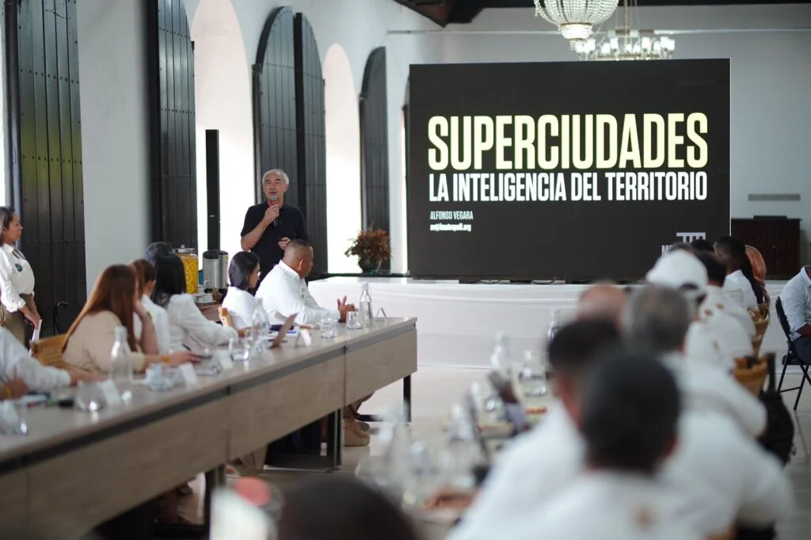

*¿POT 2025? ¿Qué necesita la SuperCartagena?/Cortesía prensa alcaldía.*

El alcalde **Dumek Turbay Paz** está pensando en un **Plan de Ordenamiento Territorial (POT)** para una **SuperCartagena**. _Pensar en Grande_ ―en inglés **Think Big**― para un gobernante, es una predisposición positiva cuando se **sienta a planificar la sociedad con sus mandantes**. Pero, en realidad, todavía su administración no da el primer paso para alcanzar la meta que se trazó de tener **POT en el 2025**. La situación se agrava, porque **existe un evidente divorcio** entre el Secretario de Planeación Distrital, **Camilo Rey Sabogal**, y el director del POT, **Juan Correa** **Reyes**, según fuentes no oficiales de esa entidad que no quisieron que las citaran.

Por tanto, abordamos con sentido crítico pero propositivo este tema muy sensible para el desarrollo de la ciudad en los próximos 10 años que debemos estar a la altura de la Cartagena del 2033 y sus 500 años. **Este análisis** se aborda desde estas **preguntas orientadores**:

> _¿Qué está pasando que después de 8 meses de esta administración no está definida una ruta cierta para el POT? ¿Le sucederá a Dumek lo mismo que al Zambiloco que echó al inodoro **$18 mil millones** para diseñar un POT que no pasó la evaluación ambiental? ¿Tendremos POT 2025?_

Sin duda, existe un evidente silencio en materia de la Ruta del POT. ¿En estos 8 meses qué hizo esta administración?

¿Te interesa? [¿Rediseñar el proyecto del POT y censurar al secretario de planeación? (I)](/articulos/redisenar-el-proyecto-del-pot-y-censurar-al-secretario-de-planeacion-i/)

## ¿El divorcio que agrava el POT

*Secretario de Planeación Distrital, Camilo Rey Sabogal, y el director del POT, Juan Correa Reyes, al parecer, están divorciados para jalar hacia la SuperCartagena.*

Hay un cantado divorcio entre el secretario de Planeación Distrital, **Camilo Rey Sabogal**, y el director del POT, **Juan Correa** **Reyes**, que agravaría los términos de tener la carta del desarrollo urbanístico para lograr la SuperCartagena. Los conocedores de este hecho, explicaron que este divorcio de los dos altos funcionarios estaría dando al traste con la iniciativa de tener un POT bien concebido en el tiempo propuesto. Es más, si se logra el POT sería en el 2026, si acaso.

Si Bogotá adoptó el POT en el 2022 vía decreto, después de 10 años de discusión, Cartagena de Indias tiene la carencia de un POT democrático y participativo con un retraso de dos décadas. El alcalde **Carlos Díaz Redondo** en 2001 adoptó vía decreto (**No 0977/01 (documento no disponible)**) el actual POT pensado para expandirse en 10 años. Hoy, tiene 23 años.

En el 2021 el alcalde William Dau Chamat y su Secretario de Planeación **Juan David Franco Peñaloza**, anunciaron con bombos y platillos que tendrían POT en el 2022. En ese momento lo dudamos en **VoxPopuli Digita**l. Cuando en 2022 Franklin Amador reemplazó a Franco, se dijo:

> La pregunta que se hacen los expertos es si Amador Hawkins puede sacar adelante un POT efectivo que sirva de faro para el desarrollo de las zonas urbanas y rurales de Cartagena. Un POT asertivo, progresista y que esté a tono con los tiempos modernos.

En ese sentido, proponemos esta pregunta: ¿Son cuentas alegres las del alcalde **Dumek Turbay Paz de Tener POT en 2025**? ¿Cuánto se gastaron en OPS y cuánto tienen previsto gastarse? ¿Se recibieron a satisfacción los productos resultantes del contrato con el Edurbe? En la próxima entrega responderemos estas inquietudes.

¿Te interesa? [¿Rediseñar el proyecto del POT y censurar al secretario de planeación? (I)](/articulos/redisenar-el-proyecto-del-pot-y-censurar-al-secretario-de-planeacion-i/)

## La SuperCartagena

*El alcalde Dumek Turbay Paz, Pensando en Grande por una SuperCartagena. Aquí, en Washington en julio de 2024, reunión con el Banco Interamericano de Desarrollo, BID, y el Banco Mundial. /Cortesía Prensa alcaldía.*

En cuanto a ordenar una ciudad, la complejidad es mayor, porque se trata de organizar la unidad básica de la convivencia social en un espacio determinado. Las ciudades modernas son como los seres humanos: cambian y se transforman de acuerdo a la cultura urbana y ciudadana dominante. Por ende, si el que se piensa, no está centrado en el ser humano, finalmente las ciudades terminan devoradas por la negligencia y la indiferencia.

¿Queremos una SuperCartagena? Si la respuesta es sí, entonces debemos decir que necesita un POT democrático donde no se privilegie los macroproyectos urbanísticos depredadores que han dominado en estos últimos 30 años.

## Pensar el POT

De manera que, si no tenemos un POT participativo, la ciudad tendría un conjunto de **obras urbanas faraónicas sin arraigo social.** Lo cual, como sucede en el modelo de desarrollo de Barranquilla, deviene en descomposición social y deterioro de las condiciones de vida del barranquillero. El llamado **Megatanque** para el acueducto del suroccidente del Distrito de Barranquilla construido por el Área Metropolitana de Barranquilla (AMB) y la constructora MARVAL no fue pensado para el ciudadano sino para el bolsillo de los dueños de dicho contrato.

Este análisis se inspiró desde el 7 piso del apartamento de un amigo recluido en su espacio. Desde su terraza se hotea la bahía de **Las Ánimas de Manga** y de las marinas que aprisionan su estrecho espacio acuático.

Si **Pensar en Grande** es pensar en esas obras faraónicas deshumanizadas, el efecto es lo contrario al concepto de alcanzar el éxito de servirle a la sociedad que debe ser el papel del servidor público. El resultado sería un realismo mágico que perjudica a la colectividad y beneficia el bolsillo de los dueños del contrato.

## ¿Cuál es la SuperCartagena de Dumek?

A raíz de la llegada desde España del afamado arquitecto de superciudades, **Alfonso Vergara**, se propiciaron tres espacios de socialización de ese concepto de urbanismo: Cámara de Comercio de Cartagena, representantes gremiales y el Concejo de la ciudad. Solo hizo falta el espacio más importante: **el Consejo Territorial de Planeación** (CTP).

En ese momento, en espacio con los gremios económicos de Cartagena, el alcalde Dumek Turbay Paz, les dijo:

> **«**Comenzamos a trascender hacia esa superciudad que soñamos, con una visión desde su componente humano, arquitectónico y urbanismo sostenible**»**.

Sin embargo, ese componente humano no lo pueden interpretar los mandatarios ni los gremios económicos sino la gente misma a través de procesos participativos y democráticos. Está demostrado que los gremios económicos no piensan en el ser humano sino en sus bolsillos. Pero la Constitución y la ley colombiana dice todo lo contrario:

> **«**Facilitar la participación de todos en las decisiones que los afectan y en la vida económica, política y administrativa de la Nación**»**.
> 
> **Sentencia C-191/96** de la Corte Constitucional.

Esa conducta de no socializar las ideas planificadoras de gobierno no solo es excluyente sino ilegal e inconstitucional a la luz de la **[Sentencia C-191/96](/articulos/relatoria/1996/c-191-96.htm#:~:text=Visor-,C%2D191%2D96,-Sentencia%20C%2D191)** de la Corte Constitucional:

> **«**Los procesos de elaboración, ejecución, seguimiento y evaluación de los planes de desarrollo, tanto a nivel nacional como  a nivel de las entidades territoriales, deben ser, en lo posible, participativos**»**.

Y ello se debe a que uno de los fines esenciales del Estado es precisamente la participación de todos en las decisiones que nos afecta en nuestras vidas dignas.

## Sin Consejo de Participación

Además, el Distrito como la gobernación de Bolívar no cumplen materialmente con el mandato de la **Ley** de **Participación Ciudadana** (**ley 1757/15**). El Sistema de Participación Ciudadana le da sustento a las decisiones gubernamentales, especialmente el **Consejo Distrital de Participación** que no existe. Es decir, sus políticas se legitiman solo con la participación efectiva.

Incluso, con ese instrumento se construye gobernanza y gobernabilidad. Este mando legal orienta los diferentes esfuerzos que desde la Constitución de 1991 se han venido desarrollando para lograr una democracia más incluyente, efectiva e incidente.

Ese sistema de participación es complejo porque se debe implementar en el país como **órgano consultivo y de deliberación** formado por diversos sectores de la institucionalidad y de la sociedad civil en su conjunto

O sea, que además del CTP, se debería tener como ente consultivo al **Consejo Distrital de Participación** , el cual no existe ni en el Distrito ni en la gobernación de Bolívar.

**Próxima entrega**: ¿Cuál es el estado del arte para tener un POT 2025 de una SuperCartagena?

P