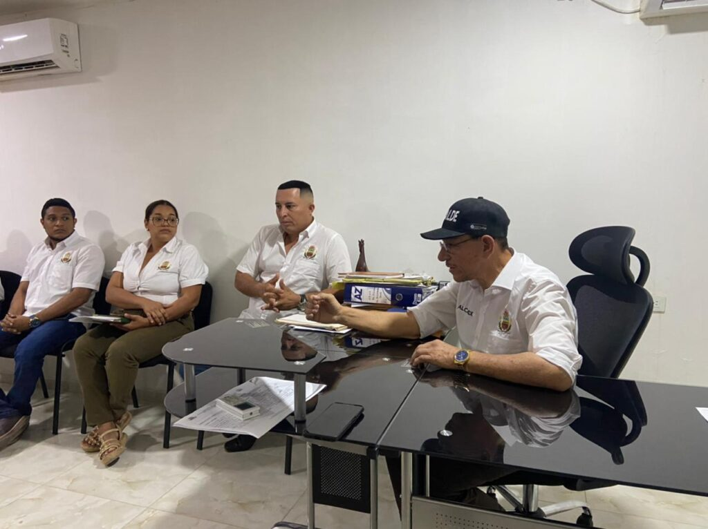
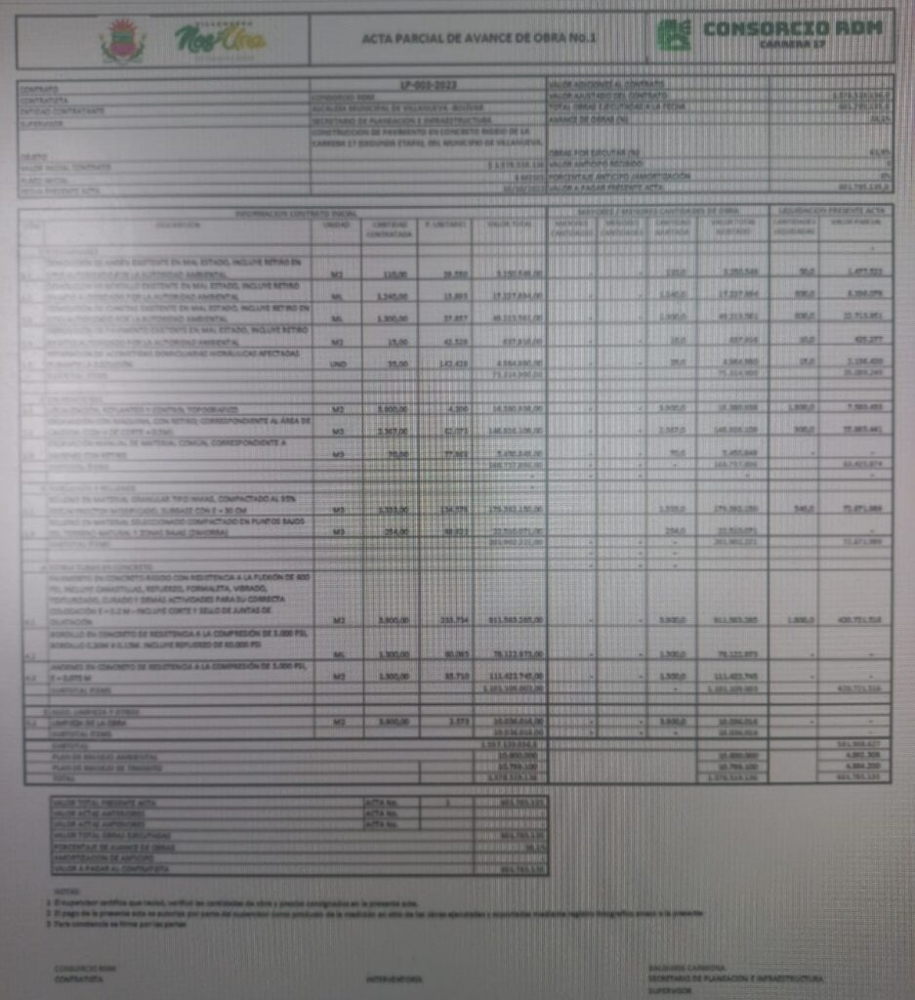

*Cuando el otrora presidente de Findeter, Ricardo Bonilla, (hoy el cuestionado ministro de Hacienda) se reunió con el alcalde William Dau para condicionar la financiación de varias obras. En tanto «Ipe» y su «olla podrida» se reactivan./Cortesía Minhacienda.*

La nueva veeduría de **Observa Público** viene preparando la artillería legal para una **auditoría forense**. Tiene como finalidad establecer la trazabilidad y el destino de más de un **$1 billón** con que **Findeter** y la nación **financiaron 126 proyectos** de infraestructura social ―algunos inconclusos― en **21 municipios de Bolívar** en los **últimos 5 años**. Pero, dicha inversión, no se tradujo en desarrollo, porque la gente sigue pisando _boñiga de vaca_.

Efectivamente, la inversión social, presuntamente, no llegó a impactar al desarrollo de la población objeto. **En realidad es un desarrollo cangrejero**. El atraso y retraso de la mayoría de los municipios de Bolívar salta a la vista. Para un ejemplo evidente, el caso de **Villanueva**, al norte del departamento, a 30 minutos de Cartagena. El **alcalde Eurípides Velasco Mendoza («Ipe» y su «olla podrida»), constatan lo dicho**.

## Villanueva, «Ipe» y su «olla podrida»

En este municipio de 21 mil habitantes ―para el mismo período― se invirtieron cerca de **$8 mil millones** en saneamiento ambiental, acueducto y alcantarillado. Y las necesidades básicas siguen intactas con leves avances que no se corresponden con la millonaria inversión.

Por otra parte, el gobernador **Yamil Arana Padauí** recientemente anunció una inversión de **$36 mil millones en el acueducto de la Línea** que beneficiaría a la población de los municipios de Santa Rosa, Villanueva y San Estanislao de Kostka.

Siguiendo con la investigación de **VoxPopuli Digital**, en esta segunda entrega mostraremos el _modus operandi_ y un patrón criminal de los alcaldes en el siglo XXI para **burlarse de la ley de contratación**. De esta forma, asignan los contratos a sus financistas de cabecera.

¿Te puede interesar? [El patrón criminal para saquear a los municipios de Bolívar: Villanueva (I)](/articulos/el-patron-criminal-para-saquear-a-los-municipios-de-bolivar-villanueva-i/)

## Aguas de Bolívar, la vista gorda

*Eliana Romero Valiente, gerente de Aguas de Bolívar ESP, se hace la vista gorda.*

Los municipios vienen invirtiendo los recursos con la supuesta coordinación de Aguas de Bolívar ESP. Pero, en este caso específico de Villanueva, el estudio no fue actualizado por esta empresa ni tampoco participó como falsamente lo expone el espurio informe de ASODIQUE sobre un supuesto estudio que tendría el aval de la empresa bolivarense.

En una comunicación, Aguas de Bolívar ESP negó cualquier relación con ese informe técnico final presentado como resultado de un supuesto estudio de ASODIQUE a la alcaldía de Villanueva.

Con base en los derechos de petición que se enviaron a Aguas de Bolívar, su representante legal debería denunciar el presunto hecho de falsedad a la Fiscalía para que aborde la investigación respectiva. Pero, hasta ahora, **Eliana Romero Valiente**, no lo hace.

## ¿Más plata para agua?

En 2021, se anunció pomposamente para la inversión en agua y saneamiento básico una asignación de **$151.660 millones** que mejorarían la calidad de vida de los bolivarenses con acueductos y alcantarillados. El anuncio lo hizo el viceministro de Agua y Saneamiento Básico de ese entonces, **José Luis Acero**. Y no pasó nada.

En abril de 2024, el gobernador **Yamil Arana Padauí** destacó que **Aguas de Bolívar ESP**, invertirá este año **$90.050 millones** en la construcción de nuevos acueductos. El propósito es que puedan funcionar 24 horas al día. 

Al hacer ese anuncio, el gobernador , dijo:

> «Con proyectos en ejecución y nuevas inversiones estamos garantizando la prestación del servicio de agua potable en varios municipios del norte y sur del departamento de Bolívar».
> 
> Prensa gobernación.

Sin embargo, hasta ahora, todas las inversiones de **Aguas de Bolívar ESP** no resuelven el problema de la escasez de agua y falta de alcantarillado de más de un millón de bolivarenses que no pueden disfrutar del servicio de agua en forma permanente y no hay una cobertura de alcantarillado superior al 80%. Ejemplo concreto, Turbaco, donde puede haber un colapso sanitario por la crisis de las **PTAR**. Ninguna de las aprobadas funcionan con los lineamientos técnicos de ley. Y siguen aprobando proyectos de construcción inmobiliarios, aparentemente, sin el lleno de requisito.

Durante una década, **Aguas de Bolívar** estuvo en manos de políticos aliados de la difunta empresaria del chance, **Enilce López Romero**. Fue un período donde el dinero invertido también se lo fumaron, porque los resultados fueron negativos. Desde 2017, luego de que dicha empresaria saliera, el poder de atrás lo asumieron **los Blel y «Juancho» García**. Cuando ocurrió la muerte de exsenador García el 2 de diciembre de 2020, Vicente Blel asumió el poder omnímodo de Aguas de Bolívar ESP.

## Findeter y Bonilla

Findeter es una banca de desarrollo territorial que viene desembolsando la suma de **$900.000** millones para [financiar 126 proyectos](/articulos/noticias/comunicados/mas-de-900000-millones-para-126-proyectos-ha-desembolsado-findeter-en-bolivar-en-los-ultimos-5-anos) en 21 municipios. Entre ellos, Achí, Arjona, Cantagallo, Cartagena, Cicuco, Carmen de Bolívar, Magangué, Mahates, María la Baja, Pinillos, Río Viejo, San Fernando, Mompós, Talaigua Nuevo, Turbaco, Turbana y **Villanueva**.

Esos dineros están destinados para proyectos de salud, educación, agua potable y saneamiento básico, desarrollo urbano, construcción de vías urbanas y escenarios deportivos en Cartagena. También se incluyó la construcción de viviendas de interés social en la **Ciudadela de La Paz**; la infraestructura física para la Universidad de Cartagena.

De la misma manera, se incluyó la ampliación de redes del sistema de alcantarillado y el mantenimiento, adecuación y dotación de centros de salud en Cicuco; el mejoramiento de vías en el casco urbano de Carmen de Bolívar y la pavimentación de la vía Santa Rosa – Guasimal en San Fernando.

## «Ipe» y su «olla podrida»

*«Ipe» y su «olla podrida», regresó para rasparla. Aquí en uno de sus primeros consejos de gobierno de Villanueva.*

La población no se cansa de elegir a los mismos con la misma práctica poco transparente. Una de las _tetas que chupan_ los alcaldes de esta subregión como si fueran terneros huérfanos, son los dineros destinados para el **saneamiento ambiental, acueducto y alcantarillado.** **Gilberto «Hipo» Amaya Vázquez** fue suspendido en 2015 por estar inhabilitado. Lo sucedió **Eurípides Velasco Mendoza** ―el popular **«Ipe»**― donde demostró su real aspiración, la cual es contraria a los intereses generales de la población.

Desde enero de 2024, **«Ipe»** volvió a la alcaldía de Villanueva. Ahora regresó por _la olla podrida_ dejada por su antecesor **Edwin Puerta Orozco** en materia de contratación de alcantarillado.

Uno de los hechos oscuros que unen a **«Ipe»** con el anterior alcalde es la contratación de las obras del alcantarillado con estudios, a todas luces, falsos. Para realizar los supuestos estudios, la alcaldía de Puerta Orozco suscribió el contrato de consultoría **No 001-2020** con **ASODIQUE**, por **$140 millones**. Esta es una de las organizaciones favoritas para evadir licitaciones. Su representante legal es **Carmelo Guzmán Fuentes**.

## Estudios falsos, obra fantasma

*El patrón criminal de los alcaldes de Villanueva (Bolívar), el saliente (Edwin Puerta Orozco, izq.) y el entrante, el famoso «Ipe» que regresa por la olla podrida.*

La hipótesis de la falsedad de dichos estudios, se planteó en la primera entrega de este trabajo de investigación y análisis. La denuncia está en la Fiscalía y la Procuraduría. Se presentaron evidencias de esa falsedad.

**Primero**, que las mediciones y estudios topográficos pertenecen a un municipio de Córdoba. **Segundo**, que suplantaron al profesional de ingeniería. **Tercero**, que el Secretario de Planeación se abstuvo de firmar el acta de recibimiento de la obra al advertir las presuntas irregularidades. Cuarto, que su pago fue irregular.

El informe final que ASODIQUE presentó para que le pagaran el segundo 50% del valor del contrato, dice:

> «Se proyectó y diseñó un nuevo sistema de tratamiento de aguas residuales (PTAR), en el sector nororiental del centro poblado de Batata.»
> 
> Informe Asodique.

El pequeño detalle de ese espurio informe es que **Batata** es un corregimiento de Tierralta, Córdoba. ¿Qué tal?

Si los estudios son espurios, significa que los contratos suscritos para el alcantarillado de varios tramos de Villanueva están preñados de ilegalidad. Se trata de **Carrera 17**, adjudicado al consorcio RDM, cuyo representante legal es **Leonardo Enrique Royo Camacho**. Tiene un valor de **$1.678.575.040,97**. El otro es **Calle Caño** adjudicado a la firma SCC 2023 de **Elkin René Reyes Romero**. Tiene un valor de **$2.354.529.014,00**. Esto quiere decir que los **$4.033.104.054 millones** y el resto del presupuesto que suma cerca de $7 mil millones.

Lo más llamativo son los adicionales de donde saldrá, supuestamente, el dulce para el alcalde **«Ipe» y su «olla podrida»**. Los dineros del alcantarillado para Villanueva, por tanto, se fugarán por las cloacas de la contratación municipal.

## La verdadera realidad

La realidad es contraria a lo que aparece en los contratos suscritos. Una visita ocular en lo sitios de las obras de **VoxPopuli Digital**, se pudo constatar varias irregularidades.

Las obras de la Cra 17 y Calle Caño que ejecutan los consorcios RDM Y SCC 2023 no tienen una real interventoría. El contrato, supuestamente se lo había adjudicado a ASOMOR. Pero, en realidad, las evidencias indican que la ejecuta ASODIQUE, la misma entidad que hizo el estudio espurio. O sea, que los consorcios realizan solos las obras. Y, a partir de allí, armán los supuestos adicionales.

En la obra de la Cra 17 tiene un pavimento que se agrieta sin motivo alguno y con desgastes de superficie, En tanto que, Calle Caño presenta un alcantarillado a nivel de la subrasante y demás imperfectos en los manjoles, y direcciones del flujo para efluentes comprometidos,

Lo anterior significa que construyen una completa empanada causando un presunto detrimento patrimonial al municipio de Villanueva y de sus pobladores que deberán seguir caminando sobre aguas servidas. Como se sabe, el informe debe servir de base para los diseños de la obra. Si es falso ¿significa que se robarán ese dinero? ¿O el alcantarillado no corresponde a su objeto contractual? La Fiscalía debe establecer esta presunta falsedad.

## ¿«Ipe» hizo desembolsos?

*¿«Ipe» y su «olla podrida»? Aquí está una de las actas de avance de obras para cobrar los desembolsos.*

Sin embargo, según fuentes de entero crédito, ¿**«Ipe» y su «olla podrida»** la raspará con los **«**adicionales**»** de la obra? Ya se reunió con los dueños del contrato. **El primer acuerdo** es que sacan del paseo al anterior alcalde **Edwin Puertas**. **El segundo**, se refiere a que cualquier tipo de «arreglo» debe hacerse con el actual alcalde. **Tercero**, Acordar unos adicionales. **Cuarto**. Planeación autoriza los desembolsos previa acta de avance de obras que debe firmar el contratista y el supervisor del contrato.

El supuesto acuerdo de «Ipe» se centra, sin embargo, en los desembolsos que esta administración, al parecer, ya le está haciendo al contratista. Se han aprobado dos actas de avance de obras, tal como se publica en esta entrega. Una en 2023 y la otra del 2024.

Con esos desembolsos se probaría la participación de «Ipe» en esta corruptela iniciada en el gobierno de Puertas para romperle la pechera al presupuesto del alcantarillado de Villanueva. Ahora, «Ipe» regresó con el rimbombante nombre del plan de desarrollo municipal: **«Villanueva Social, Participativa y Sostenible».**

**Próxima entrega**: ¿Cómo diseñan las licitaciones y sus potenciales ganadores de los municipios de Bolívar desde una bodega de Barranquilla?