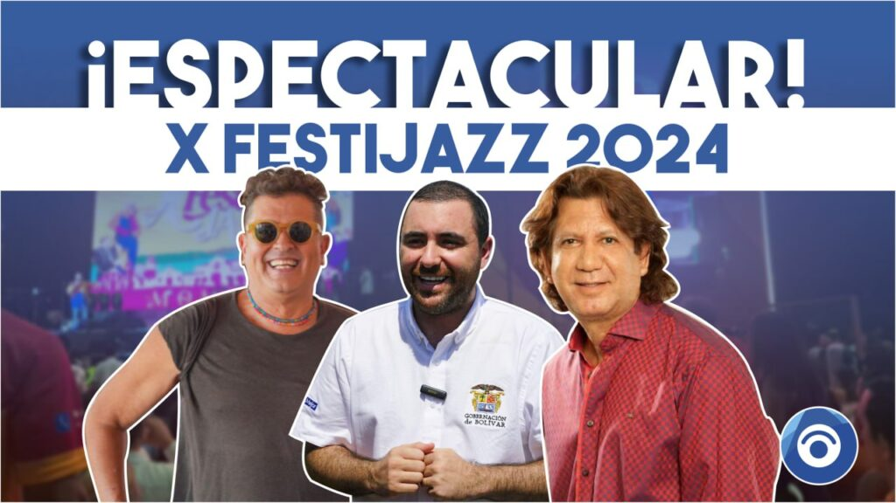
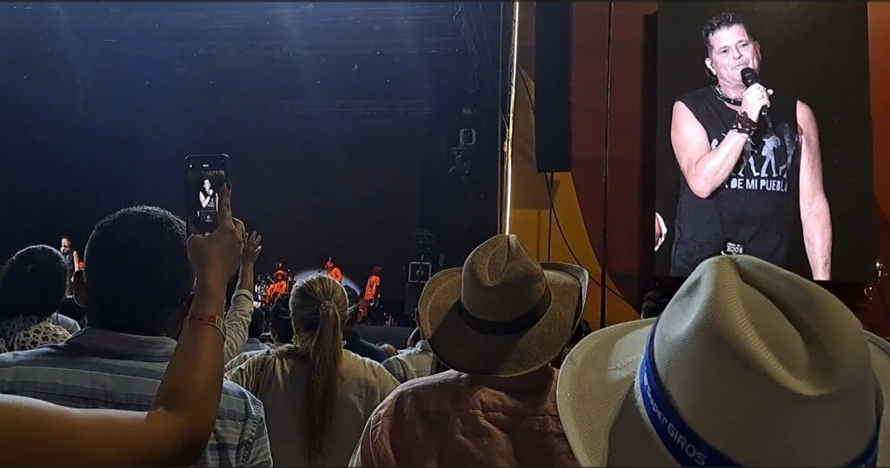
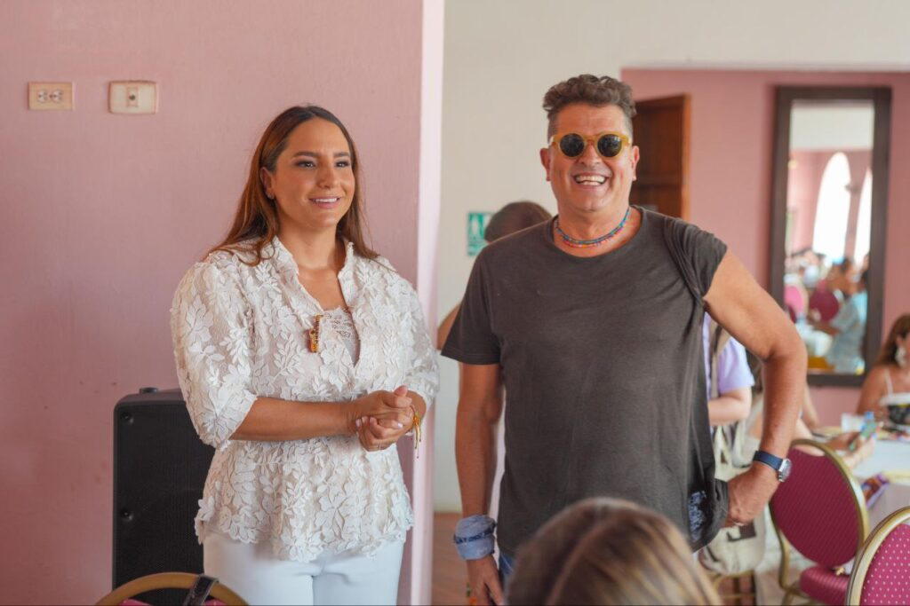

*Balance del Festijazz 2024: ¡¡Espectacular!!*

El Festijazz 2024 fue una verdadera apuesta al **turismo cultural** de la gobernación de Bolívar liderada por el jovial **Yamil Arana Padauí**. La _depresión momposina_ gozó de una febril semana del **10 al 14 de septiembre**. Visitantes nacionales e internacionales se deleitaron con la música. Ellos percibieron la magia macondiana que **engrandece este** **ecosistema cultural**. En síntesis: se hizo realidad lo pronosticado en VoxPopuli Digital:

> **«**El joven gobernador de Bolívar, **Yamil Arana**, sin duda, le pondrá su sello juvenil al Festijazz. Esta 10° versión promete ser sencillamente ¡espectacular!**»**.

Si debemos hacer un balance real del Festijazz 2024, no lo dudemos, fue ¡espectacular!

Te interesa? [Las clave del jazz en Mompox con el mundo (I)](/articulos/las-clave-del-jazz-en-mompox-con-el-mundo-i/)

## Festijazz 2024, un éxito total

Más de 220 artistas y decenas de agrupaciones. La participación decisiva de la Universidad de Bellas Artes (Unibac) que, con sus grupos y bandas, hicieron del jazz un ritmo renovado para las nuevas generaciones. Los amantes de la música urbana entendieron que existen otros ritmos y los pueden disfrutar como es la música de _Jazz The Roots_, la banda ecuatoriana que puso en alto las banderas de este ritmo.

Y también tuvimos la oportunidad de danzar en Mompox al ritmo del Colegio del Cuerpo y su obra **'Dos volcanes (y un laberinto)'** en la primera universidad de la historia moderna de Colombia: _Real Colegio Universidad de San Pedro Apóstol_. Hoy, conocido como Colegio Pinillos.

Ni siquiera un lunar prieto aguó el Festijazz 2024. La tiradera de sillas de algunos **jóvenes díscolos**, matizó el concierto de Beéle. A pesar de ello, en la noche del sábado, todo fue ¡espectacular! como la noche del viernes 13 de septiembre donde participó **Mr Black** con su champeta urbana. Si solo pensaran en ese lunar, dirían lo contrario, como algunos "influencers" han especulado.

Pero, ese pequeño incidente demuestra que los alcaldes deben trabajar más en **competencia ciudadana**. Hay que crear más demanda cultural y musical. Es decir, crear público para otras manifestaciones culturales autóctonas que afiance nuestra visión universal.

Algunos seguidores de artistas urbanos quieren estar más cerca para _pantallar_ con sus celulares cerca del cantante. No respetan las reglas ni la autoridad. No tienen compromiso con el orden ni consideración con los demás, como se pudo observar en el caso citado. Algunos de la **zona 2** se quisieron pasar sin autorización a la **zona 1** y, como no los dejaron, quisieron sabotear el concierto de Beéle.

## ¡Espectacular!

*Carlos Vives y el Festijazz 2024: ¡Espectacular!*

El concierto de **Carlos Vives** y su grupo fue pensado. Sus canciones bien escogidas. _Su rock para el pueblo_ es la fusión perfecta de la personalidad artística del samario. Sus videoclips. Su fusión. Todo lo pensaron para hacer un _ensamble musical_ propicio de la **cultura anfibia de la depresión momposina**. El mismo Vives reconoció que esta **ecoregión cultural** ―impactada por el río Magdalena donde desembocan los ríos Cesar, Cauca y San Jorge― produjo los juglares que aportaron significativamente a la cultura regional y nacional.

De igual manera, fue impactada la gente de estos departamentos que beben de la **cultura anfibia**: Bolívar, Sucre, Magdalena, Cesar, Atlántico, Córdoba y Santander. La música de Vives en este concierto expresó esa diversidad cultural, tal como él mismo lo expresó en tarima.

*Angélica Salas Salas acompaña a Carlos Vives en Matié.*

En la mañana del día de su exitosa presentación, Carlos Vives acompañó a la Primera Gestora Social, **Angélica Salas Salas**, en la instalación de _Matié_ (Madre Tierra). Esto es uno de sus programas sociales que beneficia a 720 mujeres. El encuentro reunió comensales nacionales, extranjeros e invitados especiales que disfrutaron un **menú autóctono** de los chefs **Jaime y Jonathan Galindo** preparado con productos cultivados por estas mujeres: cúrcuma, miel de abeja, flor de Jamaica, cacao, flores comestibles.

## Martín Madera: _¡El resucitado!_

*Martín Madera: ¡el resucitado!*

Antes del concierto ¡espectacular! de **Carlos Vives** y su grupo, el gobernador **Yamil Arana Padauí** acertó con el gran homenaje a **Martín Madera, ¡El resucitado!** Premio Grammy (2002). El gobernador reconoció a un artista universal que siguió la vena musical de la _Ciudad de los Tres Ríos_, donde brillaron y brillan músicos e intérpretes como **_Chico_ Cervantes** y su agrupación, **Jesús M. Leal**, **Rodolfo Aicardi**, **Willy Calderon**, **Ray Calderón**, Zalo y muchos de la música tropical que triunfaron internacionalmente.

Estuve allí para sentirlo y ponerle el tono a esta narrativa. Es un orgullo magangueleño para el mundo**.** De las 10 canciones de mayor impacto de Vives, 4 son de Madera. La más conocida, _Déjame entrar_, le permitió al samario colonizar a Miami.

En el 2020 sufrimos los embates del **Covid/19**. En ese tiempo me enteré que **Martín Madera** estaba más allá que de acá. Y el hombre resucitó después de 43 días de delirio aferrado a su fé cristiana católica. Ahora se le conoce como _¡El resucitado!_

Recuerdo que no pude escribir sobre varios amigos y conocidos que el virus se los llevó. Tampoco sobre Madera. Cuando Camilo (mi hijo) y yo, supimos que teníamos el virus, nos aislamos solitarios. Dejé entrar el virus para que me hiciera compañía. Solo atiné a escribir a mano, en una libreta, cada día de los 11 días, con sus lóbregas noches, mi reflexión personal buscando la tierra prometida: Yo.

¿Los logros de Madera? ‘El amor de mi tierra’, ‘Tu amor eterno’, ‘Luna nueva’; ‘Yo loco y tú luna’. Los intérpretes de sus locuras líricas, son, entre otros, Carlos Vives, Adriana Lucía, Moisés Angulo, Gussi y Beto, Juan Carlos Coronel, Iván Villazón. Pero el logro de Madera es llevar la cultura anfibia a otro nivel internacional

_El resucitado_, verlo a varios metros cuando el gobernador Yamilito le entregaba el decreto en nota de estilo, me dije a sí mismo: ¡Dios es grande! Lo bueno es que te reconozcan cuando estás vivo.

## Festijazz 2024: ¡¡Espectacular!!

Sencillamente, todo fue espectacular en esta versión del **Festijazz 2024**. La gente sabe que nuestra filosofía es resaltar lo que edifica, lo que construye. El lunar prieto lo dejamos a un lado. Solo fue una alerta temprana para decirle a las autoridades que deben invertir más en la gente y, en especial, en la niñez y la adolescencia. Yamilitó Arana, realmente, bateó con las bases llenas en este **Festijazz 2024**.