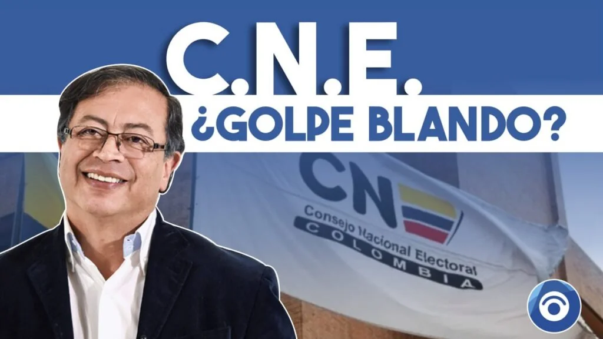
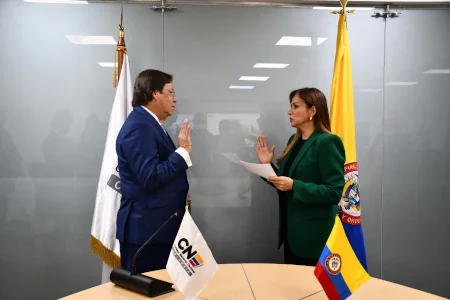
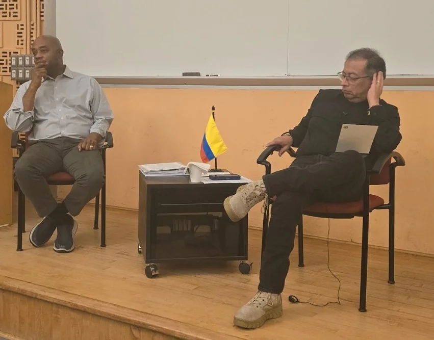
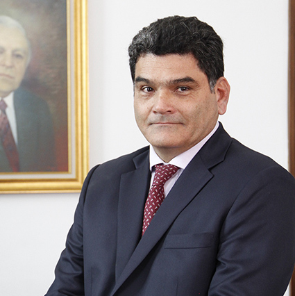

*Decisión del CNE: ¿ad portas de un juicio por indignidad?*

Los [**cinco cargos citados**](/articulos/prensa/comunicados-oficiales/814-comunicado-de-prensa-08-de-octubre-de-2024) por el Consejo Nacional Electoral (CNE) contra el Presidente de la República, Gustavo Petro, ¿lo pone _ad portas_ de **un juicio por indignidad** reservado al congreso de la República? Tal como lo señala la **Ley 1864 de 2017**, violar los topes financieros de una campaña conduce a la pérdida del cargo e **incurrirá en prisión de cuatro (4) a ocho (8) años**. Si esto se demuestra, sin duda, la Comisión Legal de Investigación y Acusación de la Cámara de Representantes, debería decidir si acusa o no al presidente ante la plenaria del senado.

Si la decisión final del CNE se mantiene, es decir, confirma que efectivamente la campaña presidencial del 2022 violó los topes financieros electorales, compulsaría copias a la Comisión de Acusaciones y ésta decidiría la acusación contra el presidente ante el senado.

¿Por qué el presidente se está equivocando en la estrategia de su defensa y apela a las masas cuando sus niveles de aceptación rondan el 30%? Como viejo parlamentario, Petro debe saber que su defensa reside en construir una **coalición de gobierno mayoritaria en el congreso**. La correlación de fuerza en el CNE no le favoreció y es probable que esa situación se mantenga. Este análisis busca ahondar en el tema por fuera del debate de si es competente o no el CNE. O si está cuajando o no _un golpe blando_. La defensa debe enfocarse con paciencia en dos aspectos: ralentizar el proceso y construir mayorías políticas. ¿Difícil? Si, pero no imposible.

/articulos/petrogustavo/status/1845840616887930913

## ¿Debate político?

El debate que se desató a raíz de la decisión del CNE es fundamentalmente político e ideológico. Incluso, prestantes figuras del derecho expresan puntos de vistas diferentes llevando la discusión más allá de la filosofía del derecho. Lo colocan en un plano meramente ideológico.

Todo esto indica que la decisión misma del CNE es también de carácter político. Recordemos que esa instancia electoral tiene un origen de naturaleza partidista. Por lo que sus decisiones no están sometidas al rigor del derecho sino del interés político dominante.

Esa premisa es necesaria entenderla para comprender el fenómeno político que se está gestando que tampoco es inédito. En 1999, después de dos años de gobierno, Ernesto Samper Pizano fue llevado a juicio. Pero la Cámara de representantes en pleno votó a favor de la absolución, por lo que su proceso no pasó al senado, la instancia encargada del juicio final.

Este análisis debe llevar a interpretar la estrategia de gobierno de convocar a movilizaciones masivas contra un eventual juicio. En vez de incendiar al país con un discurso pendenciero, el presidente Petro debe construir una coalición mayoritaria en la cámara de representantes. Así puede lograr su absolución, tal como lo hizo Ernesto Samper, quien estaba en peores condiciones.

¿Te puede interesar?: [¿«Golpe blando» del CNE contra Petro? (I)](/articulos/cne-inicio-golpe-blando-contra-petro/)

## ¿Juicio por indignidad?

*El presidente Gustavo Petro debe prepararse para su defensa tanto en el CNE como en el congreso.*

El primer obstáculo que tendrá el juicio por indignidad será demostrar la **mala conducta** del funcionario y no de la persona. Deberá responder en qué momento asumió el carácter de funcionario o el momento en que cometió el delito. La indignidad se refiere al funcionario o servidor público y no a la persona que comete delitos comunes.

Si el CNE halla responsable al hoy presidente, el proceso pasa a su juzgador natural (el senado) que responderá, en primera instancia, esta pregunta: **¿El delito lo cometió antes o después de asumir la investidura de Presidente?**

La pregunta citada es válida. Se entiende que la _indignidad por mala conducta_ se refiere al funcionario, no al que no lo es, según una tesis planteada en 1996 por el ya desaparecido maestro del derecho penal **Bernardo Gaitán Mahecha**. En aquel momento se refería al caso de **Ernesto Samper Pizano,** quien presuntamente recibió dineros del **Cartel de Cali** durante su campaña presidencial, según lo admitió su ministro Fernando Botero Zea. El fiscal **Alfonso Valdivieso** (1996 ) denunció a Samper ante la Comisión de Acusaciones.

En ese sentido Gaitán Mahecha señala que el problema de los delitos, sea cualquiera su naturaleza, comportan la indignidad. Por esta razón, el senado luego de calificar los delitos, envía el proceso a la Corte Suprema de Justicia y retiene el proceso para el juzgamiento por _mala conducta_.

## Correlación de fuerzas en el senado

*Uno de los ejes fundamentales es construir unas mayorías parlamentarias que se puso en práctica con la elección del procurador Gregorio ElJach. ¿Esa mayoría serviría para la defensa del presidente?*

Lo anterior quiere decir, que la trazabilidad del proceso para un juicio por indignidad no es una ruta fácil tanto para los juzgadores como para el presidente Petro. Cuando el congreso asume el papel de otros poderes públicos, en este caso del judicial y disciplinario, el juicio se torna netamente político.

En otras palabras, que el éxito del juicio no dependerá de si realmente el presidente infringió la ley o no en los [**cinco cargos citados**](/articulos/prensa/comunicados-oficiales/814-comunicado-de-prensa-08-de-octubre-de-2024) del CNE, sino la correlación de fuerza de las coaliciones partidistas. Esta es la razón por la cual **el presidente Petro se está equivocando en su estrategia política** para enfrentar un eventual juicio del congreso.

En vez de convocar a las masas e incendiar al país con un discurso veintejuliero, anacrónico y pendenciero, debería construir las mayorías en el congreso. Esto es lo que definiría su situación política y jurídica. Samper se encontraba en peor condición que él, porque tenía en su contra el cambio de versión de su ministro de Defensa **Fernando Botero Zea** y al mismo Fiscal General **Alfonso Valdivieso**.

A pesar de que Botero lo condenaron a 63 meses, Samper fue absuelto, contra todas las evidencias, por la Cámara de Representantes **con 111 votos a favor y 43 en contra**. El juicio a Ernesto Samper se hizo sin el cubrimiento masivo de los medios de comunicación que bautizaron el hecho como el **Proceso 8.000**.

## Las paradojas

*Un juicio por indignidad solicitó el parlamentario David Racero contra el presidente Iván Duque en 2020.*

El presidente Gustavo Petro, **ad portas de un juicio por indignidad,** ejerció 30 años de lucha parlamentaria bajo un control político despiadado. No tuvo compasión contra algunos contrincantes políticos mucho menos con los ministros y gobierno contrarios. Ahora que los otros poderes ejercen su papel constitucional y legal, apela a la lucha de masas.

Ello hace que esa lucha, válida para una acción autónoma del pueblo, se instrumentalice a favor de un gobierno que solo tiene un excelente Plan de Desarrollo y un discurso brillante para la mayoría de la gente. Pero, estructuralmente, el pueblo sigue atrapado en la trampa de la pobreza y de la mediocridad de la educación y de sus condiciones de dignidad.

Dentro de esas paradojas, se destaca, por ejemplo, cuando el 13 de agosto uno de los defensores del gobierno del Pacto Histórico, **David Racero**, expresidente de la Cámara de Representantes, solicitó a la Comisión de Investigación y Acusación de la Cámara de Representantes investigar y adelantar un juicio por indignidad contra el presidente de la República de ese entonces, Iván Duque Márquez.

Esa solicitud la hizo de conformidad con lo dispuesto en el artículo 175 de la Constitución Política de Colombia y 329 de la Ley 5 de 1992. La motivación que argumentó fue la presunta violación de los principios constitucionales de separación de poderes e independencia judicial, comportándose de manera contraria a la dignidad que reviste el cargo presidencial.

## Los hitos la decisión del CNE

Estos son los hechos más sobresalientes del proceso administrado seguido por el CNE.

**El 28 de febrero de 2022**, el representante a la Cámara por Bogotá, **Edward David Rodríguez Rodríguez**, presentó una queja ante el Consejo Nacional Electoral por el presunto incumplimiento a las normas de financiación electoral del entonces precandidato presidencial, Gustavo Francisco Petro Urrego. Señaló inconsistencias en la presentación de los ingresos y gastos de la campaña a la consulta interpartidista de la **«Coalición Pacto Histórico»**. Este caso cayó en manos del magistrado Álvaro Hernán Prada Artunduaga y se le asignó el radicado **CNE-E-DG-2022-006076**.

## Denuncia anónima

**El 2 de febrero de 2023**, se radicó queja anónima ante el Consejo Nacional Electoral por las presuntas irregularidades en la financiación y presentación de los informes de ingresos y gastos de la campaña electoral de primera y segunda vuelta presidencial de la «Coalición Pacto Histórico». Esta investigación le correspondió al magistrado **Benjamín Ortiz Torres**, bajo el radicado **CNE-E-DG-2023-002164**.

**El 28 de febrero de 2023**, el Consejo Nacional Electoral ordenó la apertura de la indagación preliminar y, en la misma etapa de averiguación se expidieron varios autos mediante los cuales se ordenó la práctica y recaudo de pruebas dentro del proceso en mención.

**El 3 de mayo de 2023**, el señor J**osé Manuel Abuchaibe Escolar** interpuso ante la Comisión de Investigación y Acusaciones de la Cámara de Representantes denuncia constitucional.

## CNE asume por competencia

**El 26 de mayo de 2023**, mediante **oficio C.I.A.3.8.12.32-2023** la Comisión de Investigación y Acusaciones de la Cámara de Representantes **remitió, por competencia, al Consejo Nacional Electoral** la «denuncia por infracción de la Constitución y leyes de la República contra el presidente de la República Gustavo Petro Urrego» que se presentó el **3 de mayo de 2023**. El Consejo Nacional Electoral la recibió y le asignó el radicado CNE-E-DG-2023-012924.

**El 6 de junio de 2023**, la Comisión de Investigación y Acusaciones de la Cámara de Representantes del Congreso de la Republica remitió, por competencia, al Consejo Nacional Electoral las cuatro denuncias relacionadas con los topes de campaña «del candidato a la Presidencia de la República Dr. Gustavo Petro Urrego»

La Carta Política le otorgó al Consejo Nacional Electoral la facultad general de **regular, inspeccionar, vigilar y controlar toda actividad electoral** de los partidos y movimientos políticos y grupos significativos de ciudadanos, de s**us representantes legales, directivos y candidatos.**

El artículo 265 de la Carta Política, señala:

> _El Consejo Nacional Electoral regulará, inspeccionará, vigilará y controlará toda la actividad electoral de los partidos y movimientos políticos, de los grupos significativos de ciudadanos, de sus representantes legales, directivos y candidatos, garantizando el cumplimiento de los principios y deberes que a ellos corresponden, y gozará de autonomía presupuestal y administrativa._  

## Debate superado

En 1996 este debate de si el CNE es competente o no, quedó superado cuando el proceso 8 mil de Ernesto Samper llegó a ese tribunal. En este caso, el CNE concluyó que la campaña presidencial **se habría gastado $11.200 millones cuando, el límite fijado era de 4.000 millones**.

La estrategia de la defensa del presidente Gustavo Petro se equivocó de salida cuando sintió el golpe fuerte del pliego de cargos del CNE. El planteamiento de _golpe blando_ es una distracción de su defensa a esta hora del proceso. Su planteamiento era válido en el primer año de gobierno, pero cuando estamos entrando en el tercer año de gobierno no deja de ser una falacia discursiva.

Ahora más que nunca el presidente debe ir al territorio no para presentar discursos kilométricos para denunciar el supuesto complot, sino para ejecutar el presupuesto con la gente. Al mismo tiempo, construir unas mayorías parlamentarias, lo cual no será tan difícil en un año pre-electoral como el 2025.