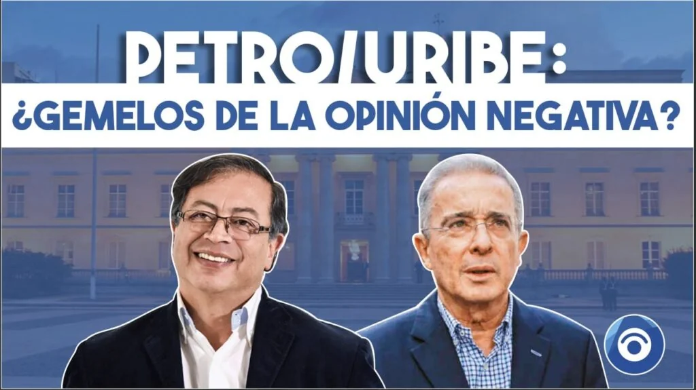
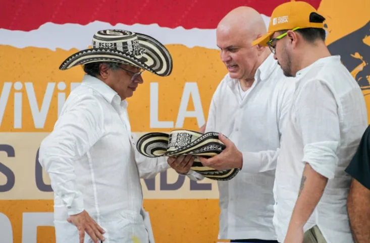

*Petro/Uribe: ¿Gemelos de la opinión negativa?*

**Petro/Uribe**: ¿Gemelos de la opinión negativa? ¿La opinión pública está cansada de la polarización? La estrategia comunicativa dominante quiere reencauchar a **Álvaro Uribe Vélez** como jefe natural de la oposición a raíz del debate de la **reforma laboral** que cursa en la cámara de representantes. Los dos líderes políticos **―**que están situados en los extremos ideológicos**―** no gozan de una aceptación ante la opinión pública.

Esa sería la razón por la cual el debate político podría girar entre estos dos gemelos de la política dominante que gozan de una percepción pública muy deteriorada. Pero, a los dos les convendría una confrontación para que sus seguidores, bodegas digitales y los medios de comunicación tengan de qué hablar.

A raíz del análisis de **VoxPopuli Digital** de las encuestas del mes de septiembre que midió la opinión de la administración del **presidente Gustavo Petro Urrego** (61% de **desaprobación**/30% de **aprobación**), algunos petristas de izquierda y otros de derecha, se volcaron con lanza en posición de ataque contra el periodista. Sin embargo, se les olvidó que **CELAG Data**, en el mes de junio de 2024 hizo un estudio con resultados similares sobre la imagen del expresidente **Álvaro Uribe Vélez**: 61,5% **negativa** frente al 28% **positiva**.

## Los gemelos de la imagen negativa

¿Acaso **Gustavo Petro Urrego y Álvaro Uribe Vélez** son gemelos o mellizos paridos por la misma sociedad afectada por una patología mental? Uno al otro lanza petardos que se hacen explotar en su caras. ¿Tienen razón en sus acusaciones? Probablemente sí.

Sin equívocos, los indicadores de imagen de los dos líderes políticos más importantes de estas dos décadas, refleja la crisis de liderazgo reinante y el discurso polarizante dominante. Para darse cuenta de esta realidad, basta con analizar en profundidad sus similitudes en los estudios de opinión sobre su imagen. Podrían ser catalogados gemelos de la opinión negativa, aunque la mayoría de la opinión política los repudien.

Las encuestas son instrumentos de medición. Su realización es fundamentalmente ética, ya que la forma cómo se formulan las preguntas podría condicionar las opiniones. Para fiarse en ellas, basta con observar su ficha técnica. Pero, de todas maneras, deben recibirse con reserva.

## Los trino de Uribe

Tanto Uribe como Petro tienen rabo de paja y no se pueden acercar a la candela. Y si se acercan, esto es lo que pasa en las mismas redes sociales:

/articulos/ismagonzalez/status/1846002849001754839

¿Te interesa? [Decisión del CNE: ¿ad portas de un juicio por indignidad?](/articulos/decision-del-cne-ad-portas-de-un-juicio-por-indignidad-ii/) 

## Los extremos se necesitan

_Los gemelos_ casi son idénticos y se necesitan. _Los mellizos_ no se parecen porque **―**según los expertos**―** son fecundados por diferentes espermatozoides. Tienen su placenta y su propio saco amniótico. Incluso, el esperma puede ser de hombres diferentes. Si esto es así, podemos proponer una dicotomía: **¿Uribe y Petro son gemelos o mellizos de esta sociedad polarizante?** ¿Ya se agotó la polarización de los discursos de derecha e izquierda para atrapar a sus seguidores que reproducen el mismo perfil patológico de sus líderes?

En su campaña electoral, Uribe construyó un fantasma a partir de su victimización y llegó a **atrapar el 80% de la opinión política del país**. En su relato, construyó su gran enemigo que era, al mismo tiempo, el enemigo de la sociedad colombiana: las FARC. Dijo que le destriparía la _cabeza de la culebra_ durante su gobierno.

No obstante, pasaron los cuatro años de su primer mandato y la culebra siguió viva. Después dijo que necesitaba un segundo período para matarla. Y la culebra allí, intacta. Esperaba tener un tercer mandato. Pero la ponencia negativa del cartagenero **Humberto Porto Sierra** detuvo la ambición del paisa, cuando fue aprobada por la plenaria de la Corte Constitucional.

¿Te interesa? [Álvaro Uribe Vélez ¿un triste final a lo Fujimori?](/articulos/alvaro-uribe-velez-un-triste-final-a-lo-fujimori/)

## Las similitudes

Aun cuando son contrarios, Petro y Uribe se necesitan. Así como Uribe necesitó de Chávez para mantener distraída a la _mayoría ciega_ de sus respectivos países. Si bien ellos dos peleaban, luego se colaboraban mutuamente. Recuerden que Uribe tuvo muchos negocios con Chávez.

Un ejemplo de lo citado, cuando Uribe y Chávez estaban cogidos de la mano, el primero le vendió la empresa barranquillera (Colombo-Venezolana) Monómeros S.A. al presidente Chávez.

De la misma manera, cuando Petro se posesionó, lo primero que hizo fue sentarse con Álvaro Uribe y tomarse la foto también cogido de la mano. Mientras sus seguidores se matan entre sí, ¿Qué te dice eso?

## Capacidad camaleónica

Los dos grandes líderes de la clase política dominante tienen la suficiente capacidad camaleónica:

**Álvaro Uribe** fue un liberal progresista que devino en conservador derechista. Tanto es así que fue el presidente más de derecha que la historia colombiana parió. Ni siquiera tiene punto de comparación con **Laureano Gómez Castro**, presidente conservador (_1950-1951_), apodado _El Hombre Tempestad_.

Por su parte, **Gustavo Petro** es un hombre de izquierda radical, capaz de tomar las armas para luchar por sus ideales. Pero, ya como presidente, devino en implementador de las **políticas neoliberales** en los dos primeros años de gobierno: ejecutó a pies juntillas las políticas del FMI, el Banco Mundial y la FED de los Estados Unidos. No se salió del libreto imperialista.

Ahora, Petro se alía a sus viejos contrincantes de manera contradictoria. La elección del Procurador General de la Nación recayó en una figura insignia del congreso de la República: **Gregorio Eljach Pacheco**. Cambio Radical Char y Vargas Lleras) fue derrotado por una coalición liderada por el partido de la U apoyada por el gobierno.

De lo anterior se colige que el presidente solo quiere terminar su mandato con una Procuraduría que no lo ataque como lo hizo la charista **Margarita Cabello**. La Elección de Eljach fue un cambio de mano donde la pesada burocracia continuará distribuida como está, salvo que saldrán los funcionarios que estuvieron al servicio de los Vargas Lleras y Char desde cuando llegó **Alejandro Ordoñez Maldonado** (16 de enero de 2009 -8 de septiembre de 2016). En esta elección, Gustavo Petro depositó su voto por su futuro verdugo: el procurador que lo suspendió temporalmente de la alcaldía de Bogotá.

## Alianza con todos

*El intercambio de sombrero que dejó perplejas a las víctimas del paramilitarismo. (Cortesía Colprensa).*

Tanto Petro como Uribe no tienen empacho para unirse hasta con el diablo. Lo importante son sus objetivos. Uribe usó, por ejemplo, a **Salvatore Mancuso** para expandir el poder paramilitar desde la gobernación de Antioquia. Los procesos judiciales de La Granja y del Aro, lo comprometen seriamente sino como determinador, sí por omisión.

En tanto que el presidente Petro instrumentaliza a uno de los criminales vivos más grandes que tiene el país: Mancuso. El gobierno lo usa como botín de guerra para la **Paz Total**.

Ese es un hecho político que confunde políticamente al pueblo. ¿O está aplicando el principio según el cual el fin justifica los medios?

## Política entreguista

Por otra parte, no se sabe si el presidente es de izquierda o de derecha. O en el mejor de los casos, si es progresista o no. El progresismo de Petro es un _regresismo_. Al tiempo que radicaliza su discurso de izquierda, su gobierna ejecuta al pie de la letra las directrices del Banco Mundial, el FMI y la FED de los Estados Unidos. Lo mismo que hizo Uribe en sus dos período de gobierno.

Petro/Uribe: ¿Gemelos de la opinión negativa? La pelea de los extremos nos lleva a una polarización que incendia a la sociedad e incentiva su patología colectiva. Estos dos bloques de la opinión pública que siguen a estos dos líderes políticos, no saben para dónde van, porque siguen ciegamente a sus jefes.