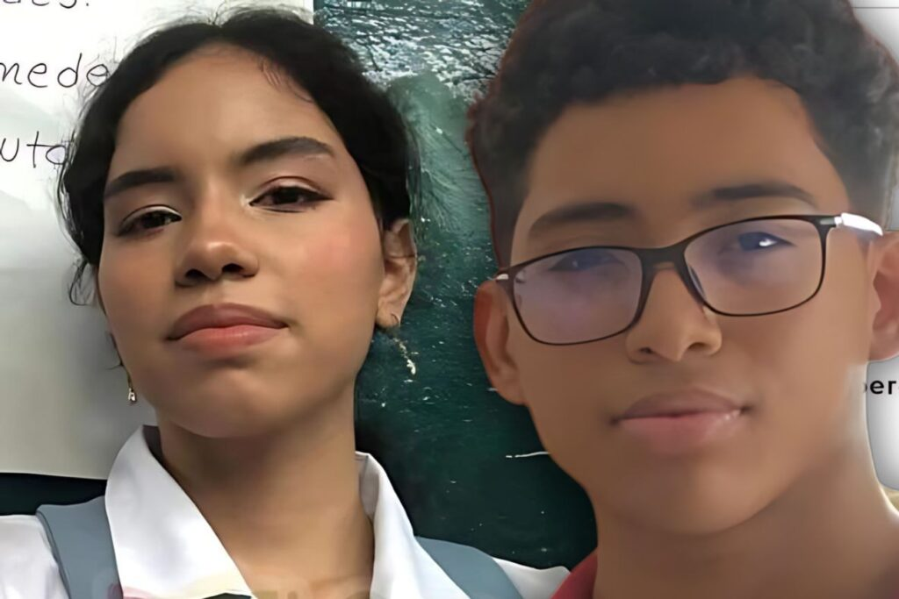
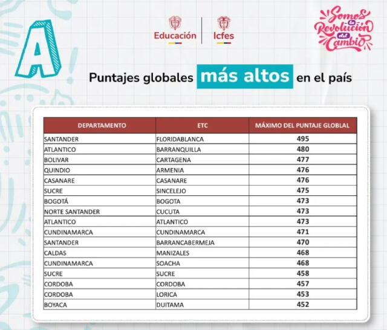

*Barranquilla y Cartagena, en los 3 mejores puntajes Saber 11/2024. Los mejores a nivel nacional son de dos barrios populares de Cartagena: Ceballos y Santa Clara.*

**Ana Sofía Vergara Marcano** (16 años), del Instituto Inem _José Manuel Rodríguez Torices_, y **Oscar Moisés Castillo Arrieta** (17 años), del _Colegio Alter Alteris_, (Cartagena) superaron al 100% de los estudiantes a nivel nacional. ¡Fueron los mejores en **Saber 11/2024**!

Los alcaldes de dos ciudades de la región Caribe (**Alejandro Char y Dumek Turbay**) deben estar sacando pecho por los resultados ICFES 2024. **Barranquilla y Cartagena** se ubicaron en el segundo y tercer lugar después de **Florida Blanca** (Santander) desplazando a Bogotá, Medellín y Cali en las **Pruebas Saber 11/2024**. Lo más destacado es que dos estudiantes cartageneros estuvieron a punto de obtener puntaje perfecto: de 500.

En consecuencia, ésos resultados ejemplares de dos adolescentes de barrios populares colindantes, contribuyó significativamente a que Cartagena se ubicare en el **tercer lugar** con un puntaje de **477 puntos sobre 500**.

¿Te interesa? [Más para educación y seguimos peor (I)](/articulos/mas-para-educacion-y-seguimos-peor-i/)

## Puntajes más altos

1.  **Floridablanca, Santander** - 495/500
2.  **Barranquilla, Atlántico** - 480/500
3.  **Cartagena, Bolívar** - 477/500
4.  **Armenia, Quindío** - 476/500
5.  **Casanare, Casanare** - 476/500

Busca tu lugar en el ICFES 2024 Icfes o hacer [**CLIC AQUÍ**](https://www.icfes.gov.co/).

## ¿Para que sirve?

Estas **Pruebas Saber 11** corresponden al **calendario A de 2024**. La prueba tiene como propósito evaluar el desempeño académico de los estudiantes de bachillerato en Colombia que les abre las puertas a la universidad o a cualquier carrera técnica.

Según el ICFES, las pruebas Saber 11 permiten evaluar el nivel de conocimiento y habilidades adquiridas durante la educación secundaria en áreas clave como matemáticas, lenguaje, ciencias naturales, ciencias sociales e inglés.

Pero, además de la evaluación, sirve para que el Estado identifique a los mejores con el fin de garantizarle plenamente el derecho a la educación y premiarle por sus méritos.

**Acceso a Educación Superior**: Uno de los propósitos principales de las pruebas Saber 11 es servir como criterio de admisión para la educación superior. **Elegibilidad para Becas y Apoyos Financieros**: Los estudiantes con puntajes sobresalientes en las pruebas Saber 11 pueden acceder a becas y programas de financiación ofrecidos por el gobierno, entidades privadas y algunas universidades

**Determinación de Políticas Educativas**: Los resultados de las pruebas Saber 11 son utilizados por el Ministerio de Educación y otras entidades gubernamentales para analizar la calidad educativa en distintas regiones y diseñar políticas que mejoren el sistema educativo. 

**Orientación Vocacional y Profesional**: Al evaluar áreas específicas de conocimiento, los resultados de Saber 11 también pueden ayudar a los estudiantes a identificar sus fortalezas y debilidades académicas, facilitando una toma de decisiones más informada sobre su orientación vocacional.