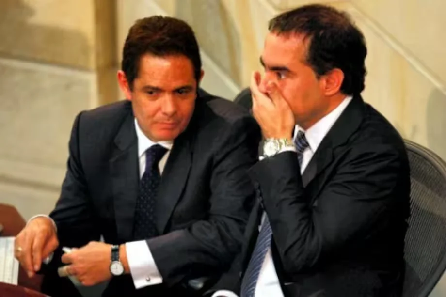

*Las aguas regresan a su cauce. La vida loca de Benedetti lo regresa al lado de Laura Sarabia, directora del Dapre. Si se cae Benedetti, se cae el presidente.*

¿Se incendiará la **Casa de Nariño**? Hay fuego cruzado amigo y enemigo por su regreso al seno presidencial. ¿Se transformará en un Centro de Rehabilitación para los que sufren de _peripea_? Pareciera que **Armando Benedetti Villaneda**, (**«**El Terminator» Benedetti) exembajador y exsenador, está atrapado en su vida loca, loca, loca. Y, con la tea en la mano, amenaza secuestrar a su habitante principal para que lo ayude a rehabilitarse.

Sin embargo, escogió para ese propósito un sitio cercano donde circulan los _jíbaros_ vestidos de frac: El Capitolio. Una constante tentación para un adicto como Benedetti Villaneda. En el congreso existe un significativo grupo de adictos a diferentes drogas y hábitos. No solamente es el caso de **Susana Boreal**, quien hasta habla disparate en el Capitolio, sino de muchos senadores y representantes que manejan los hilos políticos del país.

## Benedetti y el **«**Sádico del Charquito»

El **«**Sádico del Charquito» fue un famoso asesino en serie de Colombia. Abusó y asesinó a más de 170 niños. Nunca dominó su placer constante de abusar y asesinar a niños. Su enfermedad: **la adicción sexual preferentemente con niños**. La rehabilitación que propone Benedetti a su adicción es similar a la que hubiese aspirado el **«**Sádico del Charquito» siendo consejero de la directora de una guardería.

Colombia tuvo un presidente adicto: **Álvaro Uribe Vélez**. Su adicción era al alcohol. En 2006 escribí el libro el **_Príncipe Oscuro_** (próximo a publicar) narro este capítulo del que fuera mandatario de los colombianos. Uribe cambió su adicción aguardientosa por la **adicción al trabajo**. Hubo una sustitución de hábitos, pero la adicción es la misma.

Escoger ese sitio es un desafío muy grande para la verdadera intención de un hombre que desea rehabilitarse. Porque lo que sufre el exsenador es de una **enfermedad mental profunda** y poco valorada en Colombia: **la adicción**. Para el prestigioso neurocientífico argentino **Facundo Manes**, la adicción secuestra la voluntad del individuo y daña el cerebro.

Por eso es que un adicto no aprende de los errores y los repite constantemente. Un adicto nunca deja de ser adicto. Ayer adicto, hoy pastor, pero la adicción sigue siendo la misma. La tentación perdura hasta sus últimos años de vida.

## ¿Debilidad moral o enfermedad?

Si eres dueño de una empresa ¿contratarías a un adicto como gerente? Ahora bien, si eres presidente de una nación, ¿tendrías un consejero adicto? En mi caso, no lo haría. La adicción no es un problema de moralidad o de ética. **Los últimos descubrimientos científicos indican que es una enfermedad crónica que esclaviza al cerebro.** Y la adicción no es solo a las drogas o al alcohol. Es un profundo apego a toda acción que genere dopamina, un neurotransmisor considerado el mensajero del placer en los circuitos de recompensa.

Cuando puse al descubierto la enfermedad mental del que fuera alcalde de Cartagena, **William Dau Chamat**, sectores de derecha, la izquierda y algunos colegas se fueron en contra mía. Pero no entendieron que como periodista buscaba proteger a la sociedad cartagenera de los errores de un adicto al bazuco, a la marihuana y al tabaco. Al final de su mandato, y cuando la imagen positiva del mandatario cayó a menos del 20%, me alzaron en hombros. Pero la ciudad quedó semidestruida en su tejido social.

## Las buenas intenciones del adicto

No obstante, de buenas intenciones está tapizado el camino al infierno. ¿Sería este el destino de la Casa de Nariño con Armando Benedetti? Nos recuerda las visitas de alias _Job_, el mensajero de Don Berna, y de los grandes capos de la mafia cuando el principal habitante era **Álvaro Uribe** **Vélez**. ¿Uribe y Petro? ¿Dos caras de la misma moneda?

Por esa razón, la bulla generada por el regreso del exembajador de la FAO es un problema mayor: **profundizará la crisis de moralidad pública del gobierno y exacerbará la discordia del círculo de poder del presidente Petro**. El vicio de Benedetti refleja su incapacidad mental para tomar decisiones acertadas y dar consejos integrales al presidente.

Benedetti, si el cuerpo se lo permite, se puede aspirar un kilo de cocaína diariamente, y es problema de él. Nadie debe impedírselo. La Constitución lo ampara como sujeto de derecho. ¿Pero, cómo ha sido su conducta en estos 30 años? Errática para los intereses de la nación, aunque brillante para este mundo torcido de la real política.

¿Te interesa? [El dueño de la bolsa ¿Petro o Benedetti? (IV)](/articulos/el-dueno-de-la-bolsa-petro-o-benedetti/)

## La vida loca en palacio

Si. Benedetti es un **«**_man pirómano_» que anda con la tea en la mano. No tiene límites. Se traslada de un extremo al otro. No le importa ser samperista, vargasllerista, uribista radical, santista o petrista fundamentalista. ¿Por qué? Porque siempre anda con un deseo profundo de p_egarse un pase_ para sentirse bien y salir de esa **vida loca**. Sobre todo, en esos momentos de estrés o de triunfalismo, como este, cuando está en el _ojo del huracán_ por su regreso triunfante a la Casa de Nariño.

Sin embargo, su vida se la pasa de _peripea_ en _peripea_. Su vida se desvanece sin darse cuenta. Cuando en 2010 alcanzó la presidencia del senado con 101 votos de 102, vivía la parte más alta de su _vida loca_. Su cerebro estaba secuestrado por la adición al perico y al alcohol, como él mismo lo aceptó. Está atrapado en su propio vicio, con cuyo manto cubre el halo presidencial que también le llevaría al precipicio.

De todas manera, Benedetti es el mismo que amenazó con incendiar la Casa de Nariño, incluso, con él adentro. Así lo reseñamos en Vox Populi Digital en 2023 cuando le dijo a **Laura Sarabia**:

> **«Nos caemos todos**, hp».
> 
> [VoxPopuli Digital](/articulos/el-dueno-de-la-bolsa-petro-o-benedetti/), 5 de junio de 2023.

¿Te interesa? [¿En diciembre renunciará Gustavo Bolívar con buenos resultados en DPS?](/articulos/en-diciembre-renunciara-gustavo-bolivar-con-buenos-resultados-en-dps/)

## Y el presidente...

¿Esto lo entiende el presidente Gustavo Petro?

Pareciera que no. El anuncio del nombramiento del hombre de la _vida loca_ como asesor presidencial generó una jauría de sentimientos significativos en los propios cimientos del _petrismo_, del **Pacto Histórico**, de la institucionalidad y del mundo político colombiano. Incluso, la Defensora del Pueblo le pide al presidente que no lo nombre.

Una vida loca que brilla en la política y en los círculos oscuros del poder. Es el típico parlamentario que habla hasta por los codos. Tiene una personalidad desabrochada y dicharachera. Diferente, por ejemplo, al político mudo de **Álvaro García Romero**, quien solo vino hablar cuando Gustavo Petro lo acusó (2006) en el senado de ser promotor del paramilitarismo en Sucre.

Tanto Benedetti como García representan los lados oscuros de la política dominante en la humanidad y, en particular, de la política colombiana. Si ganó Trump teniendo varios procesos penales en su contra ¿cómo vamos a criticar a Terminator» Bendetti.

¿Te interesa? [¿Benedetti & Sarabia detuvieron la bola de nieve? (III)](/articulos/benedetti-sarabia-detuvieron-la-bola-de-nieve/)

## Benedetti, el camaleónico

*Armando Benedetti comenzó llevándole el maletín a Germán Vargas. Fue uno de los peores momentos de su adicción a las drogas.*

Sin embargo, Benedetti no está en la cárcel muy a pesar de que desde hace una década le persiguen 7 procesos penales en la Corte Suprema de Justicia (documento no disponible). Pero su capacidad camaleónica le permitió sobrevivir a las crisis políticas y a estos procesos jurídicos. Junto al Ñoño Elías, Musa Besaile y Antonio Guerra de la Espriella, hizo parte del grupo de senadores apodados **«**Los Bulldozer" que le dieron seguridad jurídica a todos los entuertos de Odebrecht. Ellos actuaron como mercenarios de la multinacional brasilera en detrimento de los intereses de la nación.

*En este mosaico, el único que no ha sido condenado por Odebrecht es Armando Benedetti. Pero él fue el más entusiasta, según el testimonio Fernando Gaviria. Allí están Musa besaile, Noño Elías y Antonio Guerra de la Espriella.*

Una de las características de Benedetti es voltearse. Es otra de sus adicciones. Pero es el deporte más practicado de esta clase política que ejerce el poder en Colombia. No importa su ideología.

En los últimos 22 años, Benedetti fue samperista, vargallerista, uribista, santista y ahora petrista. De escudero en el congreso del presidente **Álvaro Uribe Vélez** no dudó quedarse con **Juan Manuel Santos** cuando se fracturó la alianza en el uribismo. ¿Por qué lo hizo? **«**Cocacola mató tinto... El bolígrafo lo tiene el presidente», le dijo a algunos periodistas.

Pero antes, le llevaba el maletín a **Germán Vargas Lleras**. Un hombre brillante pero adicto a **«**_**Blancanieve**_», según las fuentes políticas de la época. Benedetti sirve el whiskey y el que busca el hielo. Vargas lo colocó de segundo en la lista al concejo de Bogotá encabezada por _Luz María Zapata_. Ella se casó con Germán Vargas y, al parecer, están ahora divorciados. Vargas también ha tenido o tiene una vida loca como Benedetti

¿Te interesa?

## La doble moral

*Los tiempos en que Armando Benedetti se convirtió en el congreso como el defensor de reelección de Álvaro Uribe Vélez. Esta es la vida loca de Benedetti.*

Sin embargo, Benedetti regresó de Europa a rehabilitarse. ¡Pobrecito! Colombia necesita compadecerse del hombre que, según él, buscó **15 mil millones** de pesos donados por _manes_ no emprendedores para la campaña presidencial de Petro y se pudiese sentar en el sillón de la Casa de Nariño. ¡Y tiene pruebas! Ahora, la sede presidencial pasará a ser un verdadero Centro de Rehabilitación para los que sufren de _peripea_.

¿Por qué estos seres humanos camaleónicos brillan? La política la desnaturalizaron con esa práctica guiada por sus intereses mezquinos sin importarle los intereses de toda la ciudadanía.

**«El fin justifica los medios»** es el pensamiento de la política que nos trajo la Ilustración. Se creía que la doble moral era de la burguesía ampulosa o de la pequeña burguesía intelectual. Así lo señaló Trotsky en su libro _Su moral y la nuestra_.

> **«**La base de clase de esta prédica falsa y ampulosa la constituye la pequeña burguesía intelectual. La base psicológica se halla en el deseo de superar el sentimiento de la propia inconsistencia, disfrazándose con una barba postiza de profeta».

Pero lo que no entendió el viejo topo es que las ideologías, de izquierda o de derecha, de los empresarios y de los sindicatos, hicieron suyo la doble moral bajo el concepto del **«fin justifica los medios»**.

**Próxima entrega**: Si se cae Benedetti, se cae el presidente