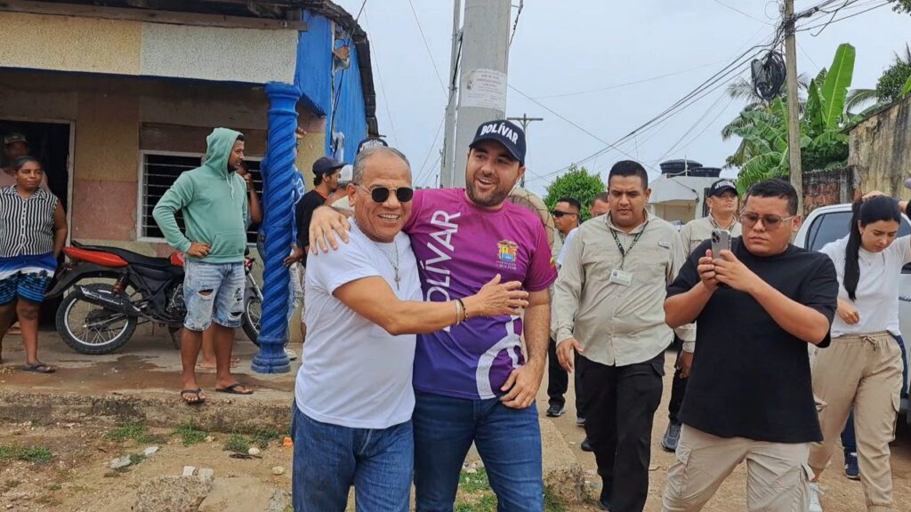
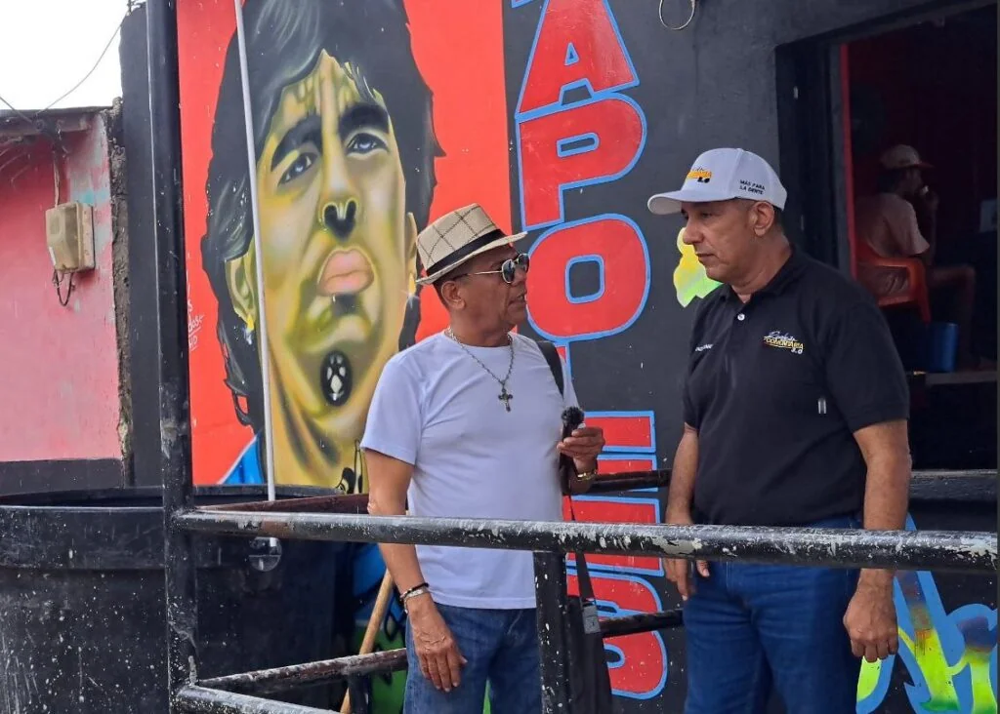
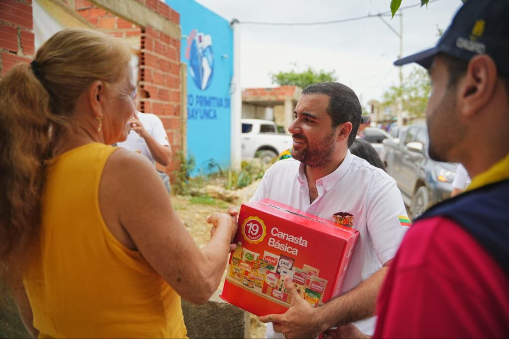

*Magangué revolucionada con Yamilito Arana y Pedro Alí. Aquí en la Punta del Padre del barrio Versalles el periodista abrazado con el gobernador de Bolívar.*

Cuando se supo que el gobernador de Bolívar despacharía 10 días desde Magangué, cambiamos la agenda para estar allí y cubrir un hecho trascendental para los sectores más populares de la ciudad de **Los Tres Ríos**. Francamente nos dimos cuenta que por estos días, los Arana y los Alí ―dos familias emprendedoras y políticas de la ciudad― **tienen a Magangué** **revolucionada**.

Mientras observábamos las obras de pavimentación de una de las calles de la Punta del Padre (Versalles ¡mi barrio querido!) en compañía del alcalde de Magangué, **Pedro Alí Alí**, vimos llegar al gobernador de Bolívar, **Yamilito Arana Padauí.** Llegó cargado con **35 ollas comunitarias** para celebrar **«Ángeles somos»**. Por la tarde, colocar el primer tablón de la avenida El Malecón y la inauguración del parque de El Ceibal.

¿Te interesa? [Yamilito gobernador: «la gracia es de Dios y de la virgen de la Candelaria»](/articulos/yamilito-gobernador-la-gracia-es-de-dios-y-de-la-virgen-de-la-candelaria/)

## La mezcla de cultura

*Magangué revolucionada. El alcalde Pedro Alí ejecutando su programa de gobierno. Aquí supervisando la pavimentación de la calle Punta del Padre de Versalles.*

Los Arana y los Alí, unas veces están unidos y otras veces en desencuentro. Pero, ahora, están tan integrados que existe una articulación de las acciones públicas del orden departamental y municipal. Jalan para el mismo sentido. Esto es muy importante porque el alcalde solo debe gestionar para bajar los recursos de las obras procedentes del orden nacional y departamental.

Ellas son dos familias tradicionales que reflejan el modo de ser magangueleño. Una ciudad de una cultura híbrida compleja para el extraño, pero sencilla para los nativos. Aquí el _kibbe_ ―una deliciosa fritura rellena de carne molida con cebolla― es tan magangueleña por la forma cómo se prepara. Nos hace olvidar de sus orígenes sirio―libanés o turco.

La buena cocinera magangueleña, como mi madre **Teresa Moreno Martínez**, debe ser experta en comida internacional. Pues, la gastronomía del magangueleño está influida por la cultura nativa, afro, española, sirio―libanesa, francesa, alemana, italiana y la del interior del país. Sin duda, Magangué es el puerto de los Tres Ríos y de las múltiples culturas que se han unido a la manera como lo explica el Néstor García Canclini en **la cultura híbrida**.

En la hibridación no sólo se mezcla lo religioso con lo étnico **sino que se entrelazan en la gastronomía como en la producción.** Asimismo, en productos de las tecnologías avanzadas y con procesos sociales modernos o posmodernos

## **Magangué** **revolucionada** con alegría

*¿Quieres un poco de sancocho? Pareciera decir el gobernador Yamilito*

Realmente **Magangué** **revolucionada**. El gobernador Arana y el alcalde Alí movieron el palote de la olla comunitaria (¡literal!) en la cancha del estadero Nápoles de la Punta del Padre. Ayudaron a repartir el sancocho a cerca de 200 niños versalleros. Los niños cantaron, bailaron y comieron al son del **«**Tintililillo**»** o de **«Ángeles somos»**. Luego, el gobernador se fue al barrio Buenos Aires.

De Buenos Aires salieron para San Pablo, Los Comuneros, Primero de Mayo, La Esmeralda y El Progreso, de Magangué, cantaron el tradicional **«Ángeles somos»** y el **«**Tintililillo**»** para recibir al programa **«Ollas Comunitarias»**, que llegó con almuerzo, juegos y regalos.

El gobernador Arana resaltó esta jornada de alegría infantil.

> _**«**Esto es algo que no tiene precio. La felicidad de los niños y niñas es lo que nos motiva a trabajar y hace que todo valga la pena. Venimos a disfrutar con ustedes, con dulces, regalos y premios**»**_.

*Yamilito Arana con los damnificados de Cartagena*

El gobernador Yamilito Arana debió regresarse este 4 de noviembre a Cartagena para ayudar a los damnificado de los tres días de aguacero que azotó a la ciudad. Llegó moviendo el palote de la olla y la entrega de ollas comunitarias para la comunidad afectada.