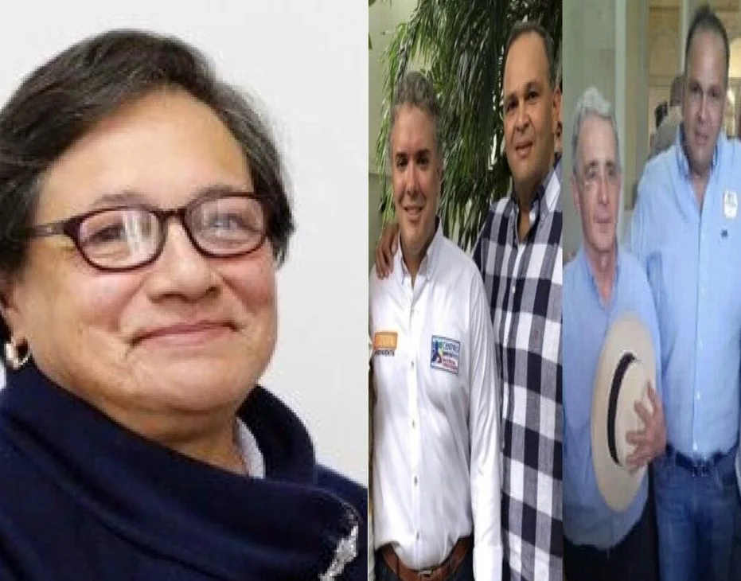
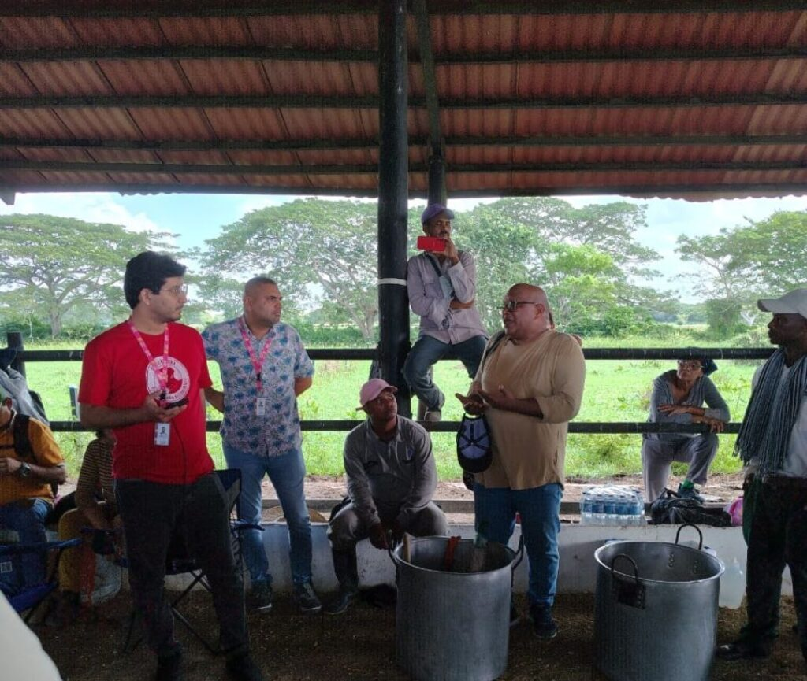
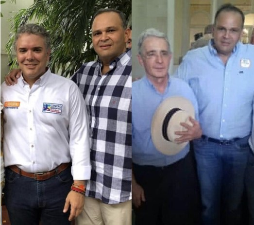

*Amelia Pérez tiene el reto de estrenarse como directora de la SAE frente a la herencia de la Ñeñe-política.*

Hoy, se espera en Bayunca a la directora nacional de la Sociedad de Activos Especiales (SAE), **Amelia Pérez Morales**, con el fin de entregar a los campesinos desposeídos **«la joya de la Corona**»** de «Ñeñe» Hernández**. Se trata de **654 hectáreas** ubicadas en ese corregimiento de Cartagena. Uno de esos predios es **«**Tres Estrellas**»**. Estas propiedades son administradas (¡escuche muy bien!) por la firma **Inversiones Hernández López**, herederos de **José Guillermo Hernández**, conocido en el mundo del hampa y de la política como **«el Ñeñe»**.

El gran negocio con **«la joya de la Corona**»** de «Ñeñe» Hernández** era la venta a la ANi que la iba a destinar a la construcción del gran aeropuerto de Bayunca.

Recordemos que ese presunto narcotraficante fue asesinado en 2019 en Brasil por orden de la misma mafia. Según los procesos penales que se le seguía en vida, utilizaba como su brazo armado el grupo liderado por **«Marquito Figueroa»**, quien hoy se encuentra purgando una larga pena.

¿Te interesa? [¿Qué quiere hacer la SAE en Cachenche?](/articulos/que-quiere-hacer-la-sae-en-cachenche/)

## Convenio SAE―ANT

*Amelia Pérez Morales, directora de la SAE debe definir la suerte de la «la joya de la Corona» de «Ñeñe» Hernández.*

El gobierno del presidente Gustavo Petro tomó la decisión de pasar las tierras del Fondo de Rehabilitación, Inversión Social y Lucha contra el Crimen Organizado (Frisco) de la SAE a la Agencia Nacional de Tierra―ANT. Según la Contraloría General de República, el Frisco es un fiasco administrativo que no cumple con su finalidad.

El Frisco no funciona ni siquiera en la administración de Petro. La SAE y la ANT suscribieron el convenio marco No 20245100 para que todas las fincas pasen al banco de tierra de la segunda, con el fin de entregárselas formalmente a los campesinos.

No obstante, ese proceso de entrega no ha sido fácil para los campesinos de Bayunca. En la misma SAE hay muchas trabas de los mandos medios para su concreción. Por ejemplo, la parte final del proceso la entorpecieron porque la petición del Frisco a Cardique para que indicara las condiciones ambientales de esa tierra no contó con el suministro de sus respectivos polígonos. Esta son figuras que permite delimitar de manera eficiente diferentes áreas de una parcela. Después de tantos _ires_ y _venires_, por fin, la SAE envío los polígonos a Cardique. Este es el paso final para la entrega efectiva de **«la joya de la Corona**»** de «Ñeñe» Hernández** a los campesinos bayunqueros.

¿Te interesa? [Campesinos de Cachenche-Turbana se opondrán a desalojo de la SAE](/articulos/valbuena-de-la-sae-desaloja-predio-ocupados-por-campesinos-de-cachenche/)

## El botín de **$1,2 billones**

De acuerdo a los procesos judiciales, la organización delincuencial del controvertido ganadero ―que se retrataba con sus protectores **Álvaro Uribe Vélez e Iván Duque**― amasó una fortuna de **$1,2 billones** producto de sus fechorías con el narcotráfico y el despojo violento. Fortuna que con la complicidad de la SAE administra la firma ****Inversiones Hernández López**** desde 2020.

Uno de los hechos que más prensa tuvo **«Ñeñe» Hernández** fue su vinculación con el asesinato de **Óscar Rodríguez** **Pomar**, hijo de **Carlos Rodríguez**, conocido en Barranquilla como **«El Sastre»**.

En la investigación judicial está demostrado que el **«Ñeñe»** le pagó **$200 millones** a su jefe de sicario **«Marquito Figueroa»** para matar a **«El Sastre»**. Pero, por error mataron a su hijo **Óscar Rodríguez**, un joven administrador titulado en la Universidad del Norte.

El móvil de ese homicidio fue asesinar a **Carlos Rodríguez** para no pagarle una multimillonaria deuda contraída por **«Ñeñe»**. Rodríguez impulsó la investigación de ese homicidio que lo dejó emocionalmente destrozado, de acuerdo a su propio parecer en las reiteradas declaraciones ante la Fiscalía.

## Se toman **«la joya de la Corona**»**** **de «Ñeñe» Hernández**

*El líder social, Carlos Amaranto, le explica Miguel Espinosa, de la SAE, las razones por las cuales se tomaron «la joya de la Corona» de «Ñeñe» Hernández.*

En vista de que los predios capturados por la SAE debían destinarse para que los campesinos de la subregión los explotaran legalmente, el proceso de entrega se inició hace un año. Sin embargo, se estrellaron con un muro de contención: las propiedades estaban en manos de una firma comercial ****Inversiones Hernández López****. Esta firma es un derivado de la organización delictiva que dirigía **«Ñeñe»** Hernández.

Cansados de tanta dilación para la **efectiva entrega**, 170 campesinos desposeídos de Bayunca se tomaron esas propiedades el **«Día de las Velitas»**, sábado 7 de diciembre. Se concentraron en el predio **«**Tres Estrellas**»**, jurisdicción de Bayunca, hasta cuando llegó Miguel Espinosa, un funcionario de la regional del Caribe con sede en Barranquilla.

**VoxPopuli Digital** estuvo cubriendo la toma de los campesinos que llegaron en la madrugada y se internaron en el establo de la finca ganadera ubicada a orilla de la carretera de La Cordialidad.

## Ocho hectáreas por cabeza

*Los viejos recientes tiempos del «Ñeñe» Hernández con Uribe y Duque.*

De acuerdo con la entrevista realizada al bayunquero **Carlos Amaranto**, abogado, exedil y líder del movimiento social, la acción de toma se hizo porque observaron mucha demora en el proceso de entrega de estas propiedades incautadas a **«Ñeñe»** Hernández. Esta demora estuvo determinada por descuido de funcionarios de la SAE que cometieron varios errores de conocimiento básico. Pensaron estar allí hasta cuando la SAE hiciera la entrega.

Sin embargo, en la misma mañana de este sábado 7 de diciembre, los líderes de la acción social acordaron con Miguel Espinosa, funcionario de esa entidad, salir pacíficamente. Hecho que lo hicieron en las siguientes horas.

Lo paradójico es que los campesinos de Bayunca están sin tierras para producirlas, mientras **«la joya de la Corona**»**** **de «Ñeñe» Hernández** tiene 8 hectáreas por cada cabeza de ganado bovino.