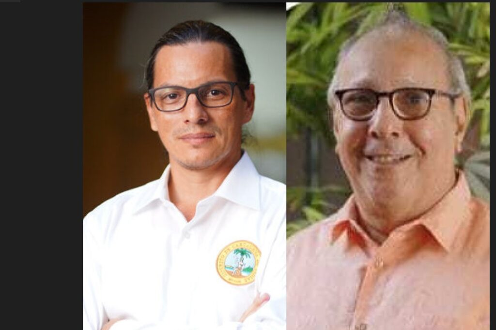
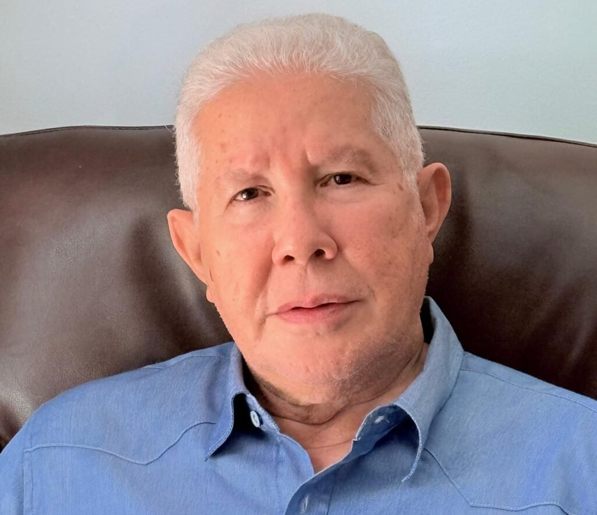

*Cartagena seguirá sin POT en los próximos tres años y la perderemos con el cambio climático. El nuevo POT ¡está envenenado! Y el alcalde parece que no lo sabe.*

Algo **gravísimo** está sucediendo con el levantamiento del nuevo POT de Cartagena: **todo está envenenado**. Seguir sin expediente urbano es como dar el remedio sin tener la historia clínica del paciente. Lo hecho durante el primer año de la administración de **Dumek Turbay** hay que hacerlo de nuevo, si queremos un POT en dos años. Seguir adelante sería una chimbonada. Esta conclusión resultó de la aplicación del **test del «árbol envenenado»**, la misma teoría que el economista **Juan Correa** ―director del Comité― usó en octubre de 2023 para referirse al inservible documento POT de Dau.

Pero, además de estar construyendo un documento que tendrá la misma suerte del anterior, al finalizar la vigencia fiscal de 2024, Planeación Distrital de Cartagena y el Comité del Plan de Ordenamiento Territorial gastaría hasta **$14.000 millones**. Así lo señala a **VoxPopuli Digital** una fuente de entero crédito allegada a la Secretaría de Hacienda. **Esta cifra es casi similar a lo gastado por William Dau**.

¿Te interesa? [El nuev o POT: ¿De Ciudad Caótica](/articulos/el-nuevo-pot-de-ciudad-caotica-a-superciudad-iv/) 

## Vea la entrevista

https://youtu.be/KplI9CUGdMk

## Turbay no tendría POT

O sea, jamás Cartagena tendrá POT en el 2025. Ni siquiera para el 2026. Porque lo trabajado hasta ahora está contaminado por el árbol envenenado. Lo dice el mismo experto que diagnosticó el estado del arte del anterior documento. Y si no se corrige ahora, el alcalde Turbay no sacará el documento en los próximos tres años. Será una promesa de campaña fallida y miles de millones tirados a la basura.

*La actuación de Camilo Rey y Juan Correa en el nuevo POT está contaminada por el árbol envenenado.*

De acuerdo con el análisis del experto urbanista, **Robinson Rada González**, la falla estructural del documento es la **falta del expediente urbano**. Este es un sistema de información que debe responder las preguntas coherentes del desarrollo territorial.

¡Curioso! Tomando en cuenta la petición que Rada le hizo al gobierno de Dau para corregir el POT, Juan Correa se refirió así en su columna de opinión de El Metro:

> **«**Sin el saneamiento de estos dos vicios de fondo es incuestionable que el proyecto, así sea aprobado por el Concejo Distrital, no podrá sostenerse ante una demanda ante la Rama Judicial, causando la Secretaría de Planeación con su actuación temeraria una lesión enorme a los intereses del Distrito y sus ciudadanos, pues de ello ha sido advertido desde el 14 de junio de 2022 por la Sociedad Colombiana de Urbanistas, mediante Oficio radicado AMC-OFI-0084977-2022. **»**

Correa le recordó a su antecesora, Sandra Bacca, lo que hoy se le recuerda a él: **la inexistencia de un expediente distrital que refleje y explique los acontecimientos transcurridos desde la aprobación del POT 2001, y la elaboración del informe de seguimiento y evaluación en concurso con el CCOT**.

## El desafío de Cartagena

*Robinson Rada González, exaltado por Juan Correa ayer para lograr sus propósitos. Hoy, en el poder, lo bembea.*

De acuerdo con Rada, Cartagena enfrenta una serie de desafíos y problemas institucionales significativos que han impedido su reordenamiento y desarrollo territorial a lo largo de más de 23 años cuando entró en vigor el POT de 2001 (D.0977-2021).

> **«**Veo un Cartagena miserable y amargada, atrapada en la desesperanza. Es una verdad prevalente e indiscutible el colapso que desde el año 2001 revela el POT de nuestra ciudad nativa. Intereses enmascarados. El yugo de la pobreza. Expreso mi preocupación por la falta de una estrategia efectiva por parte de la Secretaría de Planeación Distrital para transformar de manera ordenada y sostenible nuestro territorio, a pesar de las buenas intenciones que ha expresado el Alcalde DUMEK en transformar y convertir a Cartagena en lo que denomina una ´Superciudad´**»**.

En ese sentido, un verdadero POT no puede dar paso al servilismo de la codicia. Un falso POT es construido sin la Constitución y sin la ley. Es clandestino.

## No se puede construir sobre el error

Por tanto, debe demostrar que la información del expediente territorial representa el universo que pretende revisar y ajustar. Incoherencias técnicas. Más allá de lo técnico existen otros elementos que se requieren para que las fuentes y resultados sean confiables.

El experto urbanista precisa:

**«**El trámite POT adolece de múltiples fallas estructurales de orden jurídico legal y constitucional. No se puede construir el nuevo POT sobre lo erróneamente construido. Cuando entra en la órbita del riesgo la propiedad privada, hay que lanzar sin tapujos las alertas tempranas. Conspirar contra los fines de un proceso democrático como el POT pretermitiendo los procedimientos legales y principios constitucionales, es una afrenta al estado social de derecho y a la moralidad pública. Evidencias que suman a una historia del territorio. Una ciudad que irónica y absurdamente dispone de un territorio riquísimo y estratégico con una población extremadamente pobre y desigual**»**.

## **«**Profeta en su tierra**»**

*Robinson Rada, doctor en derecho, experto urbanista y en desarrollo territorial, hizo el test del «árbol envenenado» al POT de Dumek, y no pasó la prueba.*

Es de público conocimiento que las ideas centrales expuestas por Correa desde el 2022, fueron sustentadas por el urbanista Robinson Rada, quien le asesoró en todo los planteamientos ante el Consejo Consultivo del Ordenamiento Territorial (CCOT) y en la propuesta que finalmente le presentaron a Dumek en las comisiones de empalme.

Sin embargo, todo indica que el alcalde **Dumek Turbay Paz** no conoce esta cruda realidad. Tal vez Juan Correa no lo tiene bien informado de la **falla estructural e insubsanable que padece lo construido hasta ahora**.

Para corroborar lo dicho, cito como prueba dos artículos firmados por Correa, uno en agosto y otro en octubre de 2023. El primero reconoce que Rada González no es profeta en su tierra porque no le han reconocido sus méritos y sus aportes en materia de urbanismo y ordenamiento territorial. En el segundo, habla de la teoría usada en el derecho penal del _árbol envenenado_, planteamiento propuesto por Rada para indicar que el POT de Dau era nulo de toda nulidad.

Estos son los dos artículos de Juan Correa donde reconoce que todo su planteamiento se le debe a Robinson Rada:

1.  [Nadie es profeta en su tierra](./) (dele clic al título).
2.  [El POT va palante. Los tres interrogantes](./) (dele clic).

## El POT ¡está envenenado!

Imaginemos el POT como un árbol. Sus raíces son los estudios técnicos previos (el expediente urbano), la memoria explicativa, las consultas públicas y las decisiones políticas que lo sustentan. Si estas raíces están **«**envenenadas**»** por la carencia de ese expediente urbano, la falta de participación ciudadana, la manipulación de datos o la violación de normas ambientales, entonces los frutos de ese árbol, es decir, las decisiones de ordenamiento territorial, estarán igualmente contaminados. ―

Es decir, que el documento final quedaría íntegramente nulo, porque su base estructural está viciada. Un árbol así, daría frutos envenenados. Inservibles. Como el alcalde es abogado, lo entenderá fácilmente. Veamos:

## ¿Cómo se aplica **en el POT**?

La teoría del árbol envenenado, que trajo a colación Juan Correa para sustentar la invalidez del POT de Dau y que fue planteada por Robinson Estrada en su momento, se puede aplicar así en el caso del POT de Dumek:

1.  **Participación Ciudadana:** Si la participación ciudadana en la elaboración del POT es meramente formal o si se manipulan los resultados de las consultas, cualquier decisión basada en esos insumos será considerada "fruto envenenado" y podría ser demandada judicialmente.
2.  **Estudios Técnicos (el expediente urbano):** Si los estudios técnicos que sustentan el POT son deficientes, obsoletos o están sesgados, las decisiones basadas en ellos serán igualmente nulas para la siguiente fase del proceso.
3.  **Cumplimiento Normativo:** Si en la elaboración del POT se violan normas ambientales, urbanísticas o de participación ciudadana o el debido proceso, las decisiones resultantes serán consideradas ilegales y podrán ser anuladas.
4.  **Consistencia Interna:** Si las diferentes partes del POT son contradictorias o si no se ajustan a un criterio técnico o jurídico coherente, se puede considerar que el POT en su conjunto es un "fruto envenenado".

## Detrimento y sin POT

Hasta este punto del análisis, podemos decir que el segundo POT condenado al fracaso será el de Dumek Turbay si no cambia ahora el rumbo de su construcción. Por ejemplo, si presentan dicho documento con las 20 falencias que Rada González le halló al documento que Dau presentó a la autoridad ambiental, sería el segundo fracaso.

Sin embargo, el detrimento patrimonial con la administración de Turbay sería tres veces mayor al causado por William Dau Chamat. En el primer año los gastos llegarían a $14 mil millones. En la administración inútil de Dau causaron un detrimento de $16 mil millones y 504 OPS.

Hasta ahora, Dumek ha pagado $3,500 millones de los CDP. Esto quiere decir, que los CDP´s por comprometer podrían llegar a $14 mil millones en la presente vigencia presupuestal. Así lo anota la fuente de la Secretaría de Hacienda.

## La corrección del POT de Dumek

Una vez terminado el trabajo de las comisiones de empalme, específicamente la de Planeación, Robinson Rada, doctor en derecho y urbanista, le entregó a Juan Correa el proyecto de decreto mediante el cual se buscaba reparar el fallido documento de Dau. Pero Correa lo engavetó y es muy probable que no se lo entregó a Dumek.

El proyecto de decreto sobre el Plan de Ordenamiento Territorial (POT) de Cartagena de Indias busca restablecer el **debido proceso** que fue ignorado por la administración anterior. Este decreto se fundamenta en la necesidad de garantizar la seguridad jurídica y la transparencia en la revisión y ajuste del POT, buscando corregir las irregularidades que se presentaron en las etapas previas del proceso.

## Contexto y Justificación

El decreto señala que la administración saliente no cumplió con los requisitos de participación ciudadana y no validó adecuadamente los estudios de riesgo, lo que contraviene principios fundamentales de la administración pública, como la legalidad, la transparencia y la participación democrática.

Se destaca que el informe de seguimiento y evaluación careció de un examen exhaustivo del expediente distrital, ya que no fue acompañado ni validado por el Comité Consultivo del Ordenamiento Territorial (CCOT), lo que generó un diagnóstico deficiente basado en fuentes secundarias.

Ahora bien. Estas son formalidades de ley sin entrar al aspecto sustancial del proceso. Pero, como el alcalde lo sabe, la ley es la ley y no se le puede saltar.

**Próxima entrega**: El proyecto de POT que Correa engavetó.