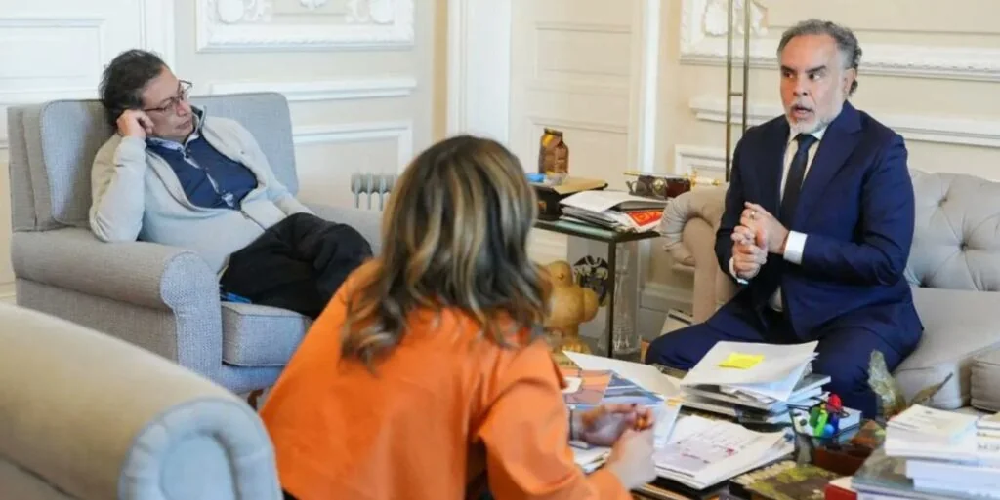

*¿«Paz Total» entre Benedetti y el presidente Petro? Esta fue la foto filtrada a los medios de comunicación, en especial a Semana. El presidente, desparramado en su sillón. Laura, en atenta escucha. Benedetti, contando lo que va hacer, al parecer. Cortesía.*

Estar en el _cuarto de al lado_ del presidente **Gustavo Petro** sería el primer **«**acuerdo de **Paz Total»** entre el gobierno y su «enemigo interno», **Armando Benedetti**. Algunos críticos de esta decisión consideraron que el exembajador solo quería cumplir el papel que por muchos años cumplió **Jesusita**, la eterna secretaria de Petro parlamentario que no pudo disfrutar las mieles del poder. Sin embargo, el problema es más complejo de lo que se cree. Con Benedetti adentro, evitaría que tumbe «Las Torres Gemelas» de la campaña presidencial.

Por esa razón, el presidente no escuchó tantas voces que le advirtieron sobre la inconveniencia de colocar en el _cuarto de al lado_ a un hombre que había dicho incendiar a la Casa de Nariño, incluso, con él adentro. Contra viento y marea, el acuerdo siguió su curso. **«Es mejor tener el enemigo cerca que lejos**». Este fue el razonamiento lógico del jefe de Estado.

Dicha decisión estaría motivada fundamentalmente por la declaración que **Armando Benedetti y Laura Sarabia** deben rendir próximamente ante la **Fiscalía General de la Nación y la Comisión de Acusaciones**, respectivamente. Tema: la controvertida financiación de la campaña presidencial. Recuerden que Benedetti dijo en junio 2023 que él sabía cómo fue financiada la campaña presidencial por personas que francamente **«**no eran unos emprendedores».

## Un adicto, consejero presidencial

https://youtu.be/mSea0hsYicM

## Si se cae Benedetti...

Por tanto, el presidente Petro y el gobierno estaban en una encrucijada. ¿Si excluían a Benedetti del gobierno, se caería el presidente? Tal sería la pregunta resultante de las amenazas de una guerra total declarada por **«El Terminator»** Benedetti en junio de 2023. Ese día no fue atendido por el presidente, luego de su paso por la embajada de Venezuela. Según mensajes de audio y textos que publicó la **revista Semana** el 4 de junio de 2023, Benedetti se sentía como **«**un tigre acorralado» que se podría lanzar hasta contra el mismo presidente.

*La hoja de vida de Armando Benedetti fui subida por el DAPRE el pasado 27 de noviembre de 2024.*

Sin duda, esos audios y mensajes de textos fueron cabeza de proceso para que la Fiscalía iniciara una investigación que, de acuerdo con un comunicado emitido en ese momento, tenía como objetivo establecer si se violaron los topes de financiación, financiación ilegal y otros delitos.

Hasta ahora, ninguno de los dos funcionarios citados han declarado. Los abogados de Petro no se habían puesto de acuerdo con Benedetti para establecer la estrategia de la defensa. Todo indica que el exembajador exigió una serie de condiciones que les fueron satisfechas. Una de ellas es estar en _el cuarto de al lado_ del presidente junto con el de Laura Sarabia.

## La fiscalía tras Benedetti y Laura

Entonces tenemos, que la verdadera razón por la cual el presidente Gustavo Petro colocó _en el cuarto del al lado_ a Benedetti es para protegerse a sí mismo de un golpe fuerte que vendría de las entrañas mismas de su campaña presidencial.

Los abogados del presidente lograron aplazar las declaraciones de Armando Benedetti y Laura Sarabia ante la Fiscalía que estaban previstas para el pasado 28 de octubre. Este ente, como se dijo, investiga los delitos relacionados con la posible financiación ilegal de la campaña electoral del Presidente de la República, Gustavo Petro Urrego.

## ¿Pruebas?

Tras un año de investigación, al parecer, la Fiscalía reunió pruebas para establecer la veracidad de los contenidos de la histérica declaraciones de Armando Benedetti el 3 o 4 de junio de 2023.

> “¿Tú lo que quieres es pelea, hijueputa? ¿Me estás usando? Dale, hijueputa, se acaba el mundo tuyo, el mío y el de todo el mundo (...) el de todo el mundo, hijueputa!”.  

No es chantaje... todavía es la parte esencial para establecer si el presidente Gustavo Petro está siendo objeto de un chantaje de uno de los principales protagonista de su triunfo presidencial.

> “ Y si tú crees que es un chantaje, es una respuesta a una hijueputada, no es chantaje todavía”

## Conclusión

El presidente Gustavo Petro decidió tener al enemigo de cerca y llegar a un **«**acuerdo de **Paz Total»** con Armando Benedetti. ¿Resolvió la encrucijada a la que estaba expuesto con el exembajador de Venezuela y de la FAO? Sin duda, no. Se debe recordar que si un gobierno queda chantajeado por una persona cuyo cerebro está secuestrado por la adicción, en cualquier momento dicha estabilidad puede caer.

Por ahora, Armando Benedetti está controlado. Pero es una solución política gravosa para el gobierno, desde el punto de vista de la opinión pública. Cada día la administración del presidente Gustavo Petro pierde credibilidad. Cada día uno se despierta con un escándalo nuevo. La renta política se verá disminuida en las próximas elecciones parlamentarias y presidenciales.